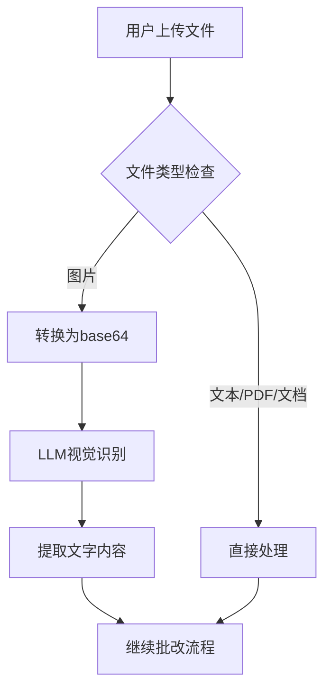
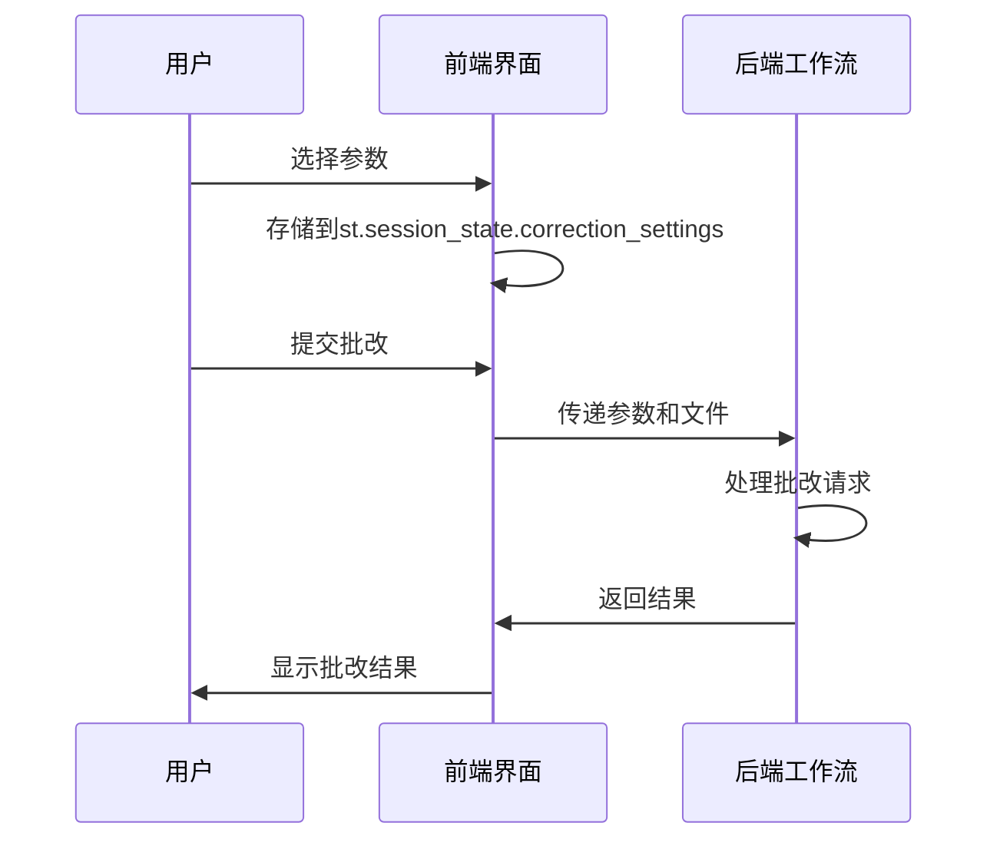

# 表单提交机制

<cite>
**本文档引用的文件**
- [main.py](file://ai_correction/main.py)
- [config.py](file://ai_correction/config.py)
- [UI_OPTIMIZATION_SUMMARY.md](file://ai_correction/docs/UI_OPTIMIZATION_SUMMARY.md)
- [IMAGE_PDF_SUPPORT_SUMMARY.md](file://ai_correction/docs/IMAGE_PDF_SUPPORT_SUMMARY.md)
- [upload_validator.py](file://ai_correction/functions/langgraph/agents/upload_validator.py)
- [user_data.json](file://ai_correction/user_data.json)
</cite>

## 目录
1. [简介](#简介)
2. [表单提交流程](#表单提交流程)
3. [文件上传机制](#文件上传机制)
4. [批改参数收集与存储](#批改参数收集与存储)
5. [文件存储策略](#文件存储策略)
6. [UI优化与用户体验](#ui优化与用户体验)
7. [结论](#结论)

## 简介
本文档详细描述了AI智能批改系统中的表单提交机制，重点阐述了Streamlit表单在批改流程中的应用。文档涵盖了文件上传、参数配置、存储策略以及用户界面优化等关键方面，为开发者和用户提供全面的技术参考。

## 表单提交流程
表单提交是AI智能批改系统的核心交互环节，通过Streamlit框架实现。当用户登录后选择"立即批改"，系统将导航至批改页面，触发`show_grading`函数。

`show_grading`函数首先验证用户登录状态，然后检查LangGraph系统的可用性。如果系统就绪，将显示生产级AI批改界面，包含文件上传区域和批改设置选项。用户完成文件上传和参数配置后，点击批改按钮即可启动批改流程。

批改流程采用多Agent协作架构，包括编排协调、多模态输入、并行理解、学生识别、批次规划、生成压缩包、批改作业和结果聚合等八个阶段。每个阶段都有明确的进度指示，确保用户能够实时了解批改状态。

**Section sources**
- [main.py](file://ai_correction/main.py#L597-L636)

## 文件上传机制
文件上传机制是表单提交的核心功能，系统支持多种文件格式的上传，包括文本、PDF、Word文档和图片等。文件上传功能通过Streamlit的`file_uploader`组件实现，具有严格的文件类型和大小限制。

系统定义了`ALLOWED_EXTENSIONS`常量，明确列出支持的文件扩展名：txt、md、pdf、docx、jpg、jpeg、png、gif、bmp、webp。同时，通过`MAX_FILE_SIZE`常量设置单个文件的最大大小为10MB，防止过大文件影响系统性能。

文件上传验证由`UploadValidator`类负责，该类在`upload_validator.py`中定义。验证过程包括：
1. 检查文件存在性和格式是否符合要求
2. 验证文件大小是否在限制范围内
3. 对图像文件进行质量检查，确保尺寸不超过4096像素
4. 确保至少有一个有效的学生答案文件

上传的文件在前端通过多列布局组织，分别用于上传题目文件、学生答案和评分标准。这种设计使用户能够清晰地区分不同类型的文件，提高上传效率。

**Diagram sources**
- [main.py](file://ai_correction/main.py#L81-L133)
- [IMAGE_PDF_SUPPORT_SUMMARY.md](file://ai_correction/docs/IMAGE_PDF_SUPPORT_SUMMARY.md#L77-L121)
- [upload_validator.py](file://ai_correction/functions/langgraph/agents/upload_validator.py#L0-L52)

**Section sources**
- [main.py](file://ai_correction/main.py#L81-L133)
- [IMAGE_PDF_SUPPORT_SUMMARY.md](file://ai_correction/docs/IMAGE_PDF_SUPPORT_SUMMARY.md#L77-L121)
- [upload_validator.py](file://ai_correction/functions/langgraph/agents/upload_validator.py#L0-L52)

## 批改参数收集与存储
批改参数的收集和存储是确保批改结果符合用户期望的关键环节。系统通过`st.session_state.correction_settings`来管理批改参数，这些参数在批改流程中被传递给后端工作流。

主要批改参数包括：
- **严格程度**：分为宽松、中等和严格三个级别，影响评分的宽容度
- **语言**：支持中文和英文，决定批改结果的输出语言
- **批改模式**：选择不同的批改策略

这些参数在用户界面上通过下拉菜单或选择框收集，并实时存储在`st.session_state.correction_settings`中。当用户提交批改请求时，这些参数会随文件一起传递给后端工作流。

在批改完成后，系统会将批改参数与结果一起保存到用户数据中。查看`user_data.json`文件可以发现，每个批改记录都包含一个`settings`字段，其中存储了本次批改的所有参数。这种设计使得用户可以随时回顾历史批改的配置，确保结果的可追溯性。

**Diagram sources**
- [main.py](file://ai_correction/main.py#L656-L693)
- [user_data.json](file://ai_correction/user_data.json#L545-L586)

**Section sources**
- [main.py](file://ai_correction/main.py#L656-L693)
- [prompts/grading_prompts.md](file://ai_correction/prompts/grading_prompts.md#L226-L281)
- [user_data.json](file://ai_correction/user_data.json#L545-L586)

## 文件存储策略
文件存储策略确保了上传文件的安全性和组织性，采用用户目录隔离和时间戳命名相结合的方式。当用户上传文件时，系统会调用`save_files`函数处理存储逻辑。

存储路径生成规则如下：
1. 以用户名创建独立的用户目录，实现用户间的数据隔离
2. 为每个文件生成时间戳（格式为YYYYMMDD_HHMMSS）
3. 将原始文件名进行安全化处理，移除特殊字符
4. 组合时间戳、安全文件名和原始扩展名作为最终文件名

例如，用户"testuser"上传的文件"学生答案.txt"将被保存为"uploads/testuser/student_answer_20250618_174154_test_file.txt"。这种命名策略确保了文件名的唯一性，避免了文件覆盖问题。

用户目录隔离策略具有以下优势：
- **安全性**：不同用户的文件物理隔离，防止越权访问
- **可管理性**：便于按用户进行文件管理和清理
- **可追溯性**：通过目录结构可以快速定位特定用户的文件

系统还实现了文件预览功能，允许用户在批改前查看已上传的文件。预览功能支持文本和图片文件，对于文本文件显示内容摘要，对于图片文件则显示缩略图。

**Section sources**
- [main.py](file://ai_correction/main.py#L423-L466)
- [uploads](file://ai_correction/uploads)

## UI优化与用户体验
根据`UI_OPTIMIZATION_SUMMARY.md`文档，系统进行了多项UI优化，显著提升了用户体验。最重要的优化是删除了冗余的模式选择步骤，简化了批改流程。

优化前的流程需要用户先选择批改模式（高效模式、详细模式、批量模式等），然后再进行文件上传和参数配置。这种设计增加了用户的操作步骤，容易造成困惑。优化后，系统直接进入生产级批改界面，减少了不必要的交互，使用户能够更专注于核心任务。

其他UI优化包括：
- **视觉效果改进**：采用卡片式设计，使用渐变背景和彩色边框突出重点信息
- **布局优化**：合理调整padding和margin，改善视觉层次
- **交互改进**：使用折叠面板减少信息过载，默认展开第一题的详细信息
- **颜色编码**：使用绿色、蓝色、橙色和红色分别表示优秀、良好、及格和不及格，便于快速识别

这些优化使得批改结果更加直观易读，用户可以快速获取关键信息，同时通过折叠面板查看详细分析。下载按钮居中显示并使用完整宽度，提高了可点击性。

**Section sources**
- [UI_OPTIMIZATION_SUMMARY.md](file://ai_correction/docs/UI_OPTIMIZATION_SUMMARY.md#L0-L389)
- [main.py](file://ai_correction/main.py#L691-L715)

## 结论
AI智能批改系统的表单提交机制设计合理，功能完善。通过Streamlit框架实现了直观的文件上传界面，结合严格的文件验证机制确保了系统的稳定性。批改参数的收集和存储机制使得批改结果可配置、可追溯。用户目录隔离和时间戳命名的存储策略保证了文件管理的安全性和有序性。UI优化显著提升了用户体验，简化了操作流程，使系统更加易用。整体设计体现了以用户为中心的理念，为教育领域的智能批改提供了可靠的技术支持。