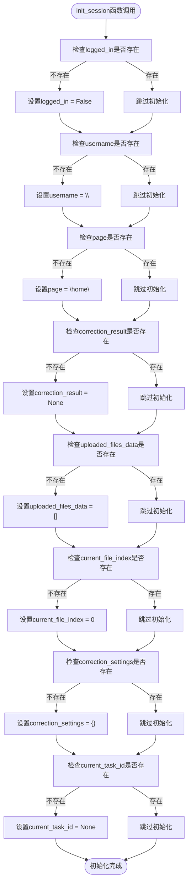
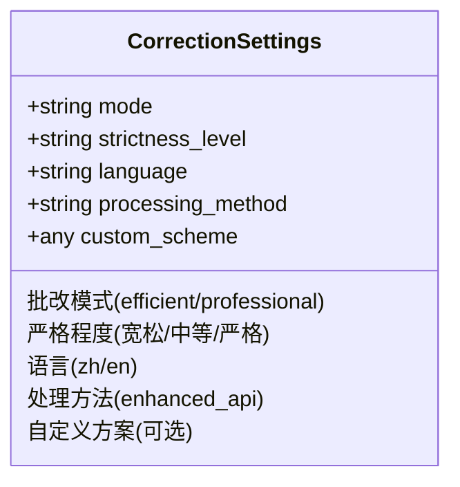
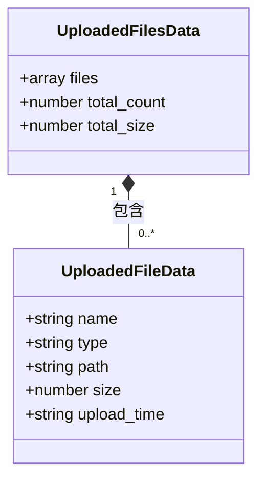
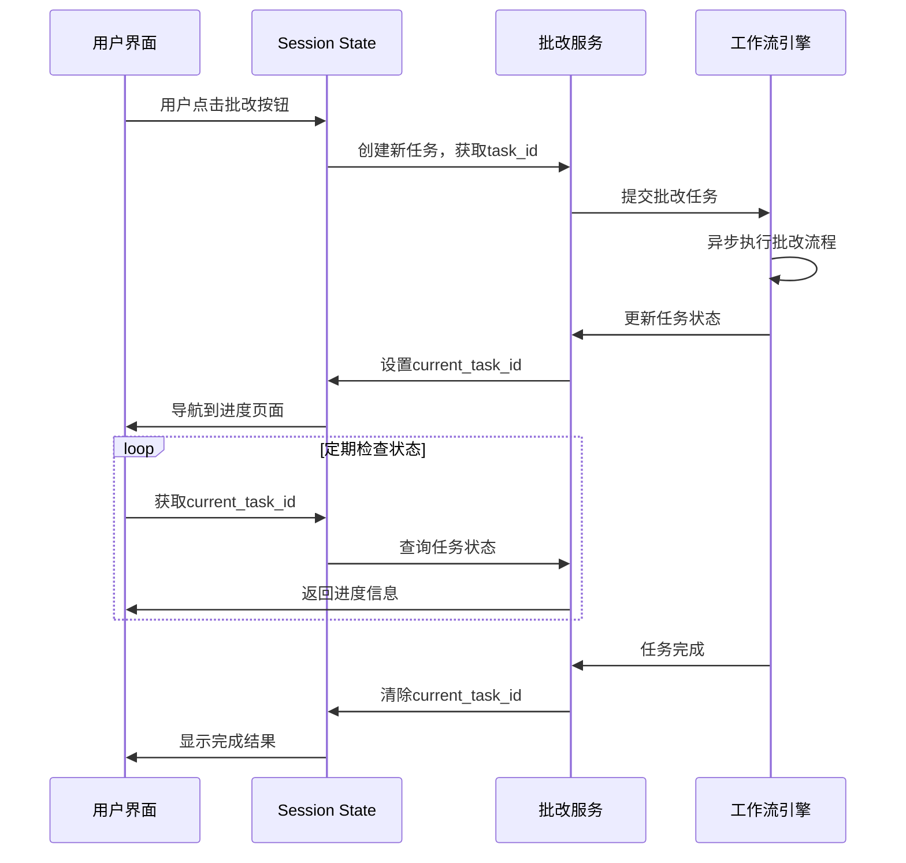
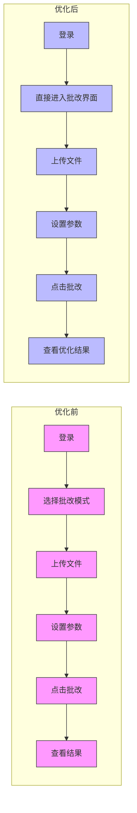
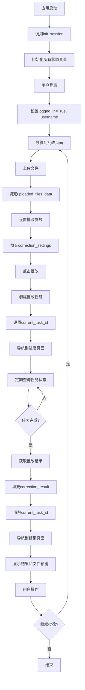

# 表单状态持久化

<cite>
**本文档引用的文件**
- [main.py](file://ai_correction/main.py)
- [progress_ui.py](file://ai_correction/functions/progress_ui.py)
- [workflow_multimodal.py](file://ai_correction/functions/langgraph/workflow_multimodal.py)
- [state.py](file://ai_correction/functions/langgraph/state.py)
- [UI_OPTIMIZATION_SUMMARY.md](file://ai_correction/docs/UI_OPTIMIZATION_SUMMARY.md)
- [user_data.json](file://ai_correction/user_data.json)
</cite>

## 目录
1. [简介](#简介)
2. [核心状态变量](#核心状态变量)
3. [init_session函数分析](#init_session函数分析)
4. [correction_settings状态分析](#correction_settings状态分析)
5. [uploaded_files_data状态分析](#uploaded_files_data状态分析)
6. [current_task_id状态分析](#current_task_id状态分析)
7. [与UI优化的集成](#与ui优化的集成)
8. [状态持久化流程图](#状态持久化流程图)
9. [结论](#结论)

## 简介
本文档详细描述了AI批改系统中的表单状态持久化机制，重点阐述Streamlit session state在批改流程中的应用。系统通过`init_session`函数初始化关键状态变量，确保用户在页面跳转后仍能保持批改上下文。文档将深入分析`logged_in`、`username`、`correction_settings`、`uploaded_files_data`和`current_task_id`等核心状态变量的作用，并结合UI优化策略说明状态持久化如何支持简化的用户界面流程。

**Section sources**
- [main.py](file://ai_correction/main.py#L407-L423)

## 核心状态变量
系统在`st.session_state`中维护了多个关键状态变量，这些变量共同构成了用户的批改上下文。主要状态变量包括：

| 状态变量 | 类型 | 初始值 | 用途 |
|---------|------|--------|------|
| logged_in | 布尔值 | False | 用户登录状态 |
| username | 字符串 | "" | 当前登录用户名 |
| page | 字符串 | "home" | 当前页面路由 |
| correction_result | 对象 | None | 批改结果数据 |
| uploaded_files_data | 数组 | [] | 上传文件元数据 |
| current_file_index | 数组 | 0 | 当前查看的文件索引 |
| correction_settings | 对象 | {} | 批改参数设置 |
| current_task_id | 字符串 | None | 当前批改任务ID |

这些状态变量在用户与系统交互的整个生命周期中保持持久化，确保了用户体验的连续性。

**Section sources**
- [main.py](file://ai_correction/main.py#L407-L423)

## init_session函数分析
`init_session`函数是状态持久化机制的核心，负责初始化所有必要的session state变量。该函数在应用启动时被调用，确保所有状态变量都有默认值。

**Diagram sources**
- [main.py](file://ai_correction/main.py#L407-L423)

**Section sources**
- [main.py](file://ai_correction/main.py#L407-L423)

## correction_settings状态分析
`correction_settings`状态变量用于持久化存储用户选择的批改参数。该对象存储了批改模式、严格程度、语言等关键设置，确保用户在页面跳转后这些设置不会丢失。

当用户在批改界面设置参数时，这些值会被存储到`st.session_state.correction_settings`中。在查看历史记录时，系统会从`user_data.json`文件中读取历史设置并重新填充该状态变量。

**Diagram sources**
- [main.py](file://ai_correction/main.py#L421)
- [user_data.json](file://ai_correction/user_data.json#L233-L248)

**Section sources**
- [main.py](file://ai_correction/main.py#L421)
- [user_data.json](file://ai_correction/user_data.json#L233-L248)

## uploaded_files_data状态分析
`uploaded_files_data`状态变量用于记录上传文件的元数据，是一个数组类型的状态，每个元素包含单个文件的信息。

该状态变量在文件上传时被填充，存储了文件名、类型、保存路径、大小和上传时间等元数据。在结果展示页面，系统使用`current_file_index`来确定当前显示哪个文件的预览。

**Diagram sources**
- [main.py](file://ai_correction/main.py#L417)
- [main.py](file://ai_correction/main.py#L960)

**Section sources**
- [main.py](file://ai_correction/main.py#L417)
- [main.py](file://ai_correction/main.py#L960)

## current_task_id状态分析
`current_task_id`状态变量用于关联异步批改任务，是连接用户界面与后台处理的关键桥梁。

当批改任务完成后，`current_task_id`会被设置为`None`，表示没有进行中的任务。这个变量在进度页面中被用来查询任务状态。

**Diagram sources**
- [main.py](file://ai_correction/main.py#L423)
- [progress_ui.py](file://ai_correction/functions/progress_ui.py#L129)

**Section sources**
- [main.py](file://ai_correction/main.py#L423)
- [progress_ui.py](file://ai_correction/functions/progress_ui.py#L129)

## 与UI优化的集成
状态持久化机制与UI优化策略紧密结合，共同实现了简化的用户界面流程。通过`UI_OPTIMIZATION_SUMMARY.md`文档的指导，系统移除了复杂的模式选择步骤，直接进入生产级批改界面。

状态持久化确保了即使在简化后的UI流程中，用户的批改上下文也能完整保留。例如，当用户从进度页面跳转到结果页面时，`correction_settings`和`uploaded_files_data`等状态变量仍然可用，无需重新输入参数或上传文件。

**Diagram sources**
- [UI_OPTIMIZATION_SUMMARY.md](file://ai_correction/docs/UI_OPTIMIZATION_SUMMARY.md#L298)
- [main.py](file://ai_correction/main.py#L1062)

**Section sources**
- [UI_OPTIMIZATION_SUMMARY.md](file://ai_correction/docs/UI_OPTIMIZATION_SUMMARY.md#L298)
- [main.py](file://ai_correction/main.py#L1062)

## 状态持久化流程图
以下流程图展示了完整的状态持久化生命周期：

**Diagram sources**
- [main.py](file://ai_correction/main.py#L407-L423)
- [progress_ui.py](file://ai_correction/functions/progress_ui.py#L129)

**Section sources**
- [main.py](file://ai_correction/main.py#L407-L423)
- [progress_ui.py](file://ai_correction/functions/progress_ui.py#L129)

## 结论
本系统通过精心设计的表单状态持久化机制，实现了流畅的用户体验。`init_session`函数确保了所有关键状态变量的正确初始化，而`st.session_state`的持久化特性保证了用户在页面跳转过程中批改上下文的完整性。`correction_settings`、`uploaded_files_data`和`current_task_id`等状态变量协同工作，支持了简化的UI流程，使用户能够专注于核心的批改任务，而无需担心上下文丢失。这种状态管理策略不仅提高了系统的可用性，也为未来的功能扩展提供了坚实的基础。