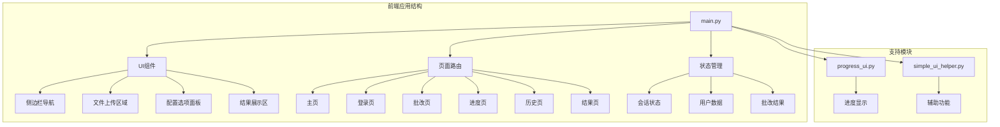
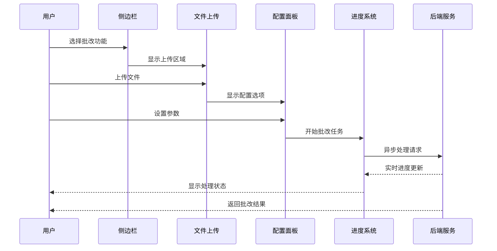
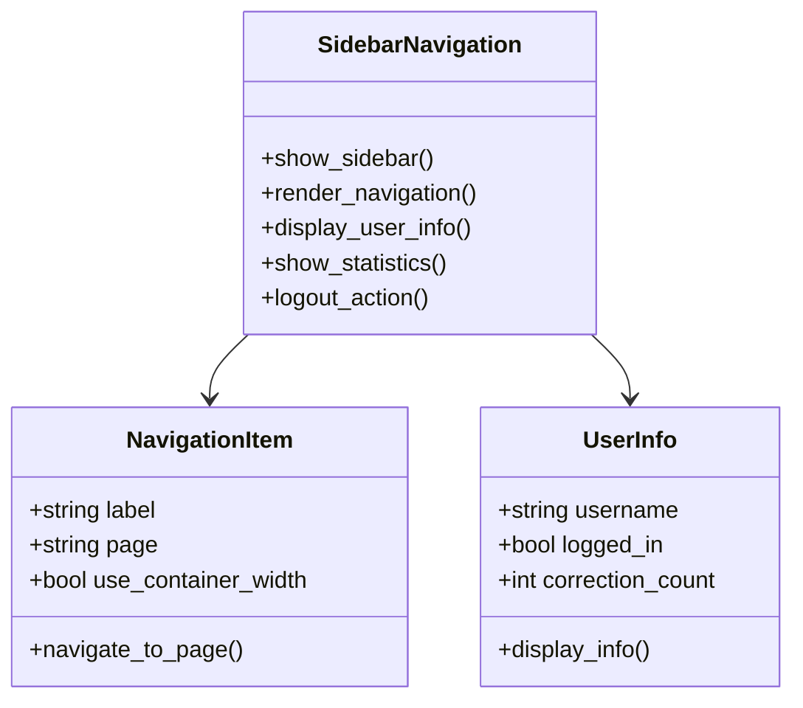
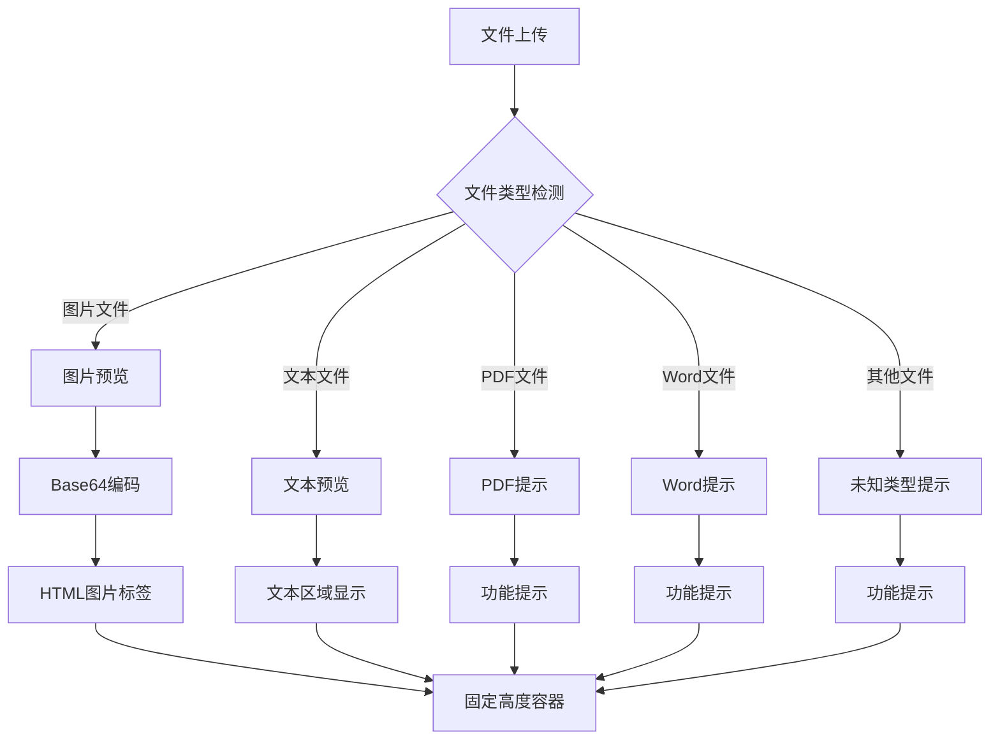
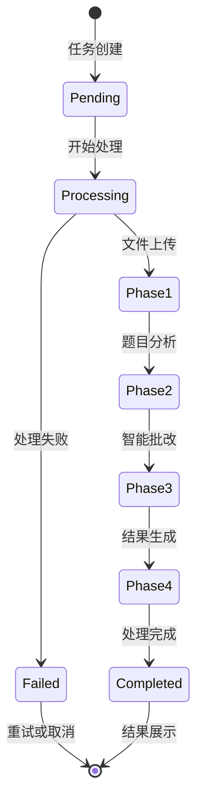
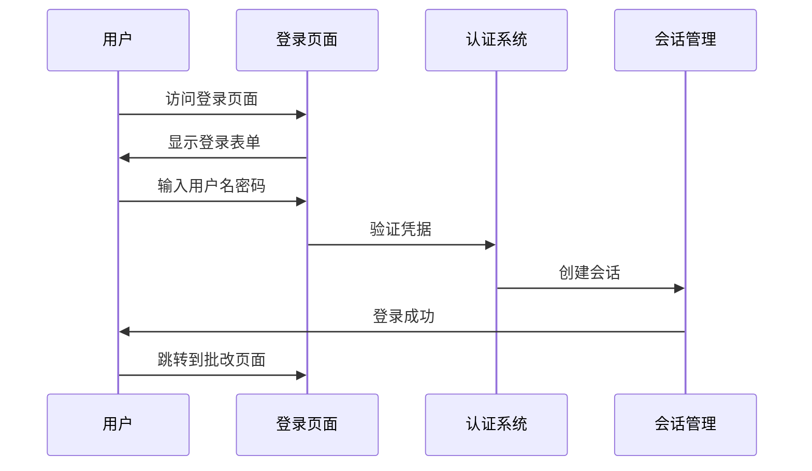
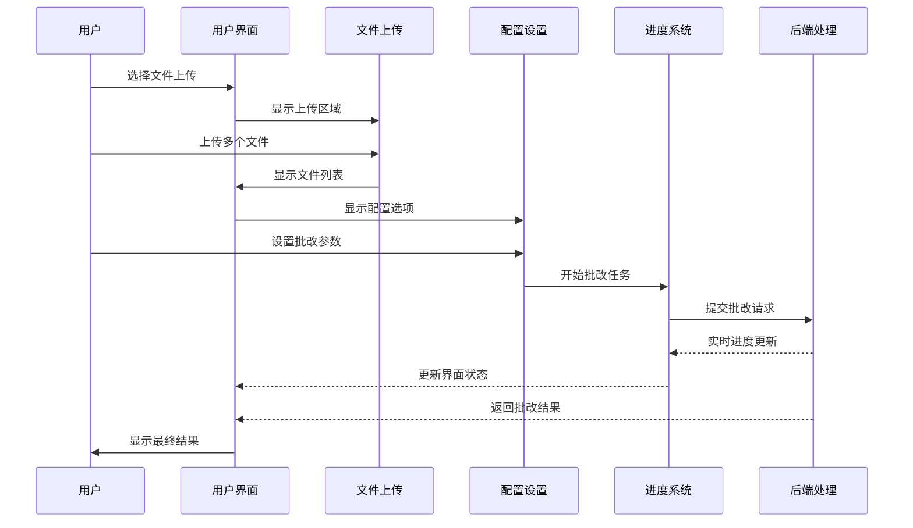

# 用户界面

<cite>
**本文档引用的文件**
- [main.py](file://ai_correction/main.py)
- [progress_ui.py](file://ai_correction/functions/progress_ui.py)
- [simple_ui_helper.py](file://ai_correction/functions/langgraph/simple_ui_helper.py)
- [UI_OPTIMIZATION_SUMMARY.md](file://ai_correction/docs/UI_OPTIMIZATION_SUMMARY.md)
</cite>

## 目录
1. [简介](#简介)
2. [项目结构](#项目结构)
3. [核心UI组件](#核心ui组件)
4. [架构概览](#架构概览)
5. [详细组件分析](#详细组件分析)
6. [交互流程](#交互流程)
7. [用户体验优化](#用户体验优化)
8. [定制化指南](#定制化指南)
9. [故障排除](#故障排除)
10. [结论](#结论)

## 简介

AI智能批改系统的用户界面基于Streamlit框架构建，采用现代化的单页应用程序架构。该界面提供了简洁直观的操作体验，支持多种文件格式的智能批改，并通过实时进度反馈提升用户体验。系统采用响应式设计，适配桌面和移动设备，确保在各种屏幕尺寸下都能提供良好的使用体验。

## 项目结构



**图表来源**
- [main.py](file://ai_correction/main.py#L1-L50)
- [progress_ui.py](file://ai_correction/functions/progress_ui.py#L1-L30)

**章节来源**
- [main.py](file://ai_correction/main.py#L1-L100)

## 核心UI组件

### 页面布局结构

系统采用双栏布局设计，主要包含以下核心组件：

#### 1. 侧边栏导航系统
侧边栏提供统一的导航入口，根据用户登录状态动态显示相应功能：
- **未登录状态**：登录入口、功能特色展示
- **已登录状态**：首页、批改、进度、历史、结果导航，以及统计信息和退出登录功能

#### 2. 文件上传区域
支持多种文件格式的批量上传：
- **支持格式**：TXT、MD、PDF、DOCX、JPG、JPEG、PNG、GIF、BMP、WEBP
- **文件大小限制**：最大10MB
- **批量处理**：支持同时上传多个文件

#### 3. 配置选项面板
提供批改模式和参数设置：
- **批改模式**：高效模式、专业模式（当前简化为单一生产级模式）
- **严格程度**：可调节的评分严格度
- **语言设置**：支持多语言批改

#### 4. 实时进度条
由`progress_ui.py`驱动的实时进度反馈系统，显示：
- **总体进度**：百分比进度条
- **当前阶段**：Agent处理阶段状态
- **时间信息**：处理耗时和预计剩余时间
- **阶段详情**：每个处理阶段的详细信息

#### 5. 结果展示区
采用左右对照布局，提供：
- **文件预览**：支持图片、文本、PDF等格式预览
- **批改结果**：详细的评分分析和建议
- **交互功能**：下载、重新批改、返回首页等操作

**章节来源**
- [main.py](file://ai_correction/main.py#L983-L1087)
- [progress_ui.py](file://ai_correction/functions/progress_ui.py#L1-L50)

## 架构概览



**图表来源**
- [main.py](file://ai_correction/main.py#L600-L700)
- [progress_ui.py](file://ai_correction/functions/progress_ui.py#L15-L80)

## 详细组件分析

### 侧边栏导航系统



**图表来源**
- [main.py](file://ai_correction/main.py#L983-L1030)

侧边栏采用简洁的设计风格，主要特点：
- **响应式布局**：自适应不同屏幕尺寸
- **状态感知**：根据用户登录状态显示不同内容
- **交互友好**：按钮具有悬停效果和过渡动画
- **信息展示**：显示用户统计信息和系统状态

**章节来源**
- [main.py](file://ai_correction/main.py#L983-L1030)

### 文件上传与预览系统



**图表来源**
- [main.py](file://ai_correction/main.py#L367-L420)

文件预览系统支持多种文件类型的处理：
- **图片文件**：支持JPG、PNG、GIF等格式，使用Base64编码优化传输
- **文本文件**：支持UTF-8和GBK编码，内容截断处理
- **PDF文件**：提示需要额外库支持
- **Word文件**：提示需要额外库支持
- **其他文件**：显示文件类型信息

**章节来源**
- [main.py](file://ai_correction/main.py#L367-L420)

### 进度管理系统



**图表来源**
- [progress_ui.py](file://ai_correction/functions/progress_ui.py#L15-L100)

进度管理系统提供实时的状态反馈：
- **阶段跟踪**：8个Agent协作阶段的详细进度
- **状态指示**：Pending、Processing、Completed、Failed、Cancelled状态
- **时间统计**：处理耗时和预计剩余时间
- **日志记录**：详细的处理日志和消息

**章节来源**
- [progress_ui.py](file://ai_correction/functions/progress_ui.py#L15-L184)

### 结果展示系统

结果展示采用现代化的卡片式设计，提供清晰的信息层次：

#### 关键指标卡片
- **总分**：显示具体分数和满分
- **得分率**：百分比显示，带颜色编码
- **等级**：根据得分率自动计算
- **答题情况**：答对题数和总题数

#### 逐题详情面板
- **折叠设计**：使用st.expander减少信息过载
- **评分点明细**：每个评分点的详细分析
- **优点不足**：左右两列布局，清晰区分
- **改进建议**：编号列表形式，便于阅读

**章节来源**
- [UI_OPTIMIZATION_SUMMARY.md](file://ai_correction/docs/UI_OPTIMIZATION_SUMMARY.md#L50-L200)

## 交互流程

### 用户登录流程



**图表来源**
- [main.py](file://ai_correction/main.py#L500-L580)

### 文件批改流程



**图表来源**
- [main.py](file://ai_correction/main.py#L600-L700)
- [progress_ui.py](file://ai_correction/functions/progress_ui.py#L15-L80)

### 系统状态管理

系统使用Streamlit的session_state机制管理全局状态：
- **页面状态**：home、login、grading、progress、history、result
- **用户状态**：logged_in、username
- **批改状态**：correction_result、uploaded_files_data、current_file_index
- **任务状态**：current_task_id、correction_settings

**章节来源**
- [main.py](file://ai_correction/main.py#L400-L450)

## 用户体验优化

### 设计原则

基于UI优化总结文档，系统采用了以下设计原则：

#### 1. 简化界面设计
- 移除了复杂的模式选择，直接进入生产级批改
- 删除了冗余的文件上传区域和批改按钮
- 保留核心功能，减少用户认知负担

#### 2. 视觉层次优化
- **颜色编码**：使用绿色、蓝色、橙色、红色区分不同状态
- **卡片设计**：所有重要信息都使用卡片展示
- **渐变背景**：增加视觉层次感
- **图标使用**：使用表情符号增强可读性

#### 3. 响应式设计
- **移动端适配**：在小屏幕上自动切换为单列布局
- **固定高度**：文件预览和结果展示区域保持固定高度
- **滚动优化**：自定义滚动条样式，提升滚动体验

#### 4. 交互反馈
- **实时进度**：显示处理进度和阶段信息
- **状态指示**：清晰的状态变化和错误提示
- **操作反馈**：按钮点击效果和过渡动画

**章节来源**
- [UI_OPTIMIZATION_SUMMARY.md](file://ai_correction/docs/UI_OPTIMIZATION_SUMMARY.md#L1-L100)

### 主题定制

系统支持通过CSS样式进行主题定制：

#### 颜色方案
- **主色调**：黑色(#000000)用于按钮和边框
- **背景色**：白色(#ffffff)用于主要内容区域
- **辅助色**：灰色系用于次要信息和边框
- **强调色**：绿色、蓝色、橙色、红色用于状态指示

#### 字体系统
- **主字体**：Inter字体族，提升可读性
- **代码字体**：Consolas、Monaco等等宽字体
- **字体大小**：标题2.5rem，正文1rem，代码0.9rem

#### 布局特性
- **弹性布局**：使用flexbox实现灵活的布局
- **固定高度**：关键区域保持固定高度
- **滚动行为**：平滑滚动体验

**章节来源**
- [main.py](file://ai_correction/main.py#L100-L200)

## 定制化指南

### 修改主题样式

要修改系统主题，可以通过编辑CSS样式部分：

#### 1. 更改主色调
```css
/* 修改按钮颜色 */
.stButton > button {
    background-color: #your_color;
    border-color: #your_color;
}

/* 修改边框颜色 */
.left-panel, .right-panel {
    border-color: #your_color;
}
```

#### 2. 调整布局
```css
/* 修改容器布局 */
.split-container {
    display: flex;
    gap: 2rem; /* 增加间距 */
    height: 90vh; /* 增加高度 */
}

/* 修改面板样式 */
.left-panel, .right-panel {
    border-radius: 12px; /* 增加圆角 */
    box-shadow: 0 6px 16px rgba(0, 0, 0, 0.15); /* 增强阴影 */
}
```

#### 3. 添加新颜色
```css
/* 定义新颜色 */
.new-status {
    background-color: #your_new_color;
    color: #ffffff;
}

/* 使用新颜色 */
.stMarkdown > div > div > p {
    color: #your_new_color;
}
```

### 添加新配置选项

要在配置面板中添加新的设置选项：

#### 1. 扩展配置字典
```python
# 在session_state初始化中添加新设置
if 'correction_settings' not in st.session_state:
    st.session_state.correction_settings = {
        'mode': 'professional',
        'strictness': 'medium',
        'language': 'zh',
        'new_option': 'default_value'  # 新增选项
    }
```

#### 2. 创建配置UI
```python
# 在show_grading函数中添加配置选项
with st.expander("高级设置"):
    new_setting = st.selectbox(
        "新选项",
        ['选项1', '选项2', '选项3'],
        key='new_option'
    )
    
    # 更新设置
    st.session_state.correction_settings['new_option'] = new_setting
```

### 集成新功能

#### 1. 添加新页面
```python
# 在页面路由中添加新页面
elif st.session_state.page == "new_feature":
    show_new_feature()

# 添加新页面函数
def show_new_feature():
    st.markdown('<h2 class="main-title">新功能</h2>', unsafe_allow_html=True)
    # 实现新功能逻辑
```

#### 2. 扩展进度系统
```python
# 在AGENT_STAGES中添加新阶段
NEW_AGENT_STAGES = [
    {"name": "新阶段", "progress": 85},
    # ... 其他阶段
]

# 在progress_ui.py中扩展阶段显示
phases = [
    # ... 其他阶段
    (NewPhase.NEW_STAGE, "🆕 新阶段"),
]
```

### 保持后端兼容性

在定制化过程中，确保与后端API的兼容性：

#### 1. 参数传递
```python
# 确保传递正确的参数格式
correction_params = {
    'mode': st.session_state.correction_settings['mode'],
    'strictness': st.session_state.correction_settings['strictness'],
    'language': st.session_state.correction_settings['language'],
    'new_option': st.session_state.correction_settings.get('new_option', 'default')
}
```

#### 2. 错误处理
```python
# 添加适当的错误处理
try:
    result = backend_api.process_correction(correction_params)
    st.session_state.correction_result = result
except Exception as e:
    st.error(f"处理失败: {str(e)}")
    st.session_state.page = "grading"
```

**章节来源**
- [main.py](file://ai_correction/main.py#L400-L500)

## 故障排除

### 常见问题及解决方案

#### 1. 文件上传失败
**问题**：文件无法上传或上传后丢失
**解决方案**：
- 检查文件大小是否超过10MB限制
- 确认文件格式在允许列表中
- 验证上传目录权限
- 检查网络连接稳定性

#### 2. 进度显示异常
**问题**：进度条不更新或显示错误状态
**解决方案**：
- 确认后端服务正常运行
- 检查WebSocket连接状态
- 验证任务ID的有效性
- 重启Streamlit应用

#### 3. 结果展示问题
**问题**：批改结果无法正确显示
**解决方案**：
- 检查结果数据格式
- 验证CSS样式加载
- 确认文件路径有效性
- 清除浏览器缓存

#### 4. 登录认证问题
**问题**：用户登录失败或会话超时
**解决方案**：
- 检查用户数据文件完整性
- 验证密码哈希算法
- 确认会话存储配置
- 检查数据库连接状态

### 性能优化建议

#### 1. 文件处理优化
- 实现文件分块上传
- 添加文件预处理验证
- 使用异步处理提高响应性
- 实现文件缓存机制

#### 2. 界面渲染优化
- 减少不必要的重新渲染
- 使用虚拟滚动处理大量数据
- 实现组件懒加载
- 优化CSS样式复杂度

#### 3. 状态管理优化
- 实现状态持久化
- 添加状态变更监听
- 优化状态更新频率
- 实现状态回滚机制

**章节来源**
- [main.py](file://ai_correction/main.py#L423-L466)

## 结论

AI智能批改系统的用户界面设计体现了现代Web应用的最佳实践。通过Streamlit框架，我们实现了：
- **简洁直观的用户体验**：移除了复杂的配置选项，专注于核心功能
- **实时反馈机制**：通过进度系统提供及时的状态更新
- **响应式设计**：适配各种设备和屏幕尺寸
- **可扩展架构**：模块化设计便于功能扩展和维护

系统的核心优势在于：
- **技术先进性**：采用最新的AI批改技术和多Agent协作架构
- **用户体验优化**：基于用户研究的界面设计和交互优化
- **开发效率**：Streamlit框架大幅简化了开发流程
- **维护便利性**：清晰的代码结构和完善的文档支持

未来的发展方向包括：
- **功能扩展**：添加更多批改模式和自定义选项
- **性能优化**：实现更高效的文件处理和界面渲染
- **移动端优化**：开发专门的移动端应用
- **AI能力增强**：集成更多先进的AI功能

这套UI系统不仅满足了当前的业务需求，也为未来的功能扩展和技术升级奠定了坚实的基础。