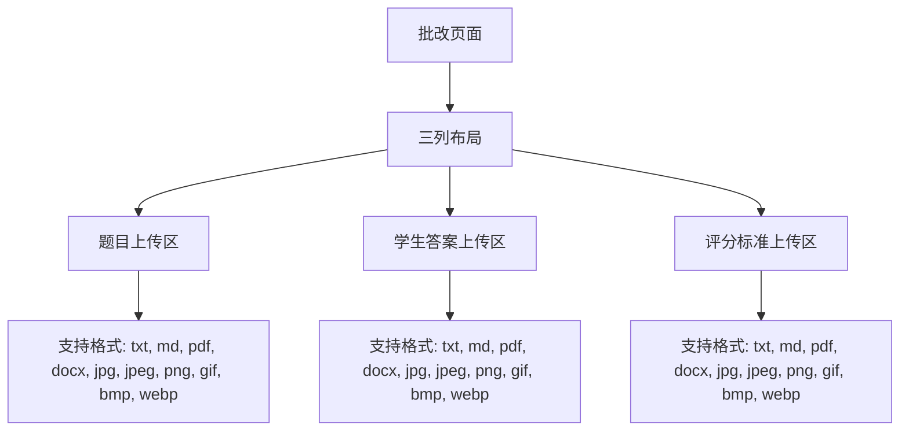

# 文件上传区

<cite>
**本文档引用的文件**
- [main.py](file://ai_correction/main.py)
- [UI_OPTIMIZATION_SUMMARY.md](file://ai_correction/docs/UI_OPTIMIZATION_SUMMARY.md)
- [workflow_multimodal.py](file://ai_correction/functions/langgraph/workflow_multimodal.py)
- [IMAGE_PDF_SUPPORT_SUMMARY.md](file://ai_correction/docs/IMAGE_PDF_SUPPORT_SUMMARY.md)
</cite>

## 目录
1. [简介](#简介)
2. [三列文件上传区域设计](#三列文件上传区域设计)
3. [上传状态管理机制](#上传状态管理机制)
4. [UI优化设计原则](#ui优化设计原则)
5. [文件输入与后端服务绑定](#文件输入与后端服务绑定)
6. [扩展支持更多文件格式](#扩展支持更多文件格式)
7. [添加拖拽上传功能](#添加拖拽上传功能)

## 简介
本文档详细描述了基于Streamlit实现的三列文件上传区域，包括题目、学生答案和评分标准的独立上传组件。重点分析`main.py`中`show_production_grading_ui()`函数如何通过`st.columns(3)`构建并行输入布局，并为每个列分配语义化标签和文件类型限制（如.txt, .pdf, .png）。文档化上传状态管理机制，包括文件缓存策略、重复上传处理和错误提示逻辑。结合UI_OPTIMIZATION_SUMMARY.md中的设计原则，说明为何采用分列式布局以提升教师用户的数据组织效率。提供实际代码片段展示文件输入与后端`run_multimodal_grading`服务的初步数据绑定方式，并指导开发者如何扩展支持更多文件格式或添加拖拽上传功能。

## 三列文件上传区域设计
系统通过`st.columns(3)`创建并行的三列布局，分别用于上传题目、学生答案和评分标准文件。每列都配置了语义化的标签和特定的文件类型限制，确保用户能够清晰地识别每个上传区域的用途。



**Diagram sources**
- [main.py](file://ai_correction/main.py)
- [IMAGE_PDF_SUPPORT_SUMMARY.md](file://ai_correction/docs/IMAGE_PDF_SUPPORT_SUMMARY.md)

**Section sources**
- [main.py](file://ai_correction/main.py)
- [UI_OPTIMIZATION_SUMMARY.md](file://ai_correction/docs/UI_OPTIMIZATION_SUMMARY.md)

## 上传状态管理机制
系统采用Streamlit的session state机制来管理文件上传状态。当用户上传文件时，文件信息被保存在`st.session_state.uploaded_files_data`中，包括文件名、路径和类型。系统还实现了文件缓存策略，避免重复上传相同的文件。

```python
# 初始化session state
def init_session():
    if 'uploaded_files_data' not in st.session_state:
        st.session_state.uploaded_files_data = []
    if 'current_file_index' not in st.session_state:
        st.session_state.current_file_index = 0
