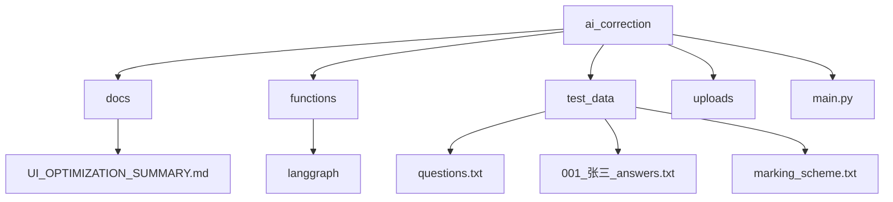
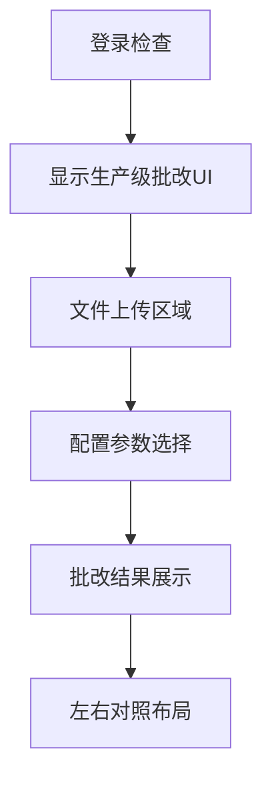
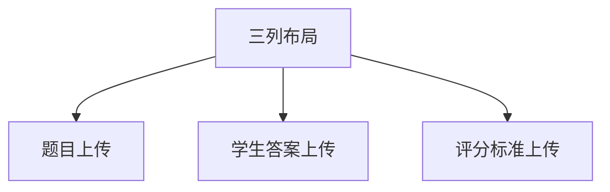
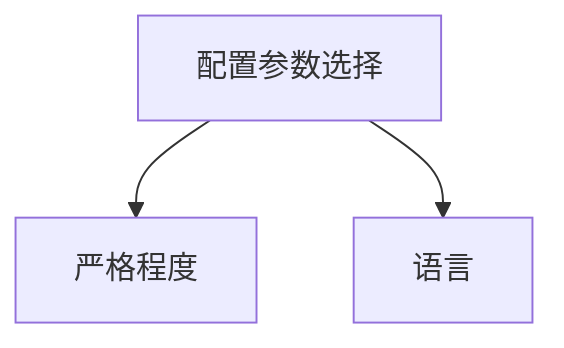
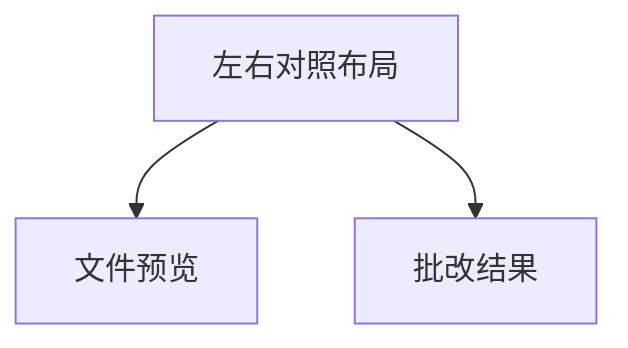
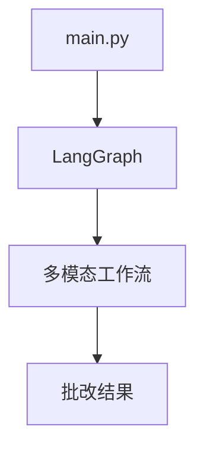

# 界面布局

<cite>
**本文档引用文件**  
- [main.py](file://ai_correction/main.py)
- [UI_OPTIMIZATION_SUMMARY.md](file://ai_correction/docs/UI_OPTIMIZATION_SUMMARY.md)
- [test_data/questions.txt](file://ai_correction/test_data/questions.txt)
- [test_data/001_张三_answers.txt](file://ai_correction/test_data/001_张三_answers.txt)
- [test_data/marking_scheme.txt](file://ai_correction/test_data/marking_scheme.txt)
</cite>

## 目录
1. [简介](#简介)
2. [项目结构](#项目结构)
3. [核心组件](#核心组件)
4. [架构概述](#架构概述)
5. [详细组件分析](#详细组件分析)
6. [依赖分析](#依赖分析)
7. [性能考虑](#性能考虑)
8. [故障排除指南](#故障排除指南)
9. [结论](#结论)
10. [附录](#附录)（如有必要）

## 简介
本文档详细说明了基于Streamlit的前端UI结构设计，重点关注`main.py`中`show_production_grading_ui()`函数实现的三列文件上传区域（题目、学生答案、评分标准）、配置参数选择面板（严格程度、语言等）以及结果展示区的布局逻辑。文档化UI组件的视觉层次结构，包括使用卡片式设计、渐变背景、彩色边框和圆角样式提升可读性的具体实现。参考UI_OPTIMIZATION_SUMMARY.md中的设计决策，解释为何移除了旧的模式选择逻辑并直接集成生产级批改UI。为开发者提供布局定制指南，例如如何调整列宽、修改组件间距或添加新的输入字段，同时确保与后端数据流的兼容性。

## 项目结构
本项目采用模块化设计，主要包含以下目录结构：
- `ai_correction/`：主应用程序目录
  - `docs/`：文档目录，包含UI优化总结等设计文档
  - `functions/`：功能模块目录，包含LangGraph集成、数据库管理等
  - `test_data/`：测试数据目录，包含题目、学生答案和评分标准示例文件
  - `uploads/`：用户上传文件存储目录
  - `main.py`：主应用程序入口文件

**图源**  
- [main.py](file://ai_correction/main.py#L1-L50)
- [UI_OPTIMIZATION_SUMMARY.md](file://ai_correction/docs/UI_OPTIMIZATION_SUMMARY.md#L1-L10)

## 核心组件
核心UI组件包括：
- 三列文件上传区域：分别用于上传题目、学生答案和评分标准
- 配置参数选择面板：提供严格程度、语言等选项
- 结果展示区：左右对照布局，左侧为文件预览，右侧为批改结果

**节源**  
- [main.py](file://ai_correction/main.py#L470-L669)
- [UI_OPTIMIZATION_SUMMARY.md](file://ai_correction/docs/UI_OPTIMIZATION_SUMMARY.md#L67-L121)

## 架构概述
系统采用生产级AI批改架构，直接集成LangGraph多模态工作流，简化了用户界面，移除了旧的模式选择逻辑。批改页面直接显示生产级批改UI，提升了用户体验。

**图源**  
- [main.py](file://ai_correction/main.py#L500-L550)
- [UI_OPTIMIZATION_SUMMARY.md](file://ai_correction/docs/UI_OPTIMIZATION_SUMMARY.md#L0-L66)

## 详细组件分析
### 文件上传区域
文件上传区域采用三列布局，分别用于上传题目、学生答案和评分标准。每列使用`st.columns(3)`创建，确保布局均衡。

**图源**  
- [main.py](file://ai_correction/main.py#L479-L508)
- [test_data/questions.txt](file://ai_correction/test_data/questions.txt#L1-L12)
- [test_data/001_张三_answers.txt](file://ai_correction/test_data/001_张三_answers.txt#L1-L14)
- [test_data/marking_scheme.txt](file://ai_correction/test_data/marking_scheme.txt#L1-L18)

### 配置参数选择面板
配置参数选择面板提供严格程度、语言等选项，使用`st.selectbox`实现，确保用户可以轻松选择所需参数。

**图源**  
- [main.py](file://ai_correction/main.py#L508-L520)
- [UI_OPTIMIZATION_SUMMARY.md](file://ai_correction/docs/UI_OPTIMIZATION_SUMMARY.md#L67-L121)

### 结果展示区
结果展示区采用左右对照布局，左侧为文件预览，右侧为批改结果。使用`st.columns(2)`创建，确保布局清晰。

**图源**  
- [main.py](file://ai_correction/main.py#L877-L925)
- [UI_OPTIMIZATION_SUMMARY.md](file://ai_correction/docs/UI_OPTIMIZATION_SUMMARY.md#L67-L121)

## 依赖分析
系统依赖于LangGraph多模态工作流，确保批改过程的高效性和准确性。通过`LANGGRAPH_AVAILABLE`标志检查系统就绪状态，确保用户体验。

**图源**  
- [main.py](file://ai_correction/main.py#L500-L550)
- [functions/langgraph/__init__.py](file://ai_correction/functions/langgraph/__init__.py#L1-L10)

## 性能考虑
系统通过优化文件上传和预览功能，确保高性能。使用`st.markdown`和`st.image`等Streamlit原生组件，减少渲染时间。

## 故障排除指南
常见问题包括文件上传失败、预览不可用等。确保文件格式正确，路径存在，且系统配置正确。

**节源**  
- [main.py](file://ai_correction/main.py#L782-L807)
- [user_data.json](file://ai_correction/user_data.json#L545-L586)

## 结论
本文档详细说明了基于Streamlit的前端UI结构设计，重点关注`main.py`中`show_production_grading_ui()`函数实现的三列文件上传区域、配置参数选择面板以及结果展示区的布局逻辑。通过优化设计，提升了用户体验和系统性能。

## 附录
无