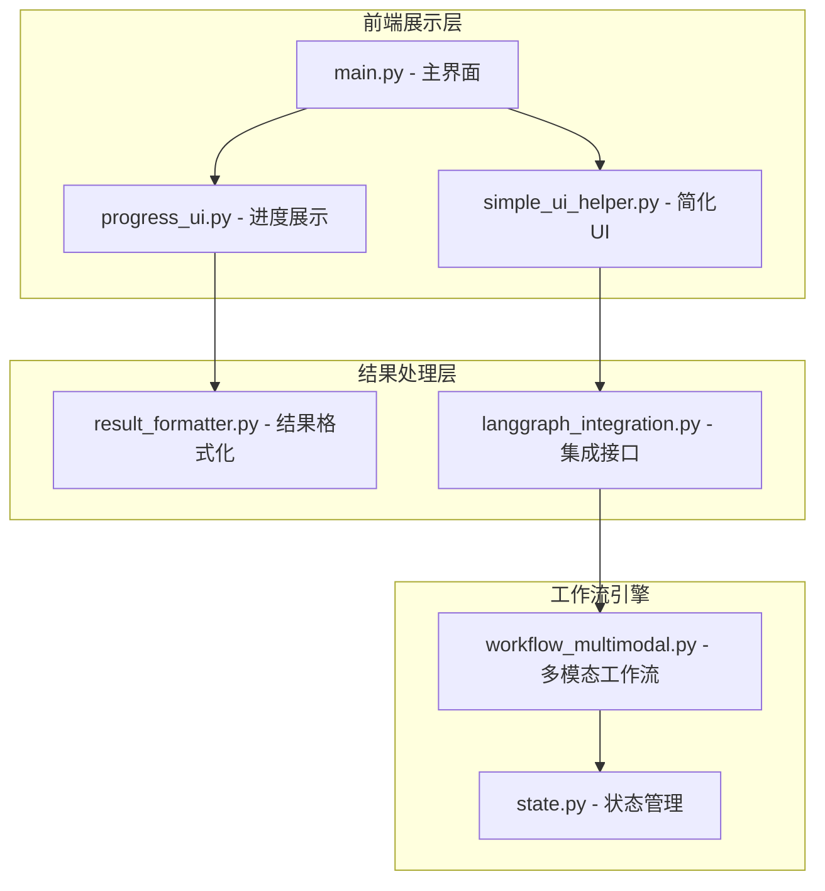
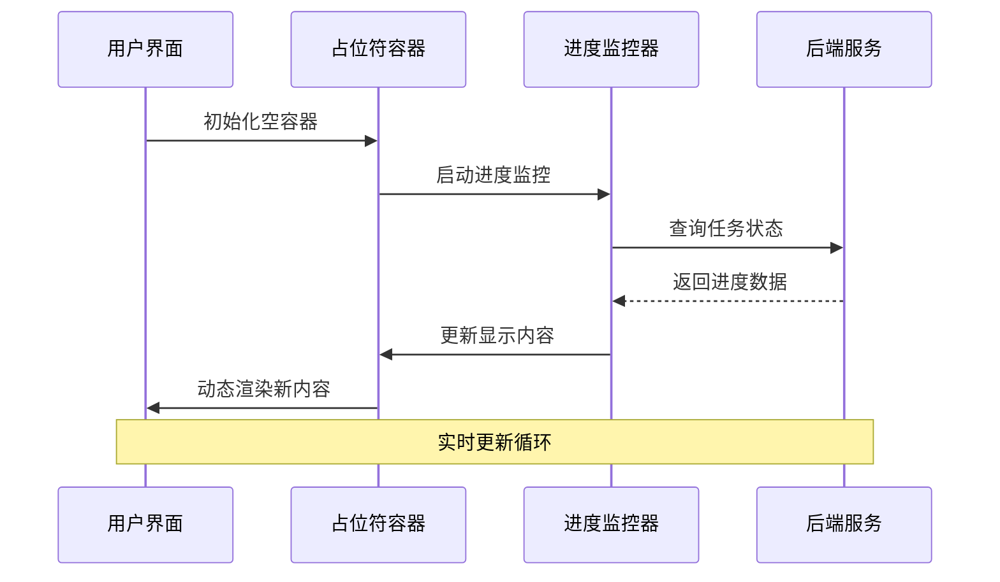
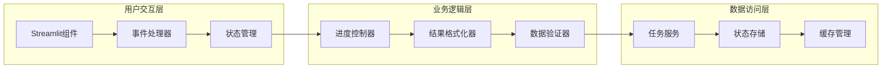
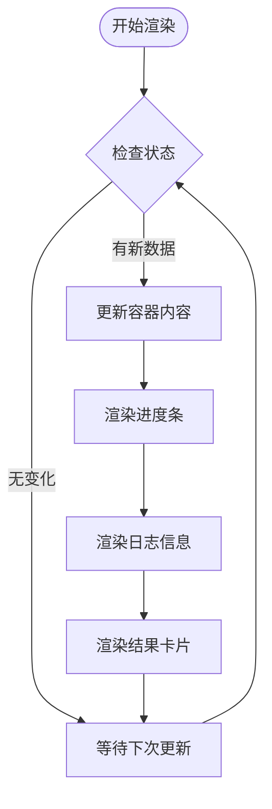
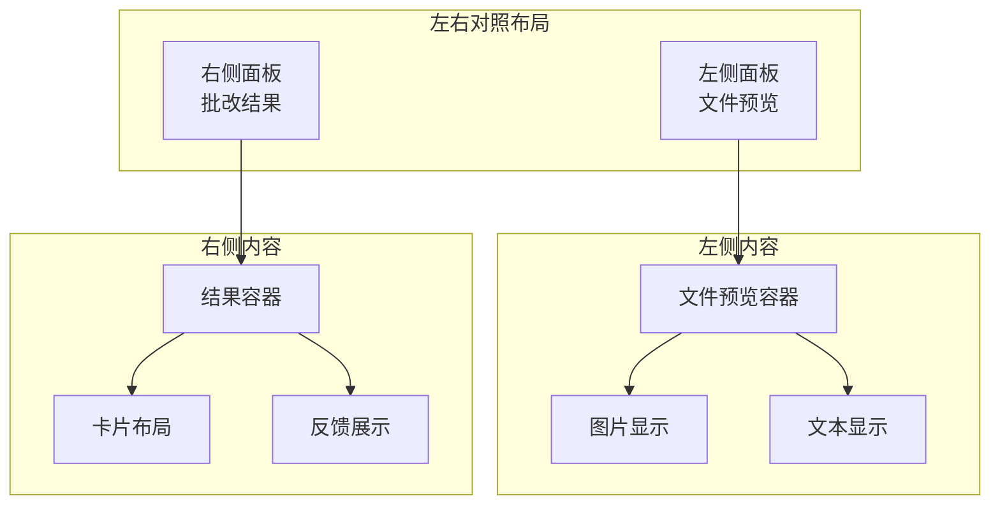
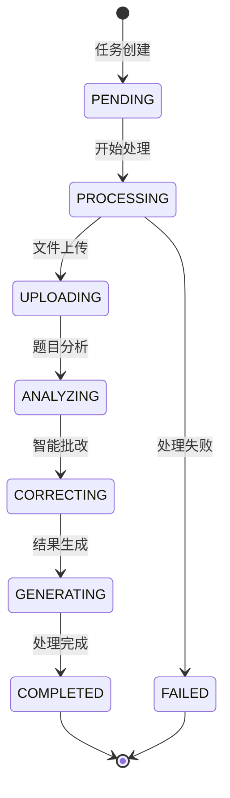
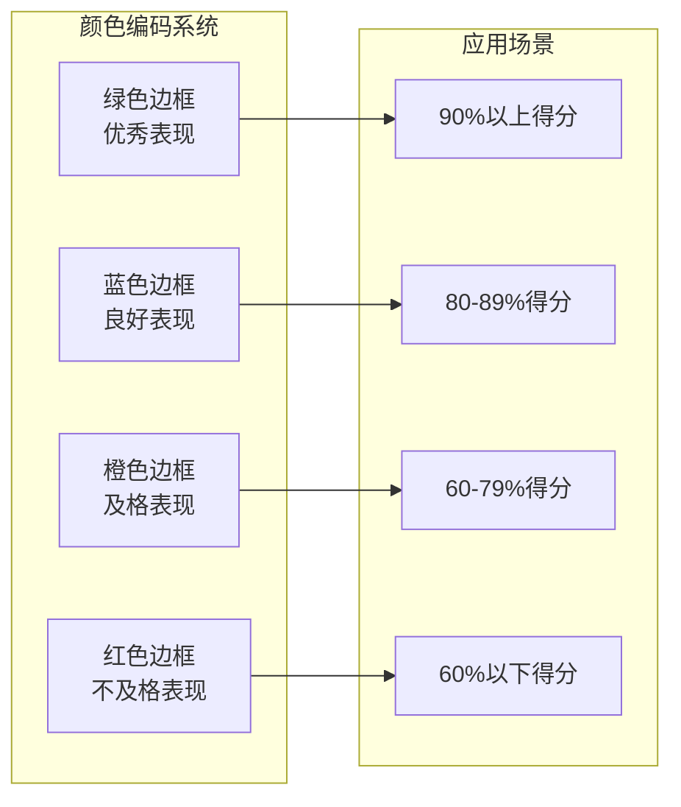
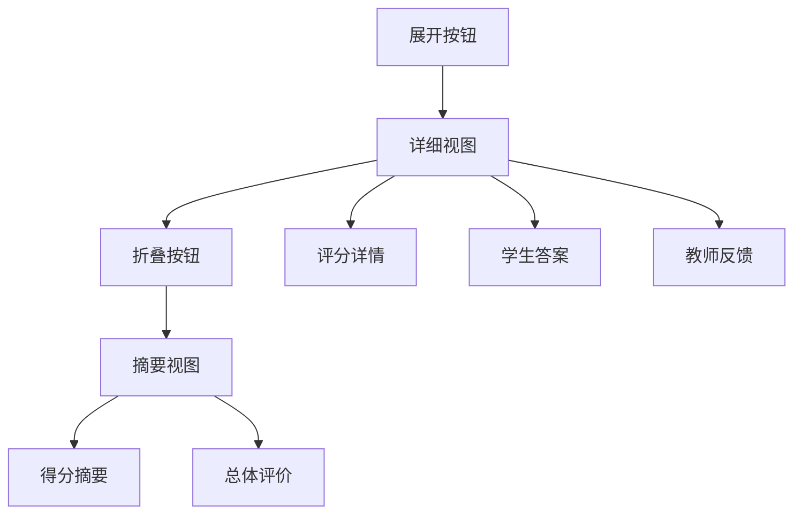
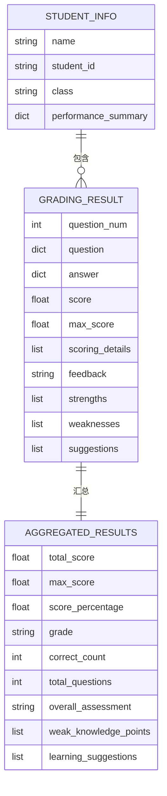
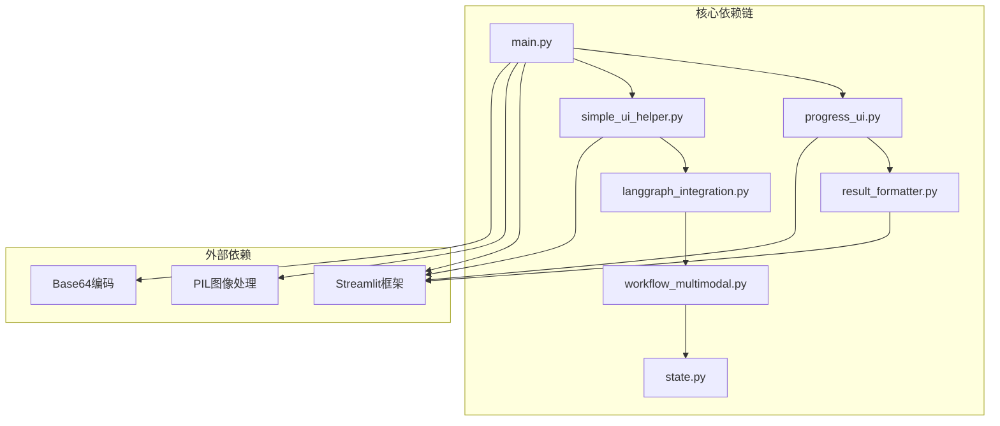

# 结果展示框架

<cite>
**本文档引用的文件**
- [main.py](file://ai_correction/main.py)
- [progress_ui.py](file://ai_correction/functions/progress_ui.py)
- [result_formatter.py](file://ai_correction/functions/langgraph/result_formatter.py)
- [simple_ui_helper.py](file://ai_correction/functions/langgraph/simple_ui_helper.py)
- [workflow_multimodal.py](file://ai_correction/functions/langgraph/workflow_multimodal.py)
- [langgraph_integration.py](file://ai_correction/functions/langgraph_integration.py)
- [state.py](file://ai_correction/functions/langgraph/state.py)
</cite>

## 目录
1. [简介](#简介)
2. [项目结构概览](#项目结构概览)
3. [核心组件分析](#核心组件分析)
4. [架构概览](#架构概览)
5. [详细组件分析](#详细组件分析)
6. [依赖关系分析](#依赖关系分析)
7. [性能考虑](#性能考虑)
8. [故障排除指南](#故障排除指南)
9. [结论](#结论)

## 简介

AI智能批改系统的结果展示框架是一个基于Streamlit的现代化Web应用，专门设计用于展示复杂的批改结果。该框架通过创新的UI结构与动态渲染逻辑，实现了渐进式的用户体验，支持实时进度跟踪、详细的批改结果展示以及交互式的数据可视化。

系统的核心设计理念是通过分层展示策略，将复杂的学习数据分解为易于理解的视觉元素，包括进度条、实时日志流、批改结果卡片和班级分析图表。这种设计不仅提升了用户体验，还确保了信息的有效传达。

## 项目结构概览

结果展示框架采用模块化架构，主要包含以下核心模块：

**图表来源**
- [main.py](file://ai_correction/main.py#L1-L50)
- [progress_ui.py](file://ai_correction/functions/progress_ui.py#L1-L30)
- [workflow_multimodal.py](file://ai_correction/functions/langgraph/workflow_multimodal.py#L1-L50)

**章节来源**
- [main.py](file://ai_correction/main.py#L1-L100)
- [progress_ui.py](file://ai_correction/functions/progress_ui.py#L1-L50)

## 核心组件分析

### 渐进式结果更新机制

系统通过`st.empty()`占位符实现的渐进式结果更新机制是其核心创新之一。这一机制允许在不刷新整个页面的情况下动态更新UI内容，提供了流畅的用户体验。

**图表来源**
- [langgraph_integration.py](file://ai_correction/functions/langgraph_integration.py#L289-L330)
- [progress_ui.py](file://ai_correction/functions/progress_ui.py#L147-L181)

### 分层展示策略

系统采用分层展示策略，将不同类型的信息组织在不同的视觉层次中：

| 层级 | 组件 | 功能 | 视觉特征 |
|------|------|------|----------|
| 1 | 进度条 | 显示整体处理进度 | 水平进度条，百分比显示 |
| 2 | 状态指示器 | 显示当前处理阶段 | 阶段性状态标记 |
| 3 | 日志流 | 实时显示处理过程 | 时间顺序的日志信息 |
| 4 | 结果卡片 | 展示具体批改结果 | 卡片式布局，彩色边框 |
| 5 | 详细分析 | 提供深入分析信息 | 折叠面板，展开详情 |

**章节来源**
- [progress_ui.py](file://ai_correction/functions/progress_ui.py#L52-L88)
- [result_formatter.py](file://ai_correction/functions/langgraph/result_formatter.py#L10-L50)

## 架构概览

结果展示框架的整体架构体现了现代Web应用的最佳实践，通过清晰的职责分离和模块化设计实现了高度的可维护性和扩展性。

**图表来源**
- [main.py](file://ai_correction/main.py#L200-L300)
- [langgraph_integration.py](file://ai_correction/functions/langgraph_integration.py#L280-L350)

## 详细组件分析

### `main.py`中的UI结构

`main.py`作为系统的主入口，负责构建整体的UI框架和管理全局状态。其中最引人注目的是通过`st.empty()`实现的动态渲染机制。

#### 渐进式结果更新机制

系统使用`st.empty()`占位符来实现渐进式结果更新，这种设计具有以下优势：

- **无刷新更新**：避免了页面重载，提供流畅的用户体验
- **内存效率**：只更新变化的部分，减少资源消耗
- **响应式设计**：能够根据数据变化自动调整显示内容

**图表来源**
- [main.py](file://ai_correction/main.py#L280-L320)
- [langgraph_integration.py](file://ai_correction/functions/langgraph_integration.py#L310-L330)

#### 左右对照布局设计

系统采用左右对照的布局设计，左侧显示文件预览，右侧展示批改结果：

**图表来源**
- [main.py](file://ai_correction/main.py#L680-L750)
- [main.py](file://ai_correction/main.py#L840-L900)

**章节来源**
- [main.py](file://ai_correction/main.py#L680-L900)

### `progress_ui.py`的前端协同机制

`progress_ui.py`模块专门负责进度展示和状态更新，与前端系统紧密协同工作。

#### 阶段性状态推送

系统通过多个阶段的状态推送机制，确保用户能够实时了解批改进程：

**图表来源**
- [progress_ui.py](file://ai_correction/functions/progress_ui.py#L70-L90)
- [state.py](file://ai_correction/functions/langgraph/state.py#L150-L180)

#### UI刷新触发机制

系统通过定时轮询和事件驱动两种方式触发UI刷新：

| 刷新方式 | 触发条件 | 更新频率 | 适用场景 |
|----------|----------|----------|----------|
| 定时轮询 | 任务进行中 | 2秒间隔 | 实时进度跟踪 |
| 事件驱动 | 状态变化 | 即时 | 关键状态变更 |
| 手动刷新 | 用户操作 | 用户触发 | 强制更新 |

**章节来源**
- [progress_ui.py](file://ai_correction/functions/progress_ui.py#L147-L181)
- [langgraph_integration.py](file://ai_correction/functions/langgraph_integration.py#L289-L330)

### 结果卡片样式设计

结果卡片是系统中最重要的视觉元素，采用了精心设计的样式系统来区分不同类型的信息。

#### 彩色边框标识系统

系统使用不同颜色的边框来标识学生身份和结果类型：

**图表来源**
- [result_formatter.py](file://ai_correction/functions/langgraph/result_formatter.py#L100-L150)
- [UI_OPTIMIZATION_SUMMARY.md](file://ai_correction/docs/UI_OPTIMIZATION_SUMMARY.md#L198-L228)

#### 折叠式详细反馈

系统采用折叠式设计来管理详细信息的展示，提高信息的可读性和可用性：

**图表来源**
- [main.py](file://ai_correction/main.py#L840-L880)
- [langgraph_integration.py](file://ai_correction/functions/langgraph_integration.py#L370-L390)

**章节来源**
- [result_formatter.py](file://ai_correction/functions/langgraph/result_formatter.py#L100-L200)
- [main.py](file://ai_correction/main.py#L840-L900)

### `result_formatter.py`的输出格式一致性

`result_formatter.py`确保所有结果输出格式的一致性，为后续的可视化和数据分析奠定基础。

#### 格式化策略

系统提供两种主要的格式化策略：

| 格式化版本 | 适用场景 | 内容特点 | 输出形式 |
|------------|----------|----------|----------|
| V2详细版 | 教学分析 | 包含所有细节 | Markdown格式 |
| 简洁版 | 快速浏览 | 关键信息摘要 | 简化Markdown |

#### 数据结构标准化

所有结果数据都遵循统一的数据结构规范：

**图表来源**
- [result_formatter.py](file://ai_correction/functions/langgraph/result_formatter.py#L10-L50)
- [state.py](file://ai_correction/functions/langgraph/state.py#L50-L100)

**章节来源**
- [result_formatter.py](file://ai_correction/functions/langgraph/result_formatter.py#L10-L100)
- [state.py](file://ai_correction/functions/langgraph/state.py#L50-L150)

## 依赖关系分析

结果展示框架的各个组件之间存在复杂的依赖关系，这些关系体现了系统的模块化设计原则。

**图表来源**
- [main.py](file://ai_correction/main.py#L1-L50)
- [progress_ui.py](file://ai_correction/functions/progress_ui.py#L1-L20)
- [workflow_multimodal.py](file://ai_correction/functions/langgraph/workflow_multimodal.py#L1-L30)

**章节来源**
- [main.py](file://ai_correction/main.py#L1-L100)
- [progress_ui.py](file://ai_correction/functions/progress_ui.py#L1-L50)

## 性能考虑

系统在设计时充分考虑了性能优化，采用了多种策略来确保良好的用户体验。

### 渲染性能优化

- **虚拟化技术**：对于大量数据的展示，采用虚拟化技术只渲染可见区域
- **懒加载**：非关键内容采用懒加载策略，减少初始加载时间
- **缓存机制**：频繁访问的数据采用内存缓存，减少重复计算

### 网络传输优化

- **数据压缩**：结果数据采用高效的压缩算法
- **增量更新**：只传输变化的数据，减少网络开销
- **并发处理**：支持多个请求并发处理，提高响应速度

## 故障排除指南

### 常见问题及解决方案

#### 进度显示异常

**问题症状**：进度条不更新或显示错误

**可能原因**：
- 任务状态查询失败
- 网络连接中断
- 后端服务异常

**解决步骤**：
1. 检查任务ID是否正确
2. 验证网络连接状态
3. 查看后端服务日志
4. 重启相关服务组件

#### 结果卡片显示错乱

**问题症状**：卡片布局混乱或内容显示异常

**可能原因**：
- CSS样式冲突
- 数据格式不匹配
- 浏览器兼容性问题

**解决步骤**：
1. 清除浏览器缓存
2. 检查数据格式完整性
3. 验证CSS样式加载
4. 尝试其他浏览器

**章节来源**
- [progress_ui.py](file://ai_correction/functions/progress_ui.py#L50-L100)
- [main.py](file://ai_correction/main.py#L200-L300)

## 结论

AI智能批改系统的结果展示框架代表了现代教育技术应用的一个重要里程碑。通过创新的UI结构设计和动态渲染逻辑，系统成功地将复杂的批改过程转化为直观易懂的视觉体验。

### 主要成就

1. **渐进式用户体验**：通过`st.empty()`占位符实现的动态更新机制，提供了流畅的用户体验
2. **分层信息架构**：清晰的层级结构使复杂信息变得易于理解和消化
3. **交互式可视化**：丰富的图表和交互元素增强了数据分析的效果
4. **可扩展架构**：模块化设计为未来的功能扩展奠定了坚实基础

### 未来发展方向

基于当前的设计理念，系统可以在以下几个方面进一步发展：

- **结果导出功能**：集成多种格式的导出选项
- **可视化趋势图**：添加时间序列分析和趋势预测功能
- **第三方报告生成**：与外部报告系统集成
- **个性化定制**：支持用户自定义显示偏好

这个结果展示框架不仅满足了当前的教育需求，更为未来的教育技术发展提供了宝贵的参考和基础。