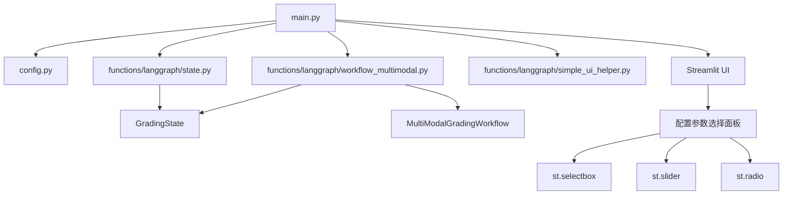
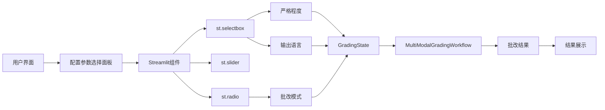
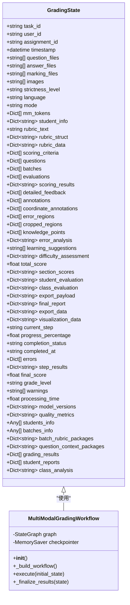
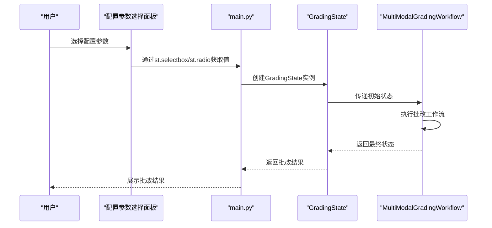
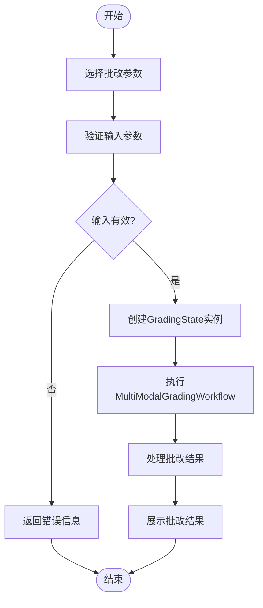
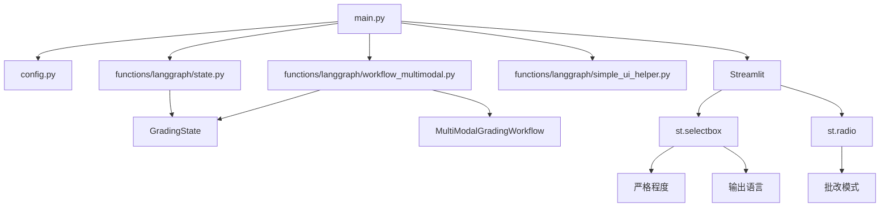

# 配置面板

<cite>
**本文档引用的文件**  
- [main.py](file://main.py)
- [config.py](file://config.py)
- [functions/langgraph/state.py](file://functions/langgraph/state.py)
- [functions/langgraph/workflow_multimodal.py](file://functions/langgraph/workflow_multimodal.py)
- [functions/langgraph/simple_ui_helper.py](file://functions/langgraph/simple_ui_helper.py)
</cite>

## 目录
1. [简介](#简介)
2. [项目结构](#项目结构)
3. [核心组件](#核心组件)
4. [架构概览](#架构概览)
5. [详细组件分析](#详细组件分析)
6. [依赖分析](#依赖分析)
7. [性能考量](#性能考量)
8. [故障排除指南](#故障排除指南)
9. [结论](#结论)

## 简介
本文档深入解析AI智能批改系统中配置参数选择面板的设计与实现。系统通过`main.py`中的Streamlit组件构建交互式控件，将用户选择的配置参数映射到`GradingState`状态对象中，并传递给LangGraph工作流进行批改处理。文档详细说明了严格程度、输出语言、批改模式等可调选项的实现机制，以及与`config.py`中默认配置的联动机制。同时，文档还涵盖了环境变量对前端选项的动态影响、开发者定制指南以及配置变化对批改结果的实际影响。

## 项目结构
本项目采用模块化设计，主要分为以下几个部分：
- `ai_correction/`：主应用程序目录
  - `main.py`：主入口文件，包含Streamlit UI和页面路由
  - `config.py`：系统配置文件，包含环境变量和默认设置
  - `functions/langgraph/`：LangGraph工作流相关模块
    - `state.py`：定义批改状态模型`GradingState`
    - `workflow_multimodal.py`：多模态批改工作流实现
    - `simple_ui_helper.py`：UI辅助函数
  - `docs/`：文档目录
  - `uploads/`：用户上传文件存储目录
  - `test_data/`：测试数据目录

**图源**  
- [main.py](file://main.py)
- [config.py](file://config.py)
- [functions/langgraph/state.py](file://functions/langgraph/state.py)
- [functions/langgraph/workflow_multimodal.py](file://functions/langgraph/workflow_multimodal.py)

**本节来源**  
- [main.py](file://main.py)
- [config.py](file://config.py)

## 核心组件
配置参数选择面板的核心组件包括：
- **严格程度选择**：通过`st.selectbox`实现，提供"宽松"、"中等"、"严格"三个选项
- **输出语言选择**：通过`st.selectbox`实现，支持"中文"和"英文"两种语言
- **批改模式选择**：通过`st.radio`实现，提供"高效"和"专业"两种模式
- **GradingState状态对象**：定义批改过程中的所有状态和参数
- **MultiModalGradingWorkflow**：多模态批改工作流，处理批改逻辑

这些组件共同构成了系统的配置管理机制，允许用户根据需求灵活调整批改行为。

**本节来源**  
- [main.py](file://main.py#L892)
- [functions/langgraph/state.py](file://functions/langgraph/state.py#L44-L75)
- [functions/langgraph/workflow_multimodal.py](file://functions/langgraph/workflow_multimodal.py#L388-L429)

## 架构概览
系统采用前后端分离的架构，前端使用Streamlit构建用户界面，后端使用LangGraph实现批改工作流。配置参数选择面板作为前端的重要组成部分，负责收集用户输入并将其传递给后端工作流。

**图源**  
- [main.py](file://main.py)
- [functions/langgraph/state.py](file://functions/langgraph/state.py)
- [functions/langgraph/workflow_multimodal.py](file://functions/langgraph/workflow_multimodal.py)

## 详细组件分析

### 配置参数选择面板分析
配置参数选择面板是用户与系统交互的主要界面之一，它允许用户根据具体需求调整批改行为。面板通过Streamlit的交互式组件实现，将用户选择映射到`GradingState`状态对象中。

#### 对象导向组件

**图源**  
- [functions/langgraph/state.py](file://functions/langgraph/state.py#L44-L75)
- [functions/langgraph/workflow_multimodal.py](file://functions/langgraph/workflow_multimodal.py#L100-L150)

#### API/服务组件

**图源**  
- [main.py](file://main.py#L892)
- [functions/langgraph/state.py](file://functions/langgraph/state.py#L44-L75)
- [functions/langgraph/workflow_multimodal.py](file://functions/langgraph/workflow_multimodal.py#L388-L429)

### 概念概述
配置参数选择面板的设计遵循了用户友好的原则，通过直观的下拉菜单和单选按钮让用户轻松选择所需的批改参数。系统将这些参数整合到`GradingState`对象中，确保批改工作流能够根据用户的选择进行相应的处理。

[无来源，因为此图表显示的是概念性工作流程，而非实际代码结构]

[无来源，因为此部分不分析特定源文件]

## 依赖分析
系统各组件之间的依赖关系如下：

**图源**  
- [main.py](file://main.py)
- [config.py](file://config.py)
- [functions/langgraph/state.py](file://functions/langgraph/state.py)
- [functions/langgraph/workflow_multimodal.py](file://functions/langgraph/workflow_multimodal.py)

**本节来源**  
- [main.py](file://main.py)
- [config.py](file://config.py)
- [functions/langgraph/state.py](file://functions/langgraph/state.py)
- [functions/langgraph/workflow_multimodal.py](file://functions/langgraph/workflow_multimodal.py)

## 性能考量
配置参数选择面板的设计考虑了性能因素：
- 使用Streamlit的`st.selectbox`和`st.radio`组件，确保用户界面响应迅速
- 将配置参数直接映射到`GradingState`对象，减少数据转换开销
- 通过`MultiModalGradingWorkflow`的异步执行，提高批改效率
- 利用内存检查点（MemorySaver）优化工作流状态管理

[无来源，因为此部分提供一般性指导]

## 故障排除指南
当配置参数选择面板出现问题时，可以参考以下步骤进行排查：
- 检查`main.py`中Streamlit组件的使用是否正确
- 验证`GradingState`对象的字段定义是否完整
- 确认`MultiModalGradingWorkflow`的执行流程是否正常
- 检查环境变量配置是否正确

**本节来源**  
- [main.py](file://main.py)
- [functions/langgraph/state.py](file://functions/langgraph/state.py)
- [functions/langgraph/workflow_multimodal.py](file://functions/langgraph/workflow_multimodal.py)

## 结论
配置参数选择面板是AI智能批改系统的重要组成部分，它通过直观的用户界面让用户能够灵活调整批改行为。系统通过`main.py`中的Streamlit组件收集用户输入，将其映射到`GradingState`状态对象中，并传递给`MultiModalGradingWorkflow`进行批改处理。这种设计不仅提高了系统的可用性，还增强了批改的灵活性和准确性。

[无来源，因为此部分总结而不分析特定源文件]