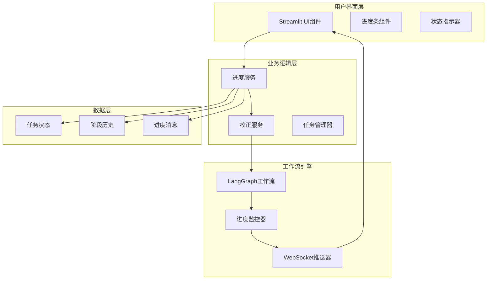
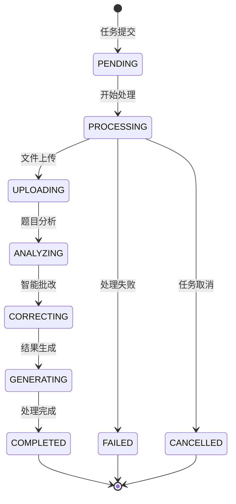
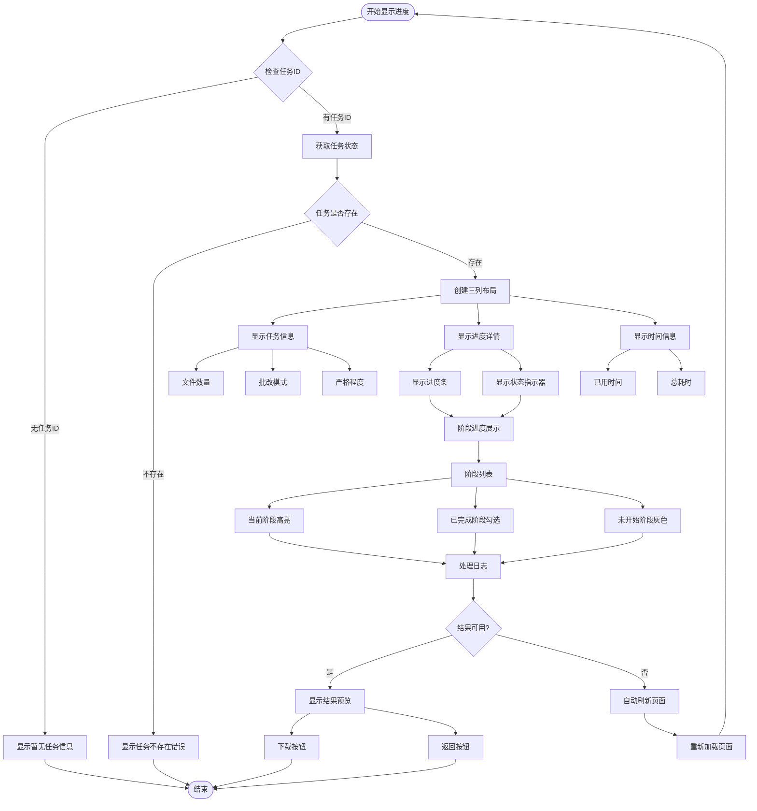
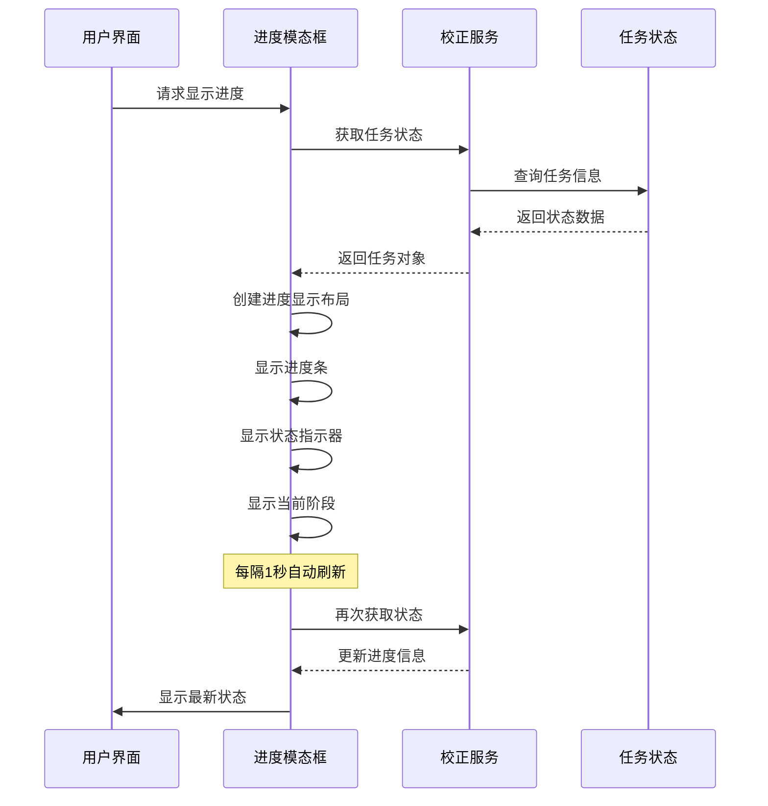
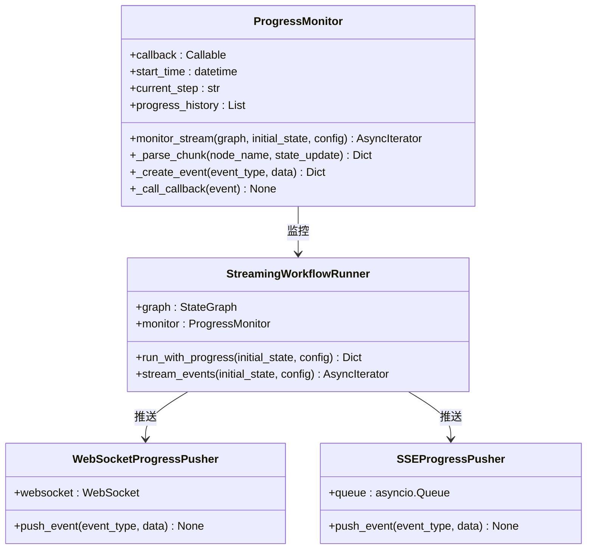
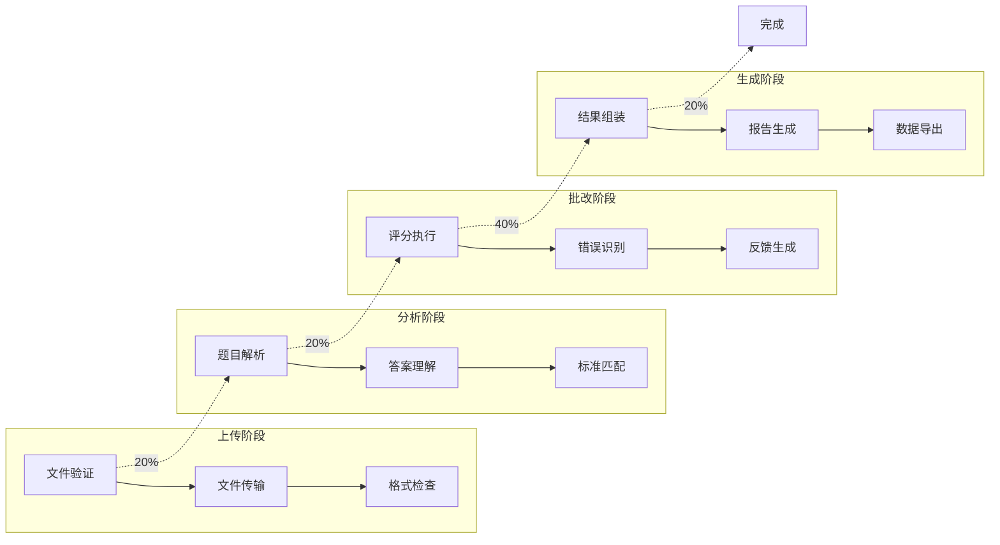

# 进度展示系统详细文档

<cite>
**本文档引用的文件**
- [progress_ui.py](file://ai_correction/functions/progress_ui.py)
- [correction_service.py](file://ai_correction/functions/correction_service.py)
- [state.py](file://ai_correction/functions/langgraph/state.py)
- [streaming.py](file://ai_correction/functions/langgraph/streaming.py)
- [workflow_multimodal.py](file://ai_correction/functions/langgraph/workflow_multimodal.py)
- [main.py](file://ai_correction/main.py)
- [UI_OPTIMIZATION_SUMMARY.md](file://ai_correction/docs/UI_OPTIMIZATION_SUMMARY.md)
</cite>

## 目录
1. [简介](#简介)
2. [系统架构概览](#系统架构概览)
3. [核心组件分析](#核心组件分析)
4. [进度展示模块详解](#进度展示模块详解)
5. [LangGraph工作流集成](#langgraph工作流集成)
6. [实时进度更新机制](#实时进度更新机制)
7. [UI优化与用户体验](#ui优化与用户体验)
8. [自定义与扩展指南](#自定义与扩展指南)
9. [故障排除指南](#故障排除指南)
10. [总结](#总结)

## 简介

进度展示系统是AI智能批改系统的核心用户界面组件，负责实时展示批改任务的处理进度和状态信息。该系统通过`progress_ui.py`模块实现了直观的进度条、阶段状态指示和详细的任务信息展示，帮助用户建立对系统处理过程的信任感。

系统采用Streamlit框架构建，结合LangGraph工作流引擎，提供了完整的实时进度反馈机制。通过监听工作流状态变更事件，系统能够动态更新进度信息，让用户随时了解批改任务的执行状态。

## 系统架构概览

进度展示系统采用分层架构设计，主要包含以下几个层次：



**图表来源**
- [progress_ui.py](file://ai_correction/functions/progress_ui.py#L1-L184)
- [correction_service.py](file://ai_correction/functions/correction_service.py#L1-L225)
- [streaming.py](file://ai_correction/functions/langgraph/streaming.py#L28-L336)

## 核心组件分析

### 任务状态管理

系统通过`TaskStatus`和`CorrectionPhase`枚举定义了完整的任务生命周期状态：



**图表来源**
- [correction_service.py](file://ai_correction/functions/correction_service.py#L13-L40)

### 进度条样式设计

进度展示系统采用了多层次的视觉设计：

| 组件 | 样式特征 | 用途 |
|------|----------|------|
| 总体进度条 | 100%宽度，渐变色彩 | 显示整体处理进度 |
| 阶段进度 | 条件性高亮显示 | 标识当前处理阶段 |
| 状态指示器 | Emoji表情符号 | 快速状态识别 |
| 时间信息 | 实时更新计时器 | 显示处理耗时 |

**章节来源**
- [progress_ui.py](file://ai_correction/functions/progress_ui.py#L25-L88)

## 进度展示模块详解

### 主进度页面实现

`show_progress_page()`函数是进度展示的核心入口，提供了完整的任务监控界面：



**图表来源**
- [progress_ui.py](file://ai_correction/functions/progress_ui.py#L12-L184)

### 模态框进度显示

`show_progress_modal()`函数提供了轻量级的进度显示组件，适用于嵌入其他页面：



**图表来源**
- [progress_ui.py](file://ai_correction/functions/progress_ui.py#L147-L184)

**章节来源**
- [progress_ui.py](file://ai_correction/functions/progress_ui.py#L12-L184)

## LangGraph工作流集成

### 工作流状态监控

系统通过`ProgressMonitor`类实现了对LangGraph工作流的实时监控：



**图表来源**
- [streaming.py](file://ai_correction/functions/langgraph/streaming.py#L28-L336)

### 实时事件推送

系统支持多种实时推送机制：

| 推送器类型 | 适用场景 | 实现方式 |
|------------|----------|----------|
| WebSocketProgressPusher | 实时Web应用 | JSON消息格式 |
| SSEProgressPusher | 服务器发送事件 | 文本事件格式 |
| ProgressCallback | 自定义回调 | Python函数回调 |

**章节来源**
- [streaming.py](file://ai_correction/functions/langgraph/streaming.py#L28-L336)

## 实时进度更新机制

### 进度计算逻辑

系统采用分阶段的进度计算策略：



**图表来源**
- [correction_service.py](file://ai_correction/functions/correction_service.py#L119-L149)

### 状态同步机制

系统通过以下机制确保状态同步：

1. **定时轮询**: 每秒刷新任务状态
2. **事件驱动**: 响应工作流状态变更
3. **缓存策略**: 避免频繁API调用
4. **错误恢复**: 处理网络中断和超时

**章节来源**
- [correction_service.py](file://ai_correction/functions/correction_service.py#L109-L149)

## UI优化与用户体验

### 视觉设计原则

根据UI优化总结文档，系统采用了以下设计原则：

| 设计元素 | 应用场景 | 效果 |
|----------|----------|------|
| 渐变背景 | 关键信息卡片 | 增强视觉层次 |
| 彩色边框 | 状态指示器 | 快速识别状态 |
| 圆角设计 | 所有交互元素 | 提升友好感 |
| 字体层次 | 标题和正文 | 区分信息重要性 |
| 颜色编码 | 不同状态 | 直观的状态表达 |

### 用户信任建立

系统通过以下方式帮助用户建立信任：

1. **透明进度**: 明确展示处理阶段和百分比
2. **实时更新**: 每秒刷新确保信息时效性
3. **详细日志**: 提供处理过程的详细信息
4. **错误提示**: 清晰的错误信息和解决建议

**章节来源**
- [UI_OPTIMIZATION_SUMMARY.md](file://ai_correction/docs/UI_OPTIMIZATION_SUMMARY.md#L1-L390)

## 自定义与扩展指南

### 扩展进度阶段

要添加新的处理阶段，可以修改`phases`列表：

```python
# 在show_progress_page函数中
phases = [
    (CorrectionPhase.UPLOADING, "📤 文件上传"),
    (CorrectionPhase.ANALYZING, "🔍 题目分析"),
    (CorrectionPhase.CORRECTING, "✏️ 智能批改"),
    (CorrectionPhase.GENERATING, "📝 结果生成"),
    (CorrectionPhase.CUSTOM_STEP, "🆕 自定义步骤"),  # 新增阶段
    (CorrectionPhase.COMPLETED, "✅ 已完成")
]
```

### 自定义样式

可以通过修改CSS样式来自定义外观：

```python
# 在show_progress_modal中
st.markdown(f"""
<div style='
    background-color: #f0f0f0;
    border-left: 4px solid #000000;
    padding: 10px;
    margin: 5px 0;
'>
    <b>⏳ {label}</b>
</div>
""", unsafe_allow_html=True)
```

### 扩展推送机制

可以添加新的推送器：

```python
class CustomProgressPusher:
    def __init__(self, endpoint: str):
        self.endpoint = endpoint
    
    async def push_event(self, event_type: str, data: Dict):
        # 实现自定义推送逻辑
        pass
```

**章节来源**
- [progress_ui.py](file://ai_correction/functions/progress_ui.py#L89-L146)

## 故障排除指南

### 常见问题及解决方案

| 问题 | 可能原因 | 解决方案 |
|------|----------|----------|
| 进度不更新 | 网络连接问题 | 检查网络连接，刷新页面 |
| 任务状态异常 | 工作流执行错误 | 查看错误日志，重新提交任务 |
| 模态框无法显示 | 任务ID无效 | 确认任务ID正确性 |
| 样式显示异常 | CSS加载失败 | 检查浏览器控制台错误 |

### 调试技巧

1. **启用调试日志**: 在`correction_service.py`中设置日志级别
2. **检查任务状态**: 使用`get_task_status()`函数验证状态获取
3. **监控网络请求**: 检查WebSocket和SSE连接状态
4. **验证工作流**: 确认LangGraph工作流正常执行

**章节来源**
- [correction_service.py](file://ai_correction/functions/correction_service.py#L150-L225)

## 总结

进度展示系统通过`progress_ui.py`模块实现了完整的实时批改进度反馈机制。系统具有以下特点：

1. **实时性**: 通过WebSocket和SSE实现实时进度推送
2. **可视化**: 直观的进度条和状态指示器
3. **完整性**: 覆盖任务生命周期的全过程监控
4. **可扩展性**: 支持自定义阶段和推送机制
5. **用户体验**: 符合UI优化目标的设计原则

该系统不仅提供了必要的技术功能，更重要的是通过透明的进度展示帮助用户建立对AI批改系统的信任感，这是现代AI应用成功的关键要素之一。开发者可以根据具体需求灵活扩展和定制进度展示功能，以满足不同应用场景的要求。