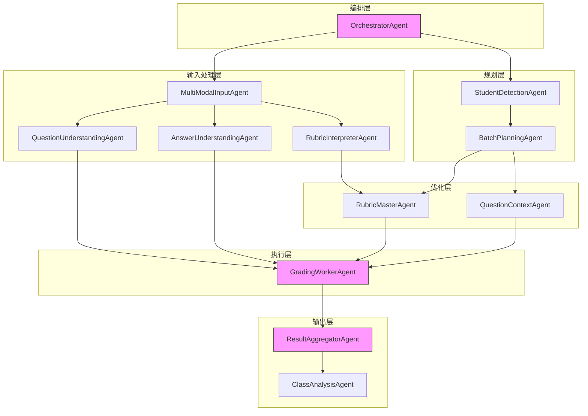
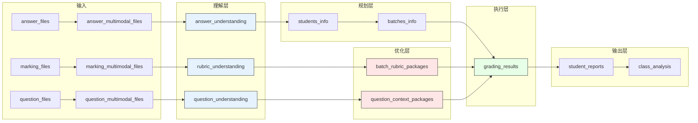

# Agent系统

<cite>
**本文档引用的文件**   
- [orchestrator_agent.py](file://ai_correction/functions/langgraph/agents/orchestrator_agent.py)
- [multimodal_input_agent.py](file://ai_correction/functions/langgraph/agents/multimodal_input_agent.py)
- [question_understanding_agent.py](file://ai_correction/functions/langgraph/agents/question_understanding_agent.py)
- [answer_understanding_agent.py](file://ai_correction/functions/langgraph/agents/answer_understanding_agent.py)
- [rubric_interpreter_agent.py](file://ai_correction/functions/langgraph/agents/rubric_interpreter_agent.py)
- [student_detection_agent.py](file://ai_correction/functions/langgraph/agents/student_detection_agent.py)
- [batch_planning_agent.py](file://ai_correction/functions/langgraph/agents/batch_planning_agent.py)
- [rubric_master_agent.py](file://ai_correction/functions/langgraph/agents/rubric_master_agent.py)
- [question_context_agent.py](file://ai_correction/functions/langgraph/agents/question_context_agent.py)
- [grading_worker_agent.py](file://ai_correction/functions/langgraph/agents/grading_worker_agent.py)
- [result_aggregator_agent.py](file://ai_correction/functions/langgraph/agents/result_aggregator_agent.py)
- [class_analysis_agent.py](file://ai_correction/functions/langgraph/agents/class_analysis_agent.py)
- [state.py](file://ai_correction/functions/langgraph/state.py)
- [workflow_new.py](file://ai_correction/functions/langgraph/workflow_new.py)
</cite>

## 目录
1. [引言](#引言)
2. [核心Agent组件详解](#核心agent组件详解)
3. [Agent协作与工作流编排](#agent协作与工作流编排)
4. [数据传递与输入/输出契约](#数据传递与输入输出契约)
5. [Token优化机制](#token优化机制)
6. [自定义与扩展指南](#自定义与扩展指南)
7. [结论](#结论)

## 引言
本系统采用LangGraph框架构建了一个先进的AI批改系统，通过12个核心Agent组件的协同工作，实现了从多模态输入处理到最终结果输出的完整批改流程。系统采用Orchestrator-Worker模式，将复杂的批改任务分解为多个专业化、可复用的组件，每个Agent专注于特定的子任务，通过状态共享和数据传递实现高效协作。该架构不仅提高了系统的可维护性和可扩展性，还通过创新的Token优化机制显著降低了LLM调用成本。

**Section sources**
- [state.py](file://ai_correction/functions/langgraph/state.py#L1-L50)
- [workflow_new.py](file://ai_correction/functions/langgraph/workflow_new.py#L1-L27)

## 核心Agent组件详解

### OrchestratorAgent（任务编排）
OrchestratorAgent作为系统的编排协调中心，负责全局任务的分解与协调。它不直接进行LLM调用，而是通过分析任务类型（单人、批量或班级批改）来决定后续Agent的执行路径。该Agent会估算最优批次大小，决定是否启用学生识别和班级分析功能，并监控全局进度。其核心价值在于轻量级的逻辑编排，避免了不必要的LLM调用，从而优化了整体性能。

**Section sources**
- [orchestrator_agent.py](file://ai_correction/functions/langgraph/agents/orchestrator_agent.py#L1-L130)

### MultiModalInputAgent（多模态输入处理）
MultiModalInputAgent负责处理各种格式的输入文件，包括文本、图片和PDF等。它将上传的文件转换为统一的多模态表示，保留原始模态信息而不进行OCR转换。该Agent会分别处理题目、答案和评分标准文件，为后续的分析Agent提供标准化的输入。其设计确保了系统能够处理不同格式的教育材料，增强了系统的灵活性和适用性。

**Section sources**
- [multimodal_input_agent.py](file://ai_correction/functions/langgraph/agents/multimodal_input_agent.py#L1-L123)

### QuestionUnderstandingAgent（题目理解）
QuestionUnderstandingAgent专门负责理解题目内容，支持文本和Vision两种模态。对于文本题目，它通过LLM分析题目的关键要求、上下文和难度等级；对于图片题目，则利用Vision API进行图像识别和理解。该Agent的输出包含了题目的结构化理解结果，为后续的批改过程提供了必要的语境信息。

**Section sources**
- [question_understanding_agent.py](file://ai_correction/functions/langgraph/agents/question_understanding_agent.py#L1-L157)

### AnswerUnderstandingAgent（答案理解）
AnswerUnderstandingAgent的功能与QuestionUnderstandingAgent类似，但专注于学生答案的理解。它同样支持多模态输入，能够处理文本和图片格式的答案。通过LLM分析，该Agent提取答案的关键点、结构特征和完整性，为评分过程提供基础数据。其理解结果直接影响批改的准确性和公平性。

**Section sources**
- [answer_understanding_agent.py](file://ai_correction/functions/langgraph/agents/answer_understanding_agent.py#L1-L154)

### RubricInterpreterAgent（评分标准解析）
RubricInterpreterAgent负责解析评分标准文件，提取其中的评分点和分值。它能够处理文本和PDF格式的评分标准，通过LLM理解复杂的评分规则，并将其转换为结构化的评分标准。当无法通过LLM解析时，该Agent还具备简单的文本分析能力，能够从文本中提取基本的评分点和分值。

**Section sources**
- [rubric_interpreter_agent.py](file://ai_correction/functions/langgraph/agents/rubric_interpreter_agent.py#L1-L205)

### StudentDetectionAgent（学生信息识别）
StudentDetectionAgent的任务是从答案文件中识别学生信息，如姓名、学号和班级。在当前实现中，它主要通过解析文件名来提取学生信息。该Agent的输出为后续的批次规划和结果聚合提供了必要的学生数据，确保批改结果能够正确关联到每个学生。

**Section sources**
- [student_detection_agent.py](file://ai_correction/functions/langgraph/agents/student_detection_agent.py#L1-L67)

### BatchPlanningAgent（批次规划）
BatchPlanningAgent根据学生列表和最优批次大小来规划批改批次。它将学生分组为多个批次，以便并行处理。每个批次包含一组学生和相关的处理信息，如预计的Token消耗和并行优先级。这种批次化处理策略显著提高了系统的处理效率，特别是在处理大量学生作业时。

**Section sources**
- [batch_planning_agent.py](file://ai_correction/functions/langgraph/agents/batch_planning_agent.py#L1-L73)

### RubricMasterAgent（评分标准主控）
RubricMasterAgent是系统中的关键优化组件，负责为每个批次生成定制化的压缩版评分包。它接收由RubricInterpreterAgent生成的完整评分标准，并将其转换为轻量级的压缩格式，包括简化的评分点、决策树和快速检查方法。这种预处理机制使得后续的批改Agent能够以极低的Token消耗访问评分标准。

**Section sources**
- [rubric_master_agent.py](file://ai_correction/functions/langgraph/agents/rubric_master_agent.py#L1-L128)

### QuestionContextAgent（题目上下文生成）
QuestionContextAgent为批改过程提供题目语境支持。它将题目的核心信息（如关键要求和核心文本）提取并压缩，生成轻量级的上下文包。这些上下文包与评分包一起分发给批改Agent，确保它们在批改时有足够的语境信息，同时最大限度地减少Token使用。

**Section sources**
- [question_context_agent.py](file://ai_correction/functions/langgraph/agents/question_context_agent.py#L1-L93)

### GradingWorkerAgent（批改执行）
GradingWorkerAgent是实际执行批改工作的核心组件。它接收由RubricMasterAgent和QuestionContextAgent生成的压缩包，结合学生答案理解结果，对每个学生的答案进行评分。该Agent的设计重点是高效性，通过使用压缩版的评分标准和上下文，显著降低了LLM调用的Token消耗，实现了成本优化的批改。

**Section sources**
- [grading_worker_agent.py](file://ai_correction/functions/langgraph/agents/grading_worker_agent.py#L1-L136)

### ResultAggregatorAgent（结果聚合）
ResultAggregatorAgent负责汇总所有批次的批改结果，生成结构化的报告。它为每个学生生成详细的报告，包括总分、等级评定、详细反馈和改进建议。同时，它还计算整体的统计信息，如平均分和完成时间，为教师提供全面的批改概览。

**Section sources**
- [result_aggregator_agent.py](file://ai_correction/functions/langgraph/agents/result_aggregator_agent.py#L1-L143)

### ClassAnalysisAgent（班级分析）
ClassAnalysisAgent仅在班级批改模式下启用，负责生成班级整体的分析报告。它分析所有学生的批改结果，识别共性问题和知识薄弱点，计算分数分布，并提供教学改进建议。该Agent的输出帮助教师了解班级整体的学习情况，为教学决策提供数据支持。

**Section sources**
- [class_analysis_agent.py](file://ai_correction/functions/langgraph/agents/class_analysis_agent.py#L1-L122)

## Agent协作与工作流编排



**Diagram sources **
- [workflow_new.py](file://ai_correction/functions/langgraph/workflow_new.py#L1-L27)
- [state.py](file://ai_correction/functions/langgraph/state.py#L1-L269)

**Section sources**
- [workflow_new.py](file://ai_correction/functions/langgraph/workflow_new.py#L1-L27)

## 数据传递与输入/输出契约



**Diagram sources **
- [state.py](file://ai_correction/functions/langgraph/state.py#L1-L269)

**Section sources**
- [state.py](file://ai_correction/functions/langgraph/state.py#L1-L269)

## Token优化机制

```mermaid
classDiagram
class RubricUnderstanding {
+rubric_id : str
+criteria : List[GradingCriterion]
+total_points : float
+grading_rules : Dict
}
class RubricPackage {
+batch_id : str
+compressed_criteria : List[Dict]
+decision_trees : Dict
+quick_checks : Dict
+total_points : float
}
class QuestionContextPackage {
+batch_id : str
+compressed_text : str
+key_requirements : List
+quick_ref : str
}
class GradingWorkerAgent {
-_grade_student()
}
RubricUnderstanding --> RubricPackage : "生成"
QuestionContextPackage --> GradingWorkerAgent : "提供"
RubricPackage --> GradingWorkerAgent : "提供"
QuestionContextPackage --> GradingWorkerAgent : "提供"
note right of RubricPackage
压缩版评分包
- 提取决策树而非完整描述
- 使用简写代替完整术语
- 提供快速检查方法
- 显著减少Token消耗
end
note right of QuestionContextPackage
压缩版题目上下文
- 截断题目文本
- 限制关键要求数量
- 提供快速参考
- 显著减少Token消耗
end
```

**Diagram sources **
- [rubric_master_agent.py](file://ai_correction/functions/langgraph/agents/rubric_master_agent.py#L1-L128)
- [question_context_agent.py](file://ai_correction/functions/langgraph/agents/question_context_agent.py#L1-L93)
- [grading_worker_agent.py](file://ai_correction/functions/langgraph/agents/grading_worker_agent.py#L1-L136)

**Section sources**
- [rubric_master_agent.py](file://ai_correction/functions/langgraph/agents/rubric_master_agent.py#L1-L128)
- [question_context_agent.py](file://ai_correction/functions/langgraph/agents/question_context_agent.py#L1-L93)

## 自定义与扩展指南
要自定义或扩展Agent系统，开发者应遵循以下指南：
1. 继承现有的Agent类并重写`__call__`方法以实现自定义逻辑
2. 在`state.py`中定义新的状态字段以支持额外的数据传递
3. 在工作流文件中注册新的Agent节点并定义其执行顺序
4. 确保新的Agent遵循输入/输出契约，与其他组件兼容
5. 为新的Agent编写单元测试以确保其正确性

**Section sources**
- [state.py](file://ai_correction/functions/langgraph/state.py#L1-L269)
- [workflow_new.py](file://ai_correction/functions/langgraph/workflow_new.py#L1-L27)

## 结论
本Agent系统通过12个专业化组件的协同工作，构建了一个高效、可扩展的AI批改架构。系统采用Orchestrator-Worker模式，实现了任务的合理分解和并行处理。创新的Token优化机制通过RubricMasterAgent和QuestionContextAgent生成的压缩包，显著降低了LLM调用成本。该架构不仅提高了批改的准确性和效率，还为未来的功能扩展提供了坚实的基础。