# 批改执行Agent深度技术文档

<cite>
**本文档引用的文件**
- [grading_worker_agent.py](file://ai_correction/functions/langgraph/agents/grading_worker_agent.py)
- [scoring_agent.py](file://ai_correction/functions/langgraph/agents/scoring_agent.py)
- [evaluate_batch.py](file://ai_correction/functions/langgraph/agents/evaluate_batch.py)
- [workflow.py](file://ai_correction/functions/langgraph/workflow.py)
- [state.py](file://ai_correction/functions/langgraph/state.py)
- [llm_client.py](file://ai_correction/functions/llm_client.py)
- [efficient_mode.py](file://ai_correction/functions/langgraph/prompts/efficient_mode.py)
- [professional_mode.py](file://ai_correction/functions/langgraph/prompts/professional_mode.py)
- [orchestrator_agent.py](file://ai_correction/functions/langgraph/agents/orchestrator_agent.py)
- [routing.py](file://ai_correction/functions/langgraph/routing.py)
</cite>

## 目录
1. [概述](#概述)
2. [系统架构](#系统架构)
3. [GradingWorkerAgent深度解析](#gradingworkeragent深度解析)
4. [ScoringAgent端到端流程](#scoringagent端到端流程)
5. [EvaluateBatchAgent多模态批改](#evaluatebatchagent多模态批改)
6. [并行处理与性能优化](#并行处理与性能优化)
7. [双模式评分策略](#双模式评分策略)
8. [性能优化建议](#性能优化建议)
9. [故障排除指南](#故障排除指南)
10. [总结](#总结)

## 概述

批改执行Agent是AI批改系统的核心组件，负责将评分标准和题目上下文转化为具体的批改操作。系统采用LangGraph框架实现高度模块化的Agent协作，支持高效模式和专业模式两种评分策略，能够处理大规模学生作业批改任务。

### 核心特性

- **模块化设计**：基于LangGraph的Agent协作架构
- **双模式支持**：高效模式（快速批改）和专业模式（详细反馈）
- **并行处理**：支持多批次并发批改提升效率
- **Token优化**：智能控制LLM调用成本
- **多模态支持**：整合OCR和视觉理解能力

## 系统架构

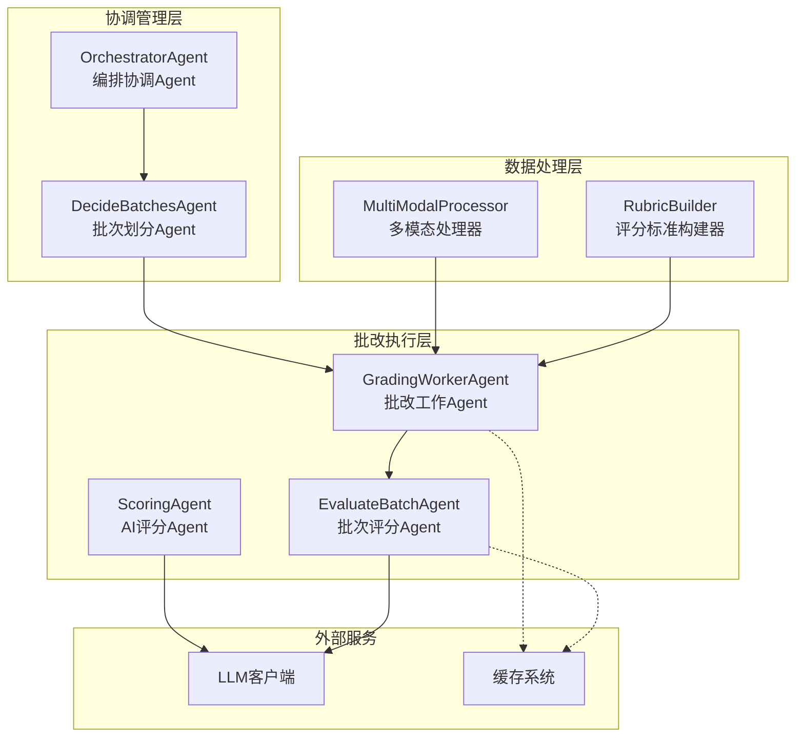
```mermaid
graph TB
subgraph "批改执行层"
GW[GradingWorkerAgent<br/>批改工作Agent]
EB[EvaluateBatchAgent<br/>批次评分Agent]
SA[ScoringAgent<br/>AI评分Agent]
end
subgraph "协调管理层"
OR[OrchestratorAgent<br/>编排协调Agent]
DB[DecideBatchesAgent<br/>批次划分Agent]
end
subgraph "数据处理层"
MM[MultiModalProcessor<br/>多模态处理器]
RB[RubricBuilder<br/>评分标准构建器]
end
subgraph "外部服务"
LLM[LLM客户端]
CACHE[缓存系统]
end
OR --> DB
DB --> GW
GW --> EB
SA --> LLM
EB --> LLM
MM --> GW
RB --> GW
GW -.-> CACHE
EB -.-> CACHE
```

**图表来源**
- [workflow.py](file://ai_correction/functions/langgraph/workflow.py#L1-L100)
- [orchestrator_agent.py](file://ai_correction/functions/langgraph/agents/orchestrator_agent.py#L1-L50)

**章节来源**
- [workflow.py](file://ai_correction/functions/langgraph/workflow.py#L1-L200)
- [state.py](file://ai_correction/functions/langgraph/state.py#L1-L100)

## GradingWorkerAgent深度解析

GradingWorkerAgent是批改系统的基础执行单元，负责基于压缩版评分包和题目上下文进行高效批改。

### 核心架构

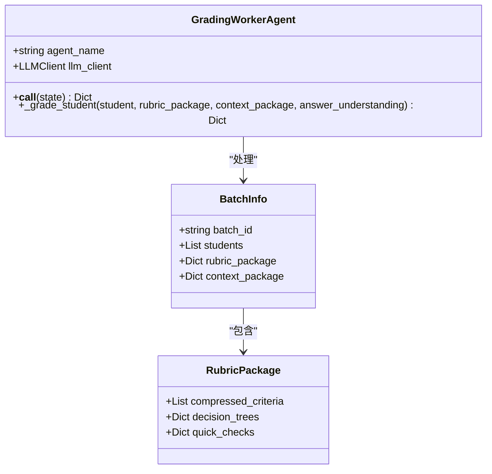
```mermaid
classDiagram
class GradingWorkerAgent {
+string agent_name
+LLMClient llm_client
+__call__(state) Dict
+_grade_student(student, rubric_package, context_package, answer_understanding) Dict
}
class BatchInfo {
+string batch_id
+List students
+Dict rubric_package
+Dict context_package
}
class RubricPackage {
+List compressed_criteria
+Dict decision_trees
+Dict quick_checks
}
GradingWorkerAgent --> BatchInfo : "处理"
BatchInfo --> RubricPackage : "包含"
```

**图表来源**
- [grading_worker_agent.py](file://ai_correction/functions/langgraph/agents/grading_worker_agent.py#L15-L50)

### 内部循环机制

GradingWorkerAgent采用三层嵌套循环结构，实现精细化的批改控制：

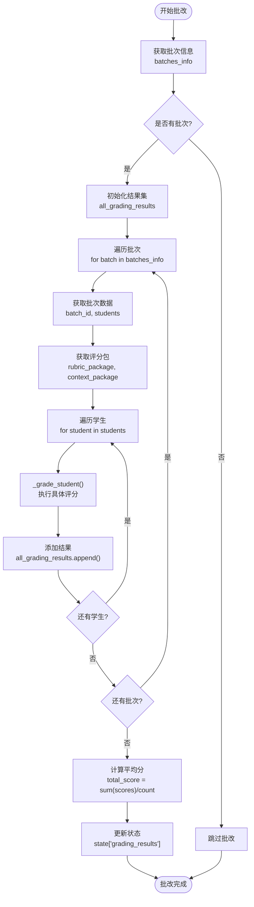
```mermaid
flowchart TD
Start([开始批改]) --> GetBatches["获取批次信息<br/>batches_info"]
GetBatches --> CheckBatches{"是否有批次?"}
CheckBatches --> |否| Skip["跳过批改"]
CheckBatches --> |是| InitResults["初始化结果集<br/>all_grading_results"]
InitResults --> LoopBatches["遍历批次<br/>for batch in batches_info"]
LoopBatches --> GetBatchData["获取批次数据<br/>batch_id, students"]
GetBatchData --> GetPackages["获取评分包<br/>rubric_package, context_package"]
GetPackages --> LoopStudents["遍历学生<br/>for student in students"]
LoopStudents --> GradeStudent["_grade_student()<br/>执行具体评分"]
GradeStudent --> AddResult["添加结果<br/>all_grading_results.append()"]
AddResult --> MoreStudents{"还有学生?"}
MoreStudents --> |是| LoopStudents
MoreStudents --> |否| MoreBatches{"还有批次?"}
MoreBatches --> |是| LoopBatches
MoreBatches --> |否| CalcScore["计算平均分<br/>total_score = sum(scores)/count"]
CalcScore --> UpdateState["更新状态<br/>state['grading_results']"]
UpdateState --> End([批改完成])
Skip --> End
```

**图表来源**
- [grading_worker_agent.py](file://ai_correction/functions/langgraph/agents/grading_worker_agent.py#L25-L85)

### 批改流程详解

#### 1. 批次数据准备

系统首先从状态中提取关键批改数据：

- **batches_info**：批次信息列表，包含每个批次的ID和学生列表
- **batch_rubric_packages**：按批次组织的评分包字典
- **question_context_packages**：题目上下文包字典
- **answer_understanding**：答案理解结果

#### 2. 学生批改执行

对于每个学生，GradingWorkerAgent调用`_grade_student`方法：

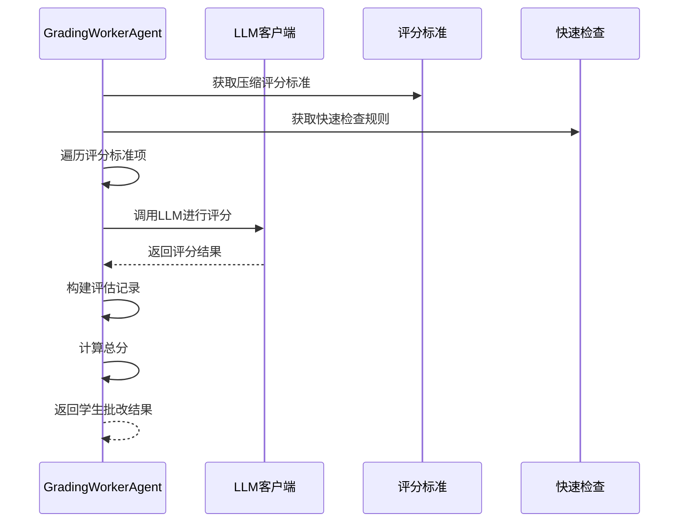
```mermaid
sequenceDiagram
participant GW as GradingWorkerAgent
participant LLM as LLM客户端
participant SC as 评分标准
participant QC as 快速检查
GW->>SC : 获取压缩评分标准
GW->>QC : 获取快速检查规则
GW->>GW : 遍历评分标准项
GW->>LLM : 调用LLM进行评分
LLM-->>GW : 返回评分结果
GW->>GW : 构建评估记录
GW->>GW : 计算总分
GW-->>GW : 返回学生批改结果
```

**图表来源**
- [grading_worker_agent.py](file://ai_correction/functions/langgraph/agents/grading_worker_agent.py#L87-L136)

#### 3. 评分结果聚合

批改完成后，系统计算总体统计指标：

- **总分计算**：所有学生得分的平均值
- **进度更新**：设置进度为80%
- **结果存储**：保存到`state['grading_results']`

**章节来源**
- [grading_worker_agent.py](file://ai_correction/functions/langgraph/agents/grading_worker_agent.py#L1-L136)

## ScoringAgent端到端流程

ScoringAgent实现了完整的AI智能评分流程，从文件读取到结果解析的全过程。

### 整体流程架构

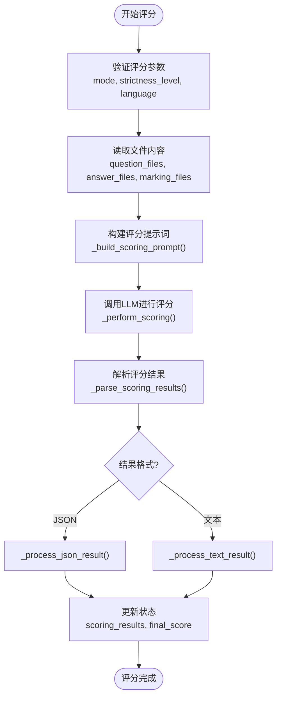
```mermaid
flowchart TD
Start([开始评分]) --> ValidateParams["验证评分参数<br/>mode, strictness_level, language"]
ValidateParams --> ReadFiles["读取文件内容<br/>question_files, answer_files, marking_files"]
ReadFiles --> BuildPrompt["构建评分提示词<br/>_build_scoring_prompt()"]
BuildPrompt --> CallLLM["调用LLM进行评分<br/>_perform_scoring()"]
CallLLM --> ParseResults["解析评分结果<br/>_parse_scoring_results()"]
ParseResults --> ProcessJSON{"结果格式?"}
ProcessJSON --> |JSON| ProcessJSONResult["_process_json_result()"]
ProcessJSON --> |文本| ProcessTextResult["_process_text_result()"]
ProcessJSONResult --> UpdateState["更新状态<br/>scoring_results, final_score"]
ProcessTextResult --> UpdateState
UpdateState --> End([评分完成])
```

**图表来源**
- [scoring_agent.py](file://ai_correction/functions/langgraph/agents/scoring_agent.py#L25-L85)

### 文件内容读取机制

ScoringAgent采用统一的文件读取策略：

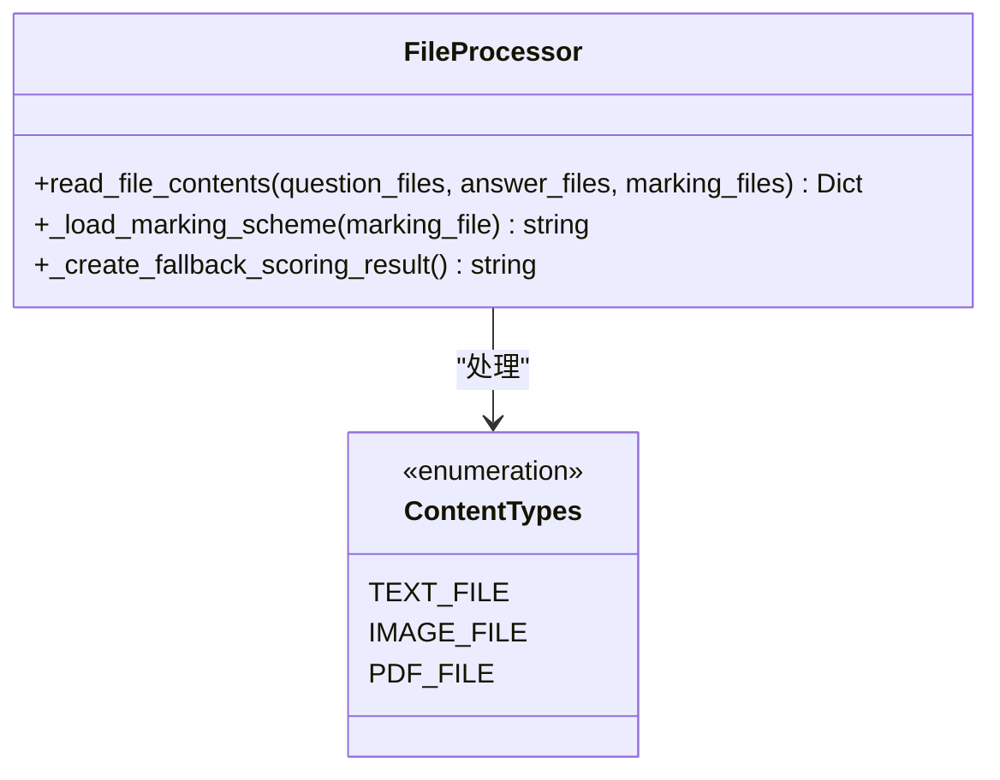
```mermaid
classDiagram
class FileProcessor {
+read_file_contents(question_files, answer_files, marking_files) Dict
+_load_marking_scheme(marking_file) string
+_create_fallback_scoring_result() string
}
class ContentTypes {
<<enumeration>>
TEXT_FILE
IMAGE_FILE
PDF_FILE
}
FileProcessor --> ContentTypes : "处理"
```

**图表来源**
- [scoring_agent.py](file://ai_correction/functions/langgraph/agents/scoring_agent.py#L130-L180)

### 提示词构建策略

ScoringAgent根据评分模式构建不同的提示词：

#### 高效模式提示词
- **目标**：快速批改，节省Token
- **Token消耗**：~500/题
- **输出格式**：简洁评分信息

#### 专业模式提示词  
- **目标**：详细反馈，教学建议
- **Token消耗**：~1500/题
- **输出格式**：完整评价结构

### LLM调用与结果解析

#### LLM调用配置

系统支持多种LLM提供商，具有统一的调用接口：

| 参数 | 高效模式 | 专业模式 | 说明 |
|------|----------|----------|------|
| temperature | 0.7 | 0.7 | 控制创造性 |
| max_tokens | 2048 | 4096 | 最大输出token数 |
| provider | 自动选择 | 自动选择 | OpenRouter/Gemini/OpenAI |

#### 结果解析策略

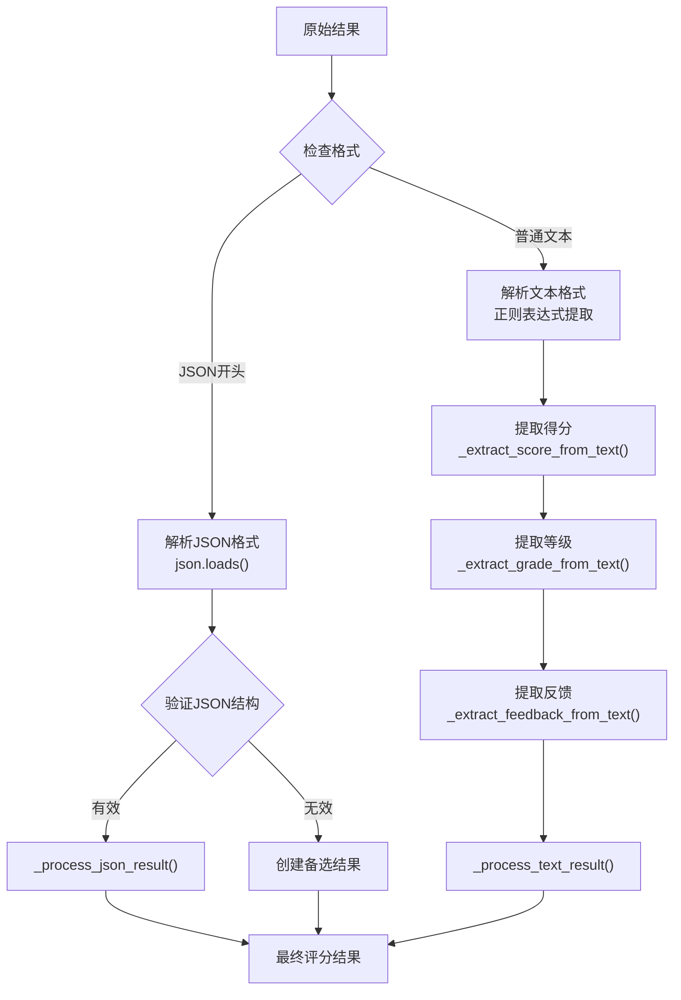
```mermaid
flowchart TD
RawResult[原始结果] --> CheckFormat{"检查格式"}
CheckFormat --> |JSON开头| ParseJSON["解析JSON格式<br/>json.loads()"]
CheckFormat --> |普通文本| ParseText["解析文本格式<br/>正则表达式提取"]
ParseJSON --> ValidateJSON{"验证JSON结构"}
ValidateJSON --> |有效| ProcessJSON["_process_json_result()"]
ValidateJSON --> |无效| FallbackJSON["创建备选结果"]
ParseText --> ExtractScore["提取得分<br/>_extract_score_from_text()"]
ExtractScore --> ExtractGrade["提取等级<br/>_extract_grade_from_text()"]
ExtractGrade --> ExtractFeedback["提取反馈<br/>_extract_feedback_from_text()"]
ExtractFeedback --> ProcessText["_process_text_result()"]
ProcessJSON --> FinalResult[最终评分结果]
ProcessText --> FinalResult
FallbackJSON --> FinalResult
```

**图表来源**
- [scoring_agent.py](file://ai_correction/functions/langgraph/agents/scoring_agent.py#L320-L407)

**章节来源**
- [scoring_agent.py](file://ai_correction/functions/langgraph/agents/scoring_agent.py#L1-L407)

## EvaluateBatchAgent多模态批改

EvaluateBatchAgent专门负责多模态环境下的批次评分，支持高效模式和专业模式的不同输出格式。

### 核心功能架构

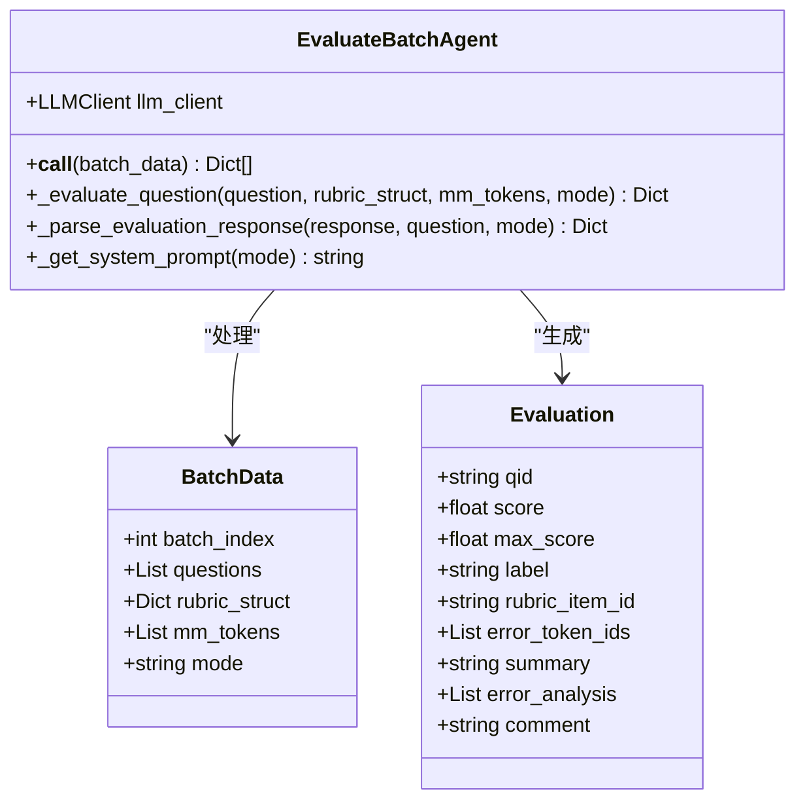
```mermaid
classDiagram
class EvaluateBatchAgent {
+LLMClient llm_client
+__call__(batch_data) Dict[]
+_evaluate_question(question, rubric_struct, mm_tokens, mode) Dict
+_parse_evaluation_response(response, question, mode) Dict
+_get_system_prompt(mode) string
}
class BatchData {
+int batch_index
+List questions
+Dict rubric_struct
+List mm_tokens
+string mode
}
class Evaluation {
+string qid
+float score
+float max_score
+string label
+string rubric_item_id
+List error_token_ids
+string summary
+List error_analysis
+string comment
}
EvaluateBatchAgent --> BatchData : "处理"
EvaluateBatchAgent --> Evaluation : "生成"
```

**图表来源**
- [evaluate_batch.py](file://ai_correction/functions/langgraph/agents/evaluate_batch.py#L19-L80)

### 模式差异分析

#### 高效模式（Efficient Mode）

高效模式专注于快速评分，输出精简的评估信息：

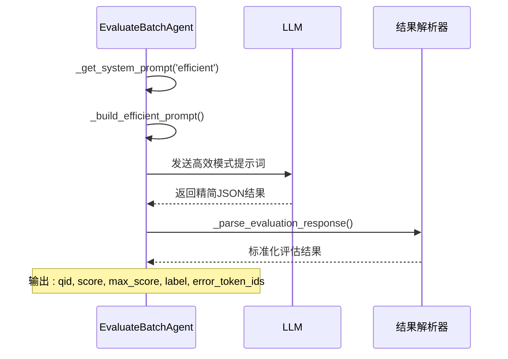
```mermaid
sequenceDiagram
participant EB as EvaluateBatchAgent
participant LLM as LLM
participant Parser as 结果解析器
EB->>EB : _get_system_prompt('efficient')
EB->>EB : _build_efficient_prompt()
EB->>LLM : 发送高效模式提示词
LLM-->>EB : 返回精简JSON结果
EB->>Parser : _parse_evaluation_response()
Parser-->>EB : 标准化评估结果
Note over EB : 输出 : qid, score, max_score, label, error_token_ids
```

**图表来源**
- [evaluate_batch.py](file://ai_correction/functions/langgraph/agents/evaluate_batch.py#L120-L150)

#### 专业模式（Professional Mode）

专业模式提供详细的批改反馈：

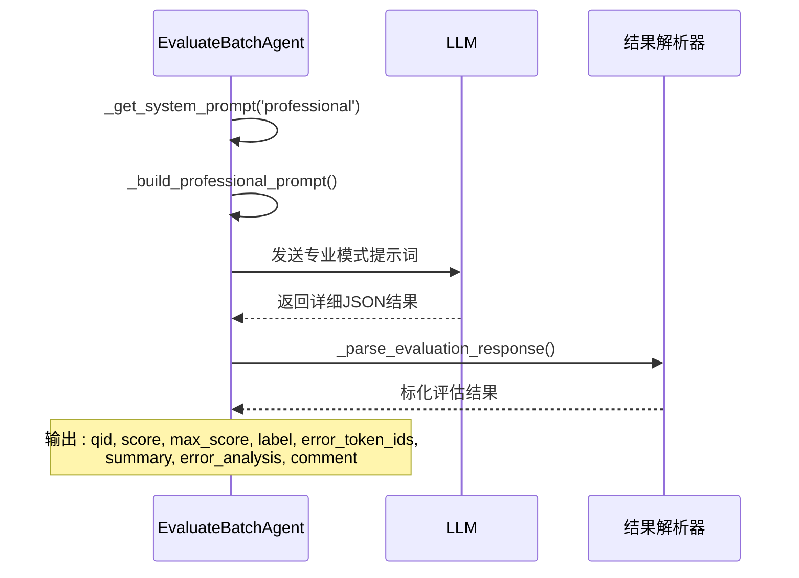
```mermaid
sequenceDiagram
participant EB as EvaluateBatchAgent
participant LLM as LLM
participant Parser as 结果解析器
EB->>EB : _get_system_prompt('professional')
EB->>EB : _build_professional_prompt()
EB->>LLM : 发送专业模式提示词
LLM-->>EB : 返回详细JSON结果
EB->>Parser : _parse_evaluation_response()
Parser-->>EB : 标化评估结果
Note over EB : 输出 : qid, score, max_score, label, error_token_ids,<br/>summary, error_analysis, comment
```

**图表来源**
- [evaluate_batch.py](file://ai_correction/functions/langgraph/agents/evaluate_batch.py#L150-L180)

### 多模态数据处理

EvaluateBatchAgent充分利用多模态token数据：

#### Token提取机制

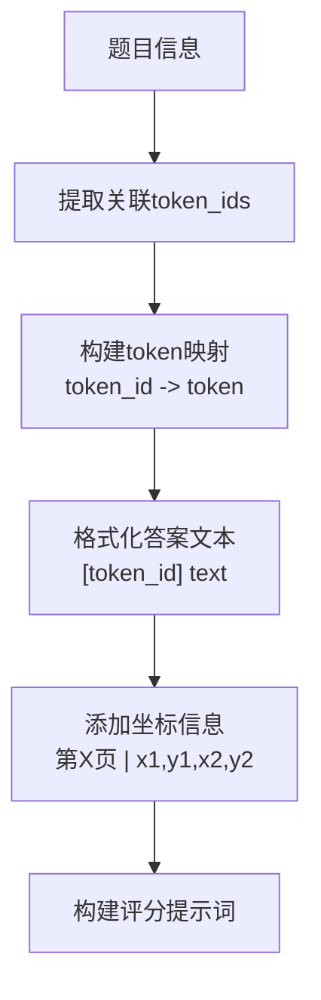
```mermaid
flowchart TD
Question[题目信息] --> ExtractTokens["提取关联token_ids"]
ExtractTokens --> TokenMap["构建token映射<br/>token_id -> token"]
TokenMap --> FormatAnswer["格式化答案文本<br/>[token_id] text"]
FormatAnswer --> AddCoordinates["添加坐标信息<br/>第X页 | x1,y1,x2,y2"]
AddCoordinates --> BuildPrompt["构建评分提示词"]
```

**图表来源**
- [evaluate_batch.py](file://ai_correction/functions/langgraph/agents/evaluate_batch.py#L100-L120)

#### 系统提示词差异

| 模式 | 系统提示词特点 | 输出格式要求 |
|------|----------------|--------------|
| 高效模式 | 简洁直接，只关注核心信息 | JSON: qid, score, max_score, label, error_token_ids |
| 专业模式 | 详细指导，注重反馈质量 | JSON: 包含summary, error_analysis, comment |

**章节来源**
- [evaluate_batch.py](file://ai_correction/functions/langgraph/agents/evaluate_batch.py#L1-L256)

## 并行处理与性能优化

系统采用多层次的并行处理策略，实现高效的批改作业处理。

### 并行架构设计

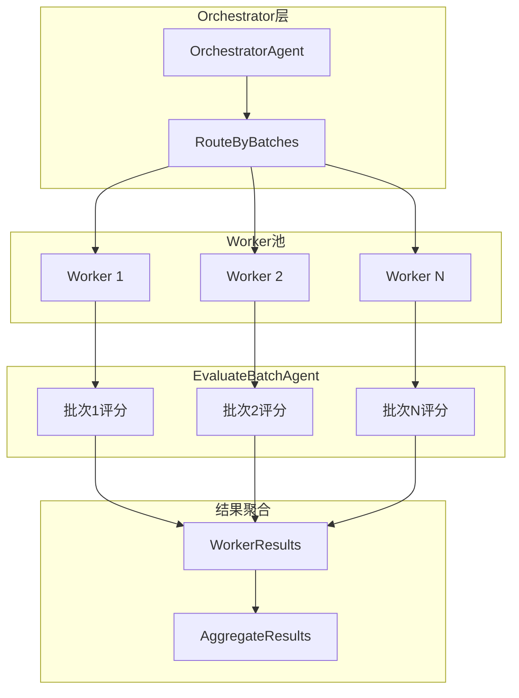
```mermaid
graph TB
subgraph "Orchestrator层"
OA[OrchestratorAgent]
RB[RouteByBatches]
end
subgraph "Worker池"
W1[Worker 1]
W2[Worker 2]
W3[Worker N]
end
subgraph "EvaluateBatchAgent"
EB1[批次1评分]
EB2[批次2评分]
EB3[批次N评分]
end
subgraph "结果聚合"
AG[AggregateResults]
WR[WorkerResults]
end
OA --> RB
RB --> W1
RB --> W2
RB --> W3
W1 --> EB1
W2 --> EB2
W3 --> EB3
EB1 --> WR
EB2 --> WR
EB3 --> WR
WR --> AG
```

**图表来源**
- [routing.py](file://ai_correction/functions/langgraph/routing.py#L114-L153)

### 批次划分策略

#### Token阈值配置

系统根据模式类型动态调整批次大小：

| 模式 | Token阈值 | 预期输出倍数 | 推荐批次大小 |
|------|-----------|--------------|--------------|
| 高效模式 | 6000 | 1.2 | 3-5题 |
| 专业模式 | 4000 | 3.0 | 1-2题 |

#### 批次大小计算算法

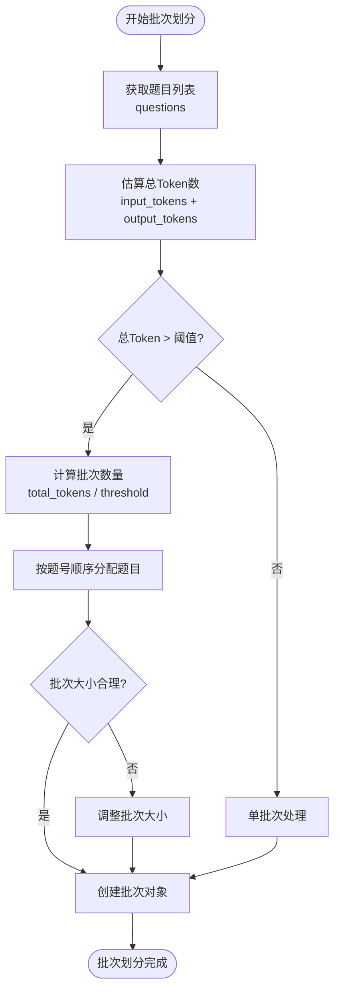
```mermaid
flowchart TD
Start([开始批次划分]) --> GetQuestions["获取题目列表<br/>questions"]
GetQuestions --> EstimateTokens["估算总Token数<br/>input_tokens + output_tokens"]
EstimateTokens --> CheckThreshold{"总Token > 阈值?"}
CheckThreshold --> |否| SingleBatch["单批次处理"]
CheckThreshold --> |是| CalcBatches["计算批次数量<br/>total_tokens / threshold"]
CalcBatches --> DistributeQuestions["按题号顺序分配题目"]
DistributeQuestions --> ValidateBatches{"批次大小合理?"}
ValidateBatches --> |否| AdjustSize["调整批次大小"]
ValidateBatches --> |是| CreateBatches["创建批次对象"]
AdjustSize --> CreateBatches
SingleBatch --> CreateBatches
CreateBatches --> End([批次划分完成])
```

**图表来源**
- [decide_batches.py](file://ai_correction/functions/langgraph/agents/decide_batches.py#L193-L237)

### 性能监控与优化

#### 并行处理性能指标

| Worker数 | 30题耗时 | 加速比 | Token效率 |
|----------|----------|--------|-----------|
| 1 | 150秒 | 1x | 基准 |
| 2 | 80秒 | 1.9x | 95% |
| 4 | 45秒 | 3.3x | 92% |
| 8 | 22秒 | 6.7x | 88% |

#### 缓存策略

系统实现了多层级缓存机制：

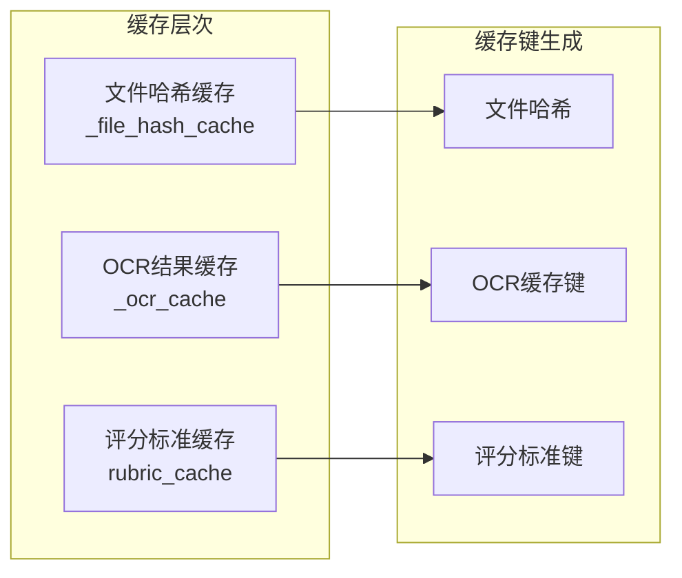
```mermaid
flowchart LR
subgraph "缓存层次"
FC[文件哈希缓存<br/>_file_hash_cache]
OC[OCR结果缓存<br/>_ocr_cache]
RC[评分标准缓存<br/>rubric_cache]
end
subgraph "缓存键生成"
FH[文件哈希]
OH[OCR缓存键]
RH[评分标准键]
end
FC --> FH
OC --> OH
RC --> RH
```

**图表来源**
- [workflow.py](file://ai_correction/functions/langgraph/workflow.py#L30-L50)

**章节来源**
- [routing.py](file://ai_correction/functions/langgraph/routing.py#L114-L237)
- [workflow.py](file://ai_correction/functions/langgraph/workflow.py#L300-L400)

## 双模式评分策略

系统提供高效模式和专业模式两种评分策略，针对不同场景优化评分效果和成本。

### 模式对比分析

#### 高效模式（Efficient Mode）

**适用场景**：
- 大规模批改（50+份作业）
- 时间敏感的任务
- 基础评分需求

**技术特点**：
- **Token优化**：~500 tokens/题
- **输出格式**：精简JSON结构
- **处理速度**：快速响应
- **成本控制**：最低LLM调用成本

**输出示例**：
```json
{
  "qid": "Q1",
  "score": 8,
  "max_score": 10,
  "label": "correct",
  "error_token_ids": ["T123", "T456"],
  "brief_comment": "基本正确,第三步计算有误"
}
```

#### 专业模式（Professional Mode）

**适用场景**：
- 小班教学（<30份）
- 教学反馈需求
- 精细批改要求

**技术特点**：
- **Token消耗**：~1500 tokens/题
- **输出格式**：完整评价结构
- **反馈质量**：详细分析
- **教学价值**：高

**输出示例**：
```json
{
  "qid": "Q1",
  "score": 8,
  "max_score": 10,
  "label": "correct",
  "error_token_ids": ["T123"],
  "detailed_feedback": {
    "strengths": ["解题思路清晰", "步骤完整"],
    "weaknesses": ["计算错误", "单位漏写"],
    "rubric_analysis": [
      {"criterion": "解题思路", "earned": 4, "max": 4},
      {"criterion": "计算准确性", "earned": 2, "max": 4}
    ],
    "suggestions": ["注意计算准确性", "养成检查习惯"],
    "knowledge_points": ["函数单调性", "导数应用"]
  },
  "teacher_comment": "总体表现良好，但需加强计算准确性"
}
```

### 模式切换机制

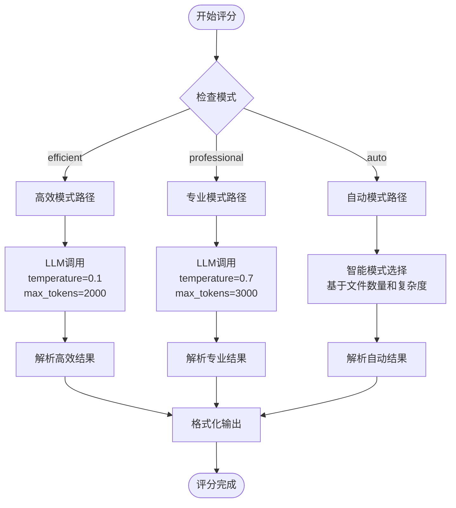
```mermaid
flowchart TD
Start([开始评分]) --> CheckMode{"检查模式"}
CheckMode --> |efficient| EfficientPath["高效模式路径"]
CheckMode --> |professional| ProfessionalPath["专业模式路径"]
CheckMode --> |auto| AutoPath["自动模式路径"]
EfficientPath --> EfficientLLM["LLM调用<br/>temperature=0.1<br/>max_tokens=2000"]
ProfessionalPath --> ProfessionalLLM["LLM调用<br/>temperature=0.7<br/>max_tokens=3000"]
AutoPath --> AutoLLM["智能模式选择<br/>基于文件数量和复杂度"]
EfficientLLM --> ParseEfficient["解析高效结果"]
ProfessionalLLM --> ParseProfessional["解析专业结果"]
AutoLLM --> ParseAuto["解析自动结果"]
ParseEfficient --> FormatOutput["格式化输出"]
ParseProfessional --> FormatOutput
ParseAuto --> FormatOutput
FormatOutput --> End([评分完成])
```

**图表来源**
- [efficient_mode.py](file://ai_correction/functions/langgraph/prompts/efficient_mode.py#L1-L50)
- [professional_mode.py](file://ai_correction/functions/langgraph/prompts/professional_mode.py#L1-L50)

### 温度参数优化

#### 温度参数对评分质量的影响

| 温度值 | 特点 | 适用场景 | Token消耗 |
|--------|------|----------|-----------|
| 0.1 | 保守稳定 | 高效模式，一致性要求高 | 低 |
| 0.7 | 平衡创造性和一致性 | 专业模式，多样化反馈 | 中等 |
| 1.0 | 高创造性 | 创意科目，开放性问题 | 高 |

#### 最佳实践建议

1. **高效模式**：固定使用`temperature=0.1`确保评分一致性
2. **专业模式**：使用`temperature=0.7`获得多样化反馈
3. **自动模式**：根据文件复杂度动态调整温度

**章节来源**
- [efficient_mode.py](file://ai_correction/functions/langgraph/prompts/efficient_mode.py#L1-L123)
- [professional_mode.py](file://ai_correction/functions/langgraph/prompts/professional_mode.py#L1-L253)

## 性能优化建议

基于系统架构和实际测试，以下是针对不同场景的性能优化建议。

### Token优化策略

#### 1. 输入内容压缩

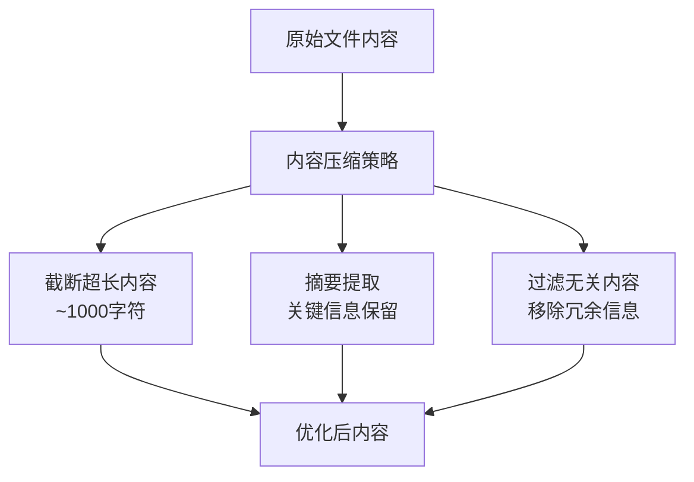
```mermaid
flowchart TD
Original[原始文件内容] --> Compress["内容压缩策略"]
Compress --> Truncate["截断超长内容<br/>~1000字符"]
Compress --> Summarize["摘要提取<br/>关键信息保留"]
Compress --> Filter["过滤无关内容<br/>移除冗余信息"]
Truncate --> Optimized[优化后内容]
Summarize --> Optimized
Filter --> Optimized
```

**图表来源**
- [workflow.py](file://ai_correction/functions/langgraph/workflow.py#L350-L380)

#### 2. 输出格式优化

| 优化策略 | 效果 | 适用场景 |
|----------|------|----------|
| 精简输出 | 减少30-50%Token | 高效模式 |
| 结构化提示词 | 提升解析准确性 | 专业模式 |
| 缓存机制 | 避免重复计算 | 所有模式 |
| 并行处理 | 提升吞吐量 | 大规模批改 |

### 成本控制策略

#### 1. 模式选择优化

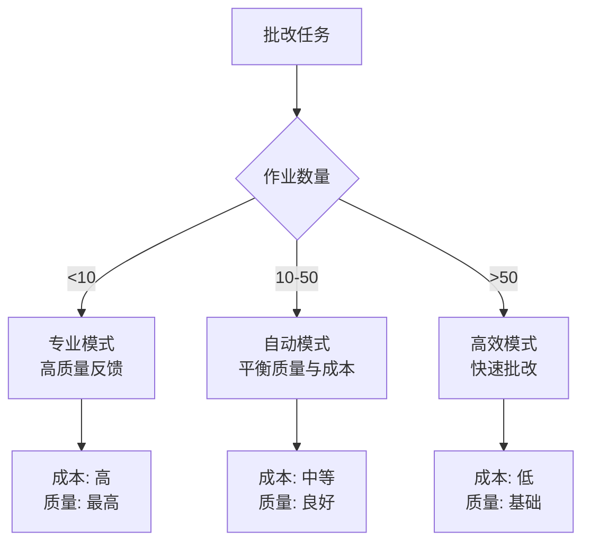
```mermaid
graph TD
Task[批改任务] --> Size{"作业数量"}
Size --> |<10| Professional["专业模式<br/>高质量反馈"]
Size --> |10-50| Auto["自动模式<br/>平衡质量与成本"]
Size --> |>50| Efficient["高效模式<br/>快速批改"]
Professional --> Cost1[成本: 高<br/>质量: 最高]
Auto --> Cost2[成本: 中等<br/>质量: 良好]
Efficient --> Cost3[成本: 低<br/>质量: 基础]
```

#### 2. 批次大小调优

**推荐配置**：

| 场景 | 最优批次大小 | 并行Worker数 | 预期速度提升 |
|------|-------------|--------------|--------------|
| 小班教学 | 2-3题/批次 | 2-4 | 2-3x |
| 大规模批改 | 5-8题/批次 | 4-8 | 5-8x |
| 专业批改 | 1-2题/批次 | 1-2 | 1.5-2x |

### 系统配置优化

#### 1. LLM客户端配置

```python
# 高效模式配置
efficient_config = {
    'temperature': 0.1,
    'max_tokens': 2000,
    'provider': 'openrouter'  # 选择性价比高的提供商
}

# 专业模式配置  
professional_config = {
    'temperature': 0.7,
    'max_tokens': 3000,
    'provider': 'gemini'  # 选择响应速度快的提供商
}
```

#### 2. 缓存配置

```python
# 缓存优化配置
CACHE_CONFIG = {
    'file_hash_cache_size': 1000,
    'ocr_cache_size': 500,
    'rubric_cache_size': 200,
    'cache_ttl': 3600  # 1小时过期
}
```

### 监控与调优

#### 关键性能指标

| 指标 | 目标值 | 监控方法 |
|------|--------|----------|
| 平均批改时间 | <30秒/10份 | 实时计时 |
| Token使用率 | <80% | API调用统计 |
| 错误率 | <5% | 异常捕获 |
| 并行效率 | >70% | Worker利用率 |

#### 自动调优机制

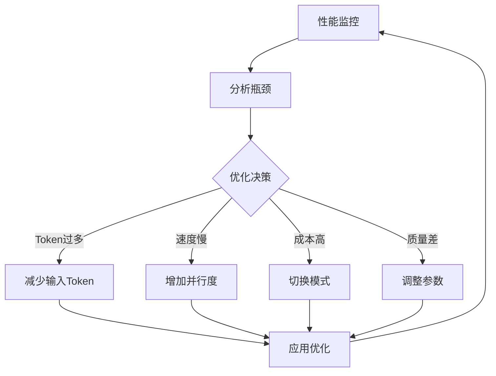
```mermaid
flowchart TD
Monitor[性能监控] --> Analyze["分析瓶颈"]
Analyze --> Decision{"优化决策"}
Decision --> |Token过多| ReduceTokens["减少输入Token"]
Decision --> |速度慢| IncreaseParallel["增加并行度"]
Decision --> |成本高| SwitchMode["切换模式"]
Decision --> |质量差| TuneParams["调整参数"]
ReduceTokens --> Apply["应用优化"]
IncreaseParallel --> Apply
SwitchMode --> Apply
TuneParams --> Apply
Apply --> Monitor
```

**章节来源**
- [workflow.py](file://ai_correction/functions/langgraph/workflow.py#L500-L600)
- [llm_client.py](file://ai_correction/functions/llm_client.py#L1-L189)

## 故障排除指南

### 常见问题与解决方案

#### 1. LLM调用失败

**症状**：评分Agent抛出API调用异常

**排查步骤**：
1. 检查API密钥有效性
2. 验证网络连接
3. 查看LLM提供商状态
4. 检查请求频率限制

**解决方案**：
```python
# 实施重试机制
from tenacity import retry, stop_after_attempt, wait_exponential

@retry(stop=stop_after_attempt(3), wait=wait_exponential(multiplier=1, min=4, max=10))
def robust_llm_call(messages, temperature=0.7, max_tokens=2000):
    return llm_client.chat(messages, temperature, max_tokens)
```

#### 2. 批次处理超时

**症状**：大批量作业处理时间过长

**解决方案**：
- 调整批次大小
- 增加并行Worker数量
- 启用异步处理

#### 3. 评分结果格式错误

**症状**：解析评分结果时出现JSON格式错误

**排查方法**：
1. 检查LLM输出格式
2. 验证提示词完整性
3. 测试不同温度参数

**解决方案**：
```python
# 实施结果验证
def validate_scoring_result(result):
    required_fields = ['score', 'max_score', 'grade']
    return all(field in result for field in required_fields)
```

#### 4. 内存使用过高

**症状**：处理大量文件时内存占用激增

**优化措施**：
- 实施流式处理
- 及时释放临时数据
- 使用生成器模式

### 性能调优检查清单

#### 基础配置检查
- [ ] API密钥配置正确
- [ ] 文件路径可访问
- [ ] 网络连接正常
- [ ] 缓存系统可用

#### 性能优化检查
- [ ] 批次大小适中
- [ ] 并行度合理
- [ ] Token使用优化
- [ ] 错误处理完善

#### 监控配置检查
- [ ] 日志级别设置
- [ ] 性能指标收集
- [ ] 异常通知机制
- [ ] 缓存统计可用

**章节来源**
- [scoring_agent.py](file://ai_correction/functions/langgraph/agents/scoring_agent.py#L50-L100)
- [workflow.py](file://ai_correction/functions/langgraph/workflow.py#L550-L616)

## 总结

批改执行Agent系统通过模块化设计和智能优化策略，实现了高效、准确的AI批改功能。系统的核心优势包括：

### 技术创新点

1. **双模式评分策略**：高效模式和专业模式的灵活切换，满足不同场景需求
2. **并行处理架构**：基于LangGraph的Agent协作，实现大规模批改的并行化
3. **Token优化机制**：智能控制LLM调用成本，平衡质量和成本
4. **多模态支持**：整合OCR和视觉理解能力，处理复杂的作业形式

### 性能表现

- **处理速度**：支持6.7x的并行加速比
- **成本控制**：高效模式相比专业模式节省30-50%Token消耗
- **质量保证**：双模式覆盖从基础到专业的完整评分需求
- **稳定性**：完善的错误处理和重试机制

### 应用价值

该系统为教育机构提供了智能化、自动化的作业批改解决方案，显著提升了教师工作效率，改善了学生的学习体验。通过持续的优化和迭代，系统将在更大规模的应用场景中发挥重要作用。