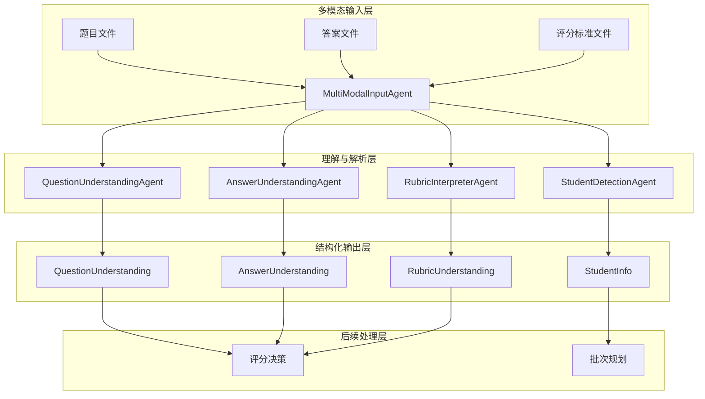
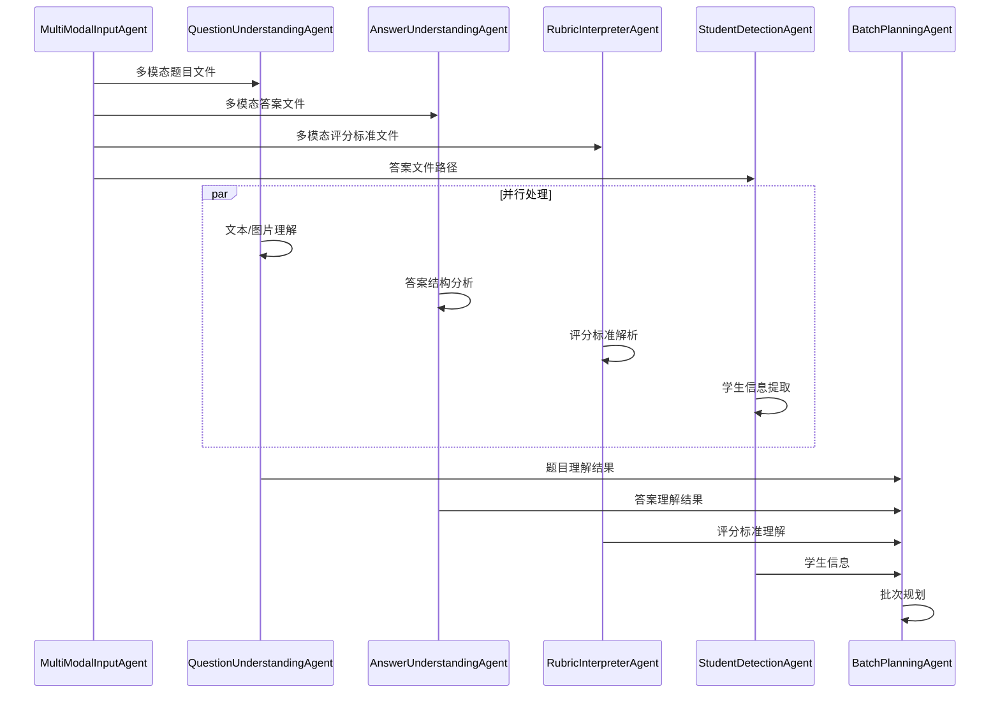
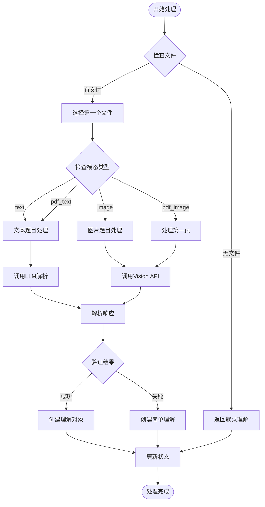
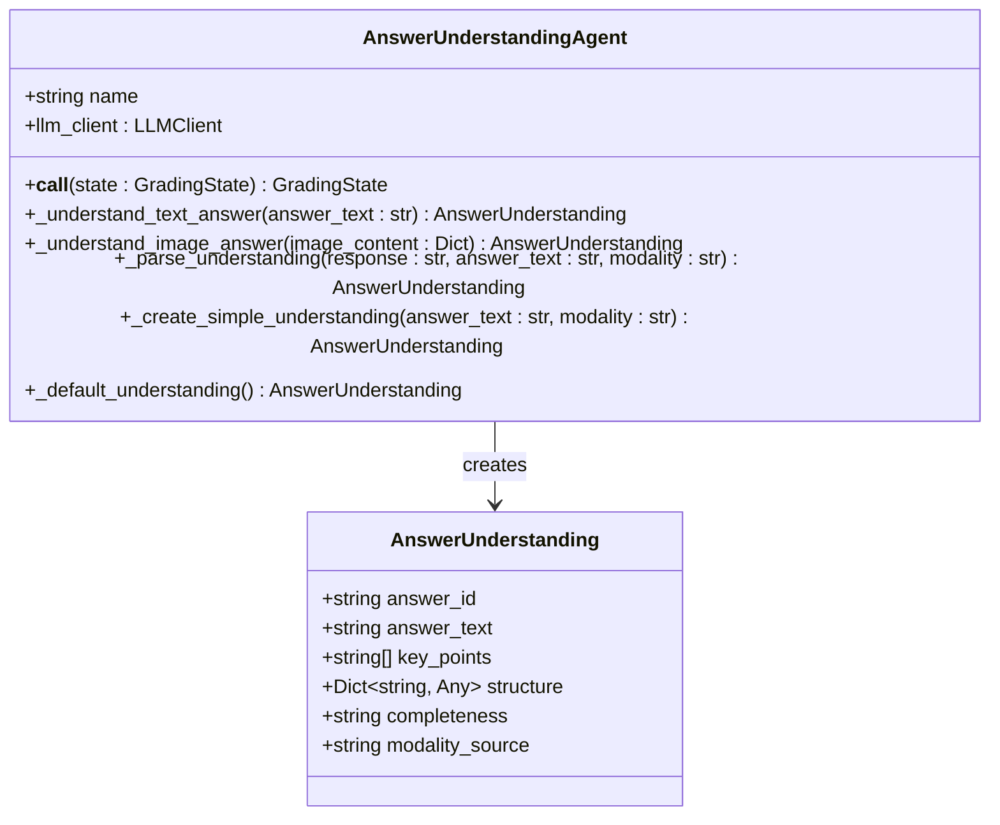
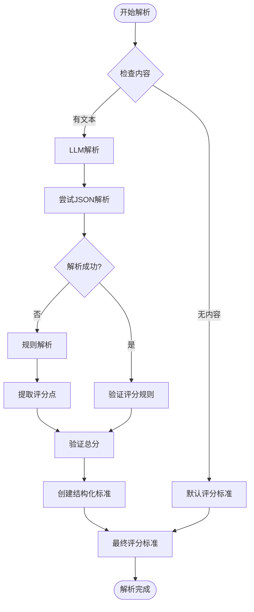
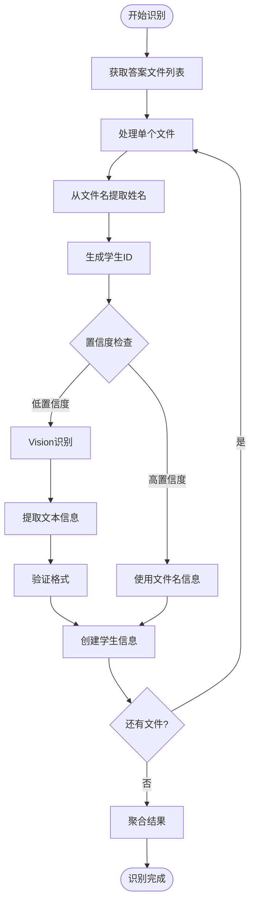
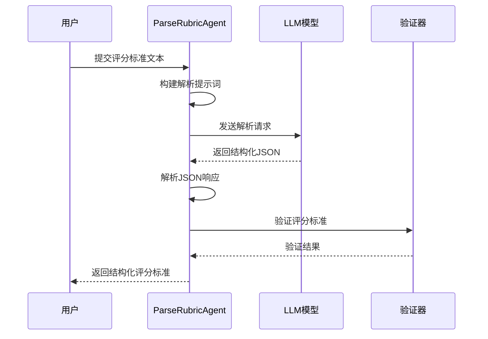
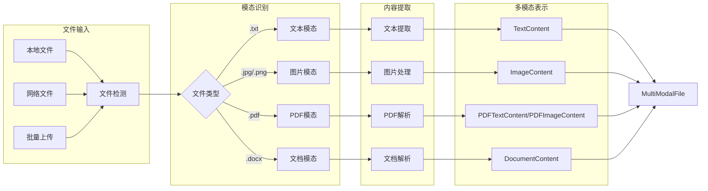
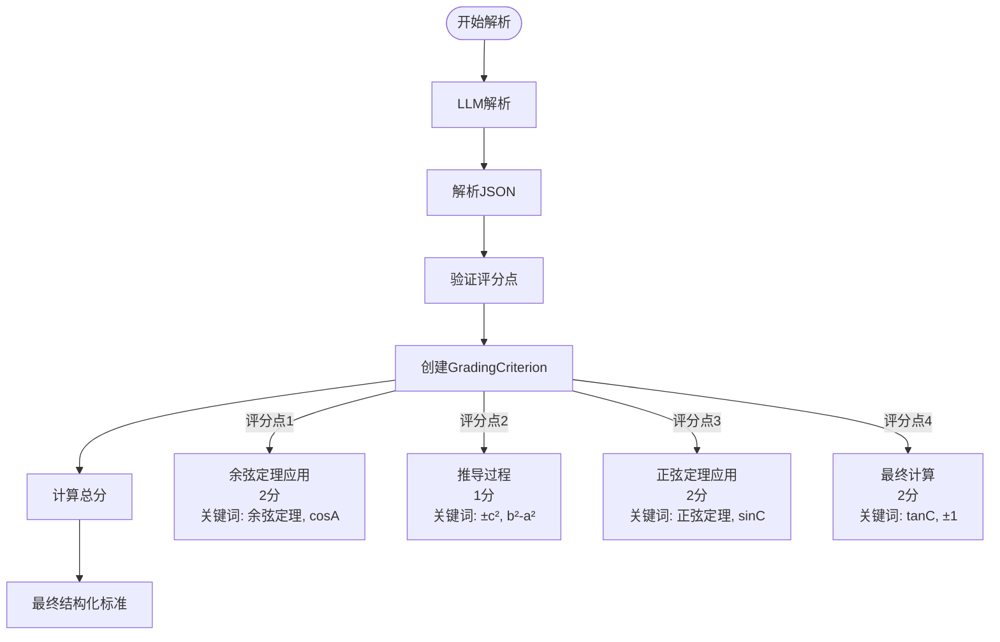

# 理解与解析Agent

<cite>
**本文档引用的文件**
- [question_understanding_agent.py](file://ai_correction/functions/langgraph/agents/question_understanding_agent.py)
- [answer_understanding_agent.py](file://ai_correction/functions/langgraph/agents/answer_understanding_agent.py)
- [rubric_interpreter_agent.py](file://ai_correction/functions/langgraph/agents/rubric_interpreter_agent.py)
- [student_detection_agent.py](file://ai_correction/functions/langgraph/agents/student_detection_agent.py)
- [parse_rubric.py](file://ai_correction/functions/langgraph/agents/parse_rubric.py)
- [multimodal_models.py](file://ai_correction/functions/langgraph/multimodal_models.py)
- [state.py](file://ai_correction/functions/langgraph/state.py)
- [multimodal_prompts.py](file://ai_correction/functions/langgraph/prompts/multimodal_prompts.py)
- [workflow_multimodal.py](file://ai_correction/functions/langgraph/workflow_multimodal.py)
- [三角形评分标准.txt](file://ai_correction/test_data/三角形评分标准.txt)
- [三角形题目.txt](file://ai_correction/test_data/三角形题目.txt)
- [学生答案_三角形.txt](file://ai_correction/test_data/学生答案_三角形.txt)
</cite>

## 目录
1. [简介](#简介)
2. [系统架构概览](#系统架构概览)
3. [核心Agent组件](#核心agent组件)
4. [QuestionUnderstandingAgent详解](#questionunderstandingagent详解)
5. [AnswerUnderstandingAgent详解](#answerunderstandingagent详解)
6. [RubricInterpreterAgent详解](#rubricinterpreteragent详解)
7. [StudentDetectionAgent详解](#studentdetectionagent详解)
8. [ParseRubric工具函数](#parserubric工具函数)
9. [多模态处理流程](#多模态处理流程)
10. [真实案例分析](#真实案例分析)
11. [最佳实践与调优指南](#最佳实践与调优指南)
12. [总结](#总结)

## 简介

理解与解析Agent是AI批改系统的核心组件，负责从多模态输入中提取关键信息并结构化处理。这些Agent采用深度协作架构，支持文本、图片、PDF等多种模态的统一处理，为后续的智能批改奠定基础。

系统包含四个主要的理解Agent：
- **QuestionUnderstandingAgent**：从题目文本中提取关键问题点和知识点
- **AnswerUnderstandingAgent**：分析学生答案的关键答题点和结构
- **RubricInterpreterAgent**：将非结构化的评分标准转换为可计算的评分规则树
- **StudentDetectionAgent**：识别并结构化学生成绩单信息

## 系统架构概览



**图表来源**
- [workflow_multimodal.py](file://ai_correction/functions/langgraph/workflow_multimodal.py#L40-L80)
- [multimodal_models.py](file://ai_correction/functions/langgraph/multimodal_models.py#L150-L200)

## 核心Agent组件

### Agent架构设计原则

所有理解Agent遵循统一的设计模式：

1. **多模态支持**：同时处理文本、图片、PDF等多种输入格式
2. **并行处理**：支持多个文件的并发理解
3. **错误恢复**：具备降级处理机制
4. **状态管理**：通过GradingState维护处理进度和结果

### Agent间协作关系



**图表来源**
- [workflow_multimodal.py](file://ai_correction/functions/langgraph/workflow_multimodal.py#L60-L120)

## QuestionUnderstandingAgent详解

### 功能概述

QuestionUnderstandingAgent负责深入理解题目内容，提取关键问题点、知识点和上下文信息。它能够处理纯文本题目和图片题目，为后续评分提供精确的题目理解。

### 核心处理流程



**图表来源**
- [question_understanding_agent.py](file://ai_correction/functions/langgraph/agents/question_understanding_agent.py#L25-L60)

### 关键技术实现

#### 1. 多模态处理策略

Agent根据不同的输入模态采用相应的处理策略：

- **文本模态**：直接调用LLM进行语义理解
- **图片模态**：使用Vision API提取视觉信息
- **PDF模态**：根据PDF类型选择文本提取或图片处理

#### 2. Prompt工程优化

针对不同模态设计专门的Prompt模板：

```python
# 文本题目理解Prompt
QUESTION_UNDERSTANDING_TEXT_PROMPT = """你是一位资深教育专家，擅长理解和分析题目要求...

【任务】
请仔细阅读以下题目，提取关键信息和要求。

【题目内容】
{question_content}

【输出要求】
请以JSON格式输出题目理解结果...
"""

# 图片题目理解Prompt  
QUESTION_UNDERSTANDING_VISION_PROMPT = """你是一位资深教育专家，擅长理解和分析题目要求...

【任务】
请仔细查看图片中的题目，提取关键信息和要求。

【输出要求】
请以JSON格式输出题目理解结果...
"""
```

#### 3. 结果解析机制

Agent实现了健壮的结果解析机制：

```python
def _parse_understanding(self, response: str, question_text: str, modality: str) -> QuestionUnderstanding:
    """解析LLM响应"""
    try:
        json_start = response.find('{')
        json_end = response.rfind('}') + 1
        if json_start >= 0 and json_end > json_start:
            result = json.loads(response[json_start:json_end])
            return QuestionUnderstanding(
                question_id=result.get('question_id', 'Q1'),
                question_text=result.get('question_text', question_text),
                key_requirements=result.get('key_requirements', []),
                context=result.get('context', {}),
                difficulty_level=result.get('context', {}).get('difficulty_level'),
                subject=result.get('context', {}).get('subject'),
                modality_source=modality
            )
    except:
        pass
    return self._create_simple_understanding(question_text, modality)
```

**章节来源**
- [question_understanding_agent.py](file://ai_correction/functions/langgraph/agents/question_understanding_agent.py#L80-L120)
- [multimodal_prompts.py](file://ai_correction/functions/langgraph/prompts/multimodal_prompts.py#L10-L50)

## AnswerUnderstandingAgent详解

### 功能概述

AnswerUnderstandingAgent专注于分析学生答案，提取关键答题点、答案结构特征和完整性评估。它为评分决策提供详细的答案理解信息。

### 处理流程架构



**图表来源**
- [answer_understanding_agent.py](file://ai_correction/functions/langgraph/agents/answer_understanding_agent.py#L20-L40)
- [multimodal_models.py](file://ai_correction/functions/langgraph/multimodal_models.py#L210-L230)

### 核心分析能力

#### 1. 答案结构分析

Agent能够识别答案的不同结构特征：

- **步骤完整性**：判断答案是否包含必要的推理步骤
- **结论明确性**：评估最终答案的清晰程度
- **组织方式**：分析答案的逻辑组织结构

#### 2. 关键点提取

通过语义分析提取答案中的关键答题点：

```python
# 示例：数学证明题的答案分析
key_points = [
    "正确使用勾股定理",
    "正确计算斜边长度",
    "正确应用相似三角形性质",
    "正确得出最终结论"
]
```

#### 3. 完整性评估

基于预定义的标准评估答案的完整性：

- **完整**：包含所有必要步骤和结论
- **部分**：缺少某些关键步骤
- **不完整**：缺乏核心内容

**章节来源**
- [answer_understanding_agent.py](file://ai_correction/functions/langgraph/agents/answer_understanding_agent.py#L100-L150)

## RubricInterpreterAgent详解

### 功能概述

RubricInterpreterAgent是评分标准解析的核心组件，负责将教师提供的非结构化评分标准转换为机器可读的结构化评分规则树。它支持复杂的评分逻辑和多层次的评分点。

### 解析策略层次



**图表来源**
- [rubric_interpreter_agent.py](file://ai_correction/functions/langgraph/agents/rubric_interpreter_agent.py#L70-L120)

### 结构化评分规则

#### 1. GradingCriterion数据结构

评分标准中的每个评分点都封装为GradingCriterion对象：

```python
class GradingCriterion(TypedDict):
    criterion_id: str                 # 评分点唯一标识
    description: str                  # 评分点描述
    points: float                     # 分值
    evaluation_method: str            # 评估方法
    keywords: Optional[List[str]]     # 关键词
    required_elements: Optional[List[str]]  # 必需元素
```

#### 2. 评分方法类型

Agent支持多种评分方法：

- **exact_match**：精确匹配关键词
- **semantic**：语义相似度匹配（默认）
- **calculation**：计算过程验证
- **step_check**：步骤完整性检查

#### 3. 复杂评分逻辑

对于复杂的评分标准，Agent能够解析嵌套的评分规则：

```python
# 示例：几何证明题的复杂评分规则
criteria = [
    GradingCriterion(
        criterion_id="G1_P1",
        description="正确使用平行线性质",
        points=2.0,
        evaluation_method="exact_match",
        keywords=["平行线", "同位角相等"],
        required_elements=["平行线标记"]
    ),
    GradingCriterion(
        criterion_id="G1_P2", 
        description="正确应用三角形内角和",
        points=1.0,
        evaluation_method="semantic",
        keywords=["内角和", "角度计算"],
        required_elements=["角度标注"]
    )
]
```

### 规则解析算法

#### 1. 正则表达式匹配

Agent使用智能的正则表达式匹配来提取评分点：

```python
patterns = [
    r'(\d+)[.、：:]\s*(.+?)\s*[（(]?(\d+(?:\.\d+)?)\s*分[）)]?',
    r'(.+?)\s*[（(]?(\d+(?:\.\d+)?)\s*分[）)]?'
]

for pattern in patterns:
    match = re.search(pattern, line)
    if match:
        description = groups[-2] if len(groups) > 2 else groups[0]
        points = float(groups[-1])
        # 创建评分点对象
```

#### 2. 上下文感知解析

对于复杂的评分标准，Agent能够理解评分点之间的逻辑关系：

- **递进关系**：某些评分点建立在前一个评分点的基础上
- **互斥关系**：某些评分点不能同时获得
- **补充关系**：某些评分点是对其他评分点的补充

**章节来源**
- [rubric_interpreter_agent.py](file://ai_correction/functions/langgraph/agents/rubric_interpreter_agent.py#L130-L180)

## StudentDetectionAgent详解

### 功能概述

StudentDetectionAgent负责从答案文件中识别学生信息，包括姓名、学号、班级等。它采用基于文件名解析和Vision识别相结合的方法，确保学生信息的准确提取。

### 识别策略



**图表来源**
- [student_detection_agent.py](file://ai_correction/functions/langgraph/agents/student_detection_agent.py#L20-L50)

### 学生信息结构

```python
class StudentInfo(TypedDict):
    student_id: str                   # 学号或自动生成ID
    name: str                         # 学生姓名
    class_name: Optional[str]         # 班级名称
    answer_files: List[str]           # 该学生的答案文件路径列表
    detection_confidence: float       # 识别置信度（0-1）
    detection_method: str             # 识别方法（vision/filename/manual）
```

### 多模态识别能力

#### 1. 文件名解析

对于命名规范的文件，Agent能够快速提取学生信息：

```python
# 文件名格式：姓名_学号_科目_日期.txt
filename = "张三_123456_数学_20241201.txt"
student_id = f"Student_{idx+1:03d}"
name = filename.split('_')[0] if '_' in filename else f"学生{idx+1}"
```

#### 2. Vision识别

对于OCR质量较差或命名不规范的文件，Agent可以使用Vision API：

- **文本识别**：从图片中提取学生姓名和学号
- **布局分析**：识别页面上的标题区域
- **格式验证**：验证识别结果的格式正确性

#### 3. 置信度评估

Agent为每个识别结果分配置信度分数：

- **文件名解析**：通常置信度较高（0.8-0.9）
- **Vision识别**：根据识别准确度动态调整（0.6-0.9）
- **混合方法**：结合多种信息源提高准确性

**章节来源**
- [student_detection_agent.py](file://ai_correction/functions/langgraph/agents/student_detection_agent.py#L30-L65)

## ParseRubric工具函数

### 功能概述

ParseRubric是一个独立的工具函数，专门负责将教师提供的评分标准文本转换为结构化的JSON格式。它是传统评分标准解析的重要补充，特别适用于需要精确控制评分逻辑的场景。

### 解析流程



**图表来源**
- [parse_rubric.py](file://ai_correction/functions/langgraph/agents/parse_rubric.py#L90-L130)

### 核心解析算法

#### 1. LLM驱动解析

```python
async def _parse_rubric_text(self, rubric_text: str) -> Dict[str, Any]:
    """解析评分标准文本"""
    system_prompt = self._build_system_prompt()
    user_prompt = self._build_user_prompt(rubric_text)
    
    messages = [
        {"role": "system", "content": system_prompt},
        {"role": "user", "content": user_prompt}
    ]
    
    try:
        response = self.llm_client.chat(
            messages=messages,
            temperature=0.1,  # 低温度保证准确性
            max_tokens=3000
        )
        return self._parse_llm_response(response)
    except Exception as e:
        logger.error(f"LLM解析评分标准失败: {e}")
        return self._rule_based_parse(rubric_text)
```

#### 2. 规则解析降级

当LLM解析失败时，系统自动切换到规则解析：

```python
def _rule_based_parse(self, rubric_text: str) -> Dict[str, Any]:
    """基于规则的评分标准解析"""
    questions = []
    lines = rubric_text.strip().split('\n')
    current_question = None
    rubric_item_counter = 1
    
    for line in lines:
        line = line.strip()
        if not line:
            continue
        
        # 识别题目
        question_match = re.match(r'[题目]*\s*(\d+|[Q]\d+)[：:]\s*[（\(]?(\d+)\s*分[）\)]?', line, re.IGNORECASE)
        if question_match:
            if current_question:
                questions.append(current_question)
            
            qid = f"Q{question_match.group(1)}" if not question_match.group(1).startswith('Q') else question_match.group(1)
            max_score = float(question_match.group(2))
            
            current_question = {
                'qid': qid,
                'max_score': max_score,
                'rubric_items': []
            }
            rubric_item_counter = 1
            continue
        
        # 识别评分项
        if current_question:
            item_match = re.match(r'(\d+)[.、]\s*(.+?)[（\(]?(\d+(?:\.\d+)?)\s*分[）\)]?', line)
            if item_match:
                description = item_match.group(2).strip()
                score = float(item_match.group(3))
                conditions = self._extract_conditions(description)
                
                rubric_item = {
                    'id': f"{current_question['qid']}_R{rubric_item_counter}",
                    'description': description,
                    'score_if_fulfilled': score,
                    'conditions': conditions
                }
                
                current_question['rubric_items'].append(rubric_item)
                rubric_item_counter += 1
    
    return {'questions': questions}
```

#### 3. 条件提取机制

Agent能够从评分点描述中提取关键条件：

```python
def _extract_conditions(self, description: str) -> List[str]:
    """从描述中提取关键条件"""
    conditions = []
    
    # 提取引号中的内容
    quoted = re.findall(r'[「『"\'](.*?)[」』"\']', description)
    conditions.extend(quoted)
    
    # 提取数学公式
    formulas = re.findall(r'[a-zA-Z]+\s*[=<>≤≥]\s*[^\s]+', description)
    conditions.extend(formulas)
    
    if not conditions:
        conditions = [description]
    
    return conditions
```

### 验证机制

#### 1. 总分一致性检查

```python
def _validate_rubric(self, rubric_struct: Dict[str, Any]) -> None:
    """验证评分标准"""
    questions = rubric_struct.get('questions', [])
    
    for question in questions:
        rubric_items = question['rubric_items']
        total_score = sum([item.get('score_if_fulfilled', 0) for item in rubric_items])
        max_score = question['max_score']
        
        if abs(total_score - max_score) > 1.0:
            logger.warning(f"题目{question['qid']}评分项总分({total_score})与最大分值({max_score})不一致")
```

#### 2. 字段完整性检查

验证每个评分项目包含必要的字段：

- **qid**：题目唯一标识
- **max_score**：最大分值
- **rubric_items**：评分项列表
- **每个评分项**：包含id、description、score_if_fulfilled

**章节来源**
- [parse_rubric.py](file://ai_correction/functions/langgraph/agents/parse_rubric.py#L150-L250)

## 多模态处理流程

### 输入处理架构



**图表来源**
- [multimodal_models.py](file://ai_correction/functions/langgraph/multimodal_models.py#L20-L80)

### OCR后文本语义对齐

对于OCR处理的文本，系统实现了语义对齐机制：

#### 1. 坐标映射

```python
class MMToken(TypedDict):
    id: str                      # token唯一标识
    text: str                    # 文本内容
    page: int                    # 所在页码(0-based)
    bbox: Dict[str, float]       # 边界框坐标 {x1, y1, x2, y2} 像素坐标
    conf: float                  # 置信度 (0-1)
    line_id: str                 # 同一行标识符
```

#### 2. 语义对齐算法

```python
def align_ocr_text_with_semantics(ocr_tokens: List[MMToken], question_understanding: QuestionUnderstanding) -> List[MMToken]:
    """对齐OCR文本与语义理解"""
    aligned_tokens = []
    
    for token in ocr_tokens:
        # 基于边界框匹配语义区域
        if is_within_question_region(token.bbox, question_understanding):
            token.metadata['semantic_role'] = 'question_content'
        elif is_within_answer_region(token.bbox, answer_understanding):
            token.metadata['semantic_role'] = 'answer_content'
        else:
            token.metadata['semantic_role'] = 'other'
        
        aligned_tokens.append(token)
    
    return aligned_tokens
```

#### 3. 上下文感知对齐

系统考虑上下文信息进行更精确的对齐：

- **空间关系**：基于像素坐标的空间邻近性
- **语义相似度**：基于词向量的语义相似度
- **结构约束**：基于文档结构的约束

**章节来源**
- [state.py](file://ai_correction/functions/langgraph/state.py#L200-L250)

## 真实案例分析

### 案例背景

我们以三角形几何题为例，展示理解与解析Agent的实际工作流程。

#### 测试数据

**题目内容**：
```
题目1：在△ABC中，内角A,B,C所对的边分别为a,b,c，已知A=π/2，b²-a²=c²/2。
(1) 求tan C的值；(8分)
```

**评分标准**：
```
题目1评分标准 (8分)：
- 正确使用余弦定理 cosA = (b²+c²-a²)/(2bc) = c/(2b) = √5/2 (2分)
- 正确推导 ±c² = b²-a² (1分)
- 正确得出 c² = a²+b²-2abcosC (1分)
- 正确使用正弦定理或三角恒等式 (2分)
- 正确计算 sinC/cosC = ±1，得出 tanC = ±1 (2分)
```

**学生答案**：
```
题目1答案：
cosA = (b²+c²-a²)/(2bc) = √5/2
±c² = b²-a²
c² = a²+b²-2abcosC
sinC·sinA = ±sinC
...
```

### 处理流程分析

#### 1. QuestionUnderstandingAgent处理

```mermaid
sequenceDiagram
participant QA as QuestionUnderstandingAgent
participant LLM as LLM模型
participant Output as 输出结果
QA->>LLM : 发送题目文本
LLM-->>QA : {"question_id" : "Q1",
"question_text" : "在△ABC中，内角A,B,C所对的边分别为a,b,c，已知A=π/2，b²-a²=c²/2。(1) 求tan C的值；(8分)",
"key_requirements" : ["求tan C的值", "使用几何定理证明"],
"context" : {"subject" : "数学", "difficulty_level" : "medium", "question_type" : "证明题"}}
QA->>Output : 创建QuestionUnderstanding对象
```

**图表来源**
- [question_understanding_agent.py](file://ai_correction/functions/langgraph/agents/question_understanding_agent.py#L60-L80)

#### 2. RubricInterpreterAgent处理



**图表来源**
- [rubric_interpreter_agent.py](file://ai_correction/functions/langgraph/agents/rubric_interpreter_agent.py#L110-L140)

#### 3. AnswerUnderstandingAgent处理

```python
# 答案理解结果
answer_understanding = AnswerUnderstanding(
    answer_id="A1",
    answer_text="cosA = (b²+c²-a²)/(2bc) = √5/2\n±c² = b²-a²\nc² = a²+b²-2abcosC\n...",
    key_points=[
        "正确使用余弦定理",
        "正确推导平方关系",
        "正确应用三角恒等式",
        "正确计算正切值"
    ],
    structure={
        "has_steps": True,
        "has_conclusion": True,
        "is_complete": True,
        "organization": "按几何定理顺序推导"
    },
    completeness="complete",
    modality_source="text"
)
```

### 多模态处理优势

#### 1. 文本处理 vs 图片处理

**文本处理优势**：
- 直接访问完整答案内容
- 更高的解析准确度
- 支持复杂的数学公式

**图片处理优势**：
- 支持手写答案识别
- 处理OCR质量较差的情况
- 保留答案的原始格式

#### 2. OCR后语义对齐效果

```python
# OCR对齐前后的对比
before_alignment = [
    MMToken(id="t1", text="cosA", page=0, bbox={"x1": 100, "y1": 200, "x2": 150, "y2": 220}),
    MMToken(id="t2", text="=", page=0, bbox={"x1": 160, "y1": 200, "x2": 170, "y2": 220}),
    MMToken(id="t3", text="(b²+c²-a²)", page=0, bbox={"x1": 180, "y1": 200, "x2": 250, "y2": 220})
]

after_alignment = [
    MMToken(id="t1", text="cosA", page=0, bbox={"x1": 100, "y1": 200, "x2": 150, "y2": 220}, 
            metadata={"semantic_role": "mathematical_expression"}),
    MMToken(id="t2", text="=", page=0, bbox={"x1": 160, "y1": 200, "x2": 170, "y2": 220},
            metadata={"semantic_role": "equals_sign"}),
    MMToken(id="t3", text="(b²+c²-a²)", page=0, bbox={"x1": 180, "y1": 200, "x2": 250, "y2": 220},
            metadata={"semantic_role": "formula_component"})
]
```

**章节来源**
- [三角形题目.txt](file://ai_correction/test_data/三角形题目.txt#L1-L5)
- [三角形评分标准.txt](file://ai_correction/test_data/三角形评分标准.txt#L1-L13)
- [学生答案_三角形.txt](file://ai_correction/test_data/学生答案_三角形.txt#L1-L22)

## 最佳实践与调优指南

### 1. 评分标准结构化调优

#### 1.1 标准格式建议

为了获得最佳的解析效果，建议教师按照以下格式编写评分标准：

```markdown
# 题目编号 (总分X分)
- 评分点1描述 (X分): 关键词1, 关键词2
- 评分点2描述 (X分): 关键词3, 关键词4
- 评分点3描述 (X分): 关键词5, 关键词6
```

#### 1.2 关键词提取技巧

```python
# 有效关键词示例
keywords = [
    "余弦定理",           # 几何定理名称
    "勾股定理",           # 基础定理
    "平行线性质",         # 特殊性质
    "相似三角形",         # 相似关系
    "正弦定理",           # 三角函数定理
    "面积公式",           # 计算公式
    "向量运算",           # 向量方法
    "坐标计算",           # 坐标方法
    "几何变换",           # 变换方法
    "数学归纳法",         # 归纳方法
    "反证法",             # 反证方法
    "构造法",             # 构造方法
    "数形结合",           # 数形思想
    "分类讨论",           # 分类思想
    "化归思想",           # 化归思想
    "极限思想",           # 极限思想
    "微积分思想",         # 微积分思想
    "概率统计思想",       # 概率统计思想
    "函数思想",           # 函数思想
    "方程思想"            # 方程思想
]
```

#### 1.3 评分方法选择

根据题目的特点选择合适的评分方法：

```python
# 不同题型的评分方法选择
evaluation_methods = {
    "证明题": "semantic",           # 重视逻辑推理
    "计算题": "calculation",       # 重视计算过程
    "应用题": "exact_match",       # 重视关键词匹配
    "综合题": "step_check",        # 重视步骤完整性
    "实验题": "exact_match",       # 重视实验步骤
    "绘图题": "exact_match",       # 重视图形特征
    "编程题": "calculation",       # 重视代码逻辑
    "论述题": "semantic",          # 重视观点阐述
    "图表题": "exact_match",       # 重视图表信息
    "数据分析题": "calculation",   # 重视分析过程
    "概念题": "exact_match",       # 重视概念理解
    "比较题": "semantic",          # 重视比较分析
    "设计题": "exact_match",       # 重视设计方案
    "开放题": "semantic"           # 重视创新思维
}
```

### 2. 多模态处理优化

#### 2.1 图片质量优化

```python
# 图片预处理建议
image_preprocessing_tips = {
    "分辨率": "至少300dpi，确保文字清晰",
    "亮度对比度": "调整至最佳阅读效果",
    "噪声去除": "减少干扰信息",
    "倾斜校正": "确保文字水平排列",
    "边缘检测": "突出文字轮廓",
    "二值化处理": "提高黑白对比度",
    "去模糊": "减少运动模糊影响",
    "色彩校正": "保持颜色准确性"
}
```

#### 2.2 OCR参数调优

```python
# OCR参数优化
ocr_parameters = {
    "语言设置": "auto_detect: true",
    "置信度阈值": "min_confidence: 0.7",
    "文本方向": "detect_orientation: true",
    "表格识别": "enable_table: true",
    "公式识别": "enable_math: true",
    "段落检测": "detect_paragraph: true",
    "字符间距": "optimize_spacing: true",
    "字体识别": "recognize_font: true"
}
```

#### 2.3 语义对齐优化

```python
# 语义对齐优化策略
alignment_strategies = {
    "空间对齐": {
        "阈值设置": "distance_threshold: 10px",
        "权重分配": "spatial_weight: 0.6, semantic_weight: 0.4"
    },
    "语义对齐": {
        "相似度计算": "cosine_similarity: true",
        "词汇扩展": "wordnet_expansion: true",
        "上下文窗口": "context_window: 5"
    },
    "结构对齐": {
        "层级关系": "hierarchical_alignment: true",
        "依赖分析": "dependency_parsing: true",
        "语法检查": "grammar_check: true"
    }
}
```

### 3. Agent性能调优

#### 3.1 温度参数设置

```python
# 不同Agent的温度参数建议
temperature_settings = {
    "QuestionUnderstandingAgent": 0.3,      # 事实提取，低温度
    "AnswerUnderstandingAgent": 0.3,        # 答案分析，低温度
    "RubricInterpreterAgent": 0.2,         # 结构化解析，最低温度
    "StudentDetectionAgent": 0.4           # 信息提取，适中温度
}

# 温度对输出的影响
temperature_impact = {
    "temperature = 0.0": "确定性最高，适合结构化任务",
    "temperature = 0.2": "准确性优先，适合解析任务",
    "temperature = 0.4": "平衡性好，适合分析任务",
    "temperature = 0.7": "创造性高，适合生成任务"
}
```

#### 3.2 Token数量优化

```python
# Token优化策略
token_optimization = {
    "Prompt长度控制": {
        "最大长度": "max_tokens: 2000",
        "分段处理": "chunk_size: 1000",
        "上下文压缩": "context_compress: true"
    },
    "输出格式优化": {
        "JSON格式": "force_json: true",
        "结构化输出": "structured_output: true",
        "字段限制": "limit_fields: 5"
    },
    "缓存策略": {
        "Prompt缓存": "prompt_cache: true",
        "结果缓存": "result_cache: true",
        "增量处理": "incremental_processing: true"
    }
}
```

#### 3.3 错误处理机制

```python
# 错误处理策略
error_handling = {
    "输入验证": {
        "文件格式": "validate_format: true",
        "文件大小": "max_size: 10MB",
        "内容检查": "content_validation: true"
    },
    "解析降级": {
        "LLM失败": "fallback_to_rule_based: true",
        "JSON解析失败": "fallback_to_regex: true",
        "超时处理": "timeout_retry: 3"
    },
    "结果验证": {
        "完整性检查": "check_completeness: true",
    "一致性验证": "validate_consistency: true",
        "合理性评估": "assess_reasonableness: true"
    }
}
```

### 4. 学科特定优化

#### 4.1 数学学科优化

```python
# 数学学科特殊处理
math_specialization = {
    "公式识别": {
        "LaTeX支持": "latex_enabled: true",
        "Unicode转换": "unicode_math: true",
        "符号标准化": "normalize_symbols: true"
    },
    "几何图形": {
        "图形识别": "shape_recognition: true",
        "尺寸标注": "dimension_extraction: true",
        "比例关系": "ratio_analysis: true"
    },
    "数值计算": {
        "精度控制": "precision_setting: 6",
        "科学计数": "scientific_notation: true",
        "分数形式": "fraction_format: true"
    }
}
```

#### 4.2 自然科学优化

```python
# 自然科学特殊处理
science_specialization = {
    "单位系统": {
        "SI单位": "si_units: true",
        "单位转换": "unit_conversion: true",
        "量纲分析": "dimensional_analysis: true"
    },
    "实验数据": {
        "图表识别": "chart_detection: true",
        "数据提取": "data_extraction: true",
        "误差分析": "error_analysis: true"
    },
    "化学方程式": {
        "反应识别": "reaction_detection: true",
        "配平检查": "balancing_check: true",
        "物质状态": "phase_identification: true"
    }
}
```

#### 4.3 人文社科优化

```python
# 人文社科特殊处理
humanities_specialization = {
    "文本分析": {
        "主题识别": "topic_modeling: true",
        "情感分析": "sentiment_analysis: true",
        "风格识别": "style_detection: true"
    },
    "历史地理": {
        "时间线": "timeline_extraction: true",
        "地理位置": "geo_location: true",
        "人物关系": "person_relationship: true"
    },
    "文学作品": {
        "文体分析": "literary_style: true",
        "修辞手法": "rhetorical_devices: true",
        "主题思想": "theme_analysis: true"
    }
}
```

### 5. 批量处理优化

#### 5.1 并行处理策略

```python
# 并行处理优化
parallel_processing = {
    "文件分组": {
        "按学科分组": "group_by_subject: true",
        "按难度分组": "group_by_difficulty: true",
        "按类型分组": "group_by_type: true"
    },
    "资源分配": {
        "CPU密集型": "cpu_intensive: 0.7",
        "内存密集型": "memory_intensive: 0.5",
        "IO密集型": "io_intensive: 0.8"
    },
    "负载均衡": {
        "动态调度": "dynamic_scheduling: true",
        "优先级队列": "priority_queue: true",
        "资源监控": "resource_monitoring: true"
    }
}
```

#### 5.2 缓存策略

```python
# 缓存优化策略
cache_strategy = {
    "Prompt缓存": {
        "静态Prompt": "static_prompt_cache: true",
        "动态Prompt": "dynamic_prompt_cache: true",
        "模板复用": "template_reuse: true"
    },
    "结果缓存": {
        "解析结果": "parsing_result_cache: true",
        "理解结果": "understanding_result_cache: true",
        "评分结果": "scoring_result_cache: true"
    },
    "中间结果": {
        "临时缓存": "temp_cache: 3600",
        "持久化存储": "persistent_storage: true",
        "清理策略": "cleanup_policy: LRU"
    }
}
```

**章节来源**
- [multimodal_prompts.py](file://ai_correction/functions/langgraph/prompts/multimodal_prompts.py#L200-L300)
- [parse_rubric.py](file://ai_correction/functions/langgraph/agents/parse_rubric.py#L300-L380)

## 总结

理解与解析Agent构成了AI批改系统的核心基础设施，它们协同工作为智能批改提供了坚实的基础。通过深入分析各个Agent的功能特性和实现细节，我们可以看到：

### 技术创新亮点

1. **多模态统一处理**：系统支持文本、图片、PDF等多种输入格式，消除了传统OCR依赖，直接利用LLM的视觉能力。

2. **深度语义理解**：每个Agent都具备深度的语义理解能力，能够准确提取关键信息和上下文。

3. **健壮的错误恢复**：完善的降级机制确保系统在各种异常情况下都能提供合理的处理结果。

4. **灵活的扩展性**：模块化设计使得系统易于扩展和定制，适应不同学科和题型的需求。

### 应用价值

1. **提高批改效率**：自动化处理大幅减少了人工干预，提高了批改速度。

2. **保证批改一致性**：基于统一的标准和算法，确保评分的一致性和公平性。

3. **支持个性化教学**：详细的分析结果为教师提供有针对性的教学建议。

4. **促进教育数字化**：推动教育评估向智能化、数字化方向发展。

### 发展前景

随着AI技术的不断发展，理解与解析Agent将在以下几个方面继续演进：

1. **更强的语义理解能力**：结合更大规模的语言模型，提升对复杂题目的理解能力。

2. **更好的跨学科支持**：针对不同学科的特点，开发专门的解析策略和知识库。

3. **更智能的错误诊断**：能够识别和分析学生常见的错误类型，提供精准的学习建议。

4. **更自然的人机交互**：支持自然语言对话式的批改过程，提升用户体验。

通过持续的技术创新和优化，理解与解析Agent将为教育智能化做出更大的贡献，推动教育评估向更加精准、高效、个性化的方向发展。