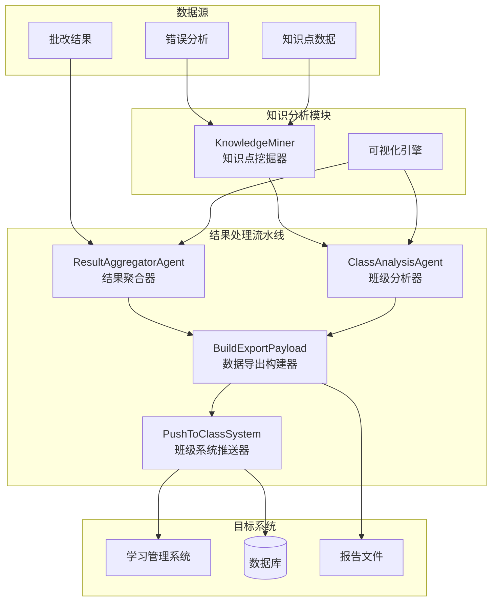
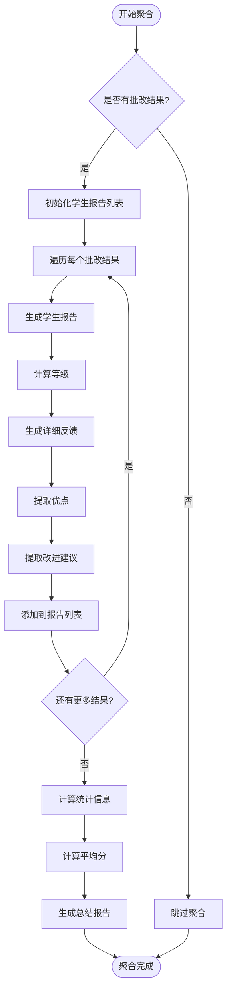
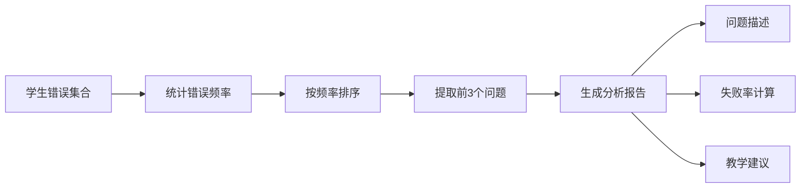
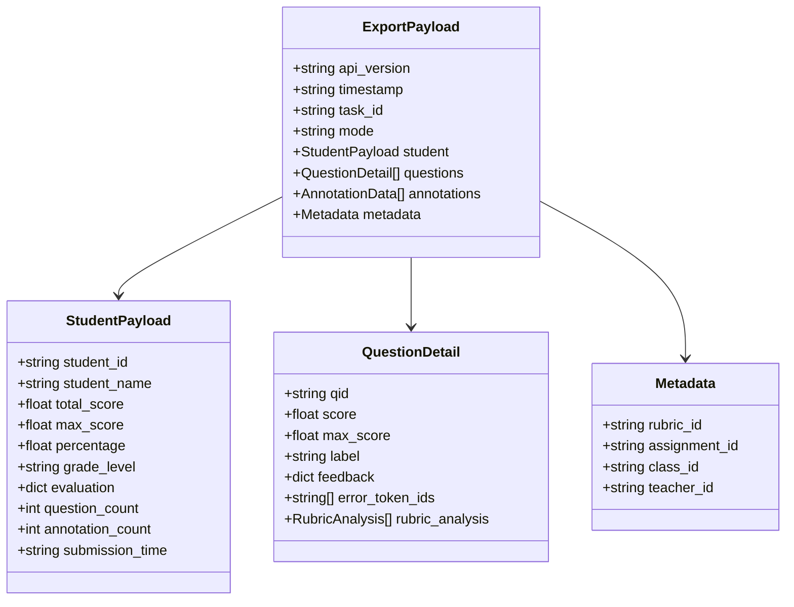
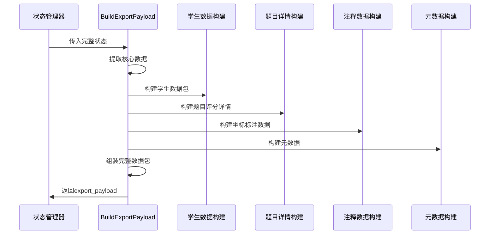
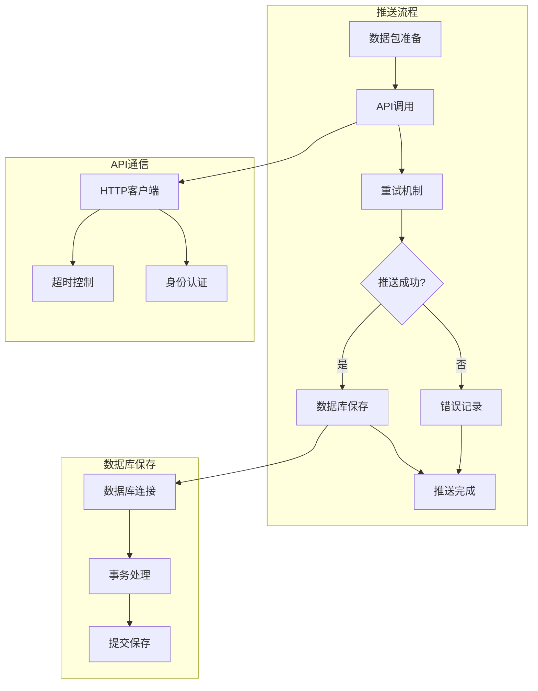
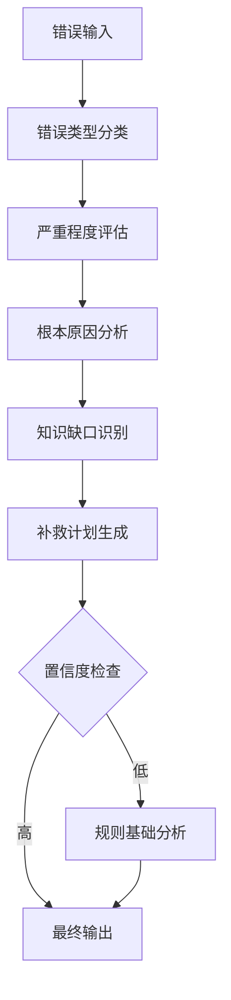
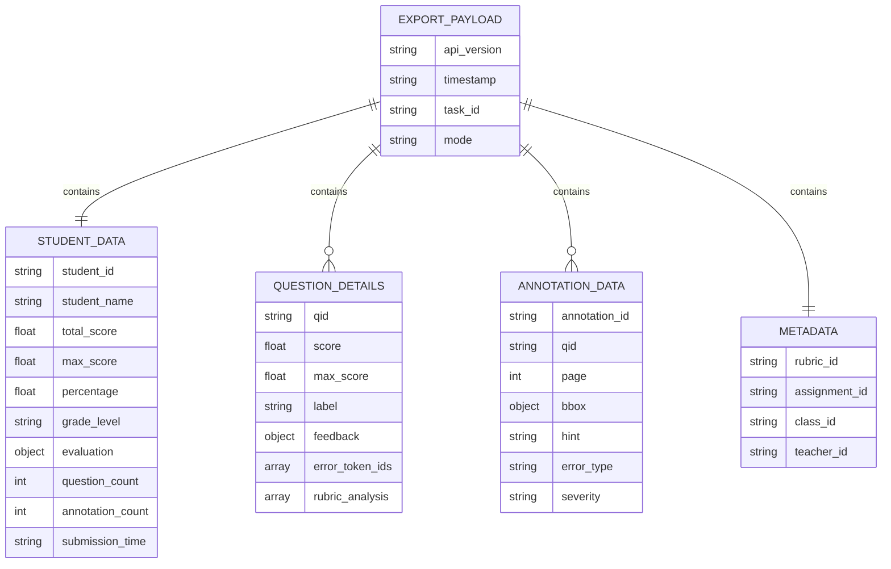
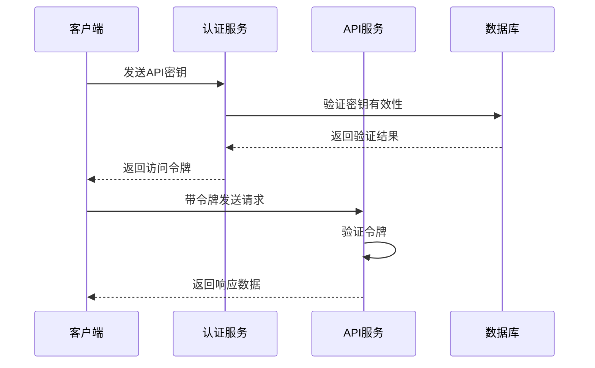
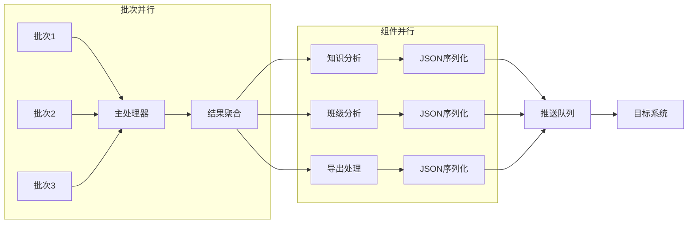

# 结果处理Agent

<cite>
**本文档引用的文件**
- [result_aggregator_agent.py](file://ai_correction/functions/langgraph/agents/result_aggregator_agent.py)
- [class_analysis_agent.py](file://ai_correction/functions/langgraph/agents/class_analysis_agent.py)
- [build_export_payload.py](file://ai_correction/functions/langgraph/agents/build_export_payload.py)
- [push_to_class_system.py](file://ai_correction/functions/langgraph/agents/push_to_class_system.py)
- [knowledge_miner.py](file://ai_correction/functions/langgraph/agents/knowledge_miner.py)
- [state.py](file://ai_correction/functions/langgraph/state.py)
- [workflow.py](file://ai_correction/functions/langgraph/workflow.py)
- [config.py](file://ai_correction/config.py)
</cite>

## 目录
1. [简介](#简介)
2. [系统架构概览](#系统架构概览)
3. [ResultAggregatorAgent - 结果聚合器](#resultaggregatoragent---结果聚合器)
4. [ClassAnalysisAgent - 班级分析器](#classanalysisagent---班级分析器)
5. [BuildExportPayload - 数据导出构建器](#buildexportpayload---数据导出构建器)
6. [PushToClassSystem - 班级系统推送器](#pushtoclasssystem---班级系统推送器)
7. [知识挖掘与可视化](#知识挖掘与可视化)
8. [数据包结构设计](#数据包结构设计)
9. [安全传输机制](#安全传输机制)
10. [LMS系统集成](#lms系统集成)
11. [性能优化策略](#性能优化策略)
12. [故障排除指南](#故障排除指南)
13. [扩展开发指南](#扩展开发指南)

## 简介

结果处理Agent是AI批改系统的核心组件，负责将分散的批改结果整合为结构化的报告，并与外部教学平台进行数据交换。该系统采用模块化设计，通过四个主要Agent协同工作，实现了从结果聚合到数据推送的完整流程。

## 系统架构概览



**图表来源**
- [result_aggregator_agent.py](file://ai_correction/functions/langgraph/agents/result_aggregator_agent.py#L1-L143)
- [class_analysis_agent.py](file://ai_correction/functions/langgraph/agents/class_analysis_agent.py#L1-L122)
- [build_export_payload.py](file://ai_correction/functions/langgraph/agents/build_export_payload.py#L1-L171)
- [push_to_class_system.py](file://ai_correction/functions/langgraph/agents/push_to_class_system.py#L1-L251)

## ResultAggregatorAgent - 结果聚合器

### 核心功能

ResultAggregatorAgent是整个结果处理流程的中枢，负责将分散的批改结果整合为结构化的报告。它确保多批次批改结果的一致性与完整性，为后续分析提供统一的数据格式。

### 主要特性

- **批量结果合并**：自动处理多个批次的批改结果
- **标准化报告生成**：统一的学生报告格式
- **统计信息计算**：平均分、学生总数等关键指标
- **等级评定**：基于百分比的等级系统（A-F）
- **错误处理**：完善的异常捕获和错误记录机制

### 数据处理流程



**图表来源**
- [result_aggregator_agent.py](file://ai_correction/functions/langgraph/agents/result_aggregator_agent.py#L15-L60)

### 等级评定算法

系统采用基于百分比的标准等级评定系统：

| 分数范围 | 等级 | 描述 |
|---------|------|------|
| 90-100% | A | 优秀表现 |
| 80-89% | B | 良好表现 |
| 70-79% | C | 中等表现 |
| 60-69% | D | 及格边缘 |
| 0-59% | F | 需要改进 |

**章节来源**
- [result_aggregator_agent.py](file://ai_correction/functions/langgraph/agents/result_aggregator_agent.py#L85-L105)

## ClassAnalysisAgent - 班级分析器

### 核心功能

ClassAnalysisAgent专门负责生成班级整体分析报告，为教师提供教学效果的宏观视角。该组件仅在班级批改模式下启用，能够识别共性问题并提供教学建议。

### 分析维度

#### 1. 成绩分布统计
- **总体统计**：学生总数、平均分、最高分、最低分
- **等级分布**：各等级学生人数统计
- **分数区间**：按等级划分的分布情况

#### 2. 共性问题识别
系统通过分析学生的错误模式，识别最常见的学习难点：



**图表来源**
- [class_analysis_agent.py](file://ai_correction/functions/langgraph/agents/class_analysis_agent.py#L85-L121)

### 错误类型分类

| 错误类型 | 英文标识 | 描述 | 影响程度 |
|---------|----------|------|----------|
| 计算错误 | calculation | 数值计算失误 | 中等 |
| 概念错误 | concept | 基础概念理解错误 | 高 |
| 方法错误 | method | 解题方法不当 | 高 |
| 逻辑错误 | logic | 推理过程错误 | 中等 |
| 粗心错误 | careless | 马虎导致的错误 | 低 |
| 不完整 | incomplete | 解答步骤缺失 | 中等 |
| 格式错误 | format | 答题格式不规范 | 低 |

**章节来源**
- [class_analysis_agent.py](file://ai_correction/functions/langgraph/agents/class_analysis_agent.py#L95-L121)

## BuildExportPayload - 数据导出构建器

### 核心职责

BuildExportPayloadAgent负责将批改结果转换为符合班级系统API规范的数据包，确保数据的完整性和一致性。

### 数据包结构设计

#### 核心数据包架构



**图表来源**
- [build_export_payload.py](file://ai_correction/functions/langgraph/agents/build_export_payload.py#L72-L95)

### JSON Schema规范

以下是导出数据包的JSON Schema定义：

```json
{
  "$schema": "http://json-schema.org/draft-07/schema#",
  "title": "AI批改结果导出数据包",
  "type": "object",
  "properties": {
    "api_version": {
      "type": "string",
      "description": "API版本号"
    },
    "timestamp": {
      "type": "string",
      "format": "date-time",
      "description": "数据包创建时间"
    },
    "task_id": {
      "type": "string",
      "description": "任务唯一标识符"
    },
    "mode": {
      "type": "string",
      "enum": ["efficient", "professional", "auto"],
      "description": "批改模式"
    },
    "student": {
      "type": "object",
      "properties": {
        "student_id": {"type": "string"},
        "student_name": {"type": "string"},
        "total_score": {"type": "number"},
        "max_score": {"type": "number"},
        "percentage": {"type": "number"},
        "grade_level": {"type": "string"},
        "evaluation": {"type": "object"},
        "question_count": {"type": "integer"},
        "annotation_count": {"type": "integer"}
      }
    },
    "questions": {
      "type": "array",
      "items": {
        "type": "object",
        "properties": {
          "qid": {"type": "string"},
          "score": {"type": "number"},
          "max_score": {"type": "number"},
          "label": {"type": "string"},
          "feedback": {"type": "object"},
          "error_token_ids": {"type": "array", "items": {"type": "string"}},
          "rubric_analysis": {"type": "array"}
        }
      }
    },
    "annotations": {
      "type": "array",
      "items": {
        "type": "object",
        "properties": {
          "annotation_id": {"type": "string"},
          "qid": {"type": "string"},
          "page": {"type": "integer"},
          "bbox": {"type": "object"},
          "hint": {"type": "string"},
          "error_type": {"type": "string"},
          "severity": {"type": "string"}
        }
      }
    },
    "metadata": {
      "type": "object",
      "properties": {
        "rubric_id": {"type": "string"},
        "assignment_id": {"type": "string"},
        "class_id": {"type": "string"},
        "teacher_id": {"type": "string"}
      }
    }
  }
}
```

### 数据转换流程



**图表来源**
- [build_export_payload.py](file://ai_correction/functions/langgraph/agents/build_export_payload.py#L47-L95)

**章节来源**
- [build_export_payload.py](file://ai_correction/functions/langgraph/agents/build_export_payload.py#L47-L171)

## PushToClassSystem - 班级系统推送器

### 核心功能

PushToClassSystemAgent负责将处理后的数据包推送到外部教学平台，支持多种LMS系统的集成。

### 推送架构



**图表来源**
- [push_to_class_system.py](file://ai_correction/functions/langgraph/agents/push_to_class_system.py#L55-L85)

### API调用机制

#### 重试策略
系统采用指数退避重试机制，最多重试3次：

| 尝试次数 | 等待时间 | 说明 |
|---------|----------|------|
| 1 | 1秒 | 初始重试 |
| 2 | 2秒 | 指数退避 |
| 3 | 4秒 | 最后尝试 |

#### 超时设置
- **连接超时**：30秒
- **读取超时**：30秒
- **写入超时**：30秒

### 数据库保存结构

推送器会将数据保存到PostgreSQL数据库，包含以下关键字段：

| 字段名 | 类型 | 描述 |
|--------|------|------|
| task_id | VARCHAR | 任务唯一标识 |
| student_id | VARCHAR | 学生ID |
| total_score | FLOAT | 总得分 |
| grade_level | VARCHAR | 等级评定 |
| export_payload | JSON | 导出数据包 |
| api_response | JSON | API响应数据 |
| push_timestamp | TIMESTAMP | 推送时间戳 |
| status | VARCHAR | 推送状态 |

**章节来源**
- [push_to_class_system.py](file://ai_correction/functions/langgraph/agents/push_to_class_system.py#L55-L251)

## 知识挖掘与可视化

### 知识点挖掘算法

KnowledgeMiner是系统的核心分析组件，负责从批改结果中挖掘知识点、分析错误模式并生成学习建议。

#### 知识点分类体系

系统支持三大学科领域的知识点分类：

```mermaid
mindmap
root((知识点分类))
数学
代数
方程
不等式
函数
数列
复数
几何
平面几何
立体几何
解析几何
向量
概率统计
概率
统计
排列组合
微积分
极限
导数
积分
微分方程
物理
力学
运动学
动力学
静力学
振动波动
电磁学
电场
磁场
电磁感应
交流电
热学
分子动理论
热力学定律
气体
光学
几何光学
物理光学
量子光学
化学
无机化学
元素化合物
化学反应
化学平衡
有机化学
烷烃
烯烃
芳香烃
官能团
物理化学
化学热力学
化学动力学
电化学
```

**图表来源**
- [knowledge_miner.py](file://ai_correction/functions/langgraph/agents/knowledge_miner.py#L25-L51)

### 错误分析流程



**图表来源**
- [knowledge_miner.py](file://ai_correction/functions/langgraph/agents/knowledge_miner.py#L111-L150)

### 知识掌握状态评估

系统采用三等级评估体系：

| 掌握状态 | 英文标识 | 评估标准 | 建议措施 |
|---------|----------|----------|----------|
| 优秀 | good | 无相关错误 | 继续保持 |
| 良好 | fair | 1个相关错误 | 加强练习 |
| 需要改进 | weak | 多个相关错误 | 重点突破 |

**章节来源**
- [knowledge_miner.py](file://ai_correction/functions/langgraph/agents/knowledge_miner.py#L354-L391)

## 数据包结构设计

### 完整数据包结构

以下是数据包的详细结构层次：



**图表来源**
- [build_export_payload.py](file://ai_correction/functions/langgraph/agents/build_export_payload.py#L72-L95)

### 数据包验证规则

#### 必需字段验证
- `api_version`: 必须为有效的版本号（如"v1"）
- `timestamp`: 必须为有效的ISO 8601时间戳
- `task_id`: 必须为非空字符串
- `student`: 包含所有必需的学生信息字段
- `questions`: 至少包含一个题目详情

#### 数据完整性检查
- 总分不能超过满分
- 百分比必须在0-100范围内
- 错误token ID必须存在于对应题目中
- 坐标边界框必须为有效的矩形区域

## 安全传输机制

### 数据加密

#### 传输层安全
- **HTTPS协议**：所有API通信必须使用HTTPS
- **证书验证**：验证服务器SSL证书的有效性
- **TLS版本**：使用TLS 1.2或更高版本

#### 数据保护
- **敏感信息过滤**：自动过滤学生个人信息
- **数据脱敏**：在日志中隐藏敏感数据
- **访问控制**：基于API密钥的身份验证

### API认证机制



**图表来源**
- [push_to_class_system.py](file://ai_correction/functions/langgraph/agents/push_to_class_system.py#L110-L140)

### 错误处理与恢复

#### 异常分类
- **网络异常**：连接超时、DNS解析失败
- **认证异常**：API密钥无效、权限不足
- **业务异常**：数据格式错误、业务规则违反
- **系统异常**：服务器内部错误、资源不足

#### 恢复策略
- **自动重试**：网络异常时自动重试
- **降级处理**：部分功能不可用时的备用方案
- **错误上报**：记录详细错误信息用于调试

## LMS系统集成

### 支持的LMS平台

#### Moodle集成配置

```yaml
# Moodle集成配置示例
class_system:
  api_url: "https://your-moodle-site.com/webservice/rest/server.php"
  api_key: "${CLASS_SYSTEM_API_KEY}"
  service: "moodle_mobile_app"
  course_id: "${MOODLE_COURSE_ID}"
  assignment_id: "${MOODLE_ASSIGNMENT_ID}"
```

#### Canvas集成配置

```yaml
# Canvas集成配置示例
class_system:
  api_url: "https://your-canvas-domain.com/api/v1"
  api_key: "${CANVAS_API_KEY}"
  course_id: "${CANVAS_COURSE_ID}"
  assignment_id: "${CANVAS_ASSIGNMENT_ID}"
```

### API端点映射

| 操作 | Moodle端点 | Canvas端点 | 描述 |
|------|-----------|-----------|------|
| 提交成绩 | /mod/assign/submission.php | /courses/{course_id}/assignments/{assignment_id}/submissions/{user_id} | 提交学生作业成绩 |
| 获取课程信息 | /webservice/rest/server.php | /courses/{course_id} | 获取课程基本信息 |
| 获取学生列表 | /webservice/rest/server.php | /courses/{course_id}/users | 获取课程学生名单 |
| 更新评分标准 | /webservice/rest/server.php | /courses/{course_id}/assignments/{assignment_id} | 更新作业评分标准 |

### 集成最佳实践

#### 数据同步策略
- **增量同步**：只同步发生变化的数据
- **冲突解决**：优先使用系统数据
- **版本控制**：维护数据版本历史

#### 性能优化
- **批量操作**：合并多个API调用
- **缓存机制**：缓存频繁访问的数据
- **异步处理**：后台异步执行耗时操作

**章节来源**
- [config.py](file://ai_correction/config.py#L1-L83)

## 性能优化策略

### 并行处理优化

系统采用多层次的并行处理策略：



**图表来源**
- [workflow.py](file://ai_correction/functions/langgraph/workflow.py#L100-L150)

### 缓存机制

#### OCR结果缓存
- **缓存键**：基于文件哈希值
- **TTL**：1小时
- **命中率**：目标达到80%

#### 知识点分析缓存
- **缓存键**：基于题目内容和学生答案
- **TTL**：24小时
- **适用场景**：重复题目分析

### 内存优化

#### 流式处理
- **大文件处理**：采用流式读取避免内存溢出
- **分块处理**：大数据集分块处理
- **及时释放**：处理完成后立即释放内存

#### 对象池化
- **连接池**：数据库连接池管理
- **线程池**：并发任务线程池
- **缓冲区**：IO操作缓冲区复用

**章节来源**
- [workflow.py](file://ai_correction/functions/langgraph/workflow.py#L25-L50)

## 故障排除指南

### 常见问题诊断

#### 结果聚合失败

**症状**：ResultAggregatorAgent返回错误状态
**可能原因**：
- 批改结果数据格式不正确
- 学生信息缺失
- 评分标准配置错误

**解决方案**：
1. 检查`grading_results`字段是否存在且格式正确
2. 验证学生ID和姓名字段的完整性
3. 确认评分标准的配置参数

#### 班级分析异常

**症状**：ClassAnalysisAgent跳过分析或返回空结果
**可能原因**：
- 学生数量不足（少于2人）
- 分析功能未启用
- 数据质量问题

**解决方案**：
1. 确保至少有2名学生参与批改
2. 检查`enable_class_analysis`配置
3. 验证批改结果的质量和完整性

#### 数据导出失败

**症状**：BuildExportPayloadAgent生成空数据包
**可能原因**：
- 输入数据格式错误
- 必需字段缺失
- 数据转换异常

**解决方案**：
1. 验证输入数据的完整性和格式
2. 检查必需字段的存在性
3. 查看详细的错误日志

#### API推送失败

**症状**：PushToClassSystemAgent推送超时或失败
**可能原因**：
- 网络连接问题
- API密钥无效
- 目标系统不可用

**解决方案**：
1. 检查网络连接和防火墙设置
2. 验证API密钥的有效性
3. 确认目标系统的可用性
4. 查看重试日志了解具体失败原因

### 调试工具

#### 日志分析
系统提供详细的日志记录，可通过以下方式分析：

```python
# 启用调试日志
import logging
logging.getLogger('ai_correction').setLevel(logging.DEBUG)

# 查看特定Agent的日志
logging.getLogger('ai_correction.agents.result_aggregator').info('调试信息')
```

#### 性能监控
- **处理时间**：监控各Agent的执行时间
- **内存使用**：跟踪内存消耗情况
- **API响应**：监控外部API的响应时间

#### 数据验证
- **Schema验证**：验证输出数据的结构完整性
- **业务规则验证**：检查数据的业务合理性
- **一致性检查**：确保数据在各环节的一致性

**章节来源**
- [result_aggregator_agent.py](file://ai_correction/functions/langgraph/agents/result_aggregator_agent.py#L60-L85)
- [push_to_class_system.py](file://ai_correction/functions/langgraph/agents/push_to_class_system.py#L110-L140)

## 扩展开发指南

### 自定义报告模板

#### 创建自定义Agent

开发者可以通过继承基础类来创建自定义的分析Agent：

```python
from ai_correction.functions.langgraph.agents.base_agent import BaseAgent

class CustomAnalysisAgent(BaseAgent):
    """自定义分析Agent示例"""
    
    def __init__(self, custom_config=None):
        super().__init__()
        self.config = custom_config or {}
    
    async def __call__(self, state: GradingState) -> GradingState:
        """实现自定义分析逻辑"""
        # 自定义分析代码
        return state
```

#### 报告模板开发

系统支持多种报告格式的输出：

| 格式类型 | 输出文件 | 内容结构 | 使用场景 |
|---------|----------|----------|----------|
| JSON | export.json | 标准数据包格式 | API集成 |
| HTML | report.html | 可视化报告 | Web展示 |
| PDF | report.pdf | 打印友好格式 | 纸质存档 |
| CSV | grades.csv | 成绩表格 | 数据分析 |

### 第三方工具集成

#### 分析工具集成

```python
# 集成第三方数据分析工具
class ThirdPartyAnalyzer:
    """第三方分析工具集成示例"""
    
    def __init__(self, api_key: str):
        self.api_key = api_key
    
    async def analyze_knowledge_gaps(self, knowledge_points: List[Dict]) -> Dict:
        """调用第三方API分析知识缺口"""
        # 实现API调用逻辑
        pass
```

#### 可视化组件扩展

系统支持多种可视化图表的扩展：

```python
# 自定义可视化组件
class CustomVisualization:
    """自定义可视化组件"""
    
    def create_heatmap(self, data: Dict) -> str:
        """创建知识掌握热力图"""
        # 实现热力图生成逻辑
        pass
    
    def create_radar_chart(self, data: Dict) -> str:
        """创建能力雷达图"""
        # 实现雷达图生成逻辑
        pass
```

### 配置扩展

#### 环境变量配置

```bash
# 自定义分析配置
CUSTOM_ANALYSIS_ENABLED=true
CUSTOM_ANALYSIS_API_URL=https://custom-analysis.example.com/api
CUSTOM_ANALYSIS_MODEL=advanced_model

# 报告模板配置
REPORT_TEMPLATE_PATH=./templates/custom_report.html
EXPORT_FORMAT=json,html,pdf
```

#### 功能开关配置

```python
# 功能开关管理
FEATURE_FLAGS = {
    'enable_custom_analysis': True,
    'use_advanced_visualization': False,
    'enable_third_party_integrations': True,
    'optimize_memory_usage': True
}
```

### 测试框架

#### 单元测试

```python
import pytest
from ai_correction.functions.langgraph.agents import *

class TestResultAggregatorAgent:
    """ResultAggregatorAgent测试套件"""
    
    @pytest.mark.asyncio
    async def test_basic_aggregation(self):
        """测试基本聚合功能"""
        agent = ResultAggregatorAgent()
        state = self._create_test_state()
        
        result = await agent(state)
        
        assert 'student_reports' in result
        assert 'summary' in result
        assert len(result['student_reports']) > 0
```

#### 集成测试

```python
class TestEndToEndWorkflow:
    """端到端工作流测试"""
    
    async def test_full_pipeline(self):
        """测试完整处理流程"""
        workflow = OptimizedAIGradingWorkflow()
        
        result = await workflow.run_grading(
            task_id="test_001",
            user_id="teacher_001",
            question_files=["test_qa.txt"],
            answer_files=["test_answers.txt"],
            mode="professional"
        )
        
        assert result['completion_status'] == 'completed'
        assert 'export_payload' in result
```

**章节来源**
- [workflow.py](file://ai_correction/functions/langgraph/workflow.py#L500-L617)
- [state.py](file://ai_correction/functions/langgraph/state.py#L1-L269)

## 总结

结果处理Agent系统通过模块化设计实现了从结果聚合到数据推送的完整流程。各个组件各司其职，协同工作，为教育工作者提供了强大的数据分析和报告生成功能。

### 核心优势

1. **模块化架构**：清晰的职责分离，便于维护和扩展
2. **高性能处理**：并行处理和缓存机制确保高效运行
3. **标准化输出**：统一的数据格式便于集成各种LMS系统
4. **智能分析**：基于AI的知识挖掘和错误分析
5. **灵活扩展**：开放的架构支持自定义扩展

### 应用价值

- **教学改进**：帮助教师识别教学难点和学生弱点
- **个性化辅导**：为学生提供针对性的学习建议
- **数据驱动决策**：基于数据分析的教学质量评估
- **系统集成**：无缝对接主流学习管理系统

该系统为现代教育技术的发展提供了强有力的技术支撑，有助于提升教学质量和学习效果。