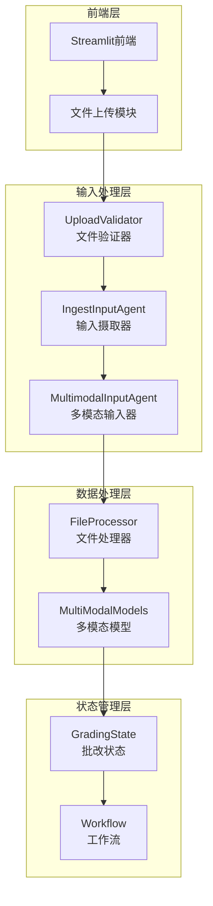
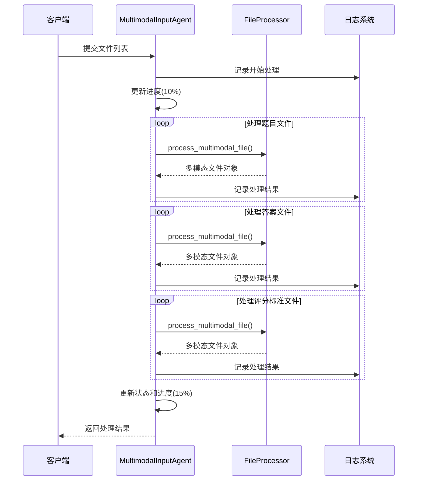
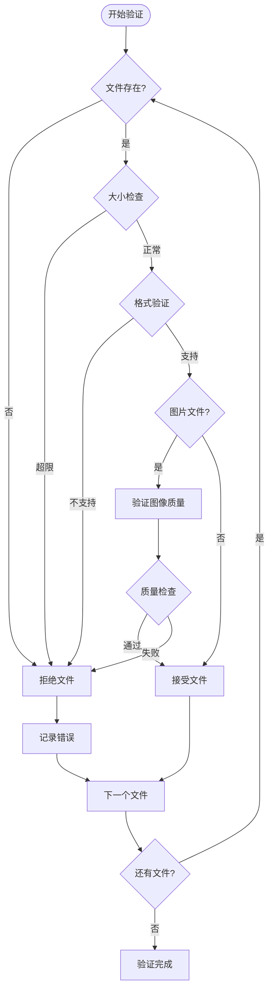
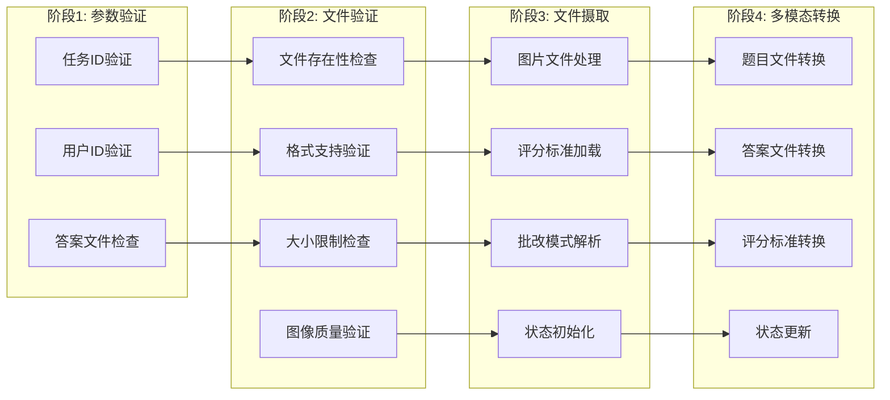
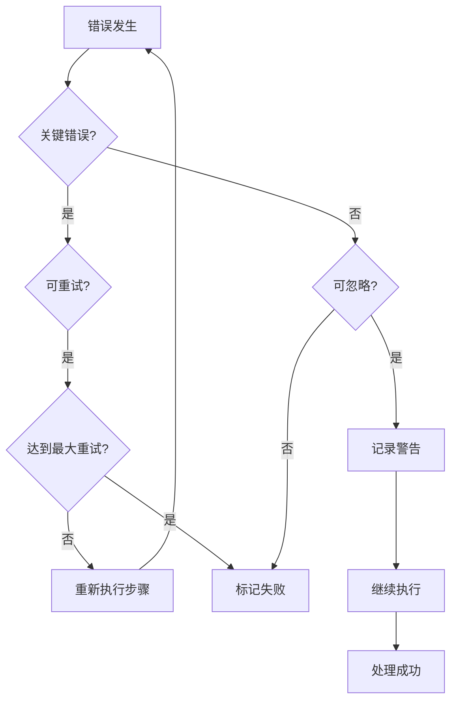
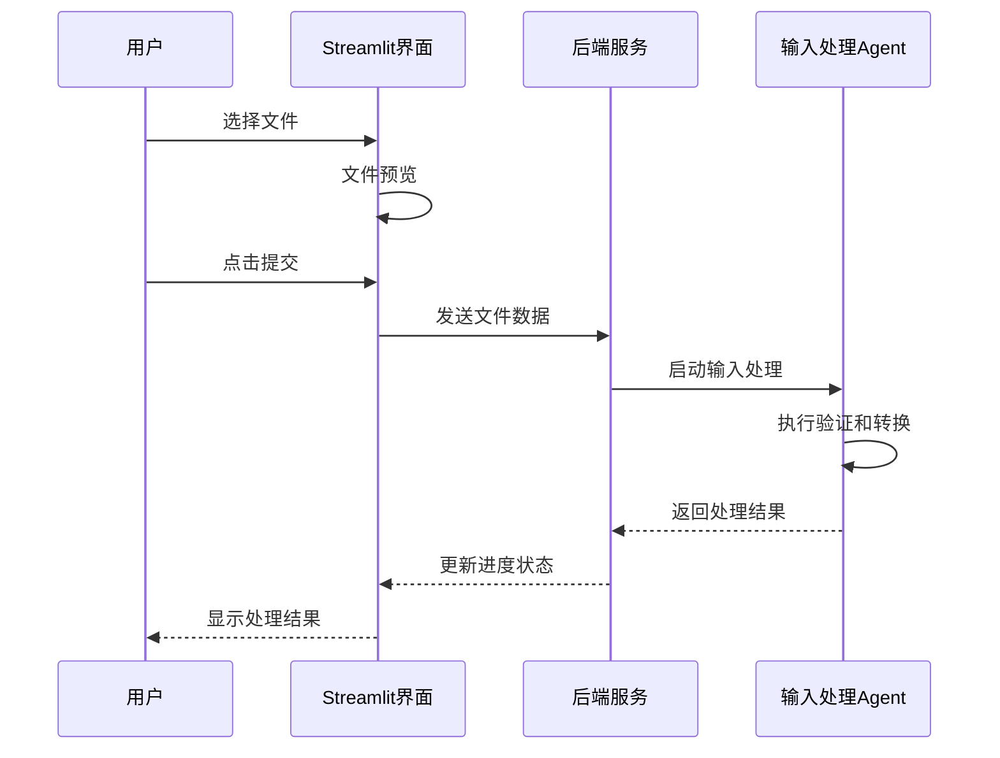

# 输入处理Agent

<cite>
**本文档引用的文件**
- [multimodal_input_agent.py](file://ai_correction/functions/langgraph/agents/multimodal_input_agent.py)
- [ingest_input.py](file://ai_correction/functions/langgraph/agents/ingest_input.py)
- [upload_validator.py](file://ai_correction/functions/langgraph/agents/upload_validator.py)
- [state.py](file://ai_correction/functions/langgraph/state.py)
- [file_processor.py](file://ai_correction/functions/file_processor.py)
- [workflow_multimodal.py](file://ai_correction/functions/langgraph/workflow_multimodal.py)
- [main.py](file://ai_correction/main.py)
</cite>

## 目录
1. [简介](#简介)
2. [系统架构概览](#系统架构概览)
3. [核心组件详解](#核心组件详解)
4. [输入处理工作流](#输入处理工作流)
5. [文件验证机制](#文件验证机制)
6. [错误处理与拒绝策略](#错误处理与拒绝策略)
7. [与Streamlit前端集成](#与streamlit前端集成)
8. [扩展开发指南](#扩展开发指南)
9. [性能优化考虑](#性能优化考虑)
10. [故障排除指南](#故障排除指南)

## 简介

输入处理Agent是AI批改系统的核心前置组件，负责协调和处理来自用户的多模态文件输入。该系统采用深度协作架构，通过三个主要Agent协同工作：`MultimodalInputAgent`、`IngestInputAgent`和`UploadValidator`，确保输入数据的完整性、安全性和一致性。

这些Agent在工作流中扮演着关键的前置角色，它们不仅负责文件格式转换和验证，还为后续的批改流程提供了标准化的数据结构。通过严格的验证机制和灵活的错误处理策略，系统能够优雅地处理各种异常情况，同时为用户提供清晰的反馈信息。

## 系统架构概览

输入处理系统采用模块化设计，每个Agent都有明确的职责分工：



**图表来源**
- [workflow_multimodal.py](file://ai_correction/functions/langgraph/workflow_multimodal.py#L1-L50)
- [state.py](file://ai_correction/functions/langgraph/state.py#L1-L100)

**章节来源**
- [workflow_multimodal.py](file://ai_correction/functions/langgraph/workflow_multimodal.py#L1-L100)
- [state.py](file://ai_correction/functions/langgraph/state.py#L1-L200)

## 核心组件详解

### MultimodalInputAgent - 多模态输入处理

`MultimodalInputAgent`是输入处理流程的核心协调者，负责将上传的文件转换为多模态表示形式。该Agent采用异步处理模式，能够并行处理多个文件类型。

#### 主要功能特性

1. **多模态文件识别**：自动识别文本、图片、PDF等不同类型的文件
2. **模态保持**：保留原始文件的模态信息，不进行强制OCR转换
3. **并行处理**：同时处理题目文件、答案文件和评分标准文件
4. **错误隔离**：单个文件处理失败不影响其他文件的处理

#### 处理流程



**图表来源**
- [multimodal_input_agent.py](file://ai_correction/functions/langgraph/agents/multimodal_input_agent.py#L25-L120)

**章节来源**
- [multimodal_input_agent.py](file://ai_correction/functions/langgraph/agents/multimodal_input_agent.py#L1-L123)

### IngestInputAgent - 输入数据摄取

`IngestInputAgent`负责读取和验证所有输入文件，加载评分标准文本，并解析批改模式和配置参数。该Agent确保系统能够正确初始化并准备处理批改请求。

#### 核心职责

1. **参数验证**：验证必需的参数是否存在
2. **文件处理**：处理图片文件并建立文件关联
3. **评分标准加载**：读取和解析评分标准文本
4. **模式验证**：验证并规范化批改模式
5. **状态初始化**：初始化所有必要的数据结构

#### 数据结构初始化

该Agent负责初始化多种数据结构，包括：

| 数据结构 | 描述 | 默认值 |
|---------|------|--------|
| `mm_tokens` | 多模态token列表 | `[]` |
| `student_info` | 学生信息字典 | `{}` |
| `questions` | 题目信息列表 | `[]` |
| `batches` | 批次划分列表 | `[]` |
| `evaluations` | 评分结果列表 | `[]` |
| `rubric_struct` | 结构化评分规则 | `{}` |
| `errors` | 错误记录列表 | `[]` |
| `warnings` | 警告信息列表 | `[]` |

**章节来源**
- [ingest_input.py](file://ai_correction/functions/langgraph/agents/ingest_input.py#L1-L311)

### UploadValidator - 文件上传验证器

`UploadValidator`实现了严格的文件验证机制，确保上传的文件符合系统要求。该Agent执行多层次的验证检查，包括文件存在性、格式支持、大小限制和质量要求。

#### 验证层次结构



**图表来源**
- [upload_validator.py](file://ai_correction/functions/langgraph/agents/upload_validator.py#L40-L190)

**章节来源**
- [upload_validator.py](file://ai_correction/functions/langgraph/agents/upload_validator.py#L1-L193)

## 输入处理工作流

输入处理工作流按照严格的顺序执行，确保每个阶段都得到充分的处理和验证：



**图表来源**
- [workflow_multimodal.py](file://ai_correction/functions/langgraph/workflow_multimodal.py#L60-L120)

### 执行顺序说明

1. **参数验证阶段**：验证必需的参数是否存在，为缺失字段提供兼容逻辑
2. **文件验证阶段**：执行严格的文件验证，包括存在性、格式、大小和质量检查
3. **文件摄取阶段**：读取和处理所有输入文件，初始化系统状态
4. **多模态转换阶段**：将原始文件转换为多模态表示，准备后续处理

**章节来源**
- [workflow_multimodal.py](file://ai_correction/functions/langgraph/workflow_multimodal.py#L1-L200)

## 文件验证机制

系统实现了多层次的文件验证机制，确保输入数据的质量和安全性：

### 支持的文件格式

| 文件类型 | 支持的扩展名 | 验证要求 |
|---------|-------------|----------|
| 图片文件 | `.jpg`, `.jpeg`, `.png`, `.bmp`, `.tiff`, `.webp` | 大小 ≤ 100MB，尺寸 ≤ 4096×4096 |
| 文档文件 | `.pdf`, `.doc`, `.docx` | 大小 ≤ 50MB，内容可读 |
| 文本文件 | `.txt`, `.md`, `.json`, `.csv` | UTF-8编码，大小 ≤ 50MB |

### 验证规则详解

#### 图像文件验证
- **文件大小限制**：最大100MB
- **尺寸限制**：最大4096×4096像素
- **格式支持**：RGB、RGBA、灰度、调色板模式
- **质量检查**：通过方差分析检测图像清晰度

#### 文档文件验证
- **PDF文件**：支持文本提取，扫描版自动转换为图片模式
- **Word文档**：使用python-docx库提取文本内容
- **文本文件**：UTF-8编码，支持GBK编码回退

#### 大小和数量限制
- 单个文件最大50MB
- 图像文件最大100MB
- 总文件数量无硬性限制，但受内存和处理能力约束

**章节来源**
- [upload_validator.py](file://ai_correction/functions/langgraph/agents/upload_validator.py#L20-L50)
- [file_processor.py](file://ai_correction/functions/file_processor.py#L1-L100)

## 错误处理与拒绝策略

系统采用分级的错误处理策略，根据错误的严重程度采取不同的处理方式：

### 错误分类体系



**图表来源**
- [routing.py](file://ai_correction/functions/langgraph/routing.py#L156-L191)

### 拒绝策略

#### 文件级拒绝
当单个文件不符合要求时：
- 记录详细的错误信息
- 继续处理其他文件
- 在最终结果中标记失败文件
- 提供具体的错误原因

#### 步骤级拒绝
当某个处理步骤失败时：
- 根据错误类型决定是否重试
- 记录错误历史和重试次数
- 在达到最大重试次数后标记整个任务失败
- 提供恢复建议

#### 系统级拒绝
当系统资源不足或核心服务不可用时：
- 立即终止处理流程
- 返回友好的错误信息
- 记录系统状态以便诊断

**章节来源**
- [routing.py](file://ai_correction/functions/langgraph/routing.py#L156-L191)
- [multimodal_input_agent.py](file://ai_correction/functions/langgraph/agents/multimodal_input_agent.py#L100-L123)

## 与Streamlit前端集成

输入处理Agent与Streamlit前端紧密集成，提供流畅的用户体验：

### 前端交互流程



**图表来源**
- [main.py](file://ai_correction/main.py#L690-L760)

### 前端特性支持

#### 文件预览功能
- **图片预览**：支持多种图片格式的实时预览
- **文本预览**：支持文本文件和Markdown文件的预览
- **PDF预览**：显示PDF文件的基本信息
- **文档预览**：支持Word文档的基本预览

#### 进度指示器
- 实时显示处理进度
- 分阶段显示各Agent的工作状态
- 提供详细的处理时间估算

#### 错误反馈
- 详细的错误信息展示
- 友好的错误提示和解决建议
- 文件级别的错误隔离显示

**章节来源**
- [main.py](file://ai_correction/main.py#L320-L400)

## 扩展开发指南

### 支持新文件格式

要扩展系统支持新的文件格式，需要修改以下几个部分：

#### 1. UploadValidator扩展

在[`UploadValidator`](file://ai_correction/functions/langgraph/agents/upload_validator.py#L20-L30)类中添加新的格式支持：

```python
# 在supported_formats字典中添加新格式
self.supported_formats = {
    'image': ['.jpg', '.jpeg', '.png', '.bmp', '.tiff', '.webp', '.heic'],  # 添加.heic支持
    'document': ['.pdf', '.doc', '.docx', '.xlsx', '.pptx'],  # 添加Office扩展
    'text': ['.txt', '.md', '.json', '.csv', '.xml'],  # 添加XML支持
    'audio': ['.mp3', '.wav', '.m4a'],  # 添加音频支持
    'video': ['.mp4', '.avi', '.mov']  # 添加视频支持
}
```

#### 2. FileProcessor扩展

在[`file_processor.py`](file://ai_correction/functions/file_processor.py#L40-L80)中添加新的处理函数：

```python
def _process_audio_file(file_path: str) -> MultiModalFile:
    """处理音频文件"""
    try:
        # 实现音频文件处理逻辑
        # 例如：提取音频特征或转换为文本
        pass
    except Exception as e:
        logger.error(f"音频文件处理失败: {file_path}, 错误: {e}")
        raise

def _process_video_file(file_path: str) -> MultiModalFile:
    """处理视频文件"""
    try:
        # 实现视频文件处理逻辑
        # 例如：提取视频帧或转换为文本
        pass
    except Exception as e:
        logger.error(f"视频文件处理失败: {file_path}, 错误: {e}")
        raise
```

#### 3. 状态模型扩展

在[`state.py`](file://ai_correction/functions/langgraph/state.py#L50-L100)中添加新的字段：

```python
class GradingState(TypedDict):
    # 现有字段...
    
    # 新增字段
    audio_files: List[str]          # 音频文件路径列表
    video_files: List[str]          # 视频文件路径列表
    media_processing_status: Dict[str, str]  # 媒体文件处理状态
```

### 自定义验证规则

可以通过扩展[`UploadValidator`](file://ai_correction/functions/langgraph/agents/upload_validator.py#L150-L190)来添加自定义验证规则：

```python
async def _validate_custom_file(self, file_path: str) -> bool:
    """自定义文件验证规则"""
    try:
        # 实现自定义验证逻辑
        # 例如：检查文件元数据、内容特征等
        return True
    except Exception as e:
        logger.warning(f"自定义验证失败: {file_path} - {e}")
        return False
```

### 性能优化建议

#### 并行处理优化
- 使用异步处理提高并发性能
- 实现文件缓存机制减少重复处理
- 采用流式处理处理大文件

#### 内存管理
- 及时释放处理完成的文件资源
- 实现内存使用监控和限制
- 采用分块处理大文件

**章节来源**
- [file_processor.py](file://ai_correction/functions/file_processor.py#L40-L150)
- [upload_validator.py](file://ai_correction/functions/langgraph/agents/upload_validator.py#L150-L193)

## 性能优化考虑

### 处理速度优化

#### 异步处理架构
系统采用异步处理模式，能够同时处理多个文件，显著提高处理效率：

- **并行文件处理**：多个文件可以同时进行验证和转换
- **非阻塞I/O**：文件读取和网络操作不会阻塞主线程
- **内存池管理**：复用内存缓冲区减少分配开销

#### 缓存策略
- **文件指纹缓存**：基于文件内容生成唯一标识符
- **处理结果缓存**：缓存已处理的文件结果
- **元数据缓存**：缓存文件属性和验证结果

### 内存使用优化

#### 流式处理
对于大文件，系统采用流式处理方式：

```python
# 示例：流式读取大文件
def process_large_file(file_path: str):
    with open(file_path, 'rb') as f:
        while chunk := f.read(8192):  # 8KB块读取
            yield process_chunk(chunk)
```

#### 内存监控
系统内置内存使用监控，防止内存溢出：

- 实时监控内存使用情况
- 设置内存使用阈值
- 自动触发垃圾回收

### 并发控制

#### 限流机制
- 控制同时处理的文件数量
- 实现队列管理避免系统过载
- 支持动态调整并发度

#### 资源池管理
- 数据库连接池
- 文件句柄池
- 网络连接池

## 故障排除指南

### 常见问题及解决方案

#### 文件上传失败

**问题症状**：
- 文件上传后立即失败
- 进度条卡在某个阶段不动

**排查步骤**：
1. 检查文件大小是否超过限制
2. 验证文件格式是否受支持
3. 确认文件编码是否正确
4. 检查磁盘空间是否充足

**解决方案**：
- 压缩文件或拆分大文件
- 转换为支持的格式
- 检查并修复文件编码
- 清理磁盘空间

#### 处理速度缓慢

**问题症状**：
- 文件处理时间过长
- 系统响应变慢

**排查步骤**：
1. 检查CPU和内存使用率
2. 验证磁盘I/O性能
3. 检查网络连接状态
4. 分析日志文件找出瓶颈

**解决方案**：
- 增加系统资源
- 优化文件存储位置
- 调整并发处理参数
- 实施文件预处理

#### 处理结果不准确

**问题症状**：
- 文件内容识别错误
- 多模态转换失败

**排查步骤**：
1. 验证文件质量
2. 检查处理日志
3. 测试不同文件格式
4. 对比处理前后文件

**解决方案**：
- 提高文件质量要求
- 更新处理算法
- 添加人工审核环节
- 实施质量控制流程

### 日志分析指南

#### 关键日志位置
- **系统日志**：`logs/system.log`
- **应用日志**：`logs/app.log`
- **错误日志**：`logs/error.log`

#### 日志分析要点
- **错误频率**：统计特定错误的发生频率
- **处理时间**：分析不同类型文件的处理时间分布
- **资源使用**：监控CPU、内存、磁盘使用情况
- **用户行为**：分析用户上传模式和偏好

**章节来源**
- [multimodal_input_agent.py](file://ai_correction/functions/langgraph/agents/multimodal_input_agent.py#L100-L123)
- [upload_validator.py](file://ai_correction/functions/langgraph/agents/upload_validator.py#L150-L193)

## 总结

输入处理Agent系统通过`MultimodalInputAgent`、`IngestInputAgent`和`UploadValidator`三个核心组件的协同工作，构建了一个强大而灵活的多模态文件处理平台。该系统不仅具备完善的验证机制和错误处理策略，还提供了良好的扩展性和性能优化能力。

通过深度协作架构的设计理念，系统能够高效处理各种复杂的文件输入场景，为后续的AI批改流程奠定了坚实的基础。无论是日常的教育应用场景还是大规模的批改需求，该系统都能够提供稳定可靠的服务保障。