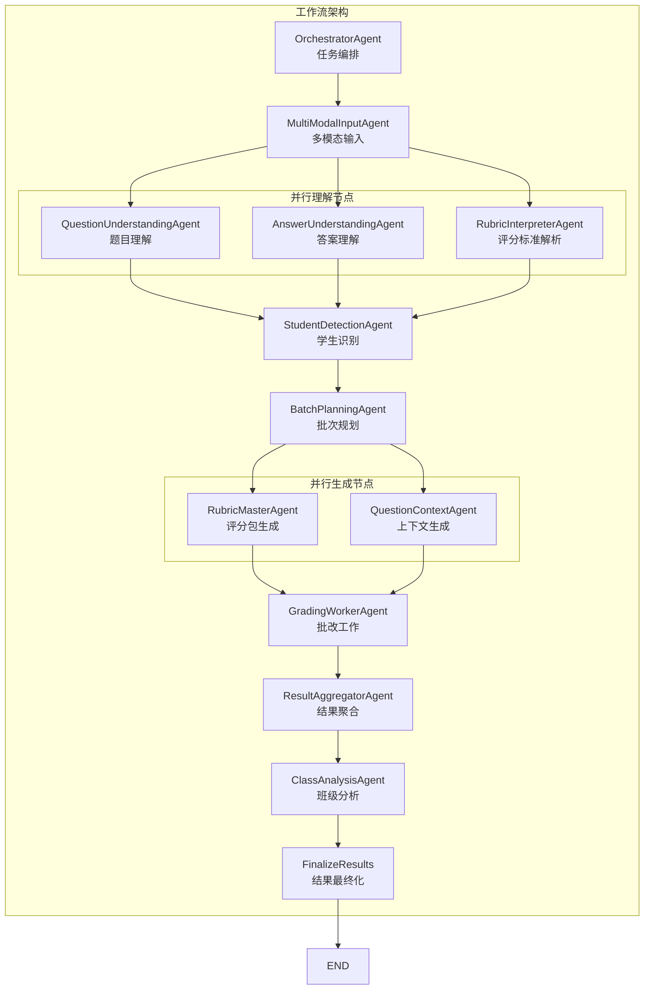
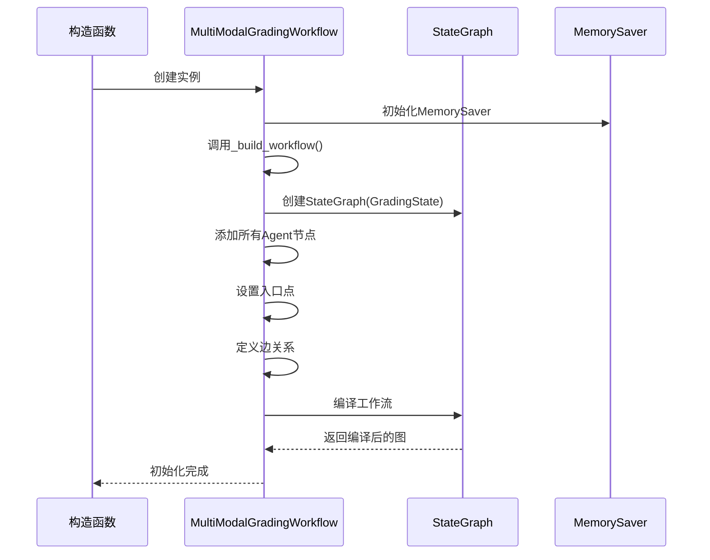
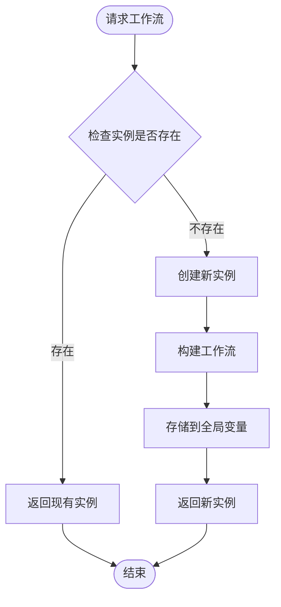
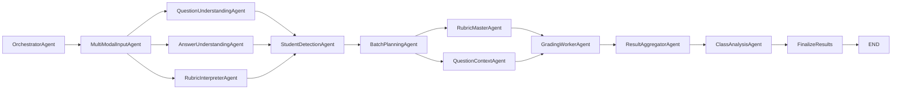
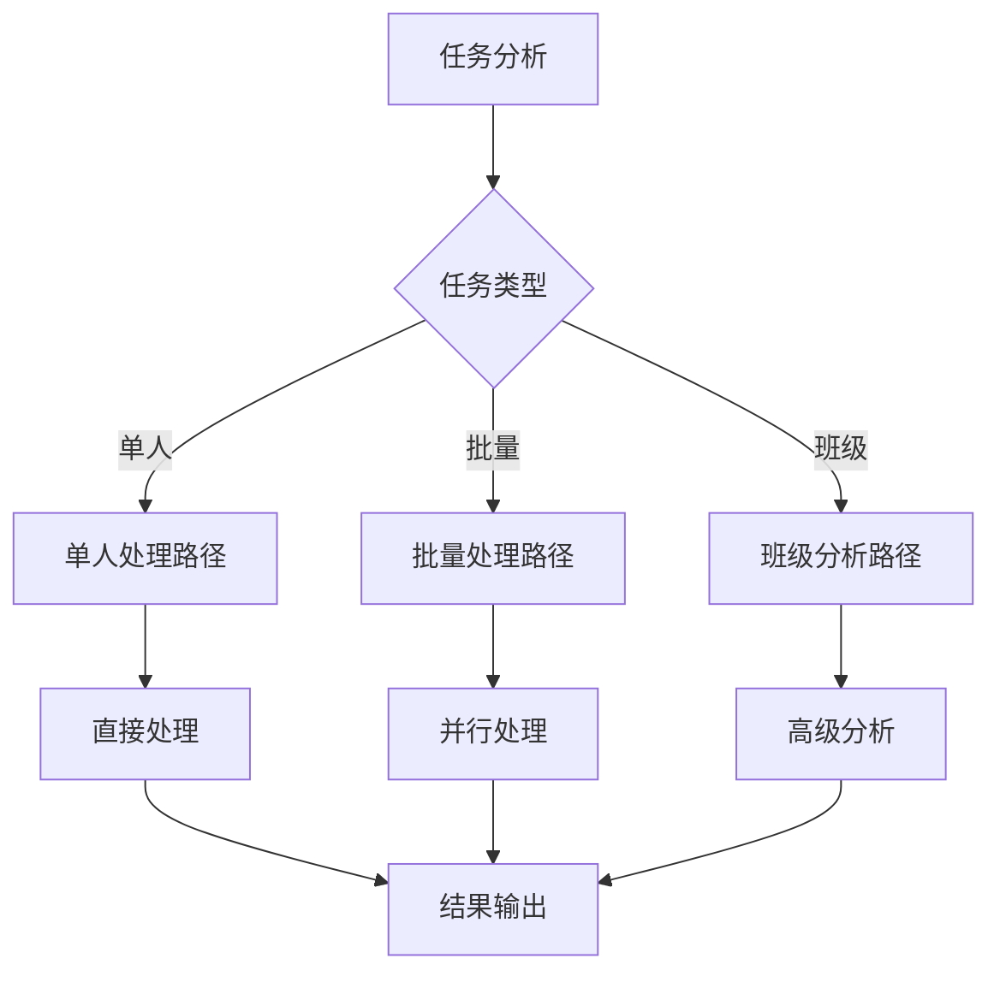
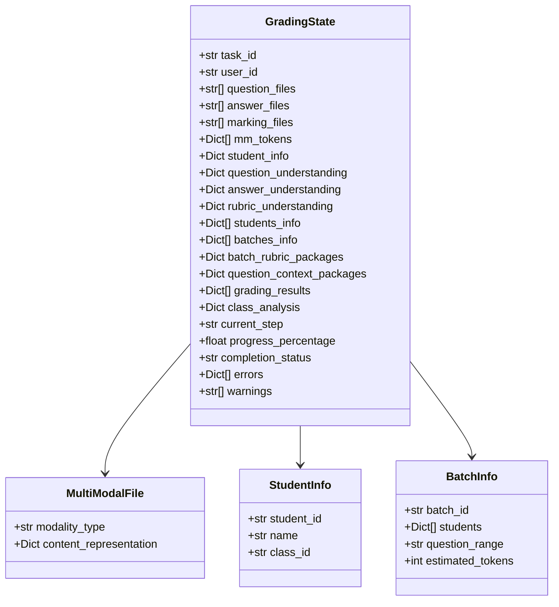
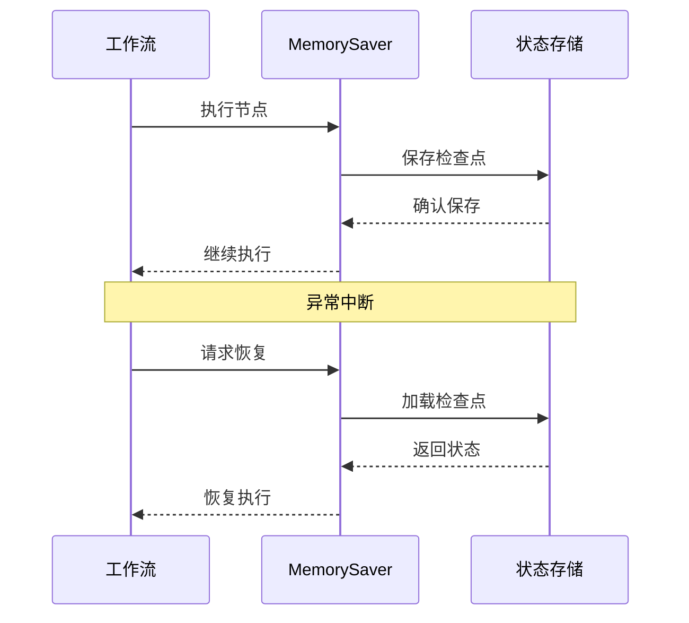
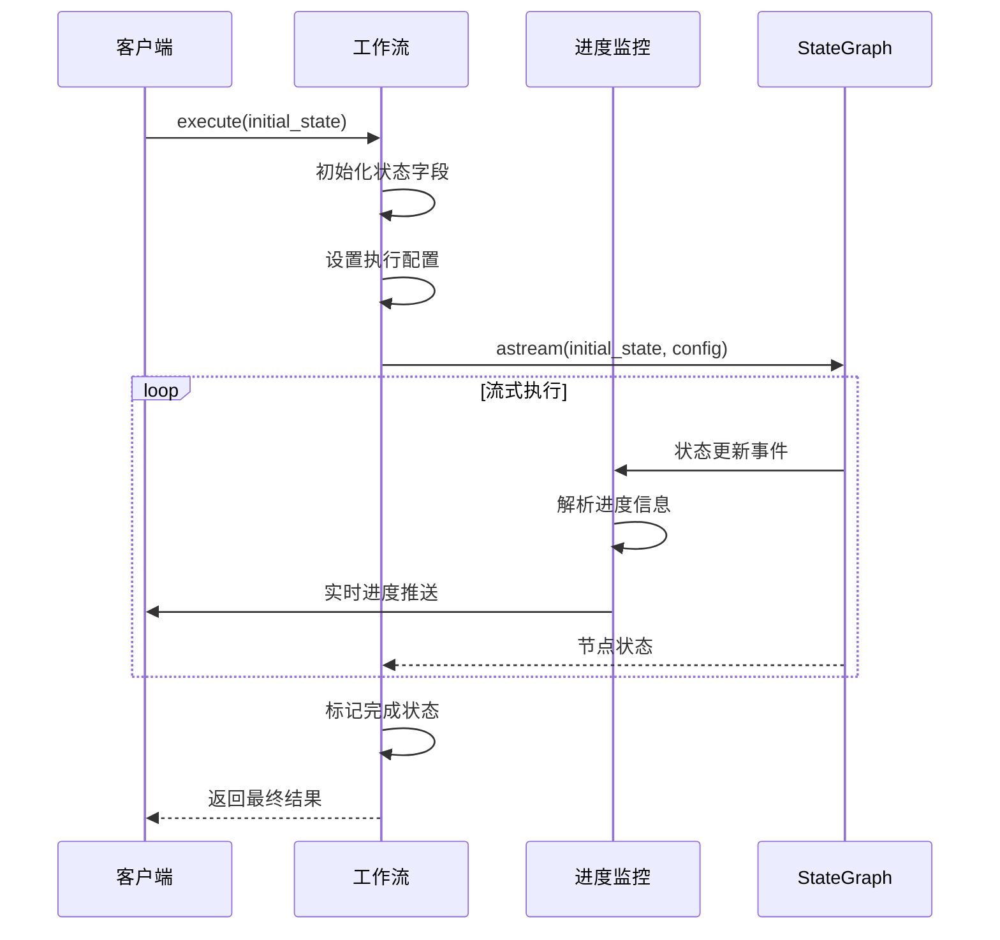
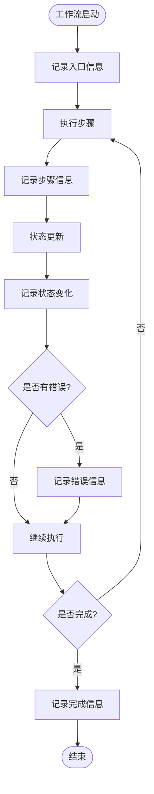

# 工作流构建机制

<cite>
**本文档引用的文件**
- [workflow_multimodal.py](file://ai_correction/functions/langgraph/workflow_multimodal.py)
- [state.py](file://ai_correction/functions/langgraph/state.py)
- [checkpointer.py](file://ai_correction/functions/langgraph/checkpointer.py)
- [orchestrator_agent.py](file://ai_correction/functions/langgraph/agents/orchestrator_agent.py)
- [multimodal_input_agent.py](file://ai_correction/functions/langgraph/agents/multimodal_input_agent.py)
- [question_understanding_agent.py](file://ai_correction/functions/langgraph/agents/question_understanding_agent.py)
- [answer_understanding_agent.py](file://ai_correction/functions/langgraph/agents/answer_understanding_agent.py)
- [rubric_interpreter_agent.py](file://ai_correction/functions/langgraph/agents/rubric_interpreter_agent.py)
- [batch_planning_agent.py](file://ai_correction/functions/langgraph/agents/batch_planning_agent.py)
- [grading_worker_agent.py](file://ai_correction/functions/langgraph/agents/grading_worker_agent.py)
- [streaming.py](file://ai_correction/functions/langgraph/streaming.py)
- [test_new_workflow.py](file://ai_correction/test_new_workflow.py)
</cite>

## 目录
1. [概述](#概述)
2. [核心架构](#核心架构)
3. [工作流构建过程](#工作流构建过程)
4. [节点详解](#节点详解)
5. [边与路由机制](#边与路由机制)
6. [状态管理与持久化](#状态管理与持久化)
7. [执行流程](#执行流程)
8. [调试与监控](#调试与监控)
9. [最佳实践](#最佳实践)
10. [故障排除](#故障排除)

## 概述

`MultiModalGradingWorkflow`类是AI批改系统的核心工作流引擎，基于LangGraph的`StateGraph`构建了一个包含12个节点的深度协作有向无环图（DAG）。该工作流实现了多模态批改的完整生命周期管理，从文件输入到最终结果输出，支持并行处理、状态持久化和实时监控。

### 核心特性

- **深度协作架构**：12个专门化的Agent协同工作
- **并行处理策略**：多个理解节点同时执行
- **状态持久化**：支持MemorySaver检查点机制
- **实时监控**：流式进度跟踪和事件推送
- **单例模式**：全局唯一的工作流实例

## 核心架构



**图表来源**
- [workflow_multimodal.py](file://ai_correction/functions/langgraph/workflow_multimodal.py#L64-L129)

**章节来源**
- [workflow_multimodal.py](file://ai_correction/functions/langgraph/workflow_multimodal.py#L39-L74)

## 工作流构建过程

### 初始化阶段

工作流的构建遵循严格的初始化序列，确保所有组件正确配置：



**图表来源**
- [workflow_multimodal.py](file://ai_correction/functions/langgraph/workflow_multimodal.py#L58-L63)

### 单例模式实现

工作流采用单例模式确保全局唯一性：



**图表来源**
- [workflow_multimodal.py](file://ai_correction/functions/langgraph/workflow_multimodal.py#L325-L332)

**章节来源**
- [workflow_multimodal.py](file://ai_correction/functions/langgraph/workflow_multimodal.py#L58-L63)

## 节点详解

### OrchestratorAgent - 任务编排节点

负责全局任务分解和Agent协调，是整个工作流的指挥中心。

**主要职责：**
- 任务类型分析（单人/批量/班级）
- 批次大小优化计算
- 功能模块启用决策
- 全局进度监控

**实现特点：**
- 轻量级逻辑处理，避免LLM调用
- 基于学生数量动态调整策略
- 支持多种批改场景的智能适配

**章节来源**
- [orchestrator_agent.py](file://ai_correction/functions/langgraph/agents/orchestrator_agent.py#L19-L128)

### MultiModalInputAgent - 多模态输入节点

处理各种格式的输入文件，将其转换为统一的多模态表示。

**处理能力：**
- 文本文件（.txt, .md）
- 图片文件（.jpg, .png, .pdf）
- PDF文档的多模态解析
- 自动格式检测和转换

**质量保证：**
- 错误处理和恢复机制
- 文件完整性验证
- 多模态内容提取

**章节来源**
- [multimodal_input_agent.py](file://ai_correction/functions/langgraph/agents/multimodal_input_agent.py#L21-L121)

### 并行理解节点群

三个并行执行的理解节点共同完成对题目、答案和评分标准的深度理解。

#### QuestionUnderstandingAgent
- **输入**：多模态题目文件
- **输出**：结构化题目理解结果
- **能力**：文本和视觉内容解析
- **应用场景**：数学公式、图表、文字描述

#### AnswerUnderstandingAgent  
- **输入**：多模态学生答案
- **输出**：答案结构化分析
- **能力**：解题思路、计算过程、答案完整性
- **应用场景**：手写答案、打印答案、混合格式

#### RubricInterpreterAgent
- **输入**：评分标准文件
- **输出**：结构化评分规则
- **能力**：评分点提取、分值分配、严格度控制
- **应用场景**：教师提供的评分标准、考试大纲

**章节来源**
- [question_understanding_agent.py](file://ai_correction/functions/langgraph/agents/question_understanding_agent.py#L20-L155)
- [answer_understanding_agent.py](file://ai_correction/functions/langgraph/agents/answer_understanding_agent.py#L20-L152)
- [rubric_interpreter_agent.py](file://ai_correction/functions/langgraph/agents/rubric_interpreter_agent.py#L20-L203)

### StudentDetectionAgent - 学生识别节点

可选的功能节点，用于识别和分类学生信息。

**核心功能：**
- 学生身份确认
- 班级归属识别
- 学生特征提取
- 批次成员管理

**章节来源**
- [batch_planning_agent.py](file://ai_correction/functions/langgraph/agents/batch_planning_agent.py#L15-L72)

### BatchPlanningAgent - 批次规划节点

基于学生列表和题目信息进行智能批次规划。

**规划策略：**
- 均匀分布算法
- 批次大小优化
- 并行处理平衡
- Token使用效率

**输出格式：**
```python
{
    'batch_id': 'batch_001',
    'students': [...],
    'question_range': 'all',
    'estimated_tokens': 1500,
    'parallel_priority': 0
}
```

**章节来源**
- [batch_planning_agent.py](file://ai_correction/functions/langgraph/agents/batch_planning_agent.py#L15-L72)

### 并行生成节点群

两个并行执行的生成节点为批改工作提供定制化的数据包。

#### RubricMasterAgent
- **输入**：评分标准和批次信息
- **输出**：压缩版评分包
- **特点**：高度优化的评分规则集合
- **用途**：减少重复计算，提高批改效率

#### QuestionContextAgent
- **输入**：题目信息和上下文
- **输出**：问题上下文包
- **特点**：结构化的问题背景信息
- **用途**：帮助批改工作准确理解题目要求

**章节来源**
- [grading_worker_agent.py](file://ai_correction/functions/langgraph/agents/grading_worker_agent.py#L15-L135)

### GradingWorkerAgent - 批改工作节点

核心的批改执行节点，基于压缩包数据高效执行批改。

**批改流程：**
1. **批次遍历**：逐个处理学生批次
2. **数据准备**：加载评分包和上下文
3. **智能批改**：基于决策树和快速检查
4. **结果汇总**：收集评分结果

**性能优化：**
- 压缩数据传输
- 决策树加速
- 快速检查机制
- 并行处理支持

**章节来源**
- [grading_worker_agent.py](file://ai_correction/functions/langgraph/agents/grading_worker_agent.py#L15-L135)

### ResultAggregatorAgent - 结果聚合节点

将分散的批改结果整合为完整的报告。

**聚合功能：**
- 评分统计分析
- 错误模式识别
- 学习趋势分析
- 质量指标计算

**输出格式：**
- 总体评分
- 细节反馈
- 知识点分析
- 改进建议

### ClassAnalysisAgent - 班级分析节点

可选的高级分析节点，提供班级层面的洞察。

**分析维度：**
- 整体表现统计
- 难点识别
- 学习差距分析
- 教学建议

### FinalizeResults - 结果最终化节点

工作流的收尾节点，完成最终的状态整理和结果输出。

**最终化步骤：**
1. 状态完整性检查
2. 结果格式标准化
3. 元数据补充
4. 完成状态标记

**章节来源**
- [workflow_multimodal.py](file://ai_correction/functions/langgraph/workflow_multimodal.py#L213-L265)

## 边与路由机制

### 串行边定义

工作流中的串行边遵循严格的执行顺序，确保数据的正确传递：



**图表来源**
- [workflow_multimodal.py](file://ai_correction/functions/langgraph/workflow_multimodal.py#L85-L129)

### 并行执行机制

LangGraph的并行执行机制通过以下方式实现：

1. **边的同步等待**：LangGraph自动等待所有并行边完成
2. **状态合并**：并行节点的结果自动合并到共享状态
3. **错误传播**：任一并行节点失败都会影响整体流程

**并行边示例：**
```python
# 多模态输入 -> 并行理解
workflow.add_edge("multimodal_input", "question_understanding")
workflow.add_edge("multimodal_input", "answer_understanding")
workflow.add_edge("multimodal_input", "rubric_interpretation")

# 理解完成 -> 学生识别（等待所有理解完成）
workflow.add_edge("question_understanding", "student_detection")
workflow.add_edge("answer_understanding", "student_detection")
workflow.add_edge("rubric_interpretation", "student_detection")
```

### 条件路由设计

虽然当前版本主要使用固定路由，但架构支持条件路由的扩展：



**章节来源**
- [workflow_multimodal.py](file://ai_correction/functions/langgraph/workflow_multimodal.py#L85-L129)

## 状态管理与持久化

### 状态结构设计

工作流状态基于`GradingState`类型定义，支持深度协作的所有数据需求：



**图表来源**
- [state.py](file://ai_correction/functions/langgraph/state.py#L40-L268)

### MemorySaver检查点机制

工作流使用`MemorySaver`实现状态持久化：



**图表来源**
- [checkpointer.py](file://ai_correction/functions/langgraph/checkpointer.py#L23-L64)

### 检查点管理策略

**自动保存机制：**
- 每个节点执行完成后自动保存
- 配置化的保存频率
- 异常情况下的自动恢复

**恢复机制：**
- 基于任务ID的状态恢复
- 断点续传支持
- 状态一致性验证

**章节来源**
- [checkpointer.py](file://ai_correction/functions/langgraph/checkpointer.py#L102-L153)

## 执行流程

### 异步执行模式

工作流采用异步执行模式，支持高并发和实时监控：



**图表来源**
- [workflow_multimodal.py](file://ai_correction/functions/langgraph/workflow_multimodal.py#L145-L185)

### 状态更新机制

每个节点执行时都会更新状态的关键字段：

**进度跟踪：**
- `current_step`: 当前执行步骤
- `progress_percentage`: 完成百分比
- `completion_status`: 完成状态

**错误处理：**
- `errors`: 错误记录列表
- `warnings`: 警告信息列表
- `step_results`: 步骤执行结果

**章节来源**
- [workflow_multimodal.py](file://ai_correction/functions/langgraph/workflow_multimodal.py#L145-L185)

## 调试与监控

### 日志跟踪系统

工作流内置了完善的日志跟踪系统：



**图表来源**
- [workflow_multimodal.py](file://ai_correction/functions/langgraph/workflow_multimodal.py#L185-L217)

### 实时监控功能

**进度监控器**：
- 实时进度跟踪
- 步骤切换通知
- 错误状态监控
- 性能指标收集

**事件推送系统**：
- WebSocket实时推送
- SSE服务器发送事件
- 自定义回调支持

**章节来源**
- [streaming.py](file://ai_correction/functions/langgraph/streaming.py#L28-L147)

### 图可视化工具

工作流支持图形化表示，便于理解和调试：

**可视化内容：**
- 节点布局和连接关系
- 执行路径显示
- 状态流转轨迹
- 性能瓶颈识别

**使用方法：**
```python
# 获取工作流图
workflow = get_multimodal_workflow()
graph = workflow.graph

# 导出图形
graph.draw_ascii()  # ASCII图形
graph.to_json()     # JSON格式
graph.draw_png()    # PNG图片
```

### 调试技巧

**1. 状态检查点**
```python
# 在关键节点添加状态检查
def debug_state(state):
    logger.info(f"状态检查 - 当前步骤: {state.get('current_step')}")
    logger.info(f"进度: {state.get('progress_percentage')}%")
    logger.info(f"错误数量: {len(state.get('errors', []))}")
```

**2. 节点隔离测试**
```python
# 单独测试某个节点
from functions.langgraph.agents.question_understanding_agent import QuestionUnderstandingAgent

agent = QuestionUnderstandingAgent()
state = {...}  # 准备测试状态
result = await agent(state)
```

**3. 流式调试**
```python
# 使用流式监控调试
from functions.langgraph.streaming import ProgressMonitor

monitor = ProgressMonitor(callback=lambda event, data: print(f"{event}: {data}"))
```

## 最佳实践

### 工作流设计原则

**1. 单一职责原则**
每个Agent专注于特定功能领域：
- Orchestrator：任务编排和策略制定
- Input：文件处理和格式转换
- Understanding：内容理解和结构化
- Planning：批次规划和资源分配
- Execution：核心业务逻辑执行
- Aggregation：结果整合和报告生成

**2. 状态驱动设计**
- 明确的状态字段定义
- 严格的类型约束
- 完整的字段初始化
- 渐进式的状态更新

**3. 错误处理策略**
- 分层错误处理
- 完整的错误记录
- 可恢复的异常处理
- 用户友好的错误信息

### 性能优化建议

**1. 并行处理优化**
```python
# 合理设置并行度
MAX_PARALLEL_BATCHES = 3
OPTIMAL_BATCH_SIZE = 10
```

**2. 内存管理**
- 及时清理临时状态
- 控制批次大小
- 使用生成器处理大数据集

**3. LLM调用优化**
- 避免不必要的LLM调用
- 使用缓存机制
- 优化提示词设计

### 扩展开发指南

**1. 新Agent集成**
```python
class NewAgent:
    def __init__(self):
        self.agent_name = "NewAgent"
    
    async def __call__(self, state: GradingState) -> GradingState:
        # 实现Agent逻辑
        return state
```

**2. 工作流扩展**
```python
# 在_build_workflow中添加新节点
workflow.add_node("new_agent", NewAgent())
workflow.add_edge("existing_node", "new_agent")
```

**3. 状态字段扩展**
```python
# 在GradingState中添加新字段
class ExtendedGradingState(GradingState):
    new_field: Optional[Dict[str, Any]]
```

## 故障排除

### 常见问题及解决方案

**1. 工作流初始化失败**
```
错误：MemorySaver初始化失败
解决方案：检查依赖库版本，确保langgraph>=0.1.0
```

**2. 状态持久化问题**
```
错误：检查点保存失败
解决方案：检查MemorySaver配置，确保线程安全
```

**3. 并行执行超时**
```
错误：并行节点执行超时
解决方案：增加超时时间，优化节点性能
```

**4. 状态不一致**
```
错误：状态字段缺失或类型错误
解决方案：完善状态初始化，添加类型验证
```

### 调试工具和方法

**1. 状态转储**
```python
def dump_state(state, filename):
    with open(filename, 'w', encoding='utf-8') as f:
        json.dump(state, f, indent=2, ensure_ascii=False)
```

**2. 执行跟踪**
```python
# 启用详细日志
import logging
logging.getLogger('ai_correction').setLevel(logging.DEBUG)
```

**3. 性能分析**
```python
import time
start_time = time.time()
# 执行工作流
execution_time = time.time() - start_time
logger.info(f"执行耗时: {execution_time:.2f}秒")
```

### 监控和告警

**关键指标监控：**
- 工作流执行时间
- 错误率统计
- 资源使用情况
- 用户满意度指标

**告警机制：**
- 执行超时告警
- 错误率过高告警
- 资源不足告警
- 性能下降告警

**章节来源**
- [test_new_workflow.py](file://ai_correction/test_new_workflow.py#L15-L91)

## 总结

`MultiModalGradingWorkflow`构建了一个功能完整、性能优异的多模态批改工作流系统。通过12个专业化Agent的深度协作，实现了从文件输入到结果输出的完整自动化流程。其核心优势包括：

- **架构清晰**：12个Agent各司其职，职责明确
- **性能优异**：并行处理和状态持久化确保高效执行
- **可扩展性强**：模块化设计支持功能扩展
- **易于调试**：完善的日志和监控系统
- **稳定可靠**：多重错误处理和恢复机制

该工作流为AI批改系统提供了坚实的技术基础，支持大规模、高质量的自动化批改需求。