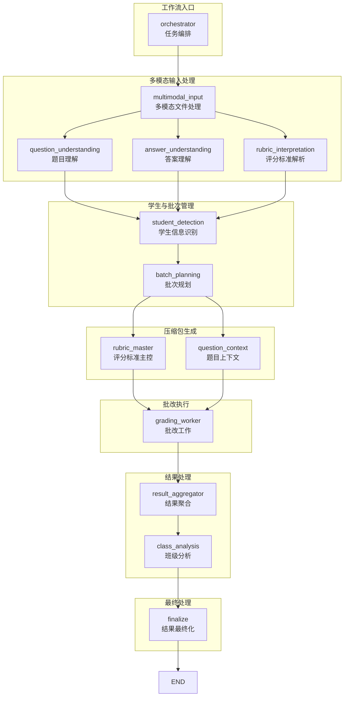
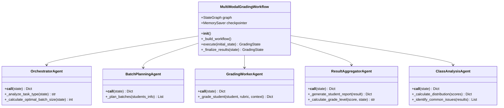

现在我有了足够的信息来创建全面的工作流设计文档。让我生成完整的文档：

<docs>
# 多模态批改工作流设计文档

<cite>
**本文档引用的文件**
- [workflow_multimodal.py](file://ai_correction/functions/langgraph/workflow_multimodal.py)
- [state.py](file://ai_correction/functions/langgraph/state.py)
- [checkpointer.py](file://ai_correction/functions/langgraph/checkpointer.py)
- [streaming.py](file://ai_correction/functions/langgraph/streaming.py)
- [multimodal_models.py](file://ai_correction/functions/langgraph/multimodal_models.py)
- [orchestrator_agent.py](file://ai_correction/functions/langgraph/agents/orchestrator_agent.py)
- [batch_planning_agent.py](file://ai_correction/functions/langgraph/agents/batch_planning_agent.py)
- [grading_worker_agent.py](file://ai_correction/functions/langgraph/agents/grading_worker_agent.py)
- [result_aggregator_agent.py](file://ai_correction/functions/langgraph/agents/result_aggregator_agent.py)
- [class_analysis_agent.py](file://ai_correction/functions/langgraph/agents/class_analysis_agent.py)
- [test_multimodal_grading.py](file://ai_correction/test_multimodal_grading.py)
</cite>

## 目录
1. [概述](#概述)
2. [系统架构](#系统架构)
3. [核心组件分析](#核心组件分析)
4. [工作流执行流程](#工作流执行流程)
5. [状态管理系统](#状态管理系统)
6. [检查点与恢复机制](#检查点与恢复机制)
7. [流式执行与进度监控](#流式执行与进度监控)
8. [单例模式实现](#单例模式实现)
9. [调试与扩展指南](#调试与扩展指南)
10. [最佳实践](#最佳实践)

## 概述

多模态批改工作流是一个基于LangGraph状态机的复杂AI批改系统，采用深度协作的8个Agent架构，实现了从多模态文件输入到最终结果输出的完整批改流程。该系统的核心特性包括：

- **深度协作架构**：8个专门Agent协同工作，每个Agent负责特定的功能模块
- **多模态处理能力**：支持文本、图片、PDF等多种文件格式的统一处理
- **批次并行处理**：基于学生数量智能规划批次，实现高效的并行批改
- **Token极致优化**：通过压缩包机制减少重复计算，优化LLM调用成本
- **流式执行监控**：实时跟踪执行进度，支持断点续传和错误恢复

## 系统架构

### 整体架构图

**图表来源**
- [workflow_multimodal.py](file://ai_correction/functions/langgraph/workflow_multimodal.py#L39-L74)

### Agent协作关系图

**图表来源**
- [workflow_multimodal.py](file://ai_correction/functions/langgraph/workflow_multimodal.py#L39-L74)
- [orchestrator_agent.py](file://ai_correction/functions/langgraph/agents/orchestrator_agent.py#L15-L130)
- [batch_planning_agent.py](file://ai_correction/functions