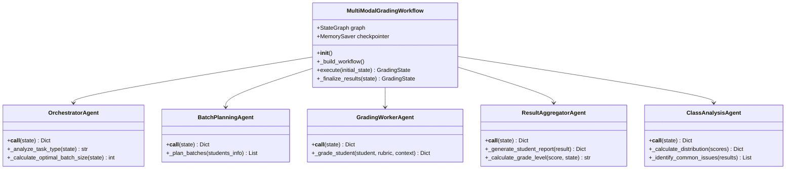

# 工作流设计

<cite>
**本文档引用的文件**
- [workflow_multimodal.py](file://ai_correction/functions/langgraph/workflow_multimodal.py)
- [state.py](file://ai_correction/functions/langgraph/state.py)
- [checkpointer.py](file://ai_correction/functions/langgraph/checkpointer.py)
- [streaming.py](file://ai_correction/functions/langgraph/streaming.py)
- [multimodal_models.py](file://ai_correction/functions/langgraph/multimodal_models.py)
- [orchestrator_agent.py](file://ai_correction/functions/langgraph/agents/orchestrator_agent.py)
- [batch_planning_agent.py](file://ai_correction/functions/langgraph/agents/batch_planning_agent.py)
- [grading_worker_agent.py](file://ai_correction/functions/langgraph/agents/grading_worker_agent.py)
- [result_aggregator_agent.py](file://ai_correction/functions/langgraph/agents/result_aggregator_agent.py)
- [class_analysis_agent.py](file://ai_correction/functions/langgraph/agents/class_analysis_agent.py)
- [test_multimodal_grading.py](file://ai_correction/test_multimodal_grading.py)
</cite>

## 目录
1. [概述](#概述)
2. [系统架构](#系统架构)
3. [核心组件分析](#核心组件分析)
4. [工作流执行流程](#工作流执行流程)
5. [状态管理系统](#状态管理系统)
6. [检查点与恢复机制](#检查点与恢复机制)
7. [流式执行与进度监控](#流式执行与进度监控)
8. [单例模式实现](#单例模式实现)
9. [调试与扩展指南](#调试与扩展指南)
10. [最佳实践](#最佳实践)

## 概述

多模态批改工作流是一个基于LangGraph状态机的复杂AI批改系统，采用深度协作的8个Agent架构，实现了从多模态文件输入到最终结果输出的完整批改流程。该系统的核心特性包括：

- **深度协作架构**：8个专门Agent协同工作，每个Agent负责特定的功能模块
- **多模态处理能力**：支持文本、图片、PDF等多种文件格式的统一处理
- **批次并行处理**：基于学生数量智能规划批次，实现高效的并行批改
- **Token极致优化**：通过压缩包机制减少重复计算，优化LLM调用成本
- **流式执行监控**：实时跟踪执行进度，支持断点续传和错误恢复

## 系统架构

### 整体架构图


**图表来源**
- [workflow_multimodal.py](file://ai_correction/functions/langgraph/workflow_multimodal.py#L39-L74)

### Agent协作关系图



**图表来源**
- [workflow_multimodal.py](file://ai_correction/functions/langgraph/workflow_multimodal.py#L39-L74)
- [orchestrator_agent.py](file://ai_correction/functions/langgraph/agents/orchestrator_agent.py#L15-L130)
- [batch_planning_agent.py](file://ai_correction/functions/langgraph/agents/batch_planning_agent.py#L15-L80)
- [grading_worker_agent.py](file://ai_correction/functions/langgraph/agents/grading_worker_agent.py#L20-L100)
- [result_aggregator_agent.py](file://ai_correction/functions/langgraph/agents/result_aggregator_agent.py#L18-L90)
- [class_analysis_agent.py](file://ai_correction/functions/langgraph/agents/class_analysis_agent.py#L15-L75)

## 核心组件分析

### MultiModalGradingWorkflow 类

`MultiModalGradingWorkflow` 类是整个批改系统的核心控制器，负责构建和管理基于LangGraph的状态机工作流。

**类结构与初始化**

```python
class MultiModalGradingWorkflow:
    def __init__(self):
        self.graph = None
        self.checkpointer = MemorySaver()
        self._build_workflow()
```

该类在初始化时创建一个 `MemorySaver` 检查点实例，并立即调用 `_build_workflow()` 方法构建完整的工作流图。

**工作流构建方法**

`_build_workflow()` 方法通过 `StateGraph(GradingState)` 创建状态图，并按执行顺序添加11个节点（Node），形成有向无环图（DAG）。每个节点对应一个专门的Agent或函数。

```python
workflow.add_node("orchestrator", OrchestratorAgent())
workflow.add_node("multimodal_input", MultiModalInputAgent())
# ... 其他节点
workflow.add_node("finalize", self._finalize_results)
```

节点间的边（Edge）定义了执行顺序和数据流。例如，`orchestrator` 节点执行完成后，会并行触发 `multimodal_input`、`question_understanding` 等节点。

### GradingState 状态模型

`GradingState` 定义了工作流中所有节点共享的状态数据结构，采用 `TypedDict` 实现类型安全。

**核心字段分类**

- **基础任务信息**: `task_id`, `user_id`, `assignment_id`
- **文件信息**: `question_files`, `answer_files`, `marking_files`
- **多模态文件信息**: `question_multimodal_files`, `answer_multimodal_files`, `marking_multimodal_files`
- **批改参数**: `strictness_level`, `language`, `mode`
- **理解结果**: `question_understanding`, `answer_understanding`, `rubric_understanding`
- **深度协作字段**: `students_info`, `batches_info`, `batch_rubric_packages`, `grading_results`
- **处理状态**: `current_step`, `progress_percentage`, `completion_status`

**状态演化示例**

初始状态仅包含文件路径和基本参数。随着工作流执行，各节点会逐步填充状态：
1. `multimodal_input` 节点填充 `question_multimodal_files` 等字段
2. `question_understanding` 节点填充 `question_understanding` 字段
3. `student_detection` 节点填充 `students_info` 字段
4. `grading_worker` 节点填充 `grading_results` 字段

## 工作流执行流程

### 执行入口与初始化

工作流通过 `execute` 方法启动，接收一个 `GradingState` 类型的初始状态。

```python
async def execute(self, initial_state: GradingState) -> GradingState:
    # 初始化必要字段
    if 'students_info' not in initial_state:
        initial_state['students_info'] = []
    # ... 其他字段初始化
    initial_state['progress_percentage'] = 0.0
    initial_state['completion_status'] = "in_progress"
```

该方法确保所有关键字段都存在，避免后续节点因缺少字段而报错。

### 执行阶段详解

#### 1. 编排与输入处理阶段

- **orchestrator**: 任务编排节点，分析任务类型并决定执行策略
- **multimodal_input**: 多模态文件处理节点，将输入文件转换为统一的 `MultiModalFile` 格式

#### 2. 并行理解阶段

此阶段三个节点并行执行，充分利用LLM的并行处理能力：

- **question_understanding**: 题目理解，提取题目要求、关键概念和难度
- **answer_understanding**: 答案理解，分析学生答案的结构和关键点
- **rubric_interpretation**: 评分标准解析，将评分标准结构化为 `RubricUnderstanding` 模型

#### 3. 学生识别与批次规划

- **student_detection**: 学生信息识别，从答案文件中提取学生姓名、学号等信息
- **batch_planning**: 批次规划，根据学生数量和题目复杂度，将学生分组为多个批次

#### 4. 压缩包生成阶段

为优化Token使用，系统在此阶段生成两个关键压缩包：

- **rubric_master**: 评分标准主控，生成 `RubricPackage`，包含压缩版评分点和决策树
- **question_context**: 题目上下文，生成 `QuestionContextPackage`，包含压缩版题目和关键公式

#### 5. 批改执行与结果聚合

- **grading_worker**: 批改工作节点，接收批次信息和两个压缩包，对每个学生进行批改
- **result_aggregator**: 结果聚合节点，将所有批次的批改结果汇总，生成学生报告

#### 6. 班级分析与最终化

- **class_analysis**: 班级分析节点，计算班级平均分、分数分布和常见错误
- **finalize**: 最终化节点，标记任务完成，生成最终摘要

## 状态管理系统

### 状态定义与扩展

`GradingState` 作为中心化的状态容器，贯穿整个工作流生命周期。其设计遵循以下原则：

- **向前兼容**: 保留 `ocr_results` 等已废弃字段，确保旧代码兼容
- **模块化扩展**: 通过 `students_info`, `batches_info` 等字段支持新功能
- **类型安全**: 使用 `TypedDict` 明确定义字段类型，减少运行时错误

### 状态流转机制

LangGraph通过 `astream` 方法实现状态流转。每个节点返回一个状态更新字典，框架自动将其合并到全局状态中。

```python
async for state in self.graph.astream(initial_state, config):
    # state 格式: {node_name: state_update}
    current_node = list(state.keys())[0]
    # 更新全局状态
    final_state = state
```

这种机制确保了状态的一致性和可追溯性。

## 检查点与恢复机制

### Checkpointer 工厂模式

系统通过 `CheckpointerFactory` 实现检查点的灵活配置：

```python
class CheckpointerFactory:
    def get_checkpointer(self):
        if self.environment == 'production':
            return self._create_postgres_checkpointer()
        else:
            return self._create_memory_checkpointer()
```

该工厂根据环境变量自动选择 `PostgresSaver`（生产环境）或 `MemorySaver`（开发/测试环境）。

### 持久化与恢复

`CheckpointManager` 提供了完整的检查点管理功能：

- **保存**: `save_checkpoint(task_id, state)` 将当前状态持久化
- **加载**: `load_checkpoint(task_id)` 从持久化存储恢复状态
- **列表**: `list_checkpoints()` 查看所有检查点
- **删除**: `delete_checkpoint(task_id)` 清理过期检查点

这使得长时间运行的批改任务可以在中断后从断点恢复。

## 流式执行与进度监控

### ProgressMonitor 进度监控器

`ProgressMonitor` 类负责将工作流的内部状态转换为外部可消费的进度事件。

```python
class ProgressEvent(Enum):
    STARTED = "started"
    STEP_STARTED = "step_started"
    PROGRESS_UPDATE = "progress_update"
    # ... 其他事件类型
```

它通过监听 `astream` 的输出，生成标准化的进度事件，便于前端展示。

### 多通道推送支持

系统提供了多种进度推送方式：

- **WebSocketProgressPusher**: 通过WebSocket实时推送进度到前端
- **SSEProgressPusher**: 通过Server-Sent Events推送，适用于HTTP长连接
- **自定义回调**: 支持用户传入回调函数处理进度事件

```python
monitor = ProgressMonitor(callback=websocket_pusher.push_event)
async for event in monitor.monitor_stream(graph, initial_state, config):
    await websocket.send_json(event)
```

## 单例模式实现

### 全局实例管理

系统通过模块级变量 `_workflow_instance` 和 `get_multimodal_workflow()` 函数实现单例模式：

```python
_workflow_instance = None

def get_multimodal_workflow() -> MultiModalGradingWorkflow:
    global _workflow_instance
    if _workflow_instance is None:
        _workflow_instance = MultiModalGradingWorkflow()
    return _workflow_instance
```

### 资源优化优势

单例模式带来以下优势：

- **内存效率**: 避免重复创建大型对象（如LLM客户端、状态图）
- **状态一致性**: 所有调用共享同一个工作流实例，确保状态同步
- **初始化开销分摊**: 复杂的初始化过程（如Agent加载）只执行一次

## 调试与扩展指南

### 添加新节点

要添加新节点，需执行以下步骤：

1. 创建新的Agent类
2. 在 `_build_workflow()` 中添加节点
3. 在状态图中连接边

```python
# 1. 添加新节点
workflow.add_node("new_agent", NewAgent())
# 2. 连接边
workflow.add_edge("previous_node", "new_agent")
workflow.add_edge("new_agent", "next_node")
```

### 修改条件路由

LangGraph支持基于条件的动态路由。可通过 `add_conditional_edges` 方法实现：

```python
def should_continue(state: GradingState):
    return "continue" if state['score'] > 60 else "end"

workflow.add_conditional_edges(
    "grading_worker",
    should_continue,
    {
        "continue": "additional_review",
        "end": "result_aggregator"
    }
)
```

### 利用检查点进行调试

检查点是调试长流程工作流的有力工具：

```python
# 1. 列出所有检查点
checkpoints = await checkpoint_manager.list_checkpoints(task_id)
# 2. 加载特定检查点进行调试
state = await checkpoint_manager.load_checkpoint(task_id)
# 3. 从该点重新执行
final_state = await workflow.execute(state)
```

## 最佳实践

### 错误处理

在 `execute` 方法中实现全面的异常处理，确保任何阶段的失败都能被捕获并记录：

```python
except Exception as e:
    error_msg = f"工作流执行失败: {str(e)}"
    logger.error(error_msg)
    initial_state['errors'].append({
        'step': 'workflow_execution',
        'error': error_msg,
        'timestamp': str(datetime.now())
    })
    return initial_state
```

### 性能优化

- **Token优化**: 通过 `RubricPackage` 和 `QuestionContextPackage` 减少重复的上下文传输
- **并行处理**: 利用批次规划实现学生间的并行批改
- **缓存机制**: 对频繁访问的数据（如评分标准）进行缓存

### 可维护性设计

- **清晰的职责划分**: 每个Agent只负责一个明确的功能
- **类型注解**: 全面使用类型提示，提高代码可读性
- **日志记录**: 在关键节点添加详细日志，便于问题追踪