# 执行流程控制

<cite>
**本文档引用的文件**
- [workflow_multimodal.py](file://ai_correction/functions/langgraph/workflow_multimodal.py)
- [state.py](file://ai_correction/functions/langgraph/state.py)
- [checkpointer.py](file://ai_correction/functions/langgraph/checkpointer.py)
- [streaming.py](file://ai_correction/functions/langgraph/streaming.py)
- [routing.py](file://ai_correction/functions/langgraph/routing.py)
- [workflow.py](file://ai_correction/functions/langgraph/workflow.py)
- [test_multimodal_grading.py](file://ai_correction/test_multimodal_grading.py)
</cite>

## 目录
1. [概述](#概述)
2. [核心架构](#核心架构)
3. [MultiModalGradingWorkflow 类详解](#multimodalgradingworkflow-类详解)
4. [execute 异步方法深度分析](#execute-异步方法深度分析)
5. [状态管理系统](#状态管理系统)
6. [流式执行与状态更新](#流式执行与状态更新)
7. [配置与任务隔离](#配置与任务隔离)
8. [日志记录与追踪](#日志记录与追踪)
9. [异常处理机制](#异常处理机制)
10. [检查点与恢复机制](#检查点与恢复机制)
11. [性能监控与超时处理](#性能监控与超时处理)
12. [调用链分析](#调用链分析)
13. [最佳实践指南](#最佳实践指南)

## 概述

MultiModalGradingWorkflow 是一个基于 LangGraph 的深度协作多模态批改工作流系统，采用状态机模式实现复杂的批改流程控制。该系统通过异步执行、流式处理、状态持久化和智能路由等机制，实现了高效、可靠、可监控的批改服务。

### 核心特性

- **深度协作架构**：8个专业Agent协同工作，支持并行处理
- **多模态处理**：原生支持图像、文本、音频等多种文件格式
- **状态持久化**：基于检查点的完整状态恢复机制
- **流式执行**：实时进度监控和状态更新
- **智能路由**：根据条件动态调整执行路径
- **异常恢复**：完善的错误处理和重试机制

## 核心架构

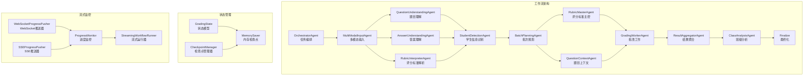

**图表来源**
- [workflow_multimodal.py](file://ai_correction/functions/langgraph/workflow_multimodal.py#L39-L99)

## MultiModalGradingWorkflow 类详解

MultiModalGradingWorkflow 是整个批改系统的核心控制器，负责协调各个Agent的执行和状态管理。

### 类结构概览

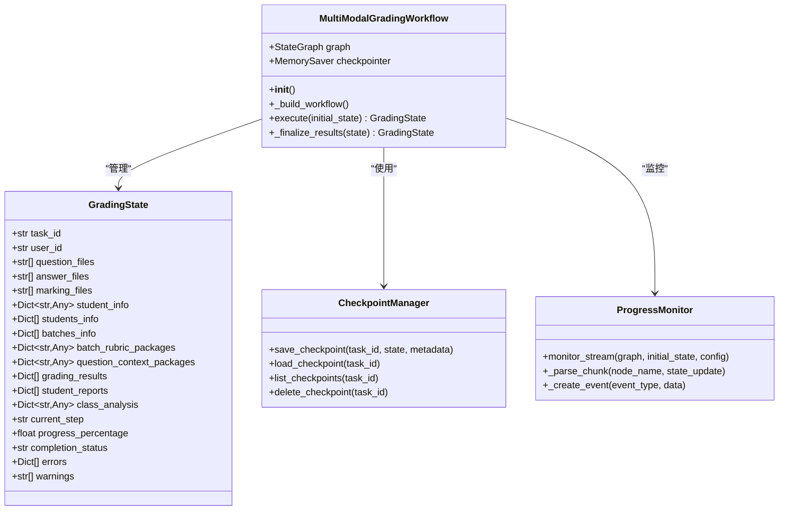

**图表来源**
- [workflow_multimodal.py](file://ai_correction/functions/langgraph/workflow_multimodal.py#L39-L265)
- [state.py](file://ai_correction/functions/langgraph/state.py#L44-L268)

**章节来源**
- [workflow_multimodal.py](file://ai_correction/functions/langgraph/workflow_multimodal.py#L39-L265)
- [state.py](file://ai_correction/functions/langgraph/state.py#L44-L268)

## execute 异步方法深度分析

`execute` 方法是工作流的核心执行引擎，负责初始化状态、执行工作流并处理异常。

### 方法签名与职责

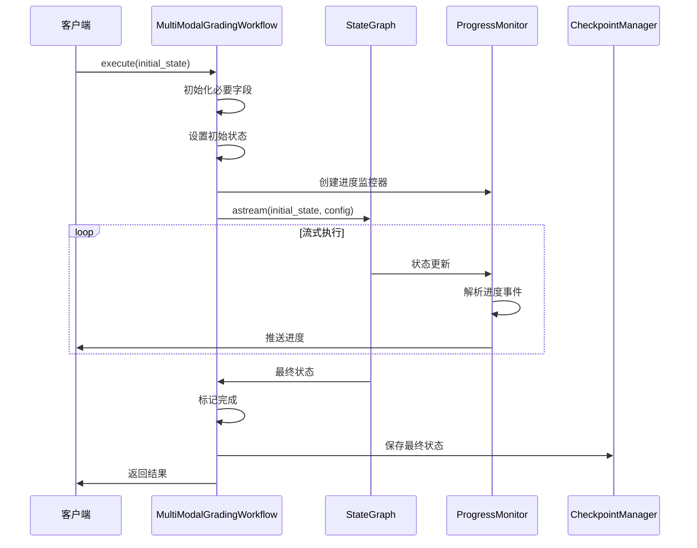

**图表来源**
- [workflow_multimodal.py](file://ai_correction/functions/langgraph/workflow_multimodal.py#L131-L216)

### 字段初始化策略

execute 方法采用防御性编程策略，确保所有必要的状态字段都被正确初始化：

#### 基础状态字段
- **错误记录**：`errors` - 存储执行过程中遇到的所有错误
- **步骤结果**：`step_results` - 记录每个步骤的执行结果
- **警告信息**：`warnings` - 存储非致命的警告信息
- **多模态文件**：`question_multimodal_files`、`answer_multimodal_files`、`marking_multimodal_files`
- **评估结果**：`criteria_evaluations` - 基于评分标准的评估结果

#### 深度协作相关字段
- **学生信息**：`students_info` - 学生基本信息列表
- **批次信息**：`batches_info` - 批次规划详细信息
- **批改包**：`batch_rubric_packages` - 批次专属评分包
- **上下文包**：`question_context_packages` - 批次专属题目上下文
- **批改结果**：`grading_results` - 所有批改的具体结果
- **学生报告**：`student_reports` - 个性化的学生报告
- **班级分析**：`class_analysis` - 班级整体分析报告

### 状态设置与进度跟踪

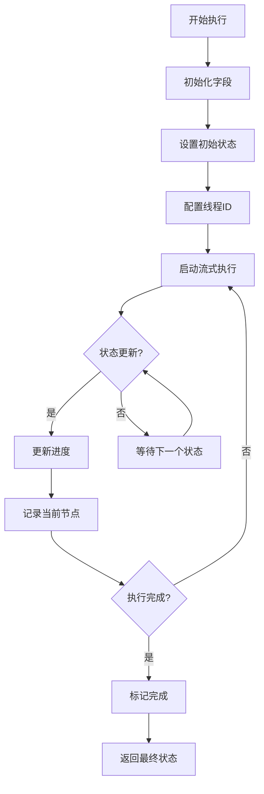

**图表来源**
- [workflow_multimodal.py](file://ai_correction/functions/langgraph/workflow_multimodal.py#L131-L216)

**章节来源**
- [workflow_multimodal.py](file://ai_correction/functions/langgraph/workflow_multimodal.py#L131-L216)

## 状态管理系统

GradingState 是整个系统的核心数据结构，包含了批改过程中的所有状态信息。

### 状态字段分类

| 字段类别 | 主要字段 | 功能描述 |
|---------|---------|---------|
| **基础信息** | `task_id`, `user_id`, `timestamp` | 任务标识和元数据 |
| **文件信息** | `question_files`, `answer_files`, `marking_files` | 原始文件路径列表 |
| **多模态数据** | `question_multimodal_files`, `mm_tokens` | 多模态处理结果 |
| **理解结果** | `question_understanding`, `answer_understanding` | AI理解输出 |
| **批改参数** | `strictness_level`, `language`, `mode` | 批改配置参数 |
| **评分标准** | `rubric_struct`, `scoring_criteria` | 结构化评分规则 |
| **批改结果** | `evaluations`, `criteria_evaluations` | 评分结果列表 |
| **深度协作** | `students_info`, `batches_info` | 协作相关信息 |
| **处理状态** | `current_step`, `progress_percentage` | 执行进度跟踪 |
| **错误记录** | `errors`, `warnings` | 错误和警告信息 |

### 状态演进流程

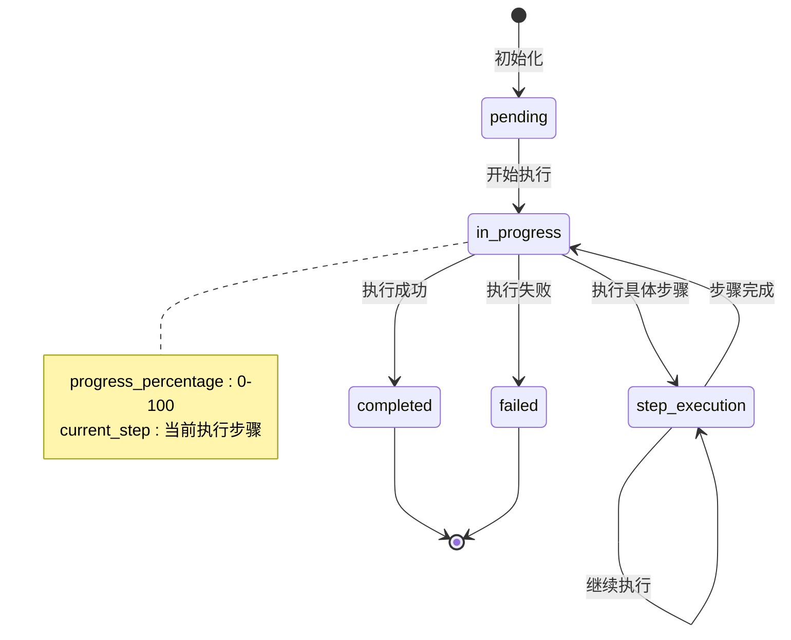

**图表来源**
- [state.py](file://ai_correction/functions/langgraph/state.py#L146-L148)

**章节来源**
- [state.py](file://ai_correction/functions/langgraph/state.py#L44-L268)

## 流式执行与状态更新

系统采用 LangGraph 的 `astream` 方法实现流式执行，能够实时获取状态更新并进行进度监控。

### astream 方法工作机制

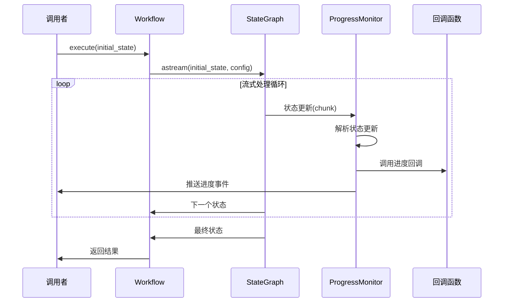

**图表来源**
- [workflow_multimodal.py](file://ai_correction/functions/langgraph/workflow_multimodal.py#L187-L200)
- [streaming.py](file://ai_correction/functions/langgraph/streaming.py#L47-L110)

### 状态更新解析

ProgressMonitor 类负责解析来自 `astream` 的状态更新：

#### 事件类型识别
- **STEP_STARTED**：步骤开始事件
- **PROGRESS_UPDATE**：进度更新事件  
- **ERROR**：错误事件
- **STEP_COMPLETED**：步骤完成事件
- **COMPLETED**：执行完成事件
- **FAILED**：执行失败事件

#### 状态解析逻辑

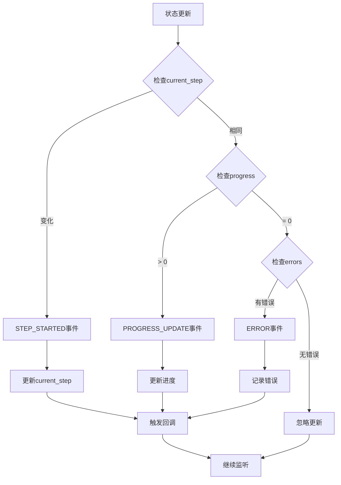

**图表来源**
- [streaming.py](file://ai_correction/functions/langgraph/streaming.py#L111-L153)

**章节来源**
- [streaming.py](file://ai_correction/functions/langgraph/streaming.py#L47-L153)

## 配置与任务隔离

系统通过 configurable 配置实现任务级别的隔离，确保不同任务之间的状态不会相互干扰。

### configurable 配置机制

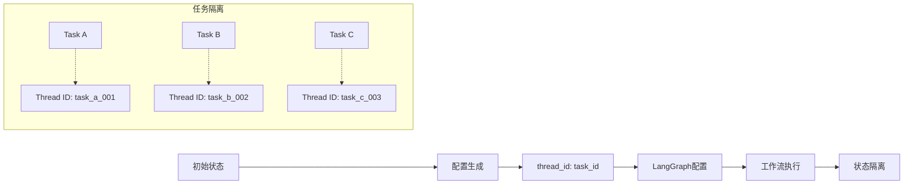

**图表来源**
- [workflow_multimodal.py](file://ai_correction/functions/langgraph/workflow_multimodal.py#L187-L188)

### 任务隔离实现

#### Thread ID 生成策略
- **默认值**：如果 `task_id` 不存在，使用 `'default'`
- **唯一性**：确保每个任务都有唯一的 thread_id
- **持久性**：thread_id 在整个执行周期内保持不变

#### 隔离机制
1. **状态隔离**：每个 thread_id 对应独立的状态空间
2. **检查点隔离**：检查点按 thread_id 分组存储
3. **并发安全**：LangGraph 自动保证并发访问的安全性

### configurable 配置示例

```python
# 配置示例
config = {
    "configurable": {
        "thread_id": "task_12345_abcde",
        "metadata": {
            "user_id": "user_67890",
            "priority": "high",
            "created_at": "2024-01-01T12:00:00Z"
        }
    }
}

# 执行工作流
async for state in graph.astream(initial_state, config=config):
    # 实时状态更新
    pass
```

**章节来源**
- [workflow_multimodal.py](file://ai_correction/functions/langgraph/workflow_multimodal.py#L187-L188)

## 日志记录与追踪

系统实现了完整的日志记录和追踪机制，支持调试、监控和故障排查。

### 日志层级结构

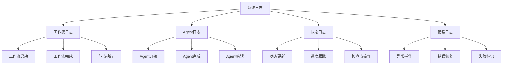

**图表来源**
- [workflow_multimodal.py](file://ai_correction/functions/langgraph/workflow_multimodal.py#L133-L216)

### 关键日志事件

#### 工作流生命周期日志
- **工作流启动**：记录任务ID和初始状态
- **节点执行**：记录当前执行的Agent节点
- **工作流完成**：记录最终结果和处理时间
- **异常发生**：记录错误详情和恢复策略

#### 状态变更日志
- **状态初始化**：记录所有字段的初始值
- **进度更新**：记录执行进度和当前步骤
- **错误记录**：记录错误发生的时间和上下文
- **警告信息**：记录非致命问题和建议

### 日志格式规范

```python
# 工作流启动日志
logger.info(f"🚀 开始执行多模态批改工作流，任务ID: {task_id}")

# 节点执行日志  
logger.info(f"📍 当前节点: {current_node}")

# 工作流完成日志
logger.info(f"✅ 工作流执行完成，总分: {total_score}")

# 错误日志
logger.error(f"工作流执行失败: {error_message}")
```

**章节来源**
- [workflow_multimodal.py](file://ai_correction/functions/langgraph/workflow_multimodal.py#L133-L216)

## 异常处理机制

系统实现了多层次的异常处理机制，确保在各种异常情况下都能保持状态的完整性和系统的稳定性。

### 异常处理层次

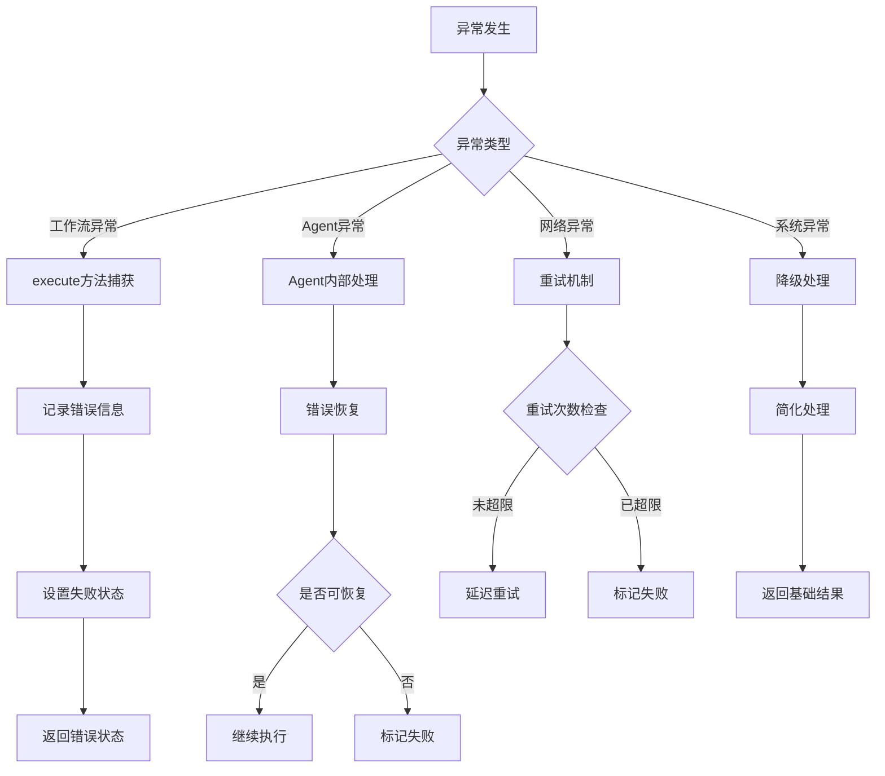

**图表来源**
- [workflow_multimodal.py](file://ai_correction/functions/langgraph/workflow_multimodal.py#L201-L216)

### 异常处理策略

#### 1. 工作流级别异常处理
在 `execute` 方法中捕获所有异常，确保状态的完整性：

```python
try:
    # 工作流执行逻辑
    final_state = await self.graph.astream(initial_state, config)
except Exception as e:
    # 异常处理
    error_msg = f"工作流执行失败: {str(e)}"
    logger.error(error_msg)
    
    # 设置失败状态
    initial_state['completion_status'] = "failed"
    initial_state['errors'].append({
        'step': 'workflow_execution',
        'error': error_msg,
        'timestamp': str(datetime.now())
    })
    
    return initial_state
```

#### 2. Agent级别异常处理
每个Agent都应该有自己的异常处理逻辑，实现局部恢复：

```python
# Agent内部异常处理示例
try:
    result = await self.process(state)
    return result
except TimeoutError:
    logger.warning("Agent处理超时，尝试重试")
    return await self.retry_with_fallback(state)
except Exception as e:
    logger.error(f"Agent执行失败: {e}")
    state['errors'].append({
        'step': self.name,
        'error': str(e),
        'timestamp': str(datetime.now())
    })
    return state
```

#### 3. 错误路由机制
系统提供了智能的错误路由机制，根据错误类型决定处理策略：

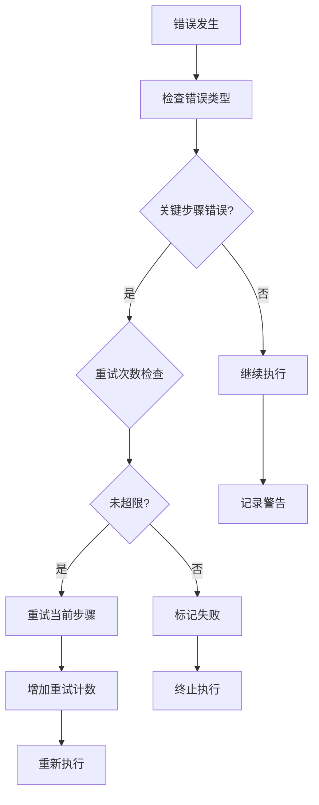

**图表来源**
- [routing.py](file://ai_correction/functions/langgraph/routing.py#L156-L191)

### 异常恢复策略

#### 1. 自动重试机制
对于临时性错误（如网络超时、模型响应慢），系统支持自动重试：

```python
# 重试配置
MAX_RETRIES = 3
RETRY_DELAY = 2  # 秒

# 重试逻辑
async def execute_with_retry(self, state: GradingState):
    for attempt in range(MAX_RETRIES):
        try:
            return await self.execute(state)
        except Exception as e:
            if attempt < MAX_RETRIES - 1:
                await asyncio.sleep(RETRY_DELAY * (attempt + 1))
                continue
            raise e
```

#### 2. 降级处理
当某些功能不可用时，系统会自动切换到降级模式：

```python
# 降级处理示例
if not self.is_advanced_feature_available():
    state['mode'] = 'efficient'  # 切换到高效模式
    state['warnings'].append("高级功能不可用，已切换到高效模式")
```

**章节来源**
- [workflow_multimodal.py](file://ai_correction/functions/langgraph/workflow_multimodal.py#L201-L216)
- [routing.py](file://ai_correction/functions/langgraph/routing.py#L156-L191)

## 检查点与恢复机制

系统提供了完整的状态持久化和恢复机制，支持长时间运行的任务和意外中断后的恢复。

### 检查点架构

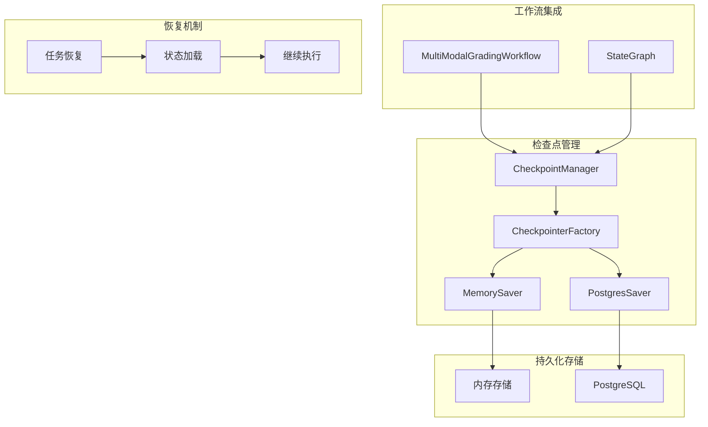

**图表来源**
- [checkpointer.py](file://ai_correction/functions/langgraph/checkpointer.py#L23-L246)

### 检查点工厂模式

CheckpointerFactory 根据环境自动选择合适的存储后端：

#### 环境配置策略
- **生产环境**：使用 PostgreSQL 存储，支持高可用和数据持久化
- **开发环境**：优先尝试 PostgreSQL，失败则回退到内存存储
- **测试环境**：强制使用内存存储，便于快速测试

#### 存储后端特性对比

| 特性 | MemorySaver | PostgresSaver |
|------|-------------|---------------|
| **持久性** | ❌ 内存中，重启丢失 | ✅ 持久化存储 |
| **并发性** | ❌ 不支持并发 | ✅ 支持并发访问 |
| **可靠性** | ❌ 易丢失 | ✅ 高可靠性 |
| **性能** | ✅ 极快 | ⚠️ 中等 |
| **部署复杂度** | ✅ 无依赖 | ⚠️ 需要数据库 |

### 检查点管理器

CheckpointManager 提供了统一的检查点管理接口：

#### 核心功能
- **保存检查点**：自动保存当前状态
- **加载检查点**：从持久化存储加载状态
- **列表检查点**：列出可用的检查点
- **删除检查点**：清理过期的检查点

#### 检查点生命周期

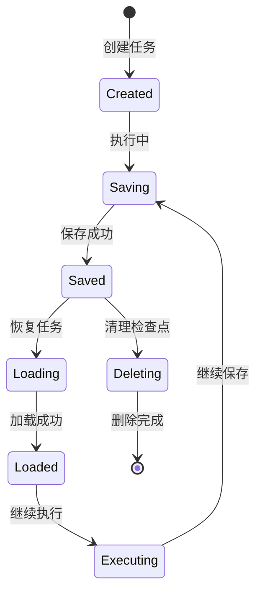

### 恢复机制实现

#### 自动恢复流程
1. **任务启动**：检查是否存在对应的检查点
2. **状态加载**：从检查点恢复完整状态
3. **继续执行**：从上次中断的地方继续执行
4. **状态更新**：定期保存新的检查点

#### 手动恢复示例

```python
# 检查点管理器使用示例
manager = CheckpointManager(get_checkpointer())

# 保存检查点
await manager.save_checkpoint(
    task_id="task_12345",
    state=current_state,
    metadata={"step": "batch_planning"}
)

# 加载检查点
loaded_state = await manager.load_checkpoint("task_12345")

# 列出所有检查点
checkpoints = await manager.list_checkpoints("task_12345")

# 删除检查点
await manager.delete_checkpoint("task_12345")
```

**章节来源**
- [checkpointer.py](file://ai_correction/functions/langgraph/checkpointer.py#L23-L246)

## 性能监控与超时处理

系统提供了全面的性能监控和超时处理机制，确保批改任务在合理时间内完成。

### 性能监控体系

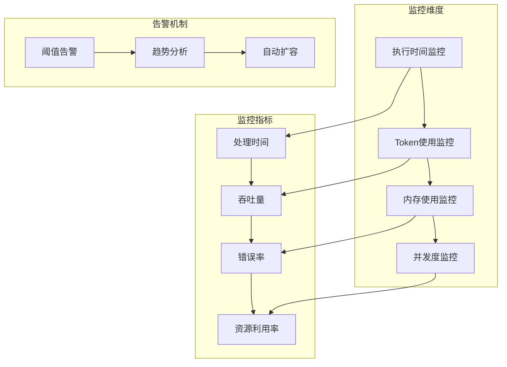

### 超时处理策略

#### 1. 任务级别超时
```python
import asyncio

async def execute_with_timeout(workflow, state, timeout=3600):
    """带超时的执行"""
    try:
        return await asyncio.wait_for(
            workflow.execute(state),
            timeout=timeout  # 1小时超时
        )
    except asyncio.TimeoutError:
        logger.error(f"任务执行超时，任务ID: {state.get('task_id')}")
        state['errors'].append({
            'step': 'timeout',
            'error': f'执行超时 ({timeout}秒)',
            'timestamp': str(datetime.now())
        })
        return state
```

#### 2. Agent级别超时
```python
async def execute_with_agent_timeout(agent, state, timeout=300):
    """单个Agent的超时控制"""
    try:
        return await asyncio.wait_for(agent(state), timeout=timeout)
    except asyncio.TimeoutError:
        logger.warning(f"Agent执行超时: {agent.__name__}")
        state['errors'].append({
            'step': agent.__name__,
            'error': f'Agent执行超时 ({timeout}秒)',
            'timestamp': str(datetime.now())
        })
        return state
```

### 性能优化策略

#### 1. Token优化
系统实现了多种Token优化技术：

```python
# 状态压缩 - 减少不必要的字段
def compress_state_for_scoring(state: GradingState) -> GradingState:
    """压缩状态以减少Token使用"""
    compressed_state = state.copy()
    
    # 只保留评分必需的字段
    essential_fields = [
        'task_id', 'user_id', 'mode', 'strictness_level', 'language',
        'question_files', 'answer_files', 'marking_files',
        'rubric_data', 'scoring_criteria'
    ]
    
    # 截断长文本内容
    if 'ocr_results' in compressed_state:
        for key, content in compressed_state['ocr_results'].items():
            if isinstance(content, str) and len(content) > 1000:
                compressed_state['ocr_results'][key] = content[:1000] + "...[截断]"
    
    return compressed_state
```

#### 2. 并行处理优化
```python
# 并行批次处理
async def process_batches_in_parallel(batches, worker_func):
    """并行处理多个批次"""
    tasks = []
    for batch in batches:
        task = asyncio.create_task(worker_func(batch))
        tasks.append(task)
    
    # 等待所有任务完成
    results = await asyncio.gather(*tasks, return_exceptions=True)
    
    # 处理异常结果
    successful_results = []
    for i, result in enumerate(results):
        if isinstance(result, Exception):
            logger.error(f"批次{i}处理失败: {result}")
        else:
            successful_results.append(result)
    
    return successful_results
```

#### 3. 缓存机制
```python
# OCR结果缓存
@lru_cache(maxsize=100)
def cached_ocr_processing(file_path: str) -> Dict:
    """缓存OCR处理结果"""
    # 实际的OCR处理逻辑
    pass

# 文件哈希缓存
_file_hash_cache = {}

def get_file_hash(file_path: str) -> str:
    """获取文件哈希值用于缓存"""
    if file_path not in _file_hash_cache:
        # 计算文件哈希
        _file_hash_cache[file_path] = calculate_hash(file_path)
    return _file_hash_cache[file_path]
```

**章节来源**
- [workflow.py](file://ai_correction/functions/langgraph/workflow.py#L221-L238)
- [workflow.py](file://ai_correction/functions/langgraph/workflow.py#L240-L246)

## 调用链分析

系统提供了完整的调用链分析能力，从外部调用到内部执行的全过程追踪。

### 外部调用入口

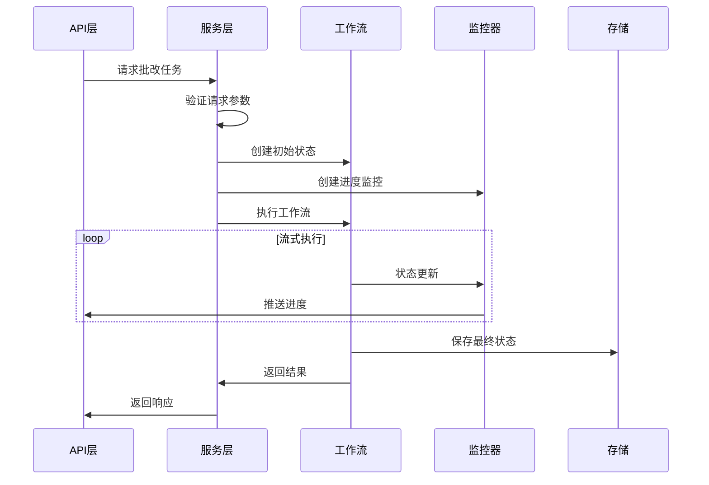

**图表来源**
- [workflow_multimodal.py](file://ai_correction/functions/langgraph/workflow_multimodal.py#L267-L373)

### run_multimodal_grading 便捷函数

`run_multimodal_grading` 是系统的主要外部入口，提供了简洁的API接口：

#### 函数签名
```python
async def run_multimodal_grading(
    task_id: str,
    user_id: str,
    question_files: list,
    answer_files: list,
    marking_files: list,
    strictness_level: str = "中等",
    language: str = "zh"
) -> Dict[str, Any]:
```

#### 参数说明
- **task_id**：唯一任务标识符
- **user_id**：用户标识符
- **question_files**：题目文件路径列表
- **answer_files**：答案文件路径列表
- **marking_files**：评分标准文件路径列表
- **strictness_level**：批改严格程度
- **language**：处理语言

#### 执行流程

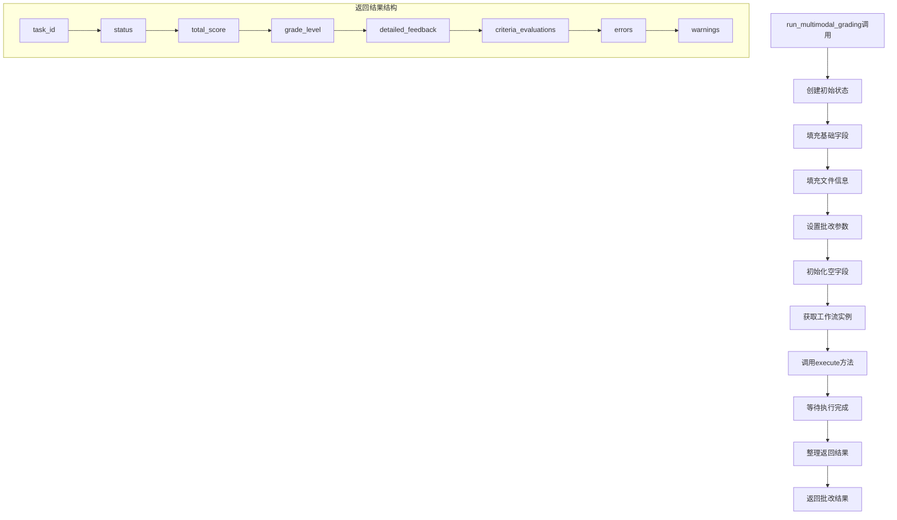

**图表来源**
- [workflow_multimodal.py](file://ai_correction/functions/langgraph/workflow_multimodal.py#L267-L373)

### 内部执行调用链

#### 1. 工作流构建阶段
```python
# 1. 创建工作流实例
workflow = MultiModalGradingWorkflow()

# 2. 构建状态图
workflow._build_workflow()

# 3. 注册Agent节点
workflow.graph.add_node("orchestrator", OrchestratorAgent())
workflow.graph.add_node("multimodal_input", MultiModalInputAgent())
# ... 其他节点

# 4. 设置执行路径
workflow.graph.set_entry_point("orchestrator")
workflow.graph.add_edge("orchestrator", "multimodal_input")
# ... 路径配置
```

#### 2. 执行阶段调用链
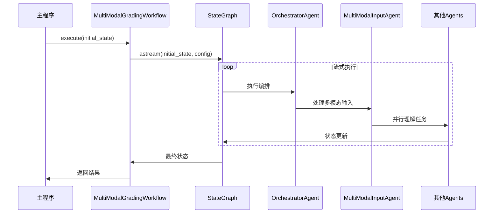

**图表来源**
- [workflow_multimodal.py](file://ai_correction/functions/langgraph/workflow_multimodal.py#L131-L216)

### 调用链监控

系统提供了完整的调用链监控能力：

#### 1. 调用链追踪
```python
# 调用链追踪装饰器
def trace_execution(func):
    @wraps(func)
    async def wrapper(*args, **kwargs):
        task_id = kwargs.get('task_id', 'unknown')
        logger.info(f"开始执行任务: {task_id}")
        
        start_time = time.time()
        try:
            result = await func(*args, **kwargs)
            duration = time.time() - start_time
            logger.info(f"任务 {task_id} 执行完成，耗时: {duration:.2f}秒")
            return result
        except Exception as e:
            duration = time.time() - start_time
            logger.error(f"任务 {task_id} 执行失败，耗时: {duration:.2f}秒, 错误: {e}")
            raise
    
    return wrapper
```

#### 2. 性能分析
```python
# 性能分析工具
class PerformanceAnalyzer:
    def __init__(self):
        self.execution_times = {}
        self.memory_usage = {}
    
    def record_start(self, task_id: str, step: str):
        """记录步骤开始时间"""
        key = f"{task_id}_{step}"
        self.execution_times[key] = time.time()
    
    def record_end(self, task_id: str, step: str):
        """记录步骤结束时间和内存使用"""
        key = f"{task_id}_{step}"
        if key in self.execution_times:
            duration = time.time() - self.execution_times[key]
            memory = psutil.Process().memory_info().rss / 1024 / 1024  # MB
            logger.info(f"步骤 {step} 完成，耗时: {duration:.2f}s, 内存: {memory:.2f}MB")
```

**章节来源**
- [workflow_multimodal.py](file://ai_correction/functions/langgraph/workflow_multimodal.py#L267-L373)

## 最佳实践指南

基于对系统的深入分析，以下是使用 MultiModalGradingWorkflow 的最佳实践指南。

### 1. 状态初始化最佳实践

#### 完整状态初始化模板
```python
def create_initial_state(
    task_id: str,
    user_id: str,
    question_files: List[str],
    answer_files: List[str],
    marking_files: List[str],
    **kwargs
) -> GradingState:
    """创建完整的初始状态"""
    return GradingState(
        task_id=task_id,
        user_id=user_id,
        assignment_id=f"assignment_{task_id}",
        timestamp=datetime.now(),
        question_files=question_files,
        answer_files=answer_files,
        marking_files=marking_files,
        images=[],  # 图片文件列表
        strictness_level=kwargs.get('strictness_level', '中等'),
        language=kwargs.get('language', 'zh'),
        mode=kwargs.get('mode', 'efficient'),
        
        # 多模态字段
        question_multimodal_files=[],
        answer_multimodal_files=[],
        marking_multimodal_files=[],
        question_understanding=None,
        answer_understanding=None,
        rubric_understanding=None,
        criteria_evaluations=[],
        
        # 深度协作字段
        students_info=[],
        batches_info=[],
        batch_rubric_packages={},
        question_context_packages={},
        grading_results=[],
        student_reports=[],
        class_analysis={},
        
        # 处理状态
        current_step="初始化",
        progress_percentage=0.0,
        completion_status="pending",
        completed_at="",
        
        # 错误和警告
        errors=[],
        warnings=[],
        step_results={},
        
        # 结果字段
        total_score=0.0,
        section_scores={},
        final_score=0.0,
        grade_level="",
        processing_time=0.0,
        model_versions={},
        quality_metrics={}
    )
```

### 2. 异常处理最佳实践

#### 分层异常处理策略
```python
class GradingWorkflowException(Exception):
    """批改工作流异常基类"""
    def __init__(self, step: str, error: str, task_id: str = None):
        self.step = step
        self.error = error
        self.task_id = task_id
        super().__init__(f"[{step}] {error}")

async def robust_workflow_execution(
    workflow: MultiModalGradingWorkflow,
    state: GradingState,
    max_retries: int = 3
) -> GradingState:
    """健壮的工作流执行"""
    for attempt in range(max_retries):
        try:
            # 创建进度监控
            monitor = ProgressMonitor()
            runner = StreamingWorkflowRunner(workflow.graph, monitor)
            
            # 执行工作流
            result = await runner.run_with_progress(state)
            
            # 检查执行结果
            if result.get('completion_status') == 'completed':
                return result
            elif result.get('completion_status') == 'failed':
                raise GradingWorkflowException(
                    step=result.get('current_step', 'unknown'),
                    error=str(result.get('errors', [])),
                    task_id=state.get('task_id')
                )
                
        except GradingWorkflowException as e:
            logger.error(f"工作流执行失败 (尝试 {attempt + 1}/{max_retries}): {e}")
            
            if attempt < max_retries - 1:
                # 等待重试
                await asyncio.sleep(2 ** attempt)
                continue
            else:
                # 最后一次尝试失败，记录详细错误
                state['errors'].append({
                    'step': e.step,
                    'error': e.error,
                    'task_id': e.task_id,
                    'timestamp': str(datetime.now())
                })
                return state
                
        except Exception as e:
            logger.error(f"未知错误: {e}")
            state['errors'].append({
                'step': 'unknown',
                'error': str(e),
                'timestamp': str(datetime.now())
            })
            return state
```

### 3. 性能优化最佳实践

#### 1. 并行处理优化
```python
async def parallel_batch_processing(
    workflow: MultiModalGradingWorkflow,
    batches: List[Dict],
    batch_size: int = 5
) -> List[Dict]:
    """批量并行处理优化"""
    
    # 分组处理
    batch_groups = [
        batches[i:i + batch_size] 
        for i in range(0, len(batches), batch_size)
    ]
    
    all_results = []
    
    for group in batch_groups:
        # 并行处理当前组
        tasks = []
        for batch in group:
            task_state = create_initial_state(
                task_id=f"batch_{batch['batch_index']}",
                user_id="parallel_user",
                question_files=batch['question_files'],
                answer_files=batch['answer_files'],
                marking_files=batch['marking_files']
            )
            tasks.append(workflow.execute(task_state))
        
        # 等待组内所有任务完成
        group_results = await asyncio.gather(*tasks, return_exceptions=True)
        
        # 处理结果
        for i, result in enumerate(group_results):
            if isinstance(result, Exception):
                logger.error(f"批次 {group[i]['batch_index']} 处理失败: {result}")
            else:
                all_results.append(result)
    
    return all_results
```

#### 2. 缓存策略
```python
class GradingCache:
    """批改结果缓存"""
    def __init__(self):
        self.cache = {}
        self.cache_lock = asyncio.Lock()
    
    async def get_cached_result(self, cache_key: str) -> Optional[Dict]:
        """获取缓存结果"""
        async with self.cache_lock:
            if cache_key in self.cache:
                result = self.cache[cache_key]
                logger.info(f"缓存命中: {cache_key}")
                return result
        return None
    
    async def set_cached_result(self, cache_key: str, result: Dict):
        """设置缓存结果"""
        async with self.cache_lock:
            self.cache[cache_key] = result
            logger.info(f"缓存设置: {cache_key}")
    
    def generate_cache_key(self, state: GradingState) -> str:
        """生成缓存键"""
        file_keys = []
        for file_list in [state['question_files'], state['answer_files'], state['marking_files']]:
            file_keys.extend([Path(f).name for f in file_list])
        
        return f"grading_{hash(tuple(sorted(file_keys)))}"

# 使用示例
cache = GradingCache()

async def cached_workflow_execution(workflow, state):
    cache_key = cache.generate_cache_key(state)
    cached_result = await cache.get_cached_result(cache_key)
    
    if cached_result:
        return cached_result
    
    result = await workflow.execute(state)
    await cache.set_cached_result(cache_key, result)
    return result
```

### 4. 监控和调试最佳实践

#### 1. 完整的监控系统
```python
class GradingWorkflowMonitor:
    """批改工作流监控系统"""
    
    def __init__(self):
        self.metrics = {
            'execution_times': {},
            'success_rates': {},
            'error_counts': {},
            'resource_usage': {}
        }
    
    def record_execution_time(self, task_id: str, step: str, duration: float):
        """记录执行时间"""
        key = f"{task_id}_{step}"
        self.metrics['execution_times'][key] = duration
    
    def record_success_rate(self, task_id: str, success: bool):
        """记录成功率"""
        if success:
            self.metrics['success_rates'][task_id] = self.metrics.get('success_rates', {}).get(task_id, 0) + 1
        else:
            self.metrics['success_rates'][task_id] = 0
    
    def record_error(self, task_id: str, error_type: str):
        """记录错误"""
        if task_id not in self.metrics['error_counts']:
            self.metrics['error_counts'][task_id] = {}
        self.metrics['error_counts'][task_id][error_type] = \
            self.metrics['error_counts'][task_id].get(error_type, 0) + 1
    
    def get_dashboard_data(self) -> Dict:
        """获取监控仪表板数据"""
        return {
            'metrics': self.metrics,
            'active_tasks': len(self.metrics['execution_times']),
            'average_execution_time': sum(self.metrics['execution_times'].values()) / len(self.metrics['execution_times']) if self.metrics['execution_times'] else 0,
            'overall_success_rate': sum(v > 0 for v in self.metrics['success_rates'].values()) / len(self.metrics['success_rates']) if self.metrics['success_rates'] else 0
        }
```

#### 2. 调试工具
```python
class GradingDebugger:
    """批改工作流调试工具"""
    
    def __init__(self):
        self.debug_log = []
    
    def log_state_change(self, task_id: str, old_state: Dict, new_state: Dict):
        """记录状态变化"""
        changes = {}
        for key in set(old_state.keys()) | set(new_state.keys()):
            if old_state.get(key) != new_state.get(key):
                changes[key] = {
                    'old': old_state.get(key),
                    'new': new_state.get(key)
                }
        
        if changes:
            self.debug_log.append({
                'task_id': task_id,
                'changes': changes,
                'timestamp': str(datetime.now())
            })
    
    def export_debug_info(self, filename: str):
        """导出调试信息"""
        with open(filename, 'w', encoding='utf-8') as f:
            json.dump(self.debug_log, f, indent=2, ensure_ascii=False)
    
    def analyze_performance(self) -> Dict:
        """分析性能瓶颈"""
        slow_steps = sorted(
            [(k, v) for k, v in self.metrics['execution_times'].items() if v > 10.0],
            key=lambda x: x[1],
            reverse=True
        )
        
        return {
            'slow_steps': slow_steps[:10],  # 最慢的10个步骤
            'total_steps': len(self.metrics['execution_times']),
            'average_time': sum(self.metrics['execution_times'].values()) / len(self.metrics['execution_times']) if self.metrics['execution_times'] else 0
        }
```

### 5. 部署和运维最佳实践

#### 1. 环境配置
```python
# 生产环境配置
PRODUCTION_CONFIG = {
    'environment': 'production',
    'checkpointer': 'postgres',
    'max_concurrent_tasks': 10,
    'timeout_seconds': 3600,
    'enable_monitoring': True,
    'log_level': 'INFO'
}

# 开发环境配置
DEVELOPMENT_CONFIG = {
    'environment': 'development',
    'checkpointer': 'memory',
    'max_concurrent_tasks': 1,
    'timeout_seconds': 1800,
    'enable_monitoring': True,
    'log_level': 'DEBUG'
}
```

#### 2. 健康检查
```python
class HealthChecker:
    """健康检查服务"""
    
    def __init__(self, workflow: MultiModalGradingWorkflow):
        self.workflow = workflow
        self.health_status = {
            'workflow_ready': False,
            'checkpointer_available': False,
            'memory_available': True,
            'last_check': None
        }
    
    async def check_health(self) -> Dict:
        """执行健康检查"""
        try:
            # 检查工作流是否就绪
            self.health_status['workflow_ready'] = self.workflow.graph is not None
            
            # 检查检查点存储
            try:
                test_state = GradingState(
                    task_id='health_check',
                    user_id='system',
                    assignment_id='health_check',
                    timestamp=datetime.now(),
                    question_files=[],
                    answer_files=[],
                    marking_files=[],
                    images=[],
                    strictness_level='中等',
                    language='zh',
                    mode='efficient',
                    mm_tokens=[],
                    student_info={},
                    rubric_text='',
                    rubric_struct={},
                    rubric_data={},
                    scoring_criteria=[],
                    questions=[],
                    batches=[],
                    evaluations=[],
                    scoring_results={},
                    detailed_feedback=[],
                    annotations=[],
                    coordinate_annotations=[],
                    error_regions=[],
                    cropped_regions=[],
                    knowledge_points=[],
                    error_analysis={},
                    learning_suggestions=[],
                    difficulty_assessment={},
                    total_score=0.0,
                    section_scores={},
                    student_evaluation={},
                    class_evaluation={},
                    export_payload={},
                    final_report={},
                    export_data={},
                    visualization_data={},
                    current_step="健康检查",
                    progress_percentage=0.0,
                    completion_status="pending",
                    completed_at="",
                    errors=[],
                    warnings=[],
                    step_results={},
                    final_score=0.0,
                    grade_level="",
                    processing_time=0.0,
                    model_versions={},
                    quality_metrics={}
                )
                
                # 测试执行
                result = await self.workflow.execute(test_state)
                self.health_status['checkpointer_available'] = result.get('completion_status') == 'completed'
                
            except Exception as e:
                logger.error(f"检查点健康检查失败: {e}")
                self.health_status['checkpointer_available'] = False
            
            # 检查内存使用
            mem_info = psutil.virtual_memory()
            self.health_status['memory_available'] = mem_info.percent < 80
            
            # 更新检查时间
            self.health_status['last_check'] = str(datetime.now())
            
            return self.health_status
            
        except Exception as e:
            logger.error(f"健康检查执行失败: {e}")
            return {
                'workflow_ready': False,
                'checkpointer_available': False,
                'memory_available': False,
                'last_check': str(datetime.now()),
                'error': str(e)
            }
```

通过遵循这些最佳实践，开发者可以充分利用 MultiModalGradingWorkflow 的强大功能，构建稳定、高效、可监控的批改系统。

**章节来源**
- [workflow_multimodal.py](file://ai_correction/functions/langgraph/workflow_multimodal.py#L267-L373)
- [state.py](file://ai_correction/functions/langgraph/state.py#L44-L268)
- [checkpointer.py](file://ai_correction/functions/langgraph/checkpointer.py#L23-L246)
- [streaming.py](file://ai_correction/functions/langgraph/streaming.py#L47-L337)