# 多模态数据结构

<cite>
**本文档引用的文件**
- [multimodal_models.py](file://ai_correction/functions/langgraph/multimodal_models.py)
- [state.py](file://ai_correction/functions/langgraph/state.py)
- [workflow_multimodal.py](file://ai_correction/functions/langgraph/workflow_multimodal.py)
- [multimodal_input_agent.py](file://ai_correction/functions/langgraph/agents/multimodal_input_agent.py)
- [extract_via_mm.py](file://ai_correction/functions/langgraph/agents/extract_via_mm.py)
- [file_processor.py](file://ai_correction/functions/file_processor.py)
- [multimodal_prompts.py](file://ai_correction/functions/langgraph/prompts/multimodal_prompts.py)
- [annotation_builder.py](file://ai_correction/functions/langgraph/agents/annotation_builder.py)
</cite>

## 目录
1. [简介](#简介)
2. [项目架构概览](#项目架构概览)
3. [核心多模态数据结构](#核心多模态数据结构)
4. [MMToken详解](#mmtoken详解)
5. [多模态文件处理](#多模态文件处理)
6. [理解结果模型](#理解结果模型)
7. [工作流执行流程](#工作流执行流程)
8. [坐标系统与边界框](#坐标系统与边界框)
9. [废弃字段与替代方案](#废弃字段与替代方案)
10. [开发者指南](#开发者指南)
11. [最佳实践](#最佳实践)

## 简介

本系统是一个基于深度协作架构的多模态AI批改系统，完全摒弃了传统的OCR依赖，直接利用大语言模型的视觉能力进行多模态内容处理。该系统支持文本、图片、PDF、Word文档等多种模态的统一处理，通过MMToken等核心数据结构实现了精确的像素级坐标标注和语义理解。

## 项目架构概览

系统采用LangGraph框架构建的深度协作架构，包含8个核心Agent协同工作：

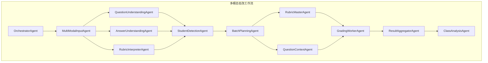

**图表来源**
- [workflow_multimodal.py](file://ai_correction/functions/langgraph/workflow_multimodal.py#L40-L85)

## 核心多模态数据结构

### MultiModalFile模型

MultiModalFile是系统中最重要的基础数据结构，用于统一表示各种类型的多模态文件：

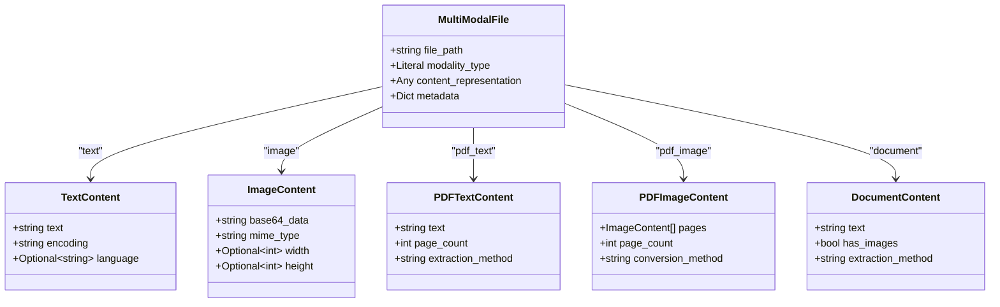

**图表来源**
- [multimodal_models.py](file://ai_correction/functions/langgraph/multimodal_models.py#L15-L100)

### 多模态状态扩展

系统在原有GradingState基础上增加了多模态相关字段：

| 字段名 | 类型 | 描述 | 用途 |
|--------|------|------|------|
| `question_multimodal_files` | List[MultiModalFile] | 多模态题目文件列表 | 存储题目相关的多模态文件 |
| `answer_multimodal_files` | List[MultiModalFile] | 多模态答案文件列表 | 存储学生答案的多模态文件 |
| `marking_multimodal_files` | List[MultiModalFile] | 多模态评分标准文件列表 | 存储评分标准的多模态文件 |
| `question_understanding` | Optional[QuestionUnderstanding] | 题目理解结果 | AI对题目的语义解析结果 |
| `answer_understanding` | Optional[AnswerUnderstanding] | 答案理解结果 | AI对答案的语义解析结果 |
| `rubric_understanding` | Optional[RubricUnderstanding] | 评分标准理解结果 | AI对评分标准的解析结果 |
| `criteria_evaluations` | List[CriteriaEvaluation] | 基于标准的评估结果列表 | 评分点级别的评估结果 |

**章节来源**
- [state.py](file://ai_correction/functions/langgraph/state.py#L35-L105)
- [multimodal_models.py](file://ai_correction/functions/langgraph/multimodal_models.py#L190-L220)

## MMToken详解

MMToken是系统的核心数据结构，代表多模态大模型返回的带像素坐标的文本片段：

### MMToken字段详解

```mermaid
classDiagram
class MMToken {
+string id : "token唯一标识"
+string text : "文本内容"
+int page : "所在页码(0-based)"
+Dict~float~ bbox : "边界框坐标{x1, y1, x2, y2}"
+float conf : "置信度 (0-1)"
+string line_id : "同一页内同一行的标识符"
}
note for MMToken "坐标系统 : 以图片左上角为原点\n置信度 : 0.0-1.0之间的数值\nline_id : 用于标识同一行的文本块"
```

**图表来源**
- [state.py](file://ai_correction/functions/langgraph/state.py#L166-L175)

### MMToken技术细节

#### 1. 文本字段 (text)
- **类型**: `string`
- **描述**: 实际提取的文本内容
- **特点**: 保持原始格式和结构，包括数学公式、特殊符号等

#### 2. 页面字段 (page)
- **类型**: `int`
- **描述**: 文本所在的页面索引（从0开始）
- **用途**: 支持多页文档的精确定位

#### 3. 边界框坐标 (bbox)
- **格式**: `Dict[str, float]`
- **字段**: `{x1, y1, x2, y2}`
- **单位**: 像素
- **原点**: 图片左上角
- **范围**: 
  - `x1, y1`: 左上角坐标
  - `x2, y2`: 右下角坐标
  - 坐标值为实际像素值

#### 4. 置信度字段 (conf)
- **类型**: `float`
- **范围**: `0.0 - 1.0`
- **含义**: 识别准确度，值越高表示识别越可靠
- **应用场景**: 
  - 质量控制
  - 错误检测
  - 后续处理决策

#### 5. 行标识符 (line_id)
- **类型**: `string`
- **格式**: `L<number>`
- **用途**: 标识同一行内的文本块，支持复杂的文本布局分析

**章节来源**
- [state.py](file://ai_correction/functions/langgraph/state.py#L166-L175)
- [extract_via_mm.py](file://ai_correction/functions/langgraph/agents/extract_via_mm.py#L264-L303)

## 多模态文件处理

### 文件处理流程

系统采用智能文件处理策略，根据文件类型和用户偏好自动选择最优处理方式：

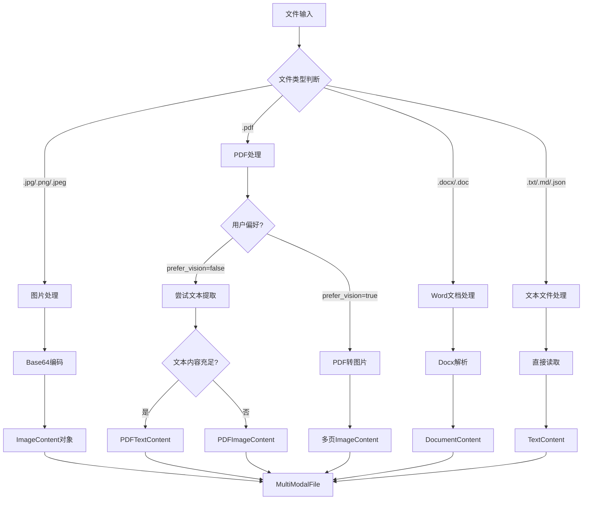

**图表来源**
- [file_processor.py](file://ai_correction/functions/file_processor.py#L40-L80)

### 支持的文件类型

| 文件类型 | 模态类型 | 处理方式 | 输出格式 |
|----------|----------|----------|----------|
| `.jpg`, `.png`, `.jpeg` | `image` | Base64编码 | `ImageContent` |
| `.pdf` (文本版) | `pdf_text` | 文本提取 | `PDFTextContent` |
| `.pdf` (扫描版) | `pdf_image` | 图片转换 | `PDFImageContent` |
| `.docx`, `.doc` | `document` | Docx解析 | `DocumentContent` |
| `.txt`, `.md`, `.json` | `text` | 直接读取 | `TextContent` |

**章节来源**
- [file_processor.py](file://ai_correction/functions/file_processor.py#L40-L120)

## 理解结果模型

### QuestionUnderstanding

题目理解结果包含AI对题目的全面语义解析：

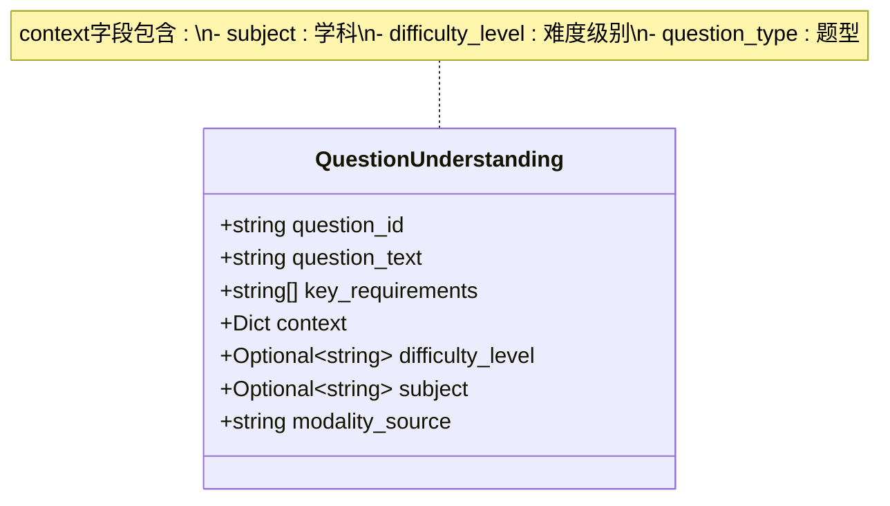

**图表来源**
- [multimodal_models.py](file://ai_correction/functions/langgraph/multimodal_models.py#L128-L137)

### AnswerUnderstanding

答案理解结果提供对学生答案的结构化分析：

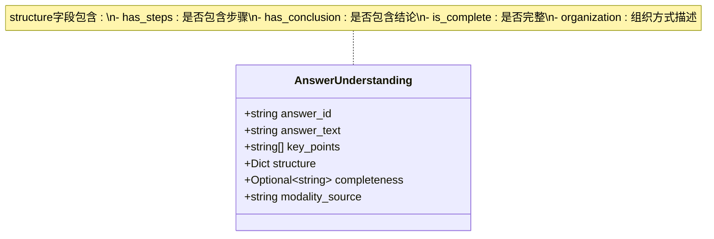

**图表来源**
- [multimodal_models.py](file://ai_correction/functions/langgraph/multimodal_models.py#L131-L139)

### RubricUnderstanding

评分标准理解结果将评分标准转化为结构化数据：

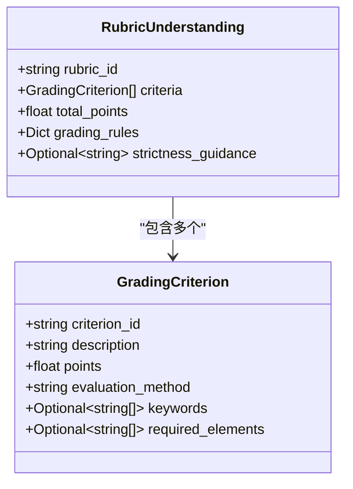

**图表来源**
- [multimodal_models.py](file://ai_correction/functions/langgraph/multimodal_models.py#L142-L155)
- [multimodal_models.py](file://ai_correction/functions/langgraph/multimodal_models.py#L158-L167)

**章节来源**
- [multimodal_models.py](file://ai_correction/functions/langgraph/multimodal_models.py#L128-L167)

## 工作流执行流程

### 多模态工作流概览

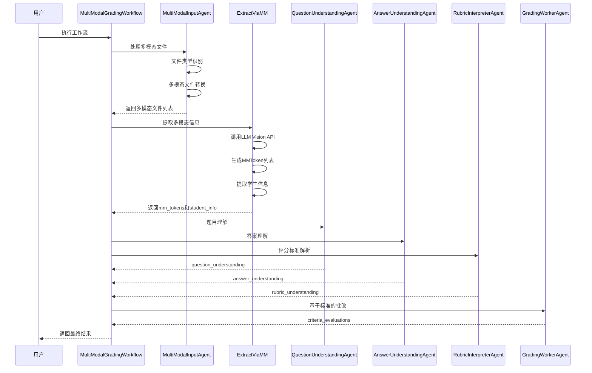

**图表来源**
- [workflow_multimodal.py](file://ai_correction/functions/langgraph/workflow_multimodal.py#L40-L85)

### 状态初始化流程

系统在执行前会自动初始化必要的多模态字段：

```mermaid
flowchart TD
A[开始执行] --> B{检查必要字段}
B --> |不存在| C[初始化字段]
B --> |存在| D[跳过初始化]
C --> E[question_multimodal_files = []]
E --> F[answer_multimodal_files = []]
F --> G[marking_multimodal_files = []]
G --> H[criteria_evaluations = []]
H --> I[students_info = []]
I --> J[batches_info = []]
J --> K[batch_rubric_packages = {}]
K --> L[question_context_packages = {}]
L --> M[grading_results = []]
M --> N[student_reports = []]
N --> O[class_analysis = {}]
D --> P[设置初始状态]
O --> P
P --> Q[开始工作流执行]
```

**图表来源**
- [workflow_multimodal.py](file://ai_correction/functions/langgraph/workflow_multimodal.py#L130-L160)

**章节来源**
- [workflow_multimodal.py](file://ai_correction/functions/langgraph/workflow_multimodal.py#L130-L180)

## 坐标系统与边界框

### 图像坐标系统

系统采用标准的图像坐标系统，原点位于图片左上角：

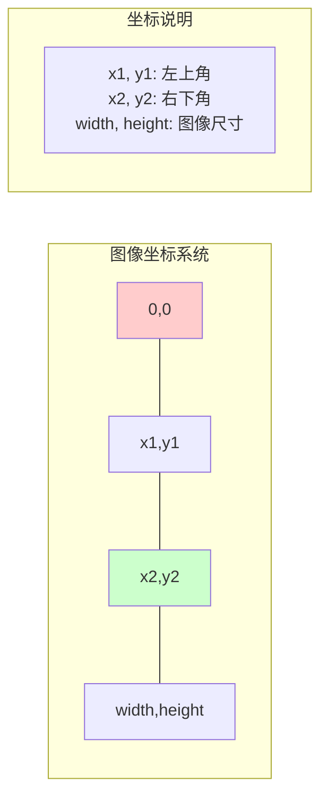

### 边界框坐标计算

系统提供了多种坐标转换和处理机制：

| 功能 | 方法 | 输入 | 输出 | 应用场景 |
|------|------|------|------|----------|
| 坐标标准化 | `_normalize_tokens` | 原始bbox | 标准化坐标 | 数据清洗 |
| 坐标转换 | `convert_to_ocr_format` | mm_tokens | OCR格式 | 向后兼容 |
| 坐标标注 | `_create_annotated_image` | 坐标+图像 | 标注图像 | 可视化展示 |
| 错误区域检测 | `_generate_error_regions` | OCR结果 | 错误区域 | 质量控制 |

### 坐标处理示例

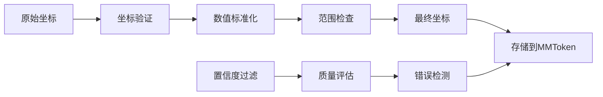

**图表来源**
- [extract_via_mm.py](file://ai_correction/functions/langgraph/agents/extract_via_mm.py#L264-L303)
- [annotation_builder.py](file://ai_correction/functions/langgraph/agents/annotation_builder.py#L302-L328)

**章节来源**
- [extract_via_mm.py](file://ai_correction/functions/langgraph/agents/extract_via_mm.py#L264-L303)
- [annotation_builder.py](file://ai_correction/functions/langgraph/agents/annotation_builder.py#L302-L342)

## 废弃字段与替代方案

### 已废弃的OCR相关字段

系统已经完全迁移至多模态LLM Vision能力，以下字段已被废弃但仍保留向后兼容性：

| 废弃字段 | 替代方案 | 使用建议 |
|----------|----------|----------|
| `ocr_results` | `mm_tokens` + `question_multimodal_files` | 直接使用多模态文件处理 |
| `image_regions` | `mm_tokens` | MMToken包含更丰富的坐标信息 |
| `preprocessed_images` | `answer_multimodal_files` | 使用多模态文件替代预处理图像 |

### 迁移策略

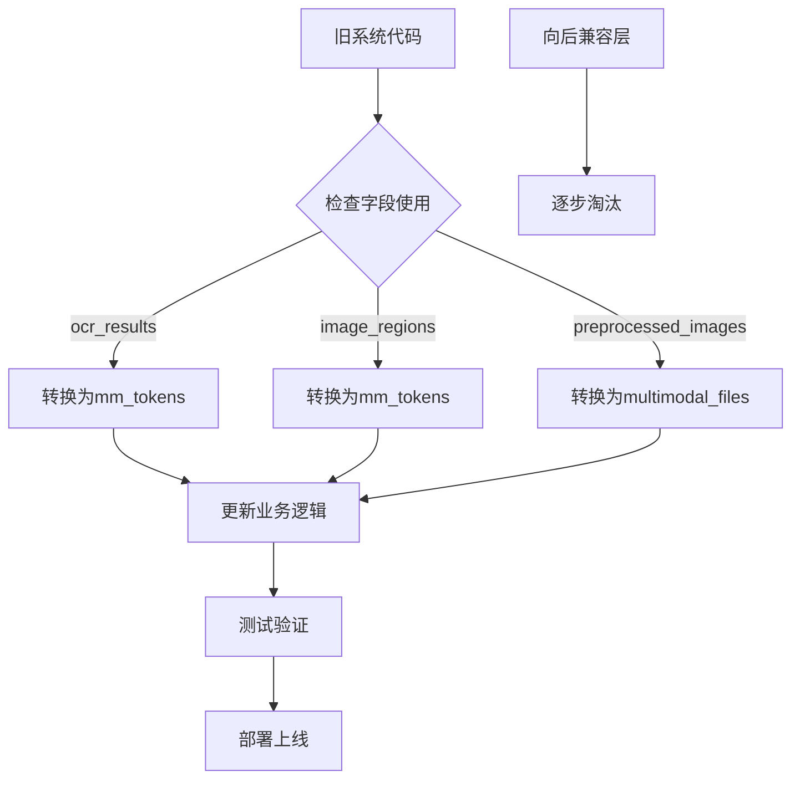

### 替代方案实现

系统提供了自动转换机制，确保新旧代码的平滑过渡：

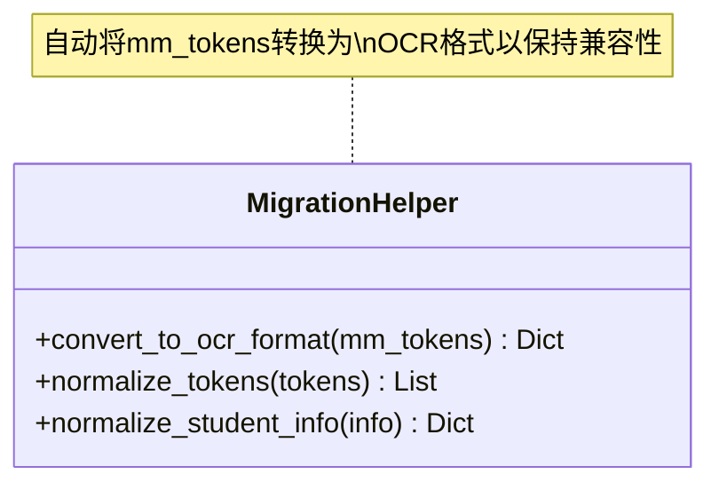

**图表来源**
- [extract_via_mm.py](file://ai_correction/functions/langgraph/agents/extract_via_mm.py#L320-L375)

**章节来源**
- [state.py](file://ai_correction/functions/langgraph/state.py#L85-L95)
- [extract_via_mm.py](file://ai_correction/functions/langgraph/agents/extract_via_mm.py#L320-L375)

## 开发者指南

### 如何正确使用多模态字段

#### 1. 初始化状态对象

```python
# 创建初始状态时正确初始化多模态字段
initial_state = GradingState(
    # ... 其他字段
    question_multimodal_files=[],      # 多模态题目文件
    answer_multimodal_files=[],        # 多模态答案文件  
    marking_multimodal_files=[],       # 多模态评分标准文件
    question_understanding=None,       # 题目理解结果
    answer_understanding=None,         # 答案理解结果
    rubric_understanding=None,         # 评分标准理解结果
    criteria_evaluations=[]            # 评估结果列表
)
```

#### 2. 处理多模态文件

```python
# 使用MultiModalInputAgent处理文件
agent = MultiModalInputAgent()
state = await agent(state)

# 访问处理后的多模态文件
question_files = state['question_multimodal_files']
answer_files = state['answer_multimodal_files']
marking_files = state['marking_multimodal_files']
```

#### 3. 访问MMToken数据

```python
# 从mm_tokens中提取信息
mm_tokens = state['mm_tokens']

for token in mm_tokens:
    text = token['text']           # 文本内容
    page = token['page']          # 页码
    bbox = token['bbox']          # 边界框坐标
    conf = token['conf']          # 置信度
    line_id = token['line_id']    # 行标识符
    
    # 使用坐标进行后续处理
    x1, y1, x2, y2 = bbox['x1'], bbox['y1'], bbox['x2'], bbox['y2']
```

#### 4. 利用理解结果

```python
# 访问题目理解结果
if state['question_understanding']:
    question = state['question_understanding']
    question_text = question['question_text']
    key_requirements = question['key_requirements']
    context = question['context']
    
    # 使用理解结果进行批改
    rubric_criteria = state['rubric_understanding']['criteria']
    for criterion in rubric_criteria:
        # 基于理解结果进行评分
        pass
```

### 常见问题解决

#### 1. 多模态文件处理失败

```python
# 检查文件处理错误
if state['errors']:
    for error in state['errors']:
        if error['step'] == 'multimodal_input':
            logger.error(f"文件处理失败: {error['file']} - {error['error']}")
```

#### 2. MMToken坐标异常

```python
# 验证MMToken坐标有效性
def validate_bbox(bbox):
    required_keys = ['x1', 'y1', 'x2', 'y2']
    return all(key in bbox for key in required_keys) and \
           bbox['x1'] < bbox['x2'] and bbox['y1'] < bbox['y2']
```

#### 3. 置信度过低的处理

```python
# 过滤低置信度的token
high_confidence_tokens = [
    token for token in mm_tokens 
    if token['conf'] >= 0.8
]
```

**章节来源**
- [workflow_multimodal.py](file://ai_correction/functions/langgraph/workflow_multimodal.py#L130-L180)
- [multimodal_input_agent.py](file://ai_correction/functions/langgraph/agents/multimodal_input_agent.py#L25-L80)

## 最佳实践

### 1. 文件类型选择建议

- **推荐**: 使用文本版PDF或.txt文件，获得最佳批改效果
- **可接受**: 图片格式（.jpg, .png）用于手写答案
- **避免**: 扫描版PDF（虽然系统会自动转换，但效果可能不如文本版）

### 2. 多模态处理策略

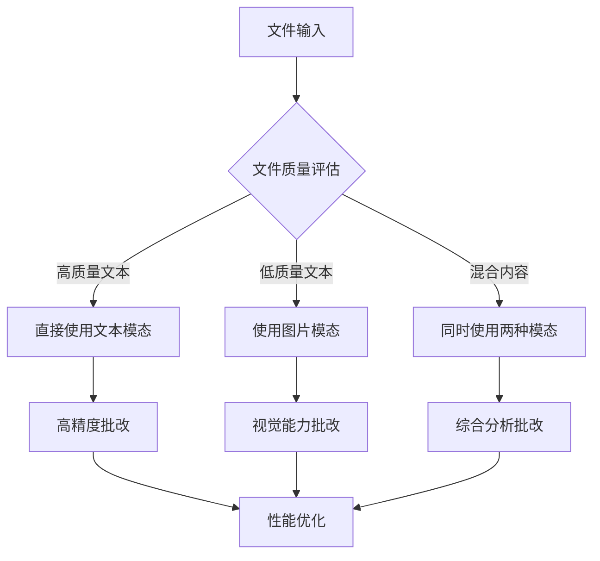

### 3. 坐标精度优化

- **置信度阈值**: 使用`conf >= 0.8`过滤低质量坐标
- **坐标验证**: 确保`x1 < x2`且`y1 < y2`
- **多尺度处理**: 根据图像分辨率调整坐标精度

### 4. 错误处理机制

```python
# 实现健壮的错误处理
async def robust_multimodal_processing(state):
    try:
        # 主要处理逻辑
        result = await process_multimodal_files(state)
        return result
    except Exception as e:
        # 降级处理
        fallback_result = create_fallback_state(state)
        state['errors'].append({
            'step': 'multimodal_processing',
            'error': str(e),
            'fallback_used': True
        })
        return fallback_result
```

### 5. 性能优化建议

- **批量处理**: 将多个小文件合并为批次处理
- **缓存机制**: 缓存重复的多模态处理结果
- **异步处理**: 利用异步工作流提高并发性能

### 6. 质量监控

```python
# 实现质量监控指标
def monitor_multimodal_quality(state):
    mm_tokens = state['mm_tokens']
    
    metrics = {
        'total_tokens': len(mm_tokens),
        'avg_confidence': sum(t['conf'] for t in mm_tokens) / len(mm_tokens) if mm_tokens else 0,
        'low_confidence_count': sum(1 for t in mm_tokens if t['conf'] < 0.5),
        'page_distribution': count_pages(mm_tokens)
    }
    
    return metrics
```

通过遵循这些最佳实践，开发者可以充分利用系统的多模态能力，实现高质量、高效率的AI批改服务。