# 理解结果模型

<cite>
**本文档引用的文件**
- [workflow_multimodal.py](file://ai_correction/functions/langgraph/workflow_multimodal.py)
- [state.py](file://ai_correction/functions/langgraph/state.py)
- [multimodal_models.py](file://ai_correction/functions/langgraph/multimodal_models.py)
- [question_understanding_agent.py](file://ai_correction/functions/langgraph/agents/question_understanding_agent.py)
- [answer_understanding_agent.py](file://ai_correction/functions/langgraph/agents/answer_understanding_agent.py)
- [rubric_interpreter_agent.py](file://ai_correction/functions/langgraph/agents/rubric_interpreter_agent.py)
- [multimodal_prompts.py](file://ai_correction/functions/langgraph/prompts/multimodal_prompts.py)
- [三角形题目.txt](file://ai_correction/test_data/三角形题目.txt)
- [三角形评分标准.txt](file://ai_correction/test_data/三角形评分标准.txt)
- [学生答案_三角形.txt](file://ai_correction/test_data/学生答案_三角形.txt)
- [test_multimodal_grading.py](file://ai_correction/test_multimodal_grading.py)
</cite>

## 目录
1. [引言](#引言)
2. [理解结果字段概述](#理解结果字段概述)
3. [核心数据结构设计](#核心数据结构设计)
4. [AI语义解析流程](#ai语义解析流程)
5. [工作流中的处理机制](#工作流中的处理机制)
6. [实际应用案例分析](#实际应用案例分析)
7. [系统认知层价值](#系统认知层价值)
8. [扩展开发指南](#扩展开发指南)
9. [总结](#总结)

## 引言

在AI智能批改系统中，`question_understanding`（题目理解）、`answer_understanding`（答案理解）和`rubric_understanding`（评分标准理解）三个核心理解结果字段构成了系统"认知层"的基础架构。这些字段承载着多模态大模型对教育场景中关键要素的深层理解，为后续的精准评分决策提供了坚实的数据基础。

本文档将深入阐述这三个理解结果字段的设计目的、数据结构、在AI语义解析流程中的核心作用，以及它们如何支持系统实现基于标准的智能批改。

## 理解结果字段概述

### 字段组成与作用

这三个理解结果字段共同构成了AI批改系统的核心认知框架：

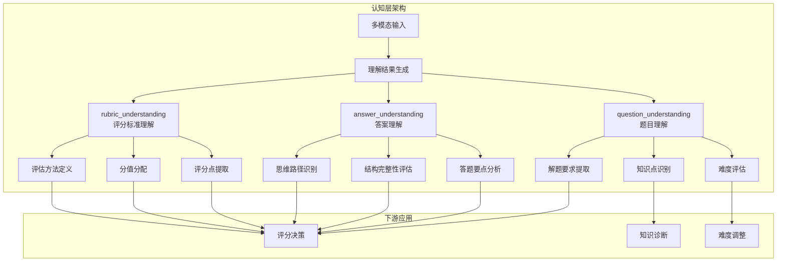

**图表来源**
- [workflow_multimodal.py](file://ai_correction/functions/langgraph/workflow_multimodal.py#L74-L99)
- [state.py](file://ai_correction/functions/langgraph/state.py#L100-L110)

### 设计理念

理解结果字段的设计遵循以下核心理念：

1. **多模态统一表示**：支持文本、图片、PDF等多种输入模态
2. **结构化深度理解**：不仅提取表面信息，更关注深层次的教育意义
3. **标准化输出格式**：确保下游模块的一致性处理
4. **可扩展性设计**：支持新题型和新评估维度的扩展

**章节来源**
- [state.py](file://ai_correction/functions/langgraph/state.py#L100-L110)
- [multimodal_models.py](file://ai_correction/functions/langgraph/multimodal_models.py#L131-L160)

## 核心数据结构设计

### QuestionUnderstanding（题目理解）

题目理解结果包含了对试题内容的全面解析：

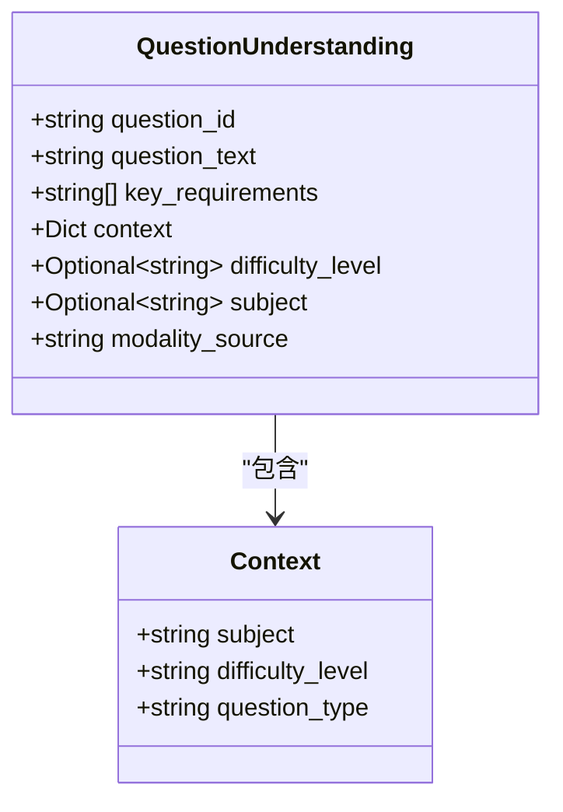

**图表来源**
- [multimodal_models.py](file://ai_correction/functions/langgraph/multimodal_models.py#L120-L130)

#### 关键字段说明

| 字段名 | 类型 | 描述 | 示例 |
|--------|------|------|------|
| `question_id` | string | 题目唯一标识符 | "Q1", "Q2-A", "Q3-B" |
| `question_text` | string | 题目文本的完整表示 | "在△ABC中，内角A,B,C所对的边分别为a,b,c..." |
| `key_requirements` | List[string] | 题目中的关键要求列表 | ["求tan C的值", "证明某个性质"] |
| `context` | Dict | 上下文信息容器 | 包含学科、难度级别、题型等 |
| `difficulty_level` | Optional[string] | 预估的难度级别 | "easy", "medium", "hard" |
| `subject` | Optional[string] | 学科领域 | "数学", "物理", "化学" |
| `modality_source` | string | 输入模态来源 | "text", "vision" |

### AnswerUnderstanding（答案理解）

答案理解结果专注于对学生作答内容的深度分析：

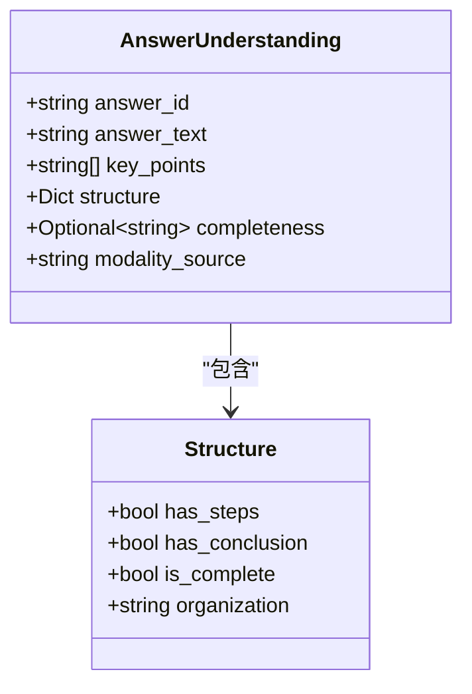

**图表来源**
- [multimodal_models.py](file://ai_correction/functions/langgraph/multimodal_models.py#L131-L140)

#### 结构化分析维度

答案理解不仅提取显性内容，还进行结构化分析：

| 分析维度 | 描述 | 应用价值 |
|----------|------|----------|
| `key_points` | 关键答题要点列表 | 评分时的重点检查项 |
| `structure.has_steps` | 是否包含解题步骤 | 判断解题过程的完整性 |
| `structure.has_conclusion` | 是否有结论总结 | 评估答案的完整性 |
| `structure.is_complete` | 答案完整性评估 | 整体质量判断 |
| `structure.organization` | 答案组织方式 | 逻辑清晰度评估 |
| `completeness` | 完整性评估结果 | 给分的重要参考 |

### RubricUnderstanding（评分标准理解）

评分标准理解是对评分规则的结构化解析：

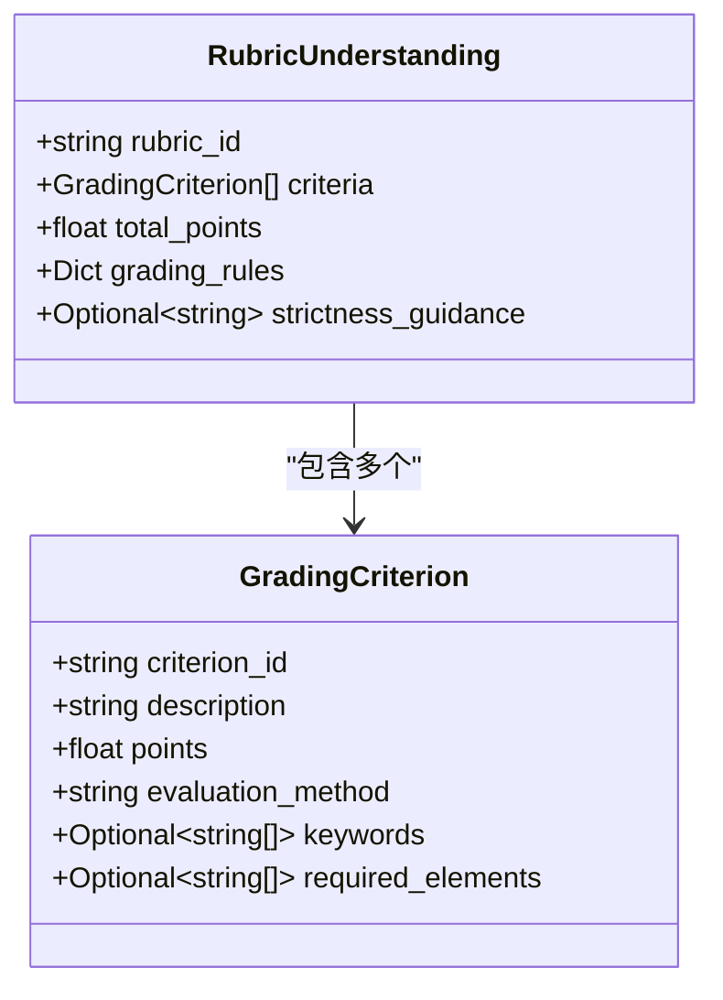

**图表来源**
- [multimodal_models.py](file://ai_correction/functions/langgraph/multimodal_models.py#L141-L160)

#### 评分点结构详解

每个评分点都包含完整的评估信息：

| 字段 | 类型 | 用途 | 示例 |
|------|------|------|------|
| `criterion_id` | string | 评分点唯一标识 | "C1", "C2-A", "C3-B" |
| `description` | string | 评分点具体描述 | "正确使用余弦定理" |
| `points` | float | 分值 | 2.0, 3.5, 5.0 |
| `evaluation_method` | string | 评估方法 | "semantic", "exact_match", "calculation" |
| `keywords` | List[string] | 关键词列表 | ["余弦定理", "cosine", "formula"] |
| `required_elements` | List[string] | 必需元素 | ["公式", "推导过程", "结果"] |

**章节来源**
- [multimodal_models.py](file://ai_correction/functions/langgraph/multimodal_models.py#L120-L160)

## AI语义解析流程

### 多模态理解管道

理解结果字段的生成遵循严格的多模态处理流程：

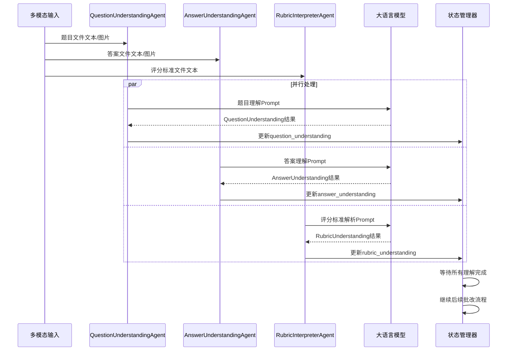

**图表来源**
- [workflow_multimodal.py](file://ai_correction/functions/langgraph/workflow_multimodal.py#L74-L99)
- [question_understanding_agent.py](file://ai_correction/functions/langgraph/agents/question_understanding_agent.py#L25-L55)

### 模态适配处理

不同输入模态采用相应的处理策略：

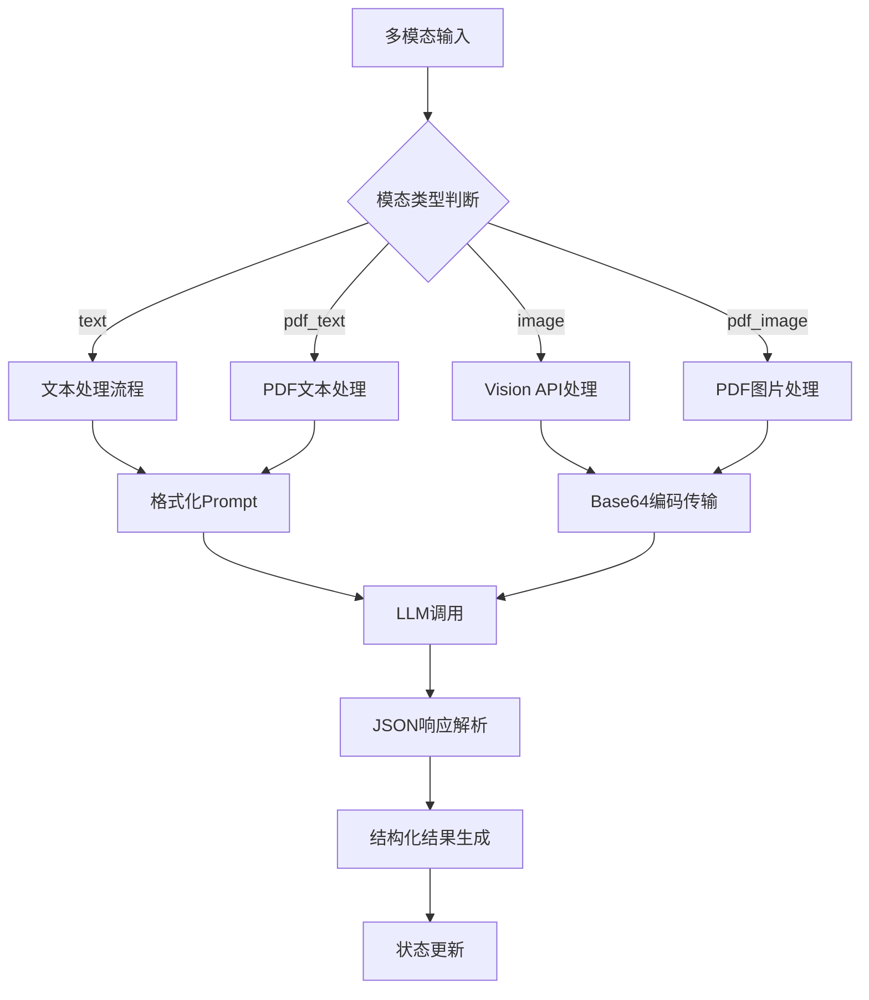

**图表来源**
- [question_understanding_agent.py](file://ai_correction/functions/langgraph/agents/question_understanding_agent.py#L40-L60)
- [answer_understanding_agent.py](file://ai_correction/functions/langgraph/agents/answer_understanding_agent.py#L40-L60)

### Prompt模板设计

每种理解任务都有专门设计的Prompt模板：

#### 题目理解Prompt特点

- **结构化输出**：强制JSON格式，确保一致性
- **上下文提取**：识别学科、难度、题型等关键信息
- **要求提取**：准确识别题目中的具体要求
- **模态适应**：针对文本和Vision分别设计

#### 答案理解Prompt特点

- **客观分析**：不进行评分，只提取关键信息
- **结构识别**：分析答案的组织方式和完整性
- **要点提取**：识别答题的关键步骤和结论
- **完整性评估**：提供客观的完整性判断

#### 评分标准解析Prompt特点

- **规则提取**：准确识别评分点和分值
- **方法定义**：明确评估方法和关键词
- **结构化输出**：支持后续算法处理
- **灵活性**：适应不同格式的评分标准

**章节来源**
- [multimodal_prompts.py](file://ai_correction/functions/langgraph/prompts/multimodal_prompts.py#L10-L166)

## 工作流中的处理机制

### 并行理解阶段

在深度协作的多模态批改工作流中，理解结果字段的生成处于核心地位：

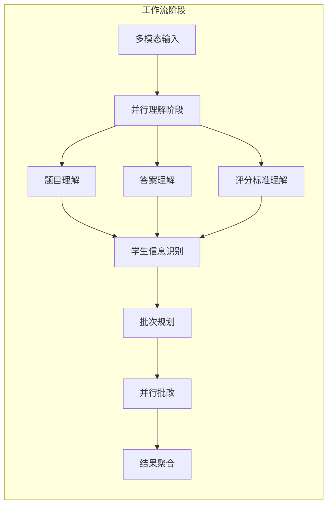

**图表来源**
- [workflow_multimodal.py](file://ai_correction/functions/langgraph/workflow_multimodal.py#L74-L99)

### 理解结果的消费模式

理解结果字段在工作流的不同阶段发挥重要作用：

#### 1. 题目理解的应用

- **解题要求提取**：从`key_requirements`中获取评分重点
- **知识点关联**：结合`context.subject`进行知识匹配
- **难度适配**：根据`difficulty_level`调整评分策略

#### 2. 答案理解的应用

- **要点检查**：基于`key_points`验证答题完整性
- **结构评估**：利用`structure`信息判断解题过程
- **完整性判断**：参考`completeness`进行给分决策

#### 3. 评分标准理解的应用

- **评分点匹配**：将答案与评分点对应
- **分值计算**：根据`points`字段确定各点分值
- **评估方法应用**：按`evaluation_method`执行具体检查

### 状态流转机制

理解结果字段的生成遵循严格的状态管理：

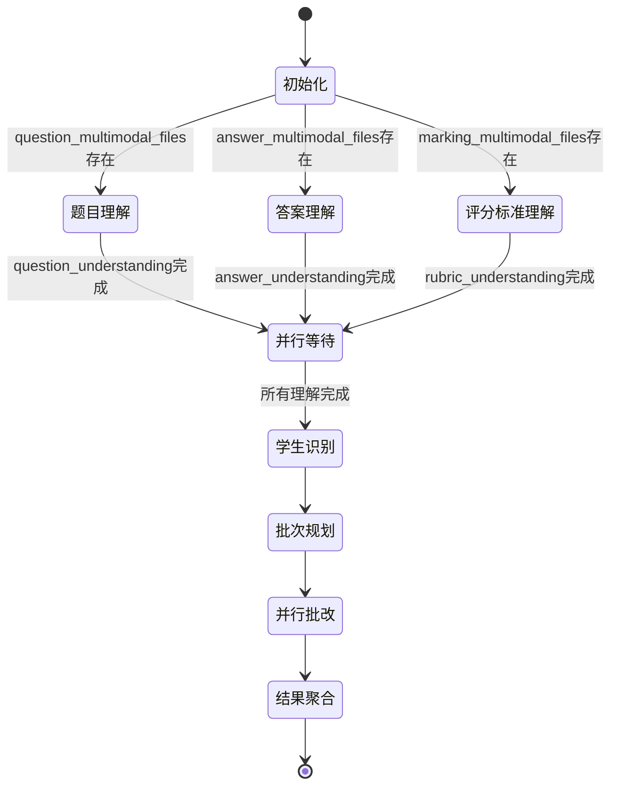

**图表来源**
- [workflow_multimodal.py](file://ai_correction/functions/langgraph/workflow_multimodal.py#L159-L187)

**章节来源**
- [workflow_multimodal.py](file://ai_correction/functions/langgraph/workflow_multimodal.py#L74-L99)
- [state.py](file://ai_correction/functions/langgraph/state.py#L100-L110)

## 实际应用案例分析

### 三角形几何题案例

以测试数据中的三角形几何题为例，展示理解结果的实际应用：

#### 题目理解结果分析

基于测试数据中的题目内容，题目理解结果可能包含：

```json
{
  "question_id": "Q1",
  "question_text": "在△ABC中，内角A,B,C所对的边分别为a,b,c，已知A=π/2，b²-a²=c²/2。",
  "key_requirements": [
    "求tan C的值",
    "利用已知条件推导关系"
  ],
  "context": {
    "subject": "数学",
    "difficulty_level": "medium",
    "question_type": "计算题"
  },
  "modality_source": "text"
}
```

#### 答案理解结果分析

学生答案的理解结果展示了答题的关键要点：

```json
{
  "answer_id": "A1",
  "answer_text": "cosA = (b²+c²-a²)/(2bc) = √5/2\n±c² = b²-a²\nc² = a²+b²-2abcosC...",
  "key_points": [
    "正确使用余弦定理",
    "推导出c² = a²+b²-2abcosC",
    "计算tanC = ±1",
    "考虑正负情况"
  ],
  "structure": {
    "has_steps": true,
    "has_conclusion": true,
    "is_complete": false,
    "organization": "逐步推导，但未完整得出最终答案"
  },
  "completeness": "partial",
  "modality_source": "text"
}
```

#### 评分标准理解结果分析

评分标准的理解结果为精确评分提供了基础：

```json
{
  "rubric_id": "R1",
  "criteria": [
    {
      "criterion_id": "C1",
      "description": "正确使用余弦定理 cosA = (b²+c²-a²)/(2bc) = c/(2b) = √5/2",
      "points": 2.0,
      "evaluation_method": "semantic",
      "keywords": ["余弦定理", "cosA", "公式"],
      "required_elements": ["公式", "推导过程", "结果"]
    },
    {
      "criterion_id": "C2",
      "description": "正确推导 ±c² = b²-a²",
      "points": 1.0,
      "evaluation_method": "semantic",
      "keywords": ["推导", "±c²", "b²-a²"],
      "required_elements": ["推导过程", "等式变换"]
    }
  ],
  "total_points": 8.0,
  "grading_rules": {
    "partial_credit": "yes",
    "deduction_rules": ["漏推导步骤扣分"]
  },
  "strictness_guidance": "中等严格程度"
}
```

### 细粒度评估应用

基于上述理解结果，系统可以进行细粒度评估：

#### 评分点匹配过程

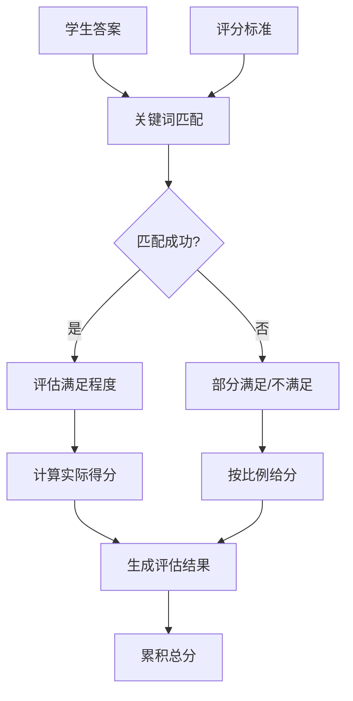

**图表来源**
- [rubric_interpreter_agent.py](file://ai_correction/functions/langgraph/agents/rubric_interpreter_agent.py#L147-L182)

#### 实际评估示例

对于评分点"C1"（正确使用余弦定理）：

- **证据提取**：从学生答案中识别出"cosA = (b²+c²-a²)/(2bc) = √5/2"
- **满足程度**：完全满足（正确使用了余弦定理）
- **得分计算**：获得2.0分（满分）
- **理由说明**：学生正确应用了余弦定理公式，推导过程正确

### 知识点挖掘应用

理解结果还支持知识点挖掘和学习分析：

#### 知识点关联

- **几何概念**：三角形、余弦定理、正弦定理
- **数学技能**：代数推导、方程求解、三角函数应用
- **解题策略**：已知条件分析、公式选择、步骤推导

#### 学习诊断

基于理解结果，系统可以生成个性化的学习建议：

- **优势**：正确使用余弦定理，代数运算能力较强
- **不足**：推导过程不够完整，未考虑特殊情况
- **建议**：加强解题步骤的完整性训练，注意特殊情况讨论

**章节来源**
- [三角形题目.txt](file://ai_correction/test_data/三角形题目.txt#L1-L6)
- [三角形评分标准.txt](file://ai_correction/test_data/三角形评分标准.txt#L1-L14)
- [学生答案_三角形.txt](file://ai_correction/test_data/学生答案_三角形.txt#L1-L23)

## 系统认知层价值

### 核心价值体现

理解结果字段作为系统"认知层"的关键组件，具有以下核心价值：

#### 1. 智能决策基础

理解结果为AI批改系统提供了智能化决策的基础：

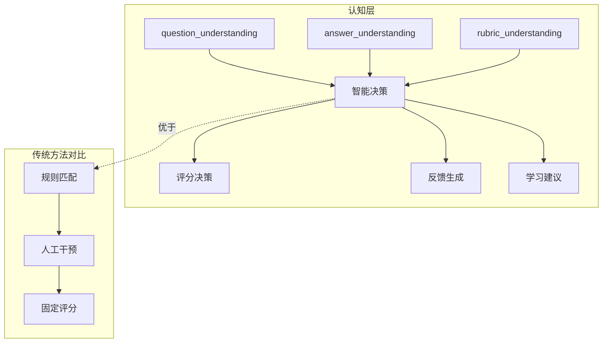

#### 2. 精准评分保障

理解结果确保评分的准确性和一致性：

| 优势维度 | 传统方法 | AI理解结果 |
|----------|----------|------------|
| **准确性** | 基于关键词匹配，易受表达差异影响 | 基于语义理解，考虑多种表达方式 |
| **一致性** | 人工评分可能存在主观偏差 | 机器理解保证处理一致性 |
| **效率** | 人工分析耗时较长 | 自动化处理，毫秒级响应 |
| **覆盖度** | 只能处理预定义的评分点 | 支持灵活的评分标准变化 |

#### 3. 教育价值提升

理解结果不仅服务于评分，更具有教育价值：

- **学习诊断**：识别学生的知识薄弱点
- **个性化反馈**：提供针对性的学习建议
- **教学改进**：帮助教师了解学生常见误区
- **质量监控**：评估教学效果和学生掌握情况

### 技术架构优势

#### 1. 模块化设计

理解结果字段采用模块化设计，便于维护和扩展：

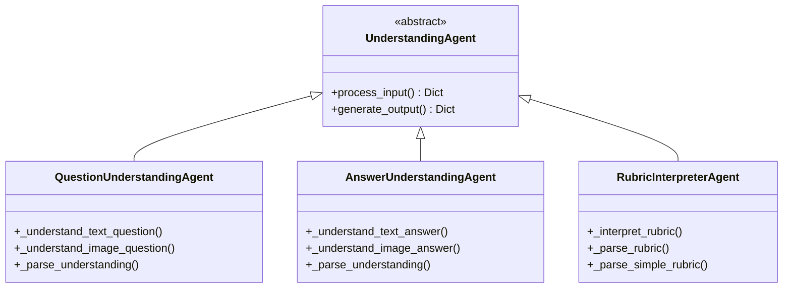

**图表来源**
- [question_understanding_agent.py](file://ai_correction/functions/langgraph/agents/question_understanding_agent.py#L20-L50)
- [answer_understanding_agent.py](file://ai_correction/functions/langgraph/agents/answer_understanding_agent.py#L20-L50)
- [rubric_interpreter_agent.py](file://ai_correction/functions/langgraph/agents/rubric_interpreter_agent.py#L20-L50)

#### 2. 可扩展性架构

理解结果字段支持新题型和新评估维度的扩展：

- **新题型支持**：只需修改对应的Prompt模板
- **新评估维度**：可在现有结构基础上增加字段
- **多语言支持**：通过Prompt模板实现多语言处理
- **跨学科应用**：通用的结构化设计支持不同学科

#### 3. 性能优化策略

系统采用多种性能优化策略：

- **并行处理**：三个理解任务并行执行，提高效率
- **Token优化**：深度协作架构减少重复理解
- **缓存机制**：相同内容的处理结果可被复用
- **增量更新**：只更新发生变化的部分

**章节来源**
- [workflow_multimodal.py](file://ai_correction/functions/langgraph/workflow_multimodal.py#L74-L99)
- [multimodal_models.py](file://ai_correction/functions/langgraph/multimodal_models.py#L120-L160)

## 扩展开发指南

### 支持新题型的方法

#### 1. 修改Prompt模板

为新题型添加专门的Prompt模板：

```python
# 示例：添加物理力学题型的题目理解Prompt
PHYSICS_MECHANICS_PROMPT = """
你是一位资深物理专家，擅长理解和分析力学题目。

【任务】
请仔细阅读以下力学题目，提取关键信息和要求。

【题目内容】
{question_content}

【输出要求】
请以JSON格式输出题目理解结果...

【注意事项】
1. 识别力学概念和公式
2. 提取受力分析要求
3. 注意单位和数值处理
"""
```

#### 2. 扩展数据结构

根据新题型的特点扩展数据结构：

```python
class PhysicsQuestionUnderstanding(TypedDict):
    """物理力学题目理解结果"""
    question_id: str
    question_text: str
    key_requirements: List[str]
    context: Dict[str, Any]
    physics_concepts: List[str]  # 物理概念列表
    mathematical_model: Dict[str, Any]  # 数学模型
    units: Dict[str, str]  # 单位信息
    modality_source: str
```

#### 3. 实现专用Agent

为特定题型实现专用的Agent：

```python
class PhysicsQuestionUnderstandingAgent:
    """物理力学题目理解Agent"""
    
    def __init__(self):
        self.name = "PhysicsQuestionUnderstandingAgent"
        self.llm_client = get_llm_client()
    
    async def __call__(self, state: GradingState) -> GradingState:
        # 物理题目的特殊处理逻辑
        pass
```

### 评估方法扩展

#### 1. 新增评估方法

在`GradingCriterion`中添加新的评估方法：

```python
# 扩展评估方法类型
class ExtendedGradingCriterion(TypedDict):
    criterion_id: str
    description: str
    points: float
    evaluation_method: Literal[
        'semantic', 
        'exact_match', 
        'calculation', 
        'step_check', 
        'conceptual',  # 新增概念理解评估
        'diagram_analysis',  # 图表分析评估
        'experimental'  # 实验设计评估
    ]
    keywords: Optional[List[str]]
    required_elements: Optional[List[str]]
```

#### 2. 实现专用评估逻辑

为新的评估方法实现专用的评估逻辑：

```python
class ConceptualUnderstandingEvaluator:
    """概念理解评估器"""
    
    def evaluate(self, answer: str, criterion: GradingCriterion) -> CriteriaEvaluation:
        # 基于概念理解的评估逻辑
        pass

class DiagramAnalysisEvaluator:
    """图表分析评估器"""
    
    def evaluate(self, answer: str, criterion: GradingCriterion) -> CriteriaEvaluation:
        # 基于图表分析的评估逻辑
        pass
```

### 多语言支持扩展

#### 1. Prompt本地化

为不同语言创建对应的Prompt模板：

```python
# 多语言Prompt模板映射
MULTI_LANGUAGE_PROMPTS = {
    'zh': {
        'question_understanding': QUESTION_UNDERSTANDING_TEXT_PROMPT,
        'answer_understanding': ANSWER_UNDERSTANDING_TEXT_PROMPT,
        'rubric_interpretation': RUBRIC_INTERPRETATION_PROMPT
    },
    'en': {
        'question_understanding': QUESTION_UNDERSTANDING_ENGLISH_PROMPT,
        'answer_understanding': ANSWER_UNDERSTANDING_ENGLISH_PROMPT,
        'rubric_interpretation': RUBRIC_INTERPRETATION_ENGLISH_PROMPT
    }
}
```

#### 2. 语言特定处理

实现语言特定的处理逻辑：

```python
class MultilingualUnderstandingAgent:
    """多语言理解Agent"""
    
    def __init__(self, language: str = 'zh'):
        self.language = language
        self.prompt_templates = MULTI_LANGUAGE_PROMPTS.get(language, MULTI_LANGUAGE_PROMPTS['zh'])
    
    async def process_multimodal_input(self, content: Any, modality_type: str) -> Dict:
        # 多语言内容处理
        pass
```

### 性能优化扩展

#### 1. 缓存机制

实现理解结果的缓存机制：

```python
class UnderstandingCache:
    """理解结果缓存"""
    
    def __init__(self):
        self.cache = {}
    
    def get(self, content_hash: str) -> Optional[Dict]:
        return self.cache.get(content_hash)
    
    def set(self, content_hash: str, result: Dict) -> None:
        self.cache[content_hash] = result
    
    def clear(self) -> None:
        self.cache.clear()
```

#### 2. 并行优化

优化并行处理策略：

```python
async def parallel_understanding_processing(
    question_files: List[MultiModalFile],
    answer_files: List[MultiModalFile],
    rubric_files: List[MultiModalFile]
) -> Tuple[QuestionUnderstanding, AnswerUnderstanding, RubricUnderstanding]:
    """并行理解处理"""
    
    # 使用asyncio.gather实现真正的并行
    tasks = [
        question_understanding_task(question_files[0]),
        answer_understanding_task(answer_files[0]),
        rubric_interpretation_task(rubric_files[0])
    ]
    
    results = await asyncio.gather(*tasks, return_exceptions=True)
    
    return results
```

**章节来源**
- [multimodal_prompts.py](file://ai_correction/functions/langgraph/prompts/multimodal_prompts.py#L10-L166)
- [multimodal_models.py](file://ai_correction/functions/langgraph/multimodal_models.py#L120-L160)

## 总结

`question_understanding`、`answer_understanding`和`rubric_understanding`三个理解结果字段构成了AI智能批改系统的核心认知基础设施。它们不仅实现了多模态大模型对教育场景要素的深度理解，更为系统提供了精准、智能、可扩展的批改能力。

### 关键技术成就

1. **多模态统一处理**：支持文本、图片、PDF等多种输入模态的统一理解和处理
2. **结构化深度理解**：不仅提取表面信息，更关注深层次的教育意义和评估价值
3. **标准化输出格式**：确保下游模块的一致性处理和算法兼容性
4. **并行高效处理**：通过并行理解机制显著提升系统处理效率

### 应用价值体现

- **教育质量提升**：提供更加准确、一致、智能的批改服务
- **学习效果改善**：通过精准的反馈和建议帮助学生改进学习
- **教学效率提高**：减轻教师负担，让教师专注于教学设计和辅导
- **个性化教育支持**：基于学生表现提供个性化的学习指导

### 发展前景展望

随着AI技术的不断发展，理解结果模型将在以下方面继续演进：

1. **更强的语义理解能力**：支持更加复杂的教育场景和题型
2. **更好的跨学科应用**：支持更多学科领域的智能批改
3. **更丰富的交互形式**：支持语音、手势等新型输入方式
4. **更智能的教学辅助**：提供更加精准的教学建议和资源推荐

理解结果模型作为AI批改系统的核心认知层，将继续推动教育技术的创新和发展，为构建智能化、个性化的教育环境提供强有力的技术支撑。