# 坐标标注系统

<cite>
**本文档引用的文件**
- [state.py](file://ai_correction/functions/langgraph/state.py)
- [annotation_builder.py](file://ai_correction/functions/langgraph/agents/annotation_builder.py)
- [extract_via_mm.py](file://ai_correction/functions/langgraph/agents/extract_via_mm.py)
- [build_export_payload.py](file://ai_correction/functions/langgraph/agents/build_export_payload.py)
- [push_to_class_system.py](file://ai_correction/functions/langgraph/agents/push_to_class_system.py)
- [workflow_multimodal.py](file://ai_correction/functions/langgraph/workflow_multimodal.py)
- [extract_mm_prompts.py](file://ai_correction/functions/langgraph/prompts/extract_mm_prompts.py)
</cite>

## 目录
1. [系统概述](#系统概述)
2. [Annotation类核心字段详解](#annotation类核心字段详解)
3. [多模态批改流程](#多模态批改流程)
4. [标注数据生成链路](#标注数据生成链路)
5. [前端渲染接口规范](#前端渲染接口规范)
6. [坐标转换算法](#坐标转换算法)
7. [常见问题解决方案](#常见问题解决方案)
8. [系统集成应用](#系统集成应用)
9. [总结](#总结)

## 系统概述

坐标标注系统是AI批改平台的核心可视化组件，负责在学生作业图片上精确定位和标注错误位置。该系统通过多模态模型提取带坐标的token，结合AI评分结果生成精确的错误定位标注，并提供完整的前端渲染接口。

### 系统架构

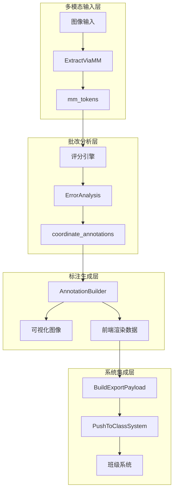

**图表来源**
- [workflow_multimodal.py](file://ai_correction/functions/langgraph/workflow_multimodal.py#L1-L50)
- [annotation_builder.py](file://ai_correction/functions/langgraph/agents/annotation_builder.py#L22-L57)

## Annotation类核心字段详解

### bbox字段：像素坐标系统

`bbox`字段是Annotation类的核心组成部分，采用像素坐标系统表示图像上的矩形区域。

#### 坐标格式定义

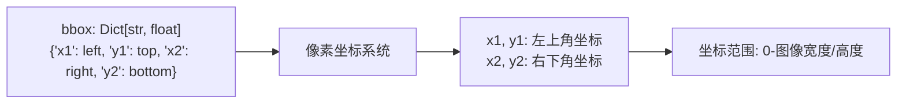

**图表来源**
- [state.py](file://ai_correction/functions/langgraph/state.py#L229-L229)

#### 坐标字段说明

| 字段名 | 类型 | 描述 | 示例值 |
|--------|------|------|--------|
| x1 | float | 左上角x坐标 | 120.5 |
| y1 | float | 左上角y坐标 | 45.0 |
| x2 | float | 右下角x坐标 | 280.5 |
| y2 | float | 右下角y坐标 | 75.0 |

### hint字段：错误提示信息

`hint`字段提供人性化的错误描述信息，帮助教师快速理解错误性质。

#### 提示信息类型

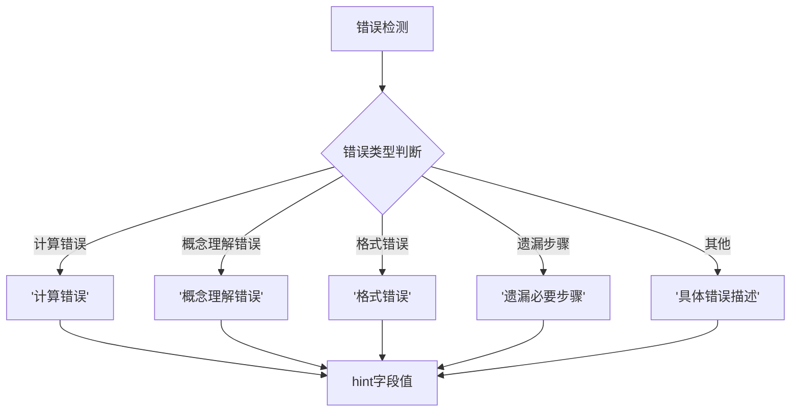

**图表来源**
- [annotation_builder.py](file://ai_correction/functions/langgraph/agents/annotation_builder.py#L86-L118)

### error_type字段：标准化错误分类

`error_type`字段采用标准化的错误分类体系，便于系统分析和统计。

#### 错误类型分类

| 错误类型 | 描述 | 应用场景 |
|----------|------|----------|
| calculation | 计算错误 | 数学运算结果错误 |
| concept | 概念理解错误 | 对基本概念理解偏差 |
| method | 方法错误 | 解题方法选择不当 |
| logic | 逻辑错误 | 推理过程逻辑不通 |
| careless | 粗心错误 | 书写、格式等细节错误 |
| incomplete | 答案不完整 | 缺少必要步骤或结论 |
| format | 格式错误 | 数学符号、表达式格式 |
| general | 一般错误 | 无法归类的错误 |

**章节来源**
- [state.py](file://ai_correction/functions/langgraph/state.py#L231-L231)
- [annotation_builder.py](file://ai_correction/functions/langgraph/agents/annotation_builder.py#L22-L57)

## 多模态批改流程

### 流程概览

多模态批改系统采用深度协作架构，通过8个Agent协同完成复杂的批改任务。

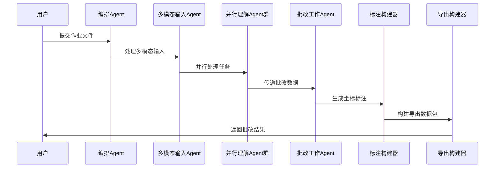

**图表来源**
- [workflow_multimodal.py](file://ai_correction/functions/langgraph/workflow_multimodal.py#L40-L80)

### 核心Agent职责

#### ExtractViaMM：多模态提取Agent

负责调用多模态大模型提取文本内容和像素坐标。

**主要功能**：
- 文本识别和坐标提取
- 学生信息识别（姓名、学号、班级）
- mm_tokens生成
- OCR格式兼容

**章节来源**
- [extract_via_mm.py](file://ai_correction/functions/langgraph/agents/extract_via_mm.py#L20-L61)

#### AnnotationBuilder：坐标标注构建器

生成精确的坐标标注和可视化图像。

**主要功能**：
- 从评分结果提取错误位置
- 从OCR结果生成高置信度标注
- 可视化图像生成
- 前端渲染数据准备

**章节来源**
- [annotation_builder.py](file://ai_correction/functions/langgraph/agents/annotation_builder.py#L22-L57)

## 标注数据生成链路

### 从多模态模型到坐标标注的完整链路

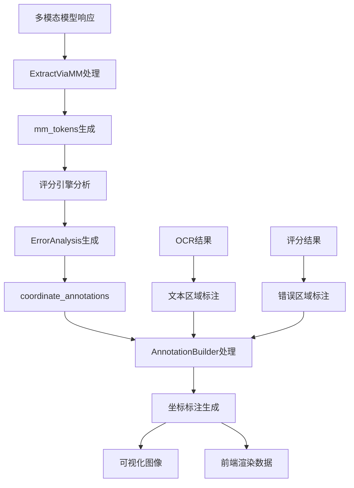

**图表来源**
- [annotation_builder.py](file://ai_correction/functions/langgraph/agents/annotation_builder.py#L86-L118)
- [extract_via_mm.py](file://ai_correction/functions/langgraph/agents/extract_via_mm.py#L60-L90)

### mm_tokens中的坐标数据联动

#### mm_tokens数据结构

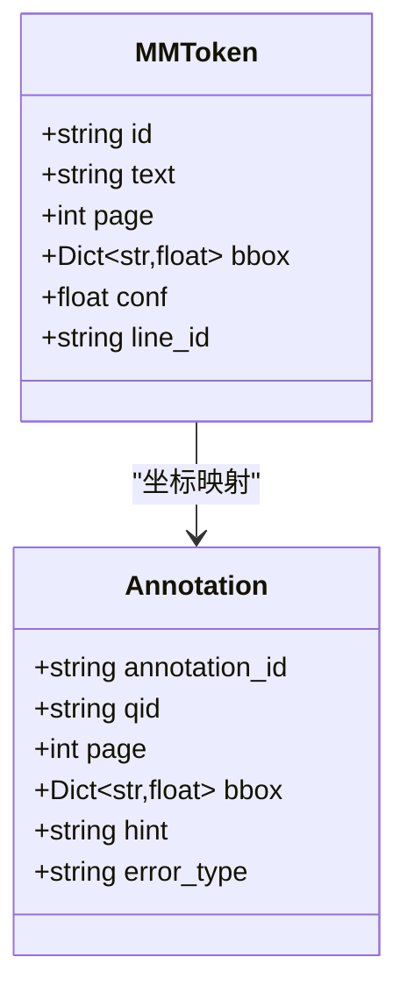

**图表来源**
- [state.py](file://ai_correction/functions/langgraph/state.py#L168-L178)
- [state.py](file://ai_correction/functions/langgraph/state.py#L221-L231)

#### 坐标数据联动机制

1. **坐标提取**：多模态模型直接返回像素坐标
2. **坐标验证**：检查坐标有效性（非负、合理范围）
3. **坐标转换**：必要时进行坐标系转换
4. **坐标映射**：建立mm_tokens与Annotation的对应关系

**章节来源**
- [extract_via_mm.py](file://ai_correction/functions/langgraph/agents/extract_via_mm.py#L127-L182)
- [annotation_builder.py](file://ai_correction/functions/langgraph/agents/annotation_builder.py#L86-L118)

## 前端渲染接口规范

### 渲染接口数据结构

前端渲染系统接收标准化的标注数据格式，支持多种渲染模式。

#### 基础渲染接口

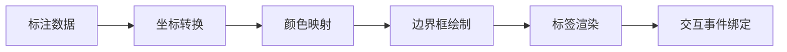

**图表来源**
- [annotation_builder.py](file://ai_correction/functions/langgraph/agents/annotation_builder.py#L302-L328)

#### 接口规范定义

| 字段名 | 类型 | 必需 | 描述 |
|--------|------|------|------|
| annotation_id | string | 是 | 标注唯一标识 |
| qid | string | 是 | 题号标识 |
| page | number | 是 | 页码索引 |
| bbox | object | 是 | 坐标边界框 |
| hint | string | 是 | 错误提示信息 |
| error_type | string | 是 | 错误类型分类 |
| severity | string | 否 | 严重程度等级 |

### 颜色方案规范

系统采用标准化的颜色方案区分不同类型的标注：

| 标注类型 | RGB颜色 | 十六进制 | 用途 |
|----------|---------|----------|------|
| error | (255, 0, 0) | #FF0000 | 错误标注 |
| correct | (0, 255, 0) | #00FF00 | 正确标注 |
| highlight | (255, 255, 0) | #FFFF00 | 重点标注 |
| comment | (0, 0, 255) | #0000FF | 批注标注 |
| suggestion | (255, 165, 0) | #FFA500 | 建议标注 |

**章节来源**
- [annotation_builder.py](file://ai_correction/functions/langgraph/agents/annotation_builder.py#L22-L57)

## 坐标转换算法

### 像素坐标到显示视图的映射

系统需要处理多种坐标变换场景，确保标注在不同显示环境下的一致性。

#### 坐标转换流程

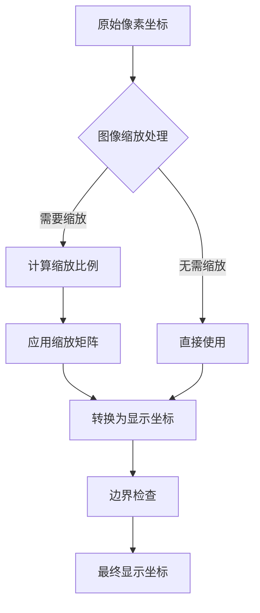

**图表来源**
- [annotation_builder.py](file://ai_correction/functions/langgraph/agents/annotation_builder.py#L115-L139)

#### 归一化坐标转换

系统采用归一化坐标系统处理不同分辨率的图像：

```mermaid
graph LR
A[像素坐标] --> B[获取图像尺寸]
B --> C[x1 = left / width]
B --> D[y1 = top / height]
B --> E[x2 = (left + width) / width]
B --> F[y2 = (top + height) / height]
C --> G[归一化坐标]
D --> G
E --> G
F --> G
```

**图表来源**
- [annotation_builder.py](file://ai_correction/functions/langgraph/agents/annotation_builder.py#L115-L139)

#### 坐标转换算法实现

**章节来源**
- [annotation_builder.py](file://ai_correction/functions/langgraph/agents/annotation_builder.py#L302-L328)

## 常见问题解决方案

### 标注偏移问题

#### 问题描述
由于图像预处理、缩放或显示差异导致标注位置与实际内容不匹配。

#### 解决方案

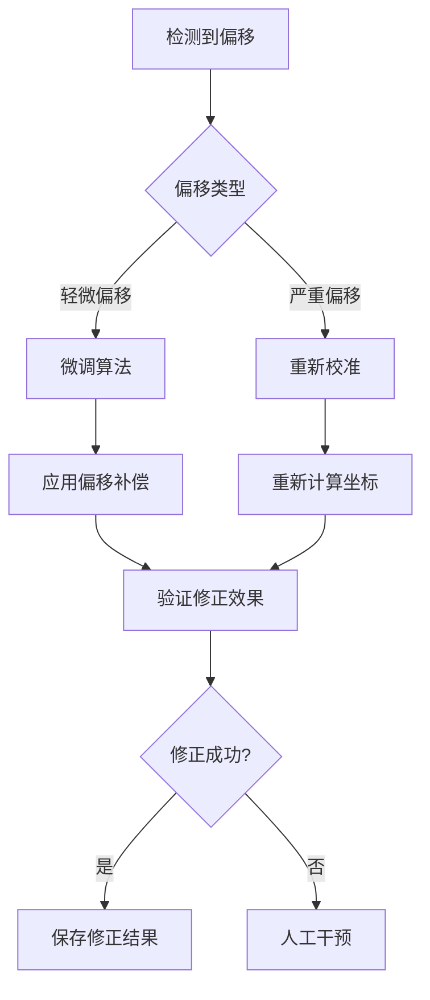

#### 偏移补偿算法

1. **图像预处理校正**：去除图像变形
2. **坐标系统校准**：建立正确的坐标系
3. **显示比例适配**：适应不同显示设备

### 标注重叠处理

#### 重叠检测算法

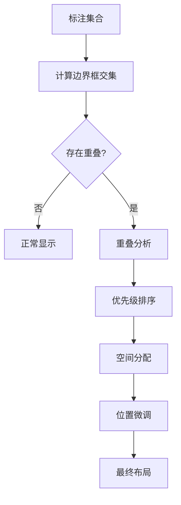

#### 重叠处理策略

| 重叠类型 | 处理策略 | 实现方式 |
|----------|----------|----------|
| 完全重叠 | 显示单个标注 | 隐藏重复标注 |
| 部分重叠 | 空间优化 | 调整位置或合并 |
| 连续重叠 | 层级管理 | 设置显示层级 |
| 复杂重叠 | 智能布局 | 自动调整位置 |

### 性能优化方案

#### 大量标注的处理

1. **分层渲染**：按重要性分层显示
2. **动态加载**：根据视口范围加载标注
3. **缓存机制**：缓存计算结果
4. **异步处理**：后台预处理标注数据

**章节来源**
- [annotation_builder.py](file://ai_correction/functions/langgraph/agents/annotation_builder.py#L272-L304)

## 系统集成应用

### push_to_class_system.py的应用

`push_to_class_system.py`负责将标注数据导出并集成到班级系统中。

#### 数据导出流程

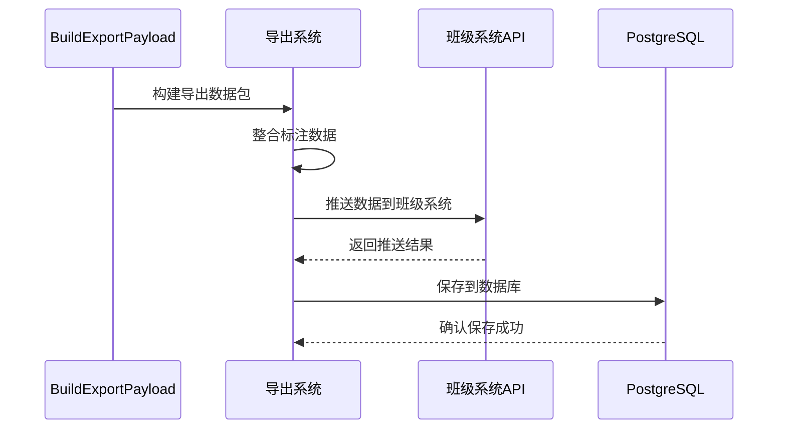

**图表来源**
- [push_to_class_system.py](file://ai_correction/functions/langgraph/agents/push_to_class_system.py#L40-L80)

#### 标注数据在导出中的处理

**章节来源**
- [build_export_payload.py](file://ai_correction/functions/langgraph/agents/build_export_payload.py#L147-L169)
- [push_to_class_system.py](file://ai_correction/functions/langgraph/agents/push_to_class_system.py#L40-L80)

### 系统集成接口

#### API接口规范

| 接口路径 | 方法 | 功能 | 输入参数 |
|----------|------|------|----------|
| `/api/grading/submit` | POST | 提交批改结果 | export_payload |
| `/api/annotations/list` | GET | 查询标注列表 | task_id, page |
| `/api/annotations/update` | PUT | 更新标注信息 | annotation_data |

#### 数据格式标准化

系统采用标准化的数据格式确保与其他系统的兼容性：

```mermaid
graph LR
A[内部数据结构] --> B[格式转换]
B --> C[标准化输出]
C --> D[外部系统集成]
E[班级系统] <- --> C
F[数据分析平台] <- --> C
G[教学管理系统] <- --> C
```

**章节来源**
- [push_to_class_system.py](file://ai_correction/functions/langgraph/agents/push_to_class_system.py#L140-L180)

## 总结

坐标标注系统是AI批改平台的核心可视化组件，通过精密的坐标系统、智能的错误识别和标准化的数据接口，实现了高质量的作业批改和可视化展示。

### 系统优势

1. **高精度定位**：基于像素坐标的精确定位
2. **智能错误识别**：结合多模态分析和AI评分
3. **标准化接口**：支持多种系统集成
4. **灵活渲染**：适应不同的前端展示需求
5. **性能优化**：支持大规模标注数据处理

### 技术创新点

- **多模态坐标提取**：直接从多模态模型获取像素坐标
- **智能标注生成**：结合评分结果和OCR分析生成标注
- **标准化数据流**：建立完整的数据导出和集成流程
- **前端渲染优化**：支持复杂的标注渲染和交互

该系统为教育信息化提供了强有力的技术支撑，显著提升了作业批改的效率和准确性，为教师提供了直观、准确的教学反馈工具。