# 批改结果模型

<cite>
**本文档中引用的文件**
- [state.py](file://ai_correction/functions/langgraph/state.py)
- [multimodal_models.py](file://ai_correction/functions/langgraph/multimodal_models.py)
- [evaluate_batch.py](file://ai_correction/functions/langgraph/agents/evaluate_batch.py)
- [aggregate_results.py](file://ai_correction/functions/langgraph/agents/aggregate_results.py)
- [build_export_payload.py](file://ai_correction/functions/langgraph/agents/build_export_payload.py)
- [knowledge_miner.py](file://ai_correction/functions/langgraph/agents/knowledge_miner.py)
- [result_aggregator_agent.py](file://ai_correction/functions/langgraph/agents/result_aggregator_agent.py)
- [workflow_new.py](file://ai_correction/functions/langgraph/workflow_new.py)
- [routing.py](file://ai_correction/functions/langgraph/routing.py)
- [test_multimodal_grading.py](file://test_multimodal_grading.py)
</cite>

## 目录
1. [简介](#简介)
2. [核心数据模型](#核心数据模型)
3. [评分结果模型](#评分结果模型)
4. [精细化评估模型](#精细化评估模型)
5. [错误分析与标注模型](#错误分析与标注模型)
6. [知识点挖掘模型](#知识点挖掘模型)
7. [结果聚合机制](#结果聚合机制)
8. [数据序列化与导出](#数据序列化与导出)
9. [最佳实践](#最佳实践)
10. [总结](#总结)

## 简介

AI批改系统采用多层次的数据模型架构，支持高效模式和专业模式两种批改方式。系统通过`Evaluation`、`CriteriaEvaluation`、`Annotation`、`KnowledgePoint`等核心数据结构，实现了从基础评分到深度分析的完整批改流程。本文档详细介绍了这些模型的设计理念、应用场景和实现细节。

## 核心数据模型

### GradingState 状态模型

`GradingState`是整个批改系统的核心状态容器，包含了批改过程中的所有关键信息。

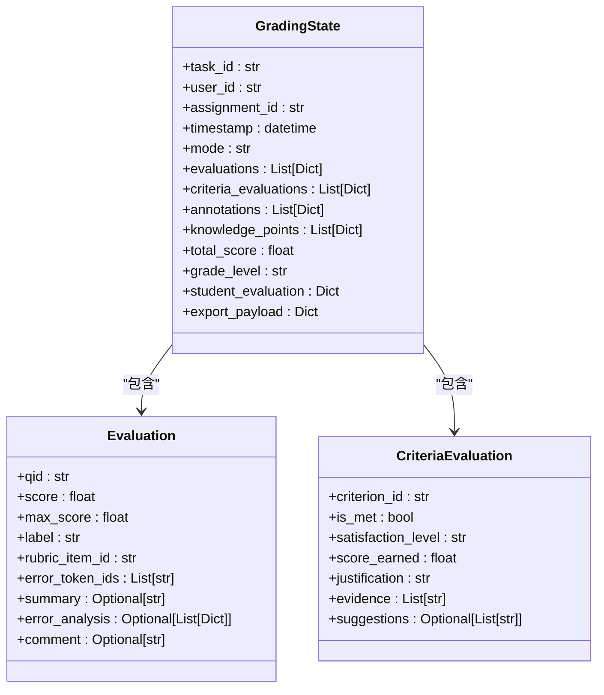

**图表来源**
- [state.py](file://ai_correction/functions/langgraph/state.py#L45-L268)

**章节来源**
- [state.py](file://ai_correction/functions/langgraph/state.py#L45-L268)

### 多模态数据模型

系统支持多种模态的数据输入和处理，包括文本、图片和PDF文件。

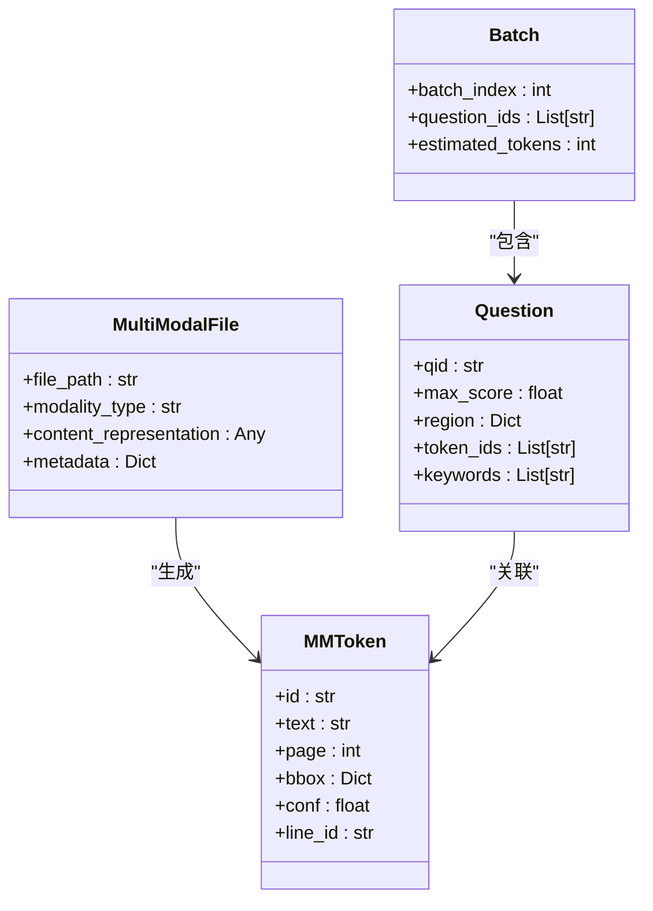

**图表来源**
- [state.py](file://ai_correction/functions/langgraph/state.py#L269-L290)
- [multimodal_models.py](file://ai_correction/functions/langgraph/multimodal_models.py#L15-L100)

**章节来源**
- [multimodal_models.py](file://ai_correction/functions/langgraph/multimodal_models.py#L15-L100)

## 评分结果模型

### Evaluation 类详解

`Evaluation`类是批改结果的核心数据结构，支持高效模式和专业模式两种输出格式。

#### 基础评分字段

| 字段名 | 类型 | 描述 | 应用场景 |
|--------|------|------|----------|
| `qid` | str | 题号标识 | 区分不同题目 |
| `score` | float | 实际得分 | 量化学生表现 |
| `max_score` | float | 最大分值 | 计算得分比例 |
| `label` | str | 评分状态 | correct/partial/wrong |
| `rubric_item_id` | str | 触发的评分项ID | 跟踪评分依据 |
| `error_token_ids` | List[str] | 错误token ID列表 | 精确定位错误 |

#### 专业模式扩展字段

| 字段名 | 类型 | 描述 | 用途 |
|--------|------|------|------|
| `summary` | Optional[str] | 答案摘要 | 提供答案概览 |
| `error_analysis` | Optional[List[Dict]] | 错误详情解析 | 深度错误分析 |
| `comment` | Optional[str] | 个人评价 | 给出具体建议 |

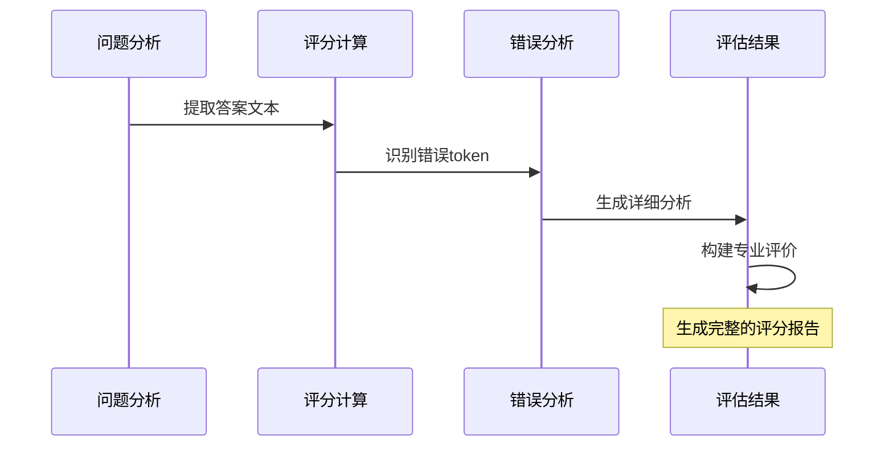

**图表来源**
- [evaluate_batch.py](file://ai_correction/functions/langgraph/agents/evaluate_batch.py#L150-L200)

**章节来源**
- [evaluate_batch.py](file://ai_correction/functions/langgraph/agents/evaluate_batch.py#L150-L256)

### 评分计算逻辑

系统采用基于评分标准的精细化评分机制，而非简单的答案对比。

#### 评分算法流程

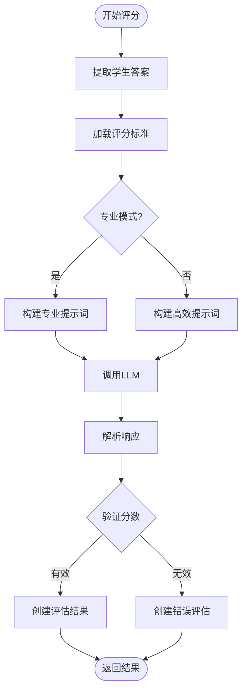

**图表来源**
- [evaluate_batch.py](file://ai_correction/functions/langgraph/agents/evaluate_batch.py#L40-L120)

## 精细化评估模型

### CriteriaEvaluation 类

`CriteriaEvaluation`实现了基于评分标准的精细化评估，提供了详细的评分依据和改进建议。

#### 评分标准评估字段

| 字段名 | 类型 | 描述 | 评分维度 |
|--------|------|------|----------|
| `criterion_id` | str | 评分点唯一标识 | 精确定位 |
| `is_met` | bool | 是否满足评分要求 | 符合性判断 |
| `satisfaction_level` | str | 满足程度 | 完全/部分/不满足 |
| `score_earned` | float | 实际获得分数 | 量化得分 |
| `justification` | str | 评分理由 | 透明度保证 |
| `evidence` | List[str] | 证据列表 | 可追溯性 |
| `suggestions` | Optional[List[str]] | 改进建议 | 教育价值 |

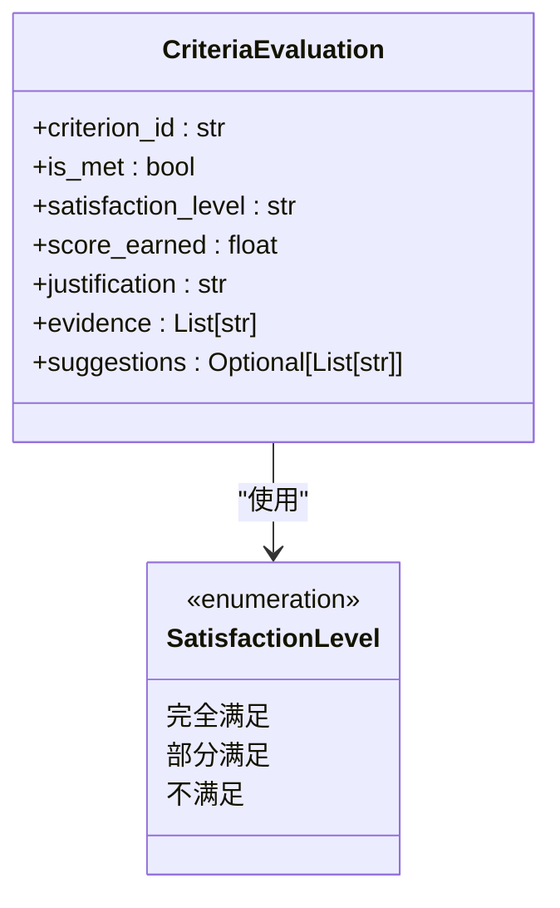

**图表来源**
- [multimodal_models.py](file://ai_correction/functions/langgraph/multimodal_models.py#L162-L170)

#### 评分点创建工厂函数

系统提供了专门的工厂函数来创建`CriteriaEvaluation`对象，确保评分结果的一致性和完整性。

**章节来源**
- [multimodal_models.py](file://ai_correction/functions/langgraph/multimodal_models.py#L162-L306)

## 错误分析与标注模型

### Annotation 类

`Annotation`类用于在图片上标记错误位置，支持精确的错误定位和可视化展示。

#### 坐标标注字段设计

| 字段名 | 类型 | 描述 | 技术实现 |
|--------|------|------|----------|
| `annotation_id` | str | 标注唯一标识 | 自动生成ID |
| `qid` | str | 题号 | 关联题目 |
| `page` | int | 页码 | 多页文档支持 |
| `bbox` | Dict[str, float] | 坐标 {x1, y1, x2, y2} | 像素坐标系 |
| `hint` | str | 提示信息 | 用户友好描述 |
| `error_type` | str | 错误类型 | 分类标识 |

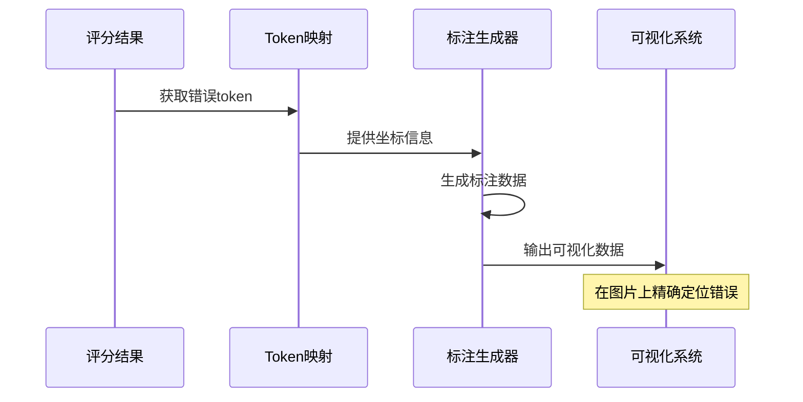

**图表来源**
- [aggregate_results.py](file://ai_correction/functions/langgraph/agents/aggregate_results.py#L86-L100)

**章节来源**
- [state.py](file://ai_correction/functions/langgraph/state.py#L221-L231)

### ErrorAnalysis 类

`ErrorAnalysis`类提供了详细的错题分析功能，支持错误分类、严重程度评估和改进建议生成。

#### 错误分析字段结构

| 字段名 | 类型 | 描述 | 分析维度 |
|--------|------|------|----------|
| `error_id` | str | 错误唯一标识 | 错误追踪 |
| `error_type` | str | 错误类型 | 分类分析 |
| `error_description` | str | 错误描述 | 问题描述 |
| `correct_solution` | str | 正确解答 | 标准答案 |
| `knowledge_gaps` | List[str] | 知识缺陷列表 | 知识点分析 |
| `remediation_plan` | List[str] | 补救计划列表 | 改进方案 |
| `root_cause` | str | 根本原因 | 深度分析 |
| `severity` | str | 严重程度 | 影响评估 |
| `confidence` | float | 置信度 | 分析可信度 |

**章节来源**
- [state.py](file://ai_correction/functions/langgraph/state.py#L249-L262)

## 知识点挖掘模型

### KnowledgePoint 类

`KnowledgePoint`类实现了知识点挖掘功能，支持学科分类、难度评估和学习建议生成。

#### 知识点数据结构

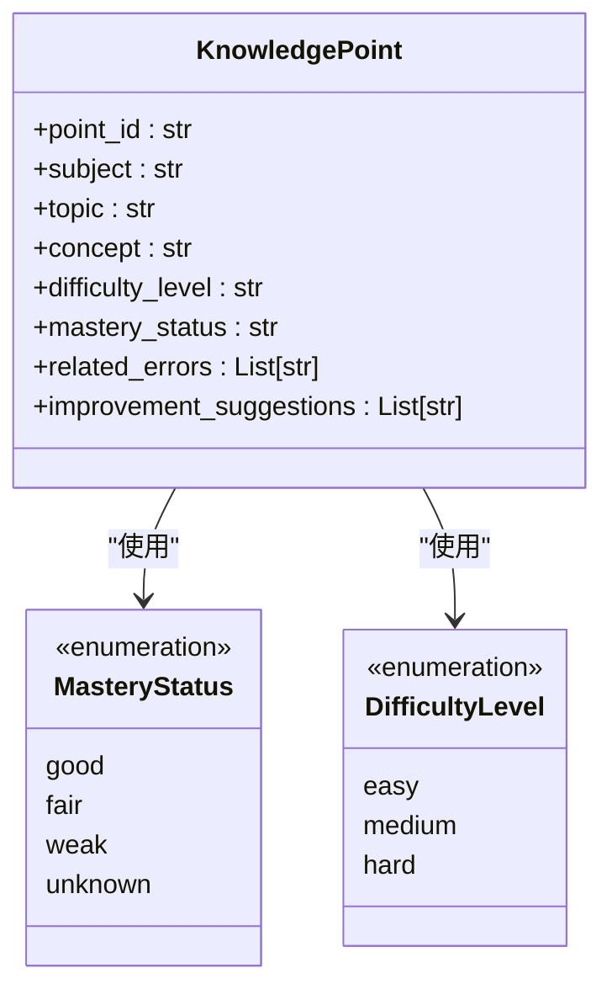

**图表来源**
- [state.py](file://ai_correction/functions/langgraph/state.py#L234-L246)

#### 知识点分类体系

系统支持多学科的知识点分类，涵盖数学、物理、化学等主要学科领域。

| 学科 | 主要分类 | 关键概念 |
|------|----------|----------|
| 数学 | 代数、几何、概率统计、微积分 | 方程、函数、向量、极限 |
| 物理 | 力学、电磁学、热学、光学 | 运动、电场、分子动理论、光 |
| 化学 | 无机化学、有机化学、物理化学 | 元素、官能团、化学平衡 |

**章节来源**
- [knowledge_miner.py](file://ai_correction/functions/langgraph/agents/knowledge_miner.py#L30-L50)

### 错题分析算法

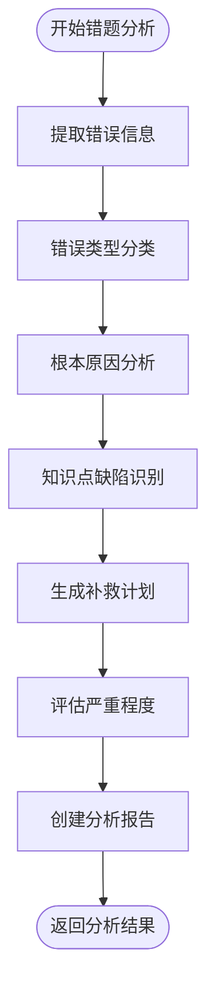

**图表来源**
- [knowledge_miner.py](file://ai_correction/functions/langgraph/agents/knowledge_miner.py#L100-L200)

**章节来源**
- [knowledge_miner.py](file://ai_correction/functions/langgraph/agents/knowledge_miner.py#L100-L300)

## 结果聚合机制

### _evaluate_all_batches 方法

系统通过并行处理机制实现高效的批改结果聚合，支持大规模作业的快速处理。

#### 并行处理架构

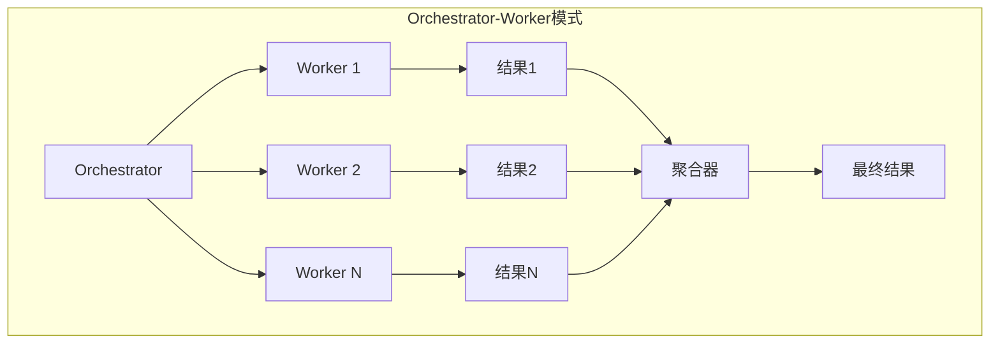

**图表来源**
- [workflow_new.py](file://ai_correction/functions/langgraph/workflow_new.py#L92-L125)
- [routing.py](file://ai_correction/functions/langgraph/routing.py#L114-L153)

#### 聚合算法实现

系统采用分布式聚合策略，支持实时结果收集和增量更新。

**章节来源**
- [workflow_new.py](file://ai_correction/functions/langgraph/workflow_new.py#L66-L125)
- [routing.py](file://ai_correction/functions/langgraph/routing.py#L194-L237)

### AggregateResultsAgent

`AggregateResultsAgent`负责收集所有worker的评分结果，计算总分，生成坐标标注和学生评价。

#### 聚合流程

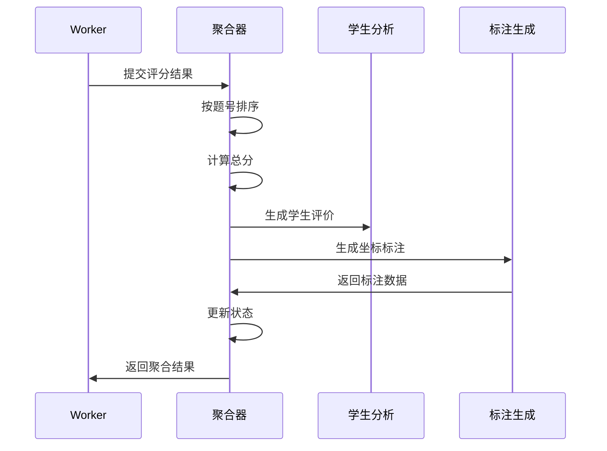

**图表来源**
- [aggregate_results.py](file://ai_correction/functions/langgraph/agents/aggregate_results.py#L20-L80)

**章节来源**
- [aggregate_results.py](file://ai_correction/functions/langgraph/agents/aggregate_results.py#L20-L131)

## 数据序列化与导出

### BuildExportPayloadAgent

`BuildExportPayloadAgent`负责将批改结果格式化为班级系统API规范，支持多种导出格式。

#### 导出数据结构

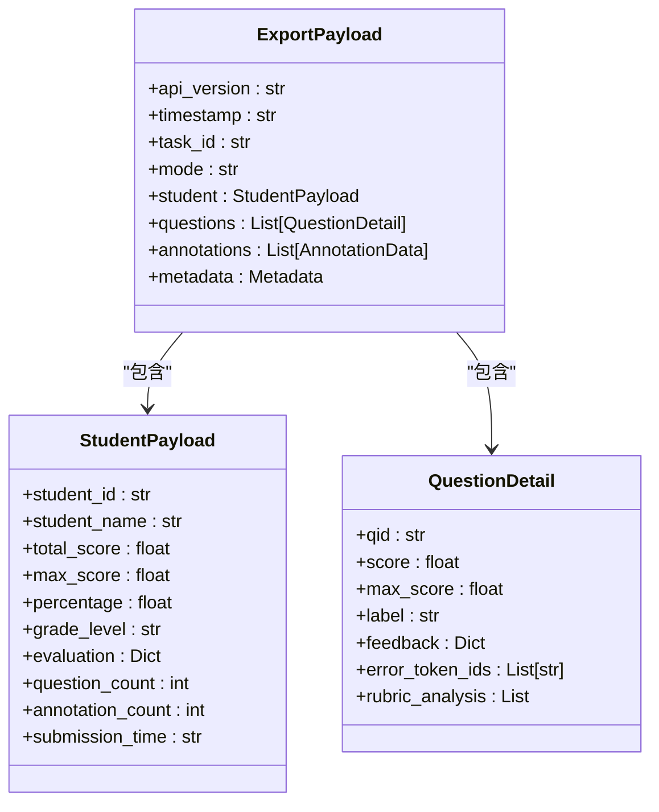

**图表来源**
- [build_export_payload.py](file://ai_correction/functions/langgraph/agents/build_export_payload.py#L40-L80)

#### 导出功能特性

| 功能 | 描述 | 应用场景 |
|------|------|----------|
| JSON导出 | 将结果导出为JSON格式 | 数据备份和传输 |
| 学生报告 | 生成个性化学生报告 | 成绩单和反馈 |
| 班级统计 | 生成班级整体统计 | 教学质量分析 |
| 可视化数据 | 提供图表所需数据 | 数据可视化 |

**章节来源**
- [build_export_payload.py](file://ai_correction/functions/langgraph/agents/build_export_payload.py#L40-L170)

### 结果组装流程

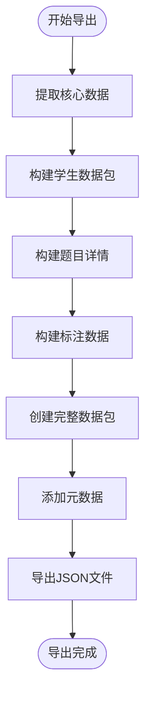

**图表来源**
- [build_export_payload.py](file://ai_correction/functions/langgraph/agents/build_export_payload.py#L40-L100)

## 最佳实践

### 评分结果优化

1. **精度控制**：合理设置分数精度，避免过度细分
2. **一致性保证**：确保同一评分标准下的评分一致性
3. **可解释性**：提供清晰的评分理由和证据

### 错误分析策略

1. **分类体系**：建立完善的错误类型分类体系
2. **严重程度评估**：基于错误影响程度进行分级
3. **改进建议**：提供具体可行的学习建议

### 知识点挖掘

1. **学科覆盖**：确保知识点分类的学科完整性
2. **难度评估**：基于学生表现动态调整难度
3. **关联分析**：挖掘知识点间的关联关系

### 数据导出规范

1. **格式标准化**：遵循班级系统API规范
2. **元数据完整**：包含必要的任务和学生信息
3. **版本兼容**：支持API版本升级

## 总结

AI批改系统通过精心设计的多层数据模型，实现了从基础评分到深度分析的完整批改流程。`Evaluation`类提供了灵活的基础评分能力，`CriteriaEvaluation`实现了精细化的评分标准对照，`Annotation`类支持精确的错误定位，`KnowledgePoint`类提供了强大的知识点挖掘功能。

系统采用并行处理架构，支持大规模作业的高效批改；通过专业的结果聚合和导出机制，确保了数据的完整性和可用性。这种设计不仅提高了批改效率，还为教学分析和个性化辅导提供了强有力的数据支撑。