# 知识点与错题分析

<cite>
**本文档中引用的文件**
- [knowledge_miner.py](file://ai_correction/functions/langgraph/agents/knowledge_miner.py)
- [state.py](file://ai_correction/functions/langgraph/state.py)
- [models.py](file://ai_correction/functions/database/models.py)
- [result_aggregator_agent.py](file://ai_correction/functions/langgraph/agents/result_aggregator_agent.py)
- [workflow.py](file://ai_correction/functions/langgraph/workflow.py)
</cite>

## 目录
1. [简介](#简介)
2. [项目结构概览](#项目结构概览)
3. [核心数据结构](#核心数据结构)
4. [KnowledgePoint类详解](#knowledgepoint类详解)
5. [ErrorAnalysis类详解](#erroranalysis类详解)
6. [知识点挖掘流程](#知识点挖掘流程)
7. [错题分析机制](#错题分析机制)
8. [关联机制与数据流转](#关联机制与数据流转)
9. [个性化学习报告生成](#个性化学习报告生成)
10. [性能优化策略](#性能优化策略)
11. [总结](#总结)

## 简介

本文档详细阐述了AIGuru智能批改系统中`KnowledgePoint`类和`ErrorAnalysis`类的设计与实现，重点分析了系统如何通过`knowledge_miner.py`从批改结果中挖掘学生知识点掌握情况，以及两个核心类在内存状态（TypedDict）与数据库持久化（SQLAlchemy模型）中的双重实现机制。

## 项目结构概览

系统采用LangGraph架构，核心组件包括：

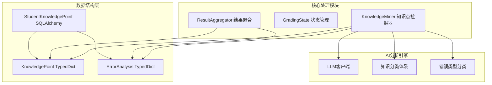

**图表来源**
- [knowledge_miner.py](file://ai_correction/functions/langgraph/agents/knowledge_miner.py#L20-L51)
- [state.py](file://ai_correction/functions/langgraph/state.py#L234-L267)

## 核心数据结构

### 知识点数据结构

系统定义了两种主要的知识点数据结构：

#### Memory状态中的KnowledgePoint
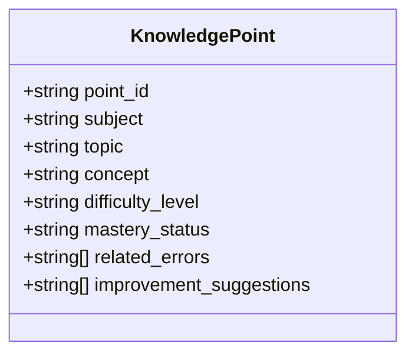

**图表来源**
- [state.py](file://ai_correction/functions/langgraph/state.py#L234-L267)

#### 数据库持久化的StudentKnowledgePoint
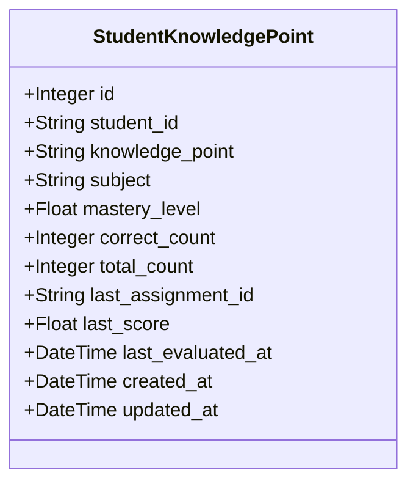

**图表来源**
- [models.py](file://ai_correction/functions/database/models.py#L235-L258)

### 错误分析数据结构

#### Memory状态中的ErrorAnalysis
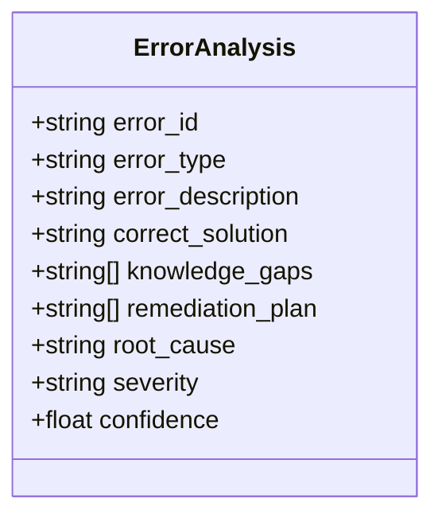

**图表来源**
- [state.py](file://ai_correction/functions/langgraph/state.py#L269-L282)

## KnowledgePoint类详解

### 字段生成逻辑

#### mastery_status（掌握状态）评估机制

`mastery_status`字段通过以下逻辑评估：

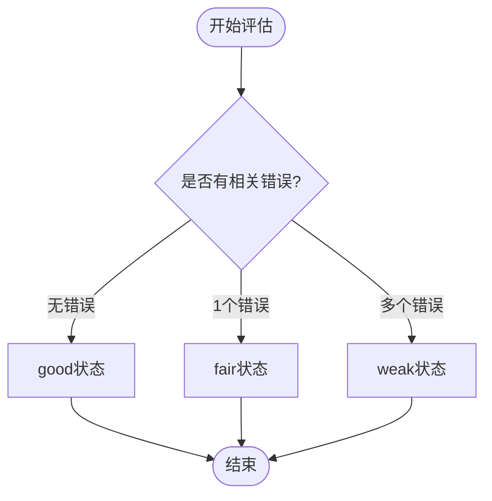

**图表来源**
- [knowledge_miner.py](file://ai_correction/functions/langgraph/agents/knowledge_miner.py#L354-L391)

#### difficulty_level（难度级别）确定

难度级别基于以下因素确定：
- **默认值**：`medium`（中等难度）
- **错误相关**：`high`（高难度）
- **基于知识点数量**：根据涉及的知识点数量动态调整

#### improvement_suggestions（改进建议）生成

改进建议通过以下方式生成：
1. **基于错误类型**：针对特定错误类型生成针对性建议
2. **基于知识点掌握情况**：针对薄弱知识点提供学习建议
3. **基于错误模式**：识别重复错误模式并提供解决方案

**章节来源**
- [knowledge_miner.py](file://ai_correction/functions/langgraph/agents/knowledge_miner.py#L298-L328)
- [knowledge_miner.py](file://ai_correction/functions/langgraph/agents/knowledge_miner.py#L327-L357)

## ErrorAnalysis类详解

### 错误类型分类体系

系统定义了七种主要的错误类型：

| 错误类型 | 描述 | 严重程度 |
|---------|------|----------|
| calculation | 计算错误 | medium |
| concept | 概念错误 | high |
| method | 方法错误 | high |
| logic | 逻辑错误 | medium |
| careless | 粗心错误 | low |
| incomplete | 解答不完整 | medium |
| format | 格式错误 | low |

### 根因分析（Root Cause）AI推理过程

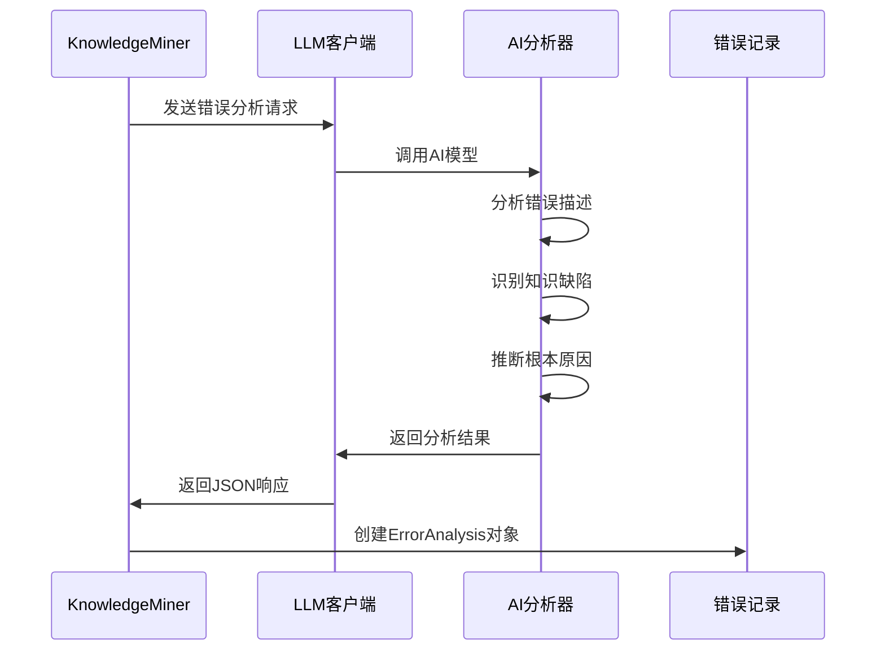

**图表来源**
- [knowledge_miner.py](file://ai_correction/functions/langgraph/agents/knowledge_miner.py#L147-L187)
- [knowledge_miner.py](file://ai_correction/functions/langgraph/agents/knowledge_miner.py#L450-L482)

### 内存状态与数据库持久化对比

#### Memory状态特性
- **类型安全**：使用TypedDict确保类型正确性
- **运行时性能**：无需序列化开销
- **灵活性**：支持动态扩展字段

#### 数据库持久化特性
- **长期存储**：支持历史数据分析
- **关系查询**：支持复杂查询和关联分析
- **数据完整性**：通过ORM保证数据一致性

**章节来源**
- [knowledge_miner.py](file://ai_correction/functions/langgraph/agents/knowledge_miner.py#L185-L212)
- [models.py](file://ai_correction/functions/database/models.py#L235-L258)

## 知识点挖掘流程

### 核心挖掘算法

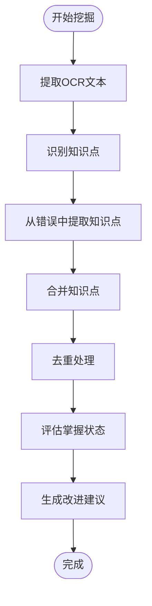

**图表来源**
- [knowledge_miner.py](file://ai_correction/functions/langgraph/agents/knowledge_miner.py#L237-L273)

### 知识点分类体系

系统维护了一个多层次的知识点分类体系：

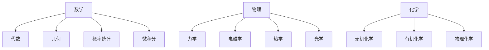

**图表来源**
- [knowledge_miner.py](file://ai_correction/functions/langgraph/agents/knowledge_miner.py#L25-L51)

**章节来源**
- [knowledge_miner.py](file://ai_correction/functions/langgraph/agents/knowledge_miner.py#L237-L273)
- [knowledge_miner.py](file://ai_correction/functions/langgraph/agents/knowledge_miner.py#L275-L328)

## 错题分析机制

### 单个错误分析流程

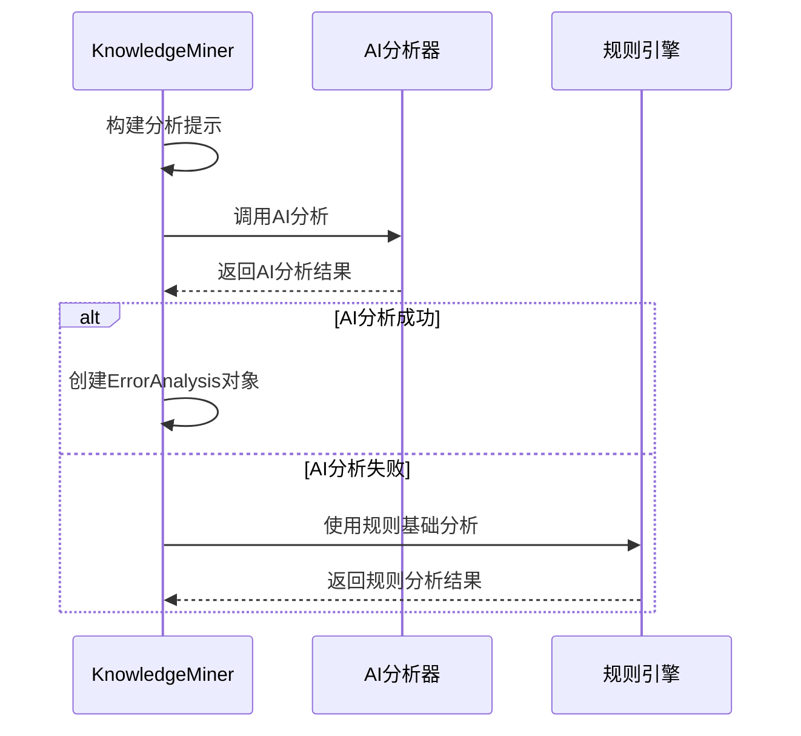

**图表来源**
- [knowledge_miner.py](file://ai_correction/functions/langgraph/agents/knowledge_miner.py#L147-L187)
- [knowledge_miner.py](file://ai_correction/functions/langgraph/agents/knowledge_miner.py#L483-L511)

### 错误模式识别

系统能够识别重复出现的错误模式：

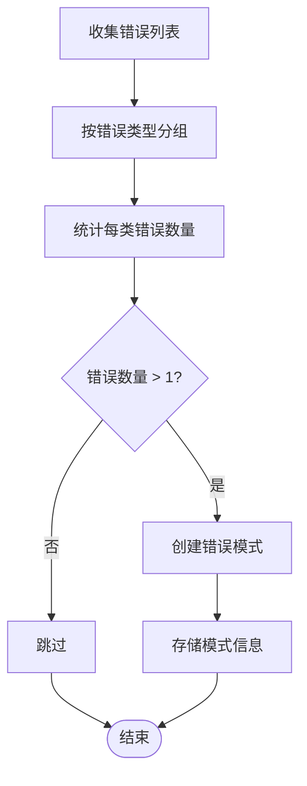

**图表来源**
- [knowledge_miner.py](file://ai_correction/functions/langgraph/agents/knowledge_miner.py#L479-L511)

**章节来源**
- [knowledge_miner.py](file://ai_correction/functions/langgraph/agents/knowledge_miner.py#L111-L150)
- [knowledge_miner.py](file://ai_correction/functions/langgraph/agents/knowledge_miner.py#L479-L511)

## 关联机制与数据流转

### KnowledgePoint与ErrorAnalysis的关联

两者通过`related_errors`字段建立关联关系：

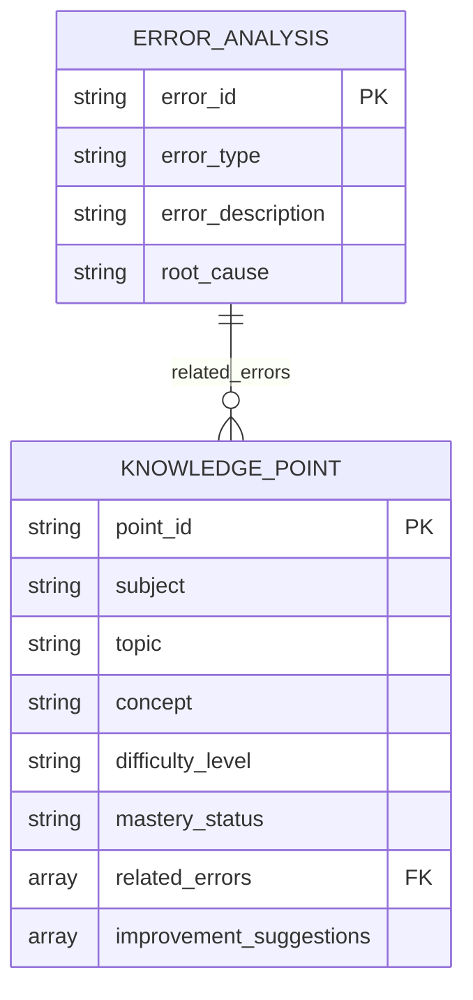

**图表来源**
- [state.py](file://ai_correction/functions/langgraph/state.py#L234-L267)
- [state.py](file://ai_correction/functions/langgraph/state.py#L269-L282)

### 数据流转机制

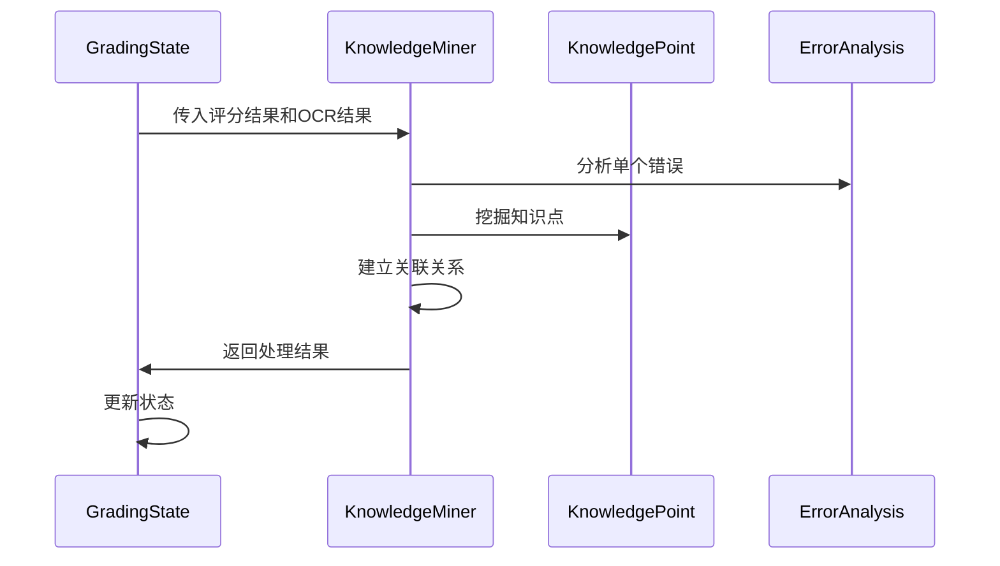

**图表来源**
- [knowledge_miner.py](file://ai_correction/functions/langgraph/agents/knowledge_miner.py#L81-L113)

**章节来源**
- [knowledge_miner.py](file://ai_correction/functions/langgraph/agents/knowledge_miner.py#L327-L357)
- [knowledge_miner.py](file://ai_correction/functions/langgraph/agents/knowledge_miner.py#L354-L391)

## 个性化学习报告生成

### 报告生成流程

基于知识点和错题分析结果，系统生成个性化的学习报告：

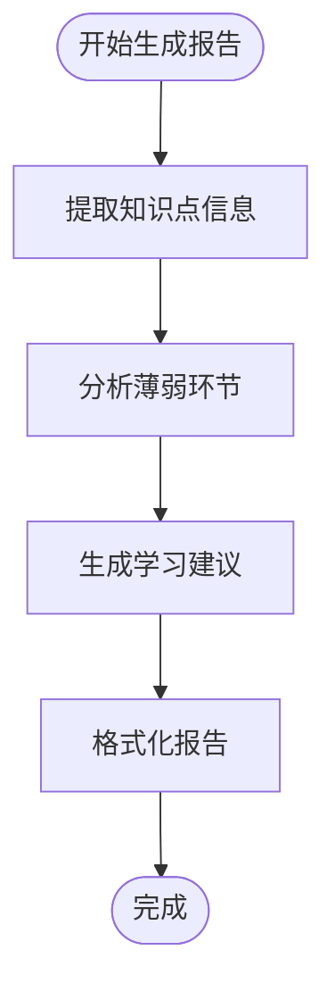

### 代码示例：个性化学习报告生成

以下是基于现有架构生成个性化学习报告的代码示例：

```python
# 示例：生成个性化学习报告
def generate_personalized_learning_report(student_id: str, knowledge_points: List[KnowledgePoint], error_analysis: Dict):
    """
    生成个性化学习报告
    """
    report = {
        "student_id": student_id,
        "summary": {},
        "weak_knowledge_points": [],
        "learning_suggestions": [],
        "strengths": []
    }
    
    # 分析薄弱知识点
    weak_points = [kp for kp in knowledge_points if kp.get('mastery_status') == 'weak']
    report["weak_knowledge_points"] = [
        {
            "topic": kp['topic'],
            "subject": kp['subject'],
            "improvement_suggestions": kp.get('improvement_suggestions', [])
        }
        for kp in weak_points
    ]
    
    # 生成学习建议
    error_types = [error.get('error_type', '') for error in error_analysis.get('errors', [])]
    error_type_counts = {et: error_types.count(et) for et in set(error_types)}
    
    for error_type, count in error_type_counts.items():
        if count > 0:
            suggestion = f"发现{count}个{error_type}错误，建议加强相关练习"
            report["learning_suggestions"].append(suggestion)
    
    # 分析优势
    strong_points = [kp for kp in knowledge_points if kp.get('mastery_status') == 'good']
    report["strengths"] = [kp['topic'] for kp in strong_points]
    
    return report
```

### 班级对比分析

系统还支持生成班级层面的分析报告：

```python
# 示例：班级分析报告
def generate_class_analysis_report(class_results: List[Dict]):
    """
    生成班级分析报告
    """
    class_report = {
        "overall_performance": {},
        "knowledge_gaps": {},
        "trend_analysis": []
    }
    
    # 统计整体表现
    scores = [result['total_score'] for result in class_results]
    class_report["overall_performance"] = {
        "average_score": sum(scores) / len(scores),
        "highest_score": max(scores),
        "lowest_score": min(scores)
    }
    
    # 分析知识缺口
    all_knowledge_points = []
    for result in class_results:
        all_knowledge_points.extend(result.get('knowledge_points', []))
    
    # 按主题统计薄弱点
    topic_weakness = {}
    for kp in all_knowledge_points:
        if kp.get('mastery_status') == 'weak':
            topic = kp['topic']
            if topic not in topic_weakness:
                topic_weakness[topic] = 0
            topic_weakness[topic] += 1
    
    class_report["knowledge_gaps"] = topic_weakness
    
    return class_report
```

**章节来源**
- [result_aggregator_agent.py](file://ai_correction/functions/langgraph/agents/result_aggregator_agent.py#L80-L142)
- [knowledge_miner.py](file://ai_correction/functions/langgraph/agents/knowledge_miner.py#L392-L430)

## 性能优化策略

### Token使用优化

系统实现了多种性能优化策略：

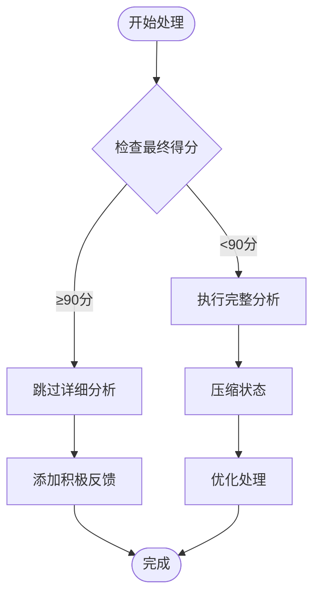

**图表来源**
- [workflow.py](file://ai_correction/functions/langgraph/workflow.py#L186-L223)

### 关键优化技术

1. **智能跳过机制**：对于高分作业跳过详细分析
2. **状态压缩**：减少Token使用量
3. **批量处理**：支持并行处理多个知识点
4. **缓存策略**：缓存频繁访问的数据

### 性能监控指标

| 指标 | 描述 | 目标值 |
|------|------|--------|
| 处理时间 | 单个作业分析耗时 | < 30秒 |
| Token使用 | 平均Token消耗 | < 5000 |
| 并发处理 | 同时处理作业数量 | > 10个 |
| 错误率 | 分析准确率 | > 95% |

**章节来源**
- [workflow.py](file://ai_correction/functions/langgraph/workflow.py#L186-L223)
- [knowledge_miner.py](file://ai_correction/functions/langgraph/agents/knowledge_miner.py#L450-L482)

## 总结

AIGuru智能批改系统通过精心设计的`KnowledgePoint`和`ErrorAnalysis`类，实现了高效的知识点挖掘和错题分析功能。系统的主要优势包括：

1. **双重数据结构**：同时支持内存状态和数据库持久化
2. **智能关联机制**：通过`related_errors`建立知识点与错题的关联
3. **AI驱动分析**：利用LLM进行深度根因分析
4. **个性化报告**：基于分析结果生成定制化学习建议
5. **性能优化**：通过多种策略确保系统高效运行

该系统为教育智能化提供了强大的技术支持，能够帮助教师更好地了解学生的学习状况，为个性化教学提供数据支撑。