# 评分与评估结果

<cite>
**本文档引用的文件**
- [state.py](file://ai_correction/functions/langgraph/state.py)
- [multimodal_models.py](file://ai_correction/functions/langgraph/multimodal_models.py)
- [evaluate_batch.py](file://ai_correction/functions/langgraph/agents/evaluate_batch.py)
- [scoring_agent.py](file://ai_correction/functions/langgraph/agents/scoring_agent.py)
- [result_assembler.py](file://ai_correction/functions/langgraph/agents/result_assembler.py)
- [build_export_payload.py](file://ai_correction/functions/langgraph/agents/build_export_payload.py)
- [push_to_class_system.py](file://ai_correction/functions/langgraph/agents/push_to_class_system.py)
- [efficient_mode.py](file://ai_correction/functions/langgraph/prompts/efficient_mode.py)
- [professional_mode.py](file://ai_correction/functions/langgraph/prompts/professional_mode.py)
- [test_scoring.py](file://ai_correction/test_scoring.py)
</cite>

## 目录
1. [简介](#简介)
2. [Evaluation类核心字段详解](#evaluation类核心字段详解)
3. [高效模式与专业模式差异化](#高效模式与专业模式差异化)
4. [CriteriaEvaluation细粒度评估](#criteriavaluation细粒度评估)
5. [_evaluate_all_batches工作流节点](#_evaluate_all_batches工作流节点)
6. [评分数据序列化与导出](#评分数据序列化与导出)
7. [与外部系统集成](#与外部系统集成)
8. [错误回溯与调试](#错误回溯与调试)
9. [最佳实践示例](#最佳实践示例)
10. [总结](#总结)

## 简介

AI批改系统的核心评分与评估机制基于`Evaluation`类和`CriteriaEvaluation`类构建，实现了从基础得分到详细反馈的完整评分体系。系统支持高效模式和专业模式两种批改策略，在保证评分准确性的同时，提供了灵活的性能优化选项。

## Evaluation类核心字段详解

### 核心评分字段

`Evaluation`类是评分结果的基础数据结构，包含了评分过程中的关键信息：

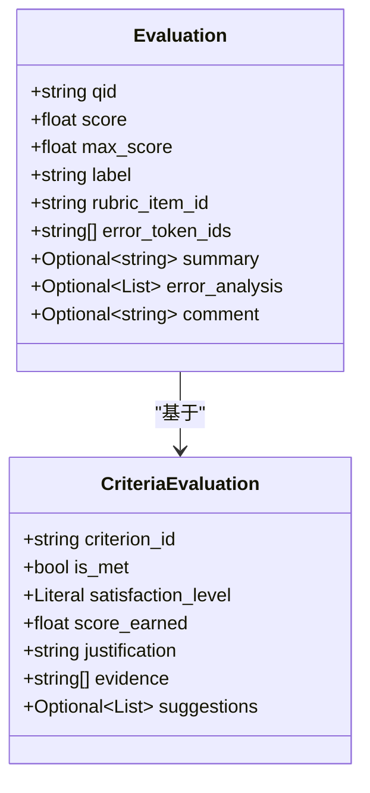

**图表来源**
- [state.py](file://ai_correction/functions/langgraph/state.py#L203-L218)
- [multimodal_models.py](file://ai_correction/functions/langgraph/multimodal_models.py#L162-L170)

#### score字段
- **业务含义**: 实际获得的分数，范围通常为0到max_score
- **计算逻辑**: 基于AI评分算法得出的具体得分值
- **精度**: 保留小数点后两位，支持精确评分

#### max_score字段  
- **业务含义**: 该题目的满分值，定义了评分的上限
- **设置原则**: 根据评分标准中的各项要求确定
- **验证机制**: 系统会验证score不超过max_score

#### label字段
- **业务含义**: 评分结果的状态标签，指示答案的整体质量
- **可选值**: 
  - `"correct"`: 完全正确
  - `"partial"`: 部分正确
  - `"wrong"`: 完全错误
  - `"error"`: 评分过程中出现错误

#### error_token_ids字段
- **业务含义**: 标记答案中存在错误的token ID列表
- **技术实现**: 基于多模态模型的文本定位能力
- **应用场景**: 支持在作业图片上精确定位错误位置

**章节来源**
- [state.py](file://ai_correction/functions/langgraph/state.py#L203-L218)

### 专业模式扩展字段

专业模式下，`Evaluation`类扩展了三个重要字段：

#### summary字段
- **业务含义**: 答案的摘要描述，概括学生作答的主要内容
- **生成方式**: 基于AI对答案内容的理解和提炼
- **用途**: 帮助教师快速了解学生作答情况

#### error_analysis字段
- **业务含义**: 详细的错误分析列表，包含每个错误的完整信息
- **结构组成**: 
  - `error_id`: 错误唯一标识
  - `token_ids`: 错误位置的token ID
  - `description`: 错误描述
  - `correct_solution`: 正确解法
  - `reason`: 原因分析

#### comment字段
- **业务含义**: 教师对学生的个性化评价和建议
- **生成策略**: 结合评分结果和学生表现综合生成
- **教学价值**: 提供针对性的学习建议

**章节来源**
- [state.py](file://ai_correction/functions/langgraph/state.py#L216-L218)

## 高效模式与专业模式差异化

### 模式对比矩阵

| 对比维度 | 高效模式 | 专业模式 |
|----------|----------|----------|
| **目标** | 快速批改，节省Token | 详细反馈，教学建议 |
| **Token消耗** | ~500/题 | ~1500/题 |
| **输出复杂度** | 简洁评分 | 完整评价结构 |
| **处理时间** | 2秒 | 5秒 |
| **适用场景** | 大规模批改(50+份) | 小班教学(<30份) |
| **并行加速** | 6.7x | 6.7x |

### 提示词设计差异

#### 高效模式提示词特点
- **简洁性**: 专注于核心评分信息
- **格式要求**: 严格的JSON输出格式
- **输出内容**: 仅包含评分结果和错误标记

```mermaid
flowchart TD
A["高效模式输入"] --> B["评分标准<br/>题目信息<br/>学生答案"]
B --> C["简洁提示词模板"]
C --> D["AI评分模型"]
D --> E["JSON格式输出<br/>{<br/> \"qid\": \"Q1\",<br/> \"score\": 8,<br/> \"max_score\": 10,<br/> \"label\": \"correct\",<br/> \"error_token_ids\": [...]<br/>}"]
```

**图表来源**
- [efficient_mode.py](file://ai_correction/functions/langgraph/prompts/efficient_mode.py#L0-L47)

#### 专业模式提示词特点
- **完整性**: 包含详细的教学反馈
- **结构化**: 多层次的评价结构
- **教育价值**: 提供具体的学习建议

### 实现机制

系统通过`EvaluateBatchAgent`类实现模式切换：

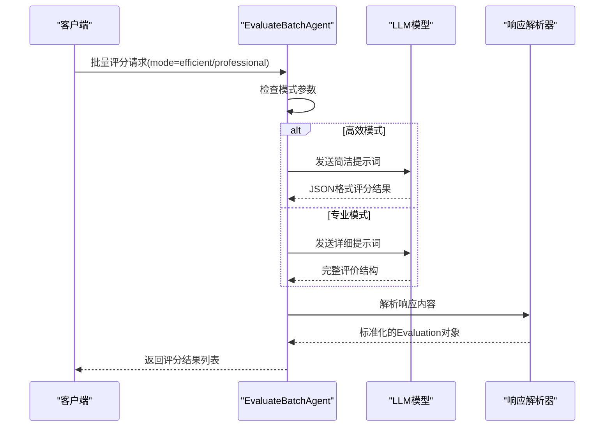

**图表来源**
- [evaluate_batch.py](file://ai_correction/functions/langgraph/agents/evaluate_batch.py#L35-L85)

**章节来源**
- [evaluate_batch.py](file://ai_correction/functions/langgraph/agents/evaluate_batch.py#L132-L185)
- [efficient_mode.py](file://ai_correction/functions/langgraph/prompts/efficient_mode.py#L0-L47)

## CriteriaEvaluation细粒度评估

### 结构化评分标准

`CriteriaEvaluation`类基于`GradingCriterion`实现了细粒度的评分机制：

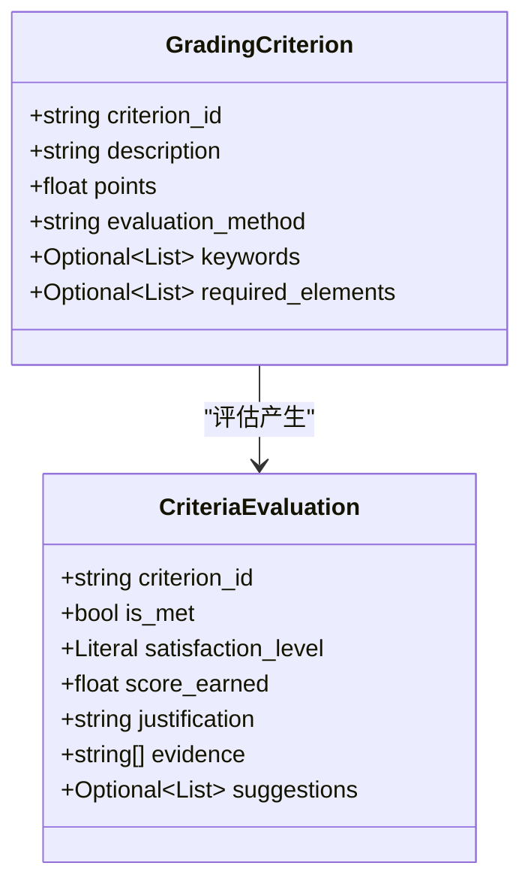

**图表来源**
- [multimodal_models.py](file://ai_correction/functions/langgraph/multimodal_models.py#L150-L157)
- [multimodal_models.py](file://ai_correction/functions/langgraph/multimodal_models.py#L162-L170)

### 评分决策机制

#### satisfaction_level字段
- **完全满足**: 评分点要求完全达成
- **部分满足**: 评分点要求部分达成
- **不满足**: 评分点要求未达成

#### 评分计算逻辑
系统根据`is_met`和`score_earned`自动计算满意度等级：

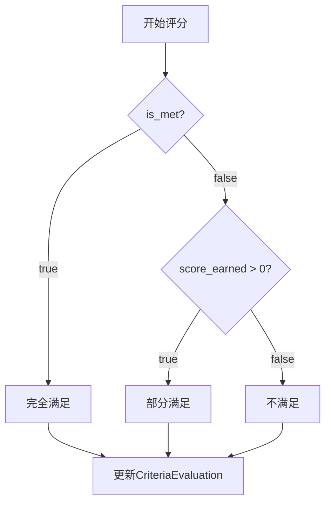

**图表来源**
- [multimodal_models.py](file://ai_correction/functions/langgraph/multimodal_models.py#L279-L305)

### AI评分的可解释性机制

#### justification字段
- **内容构成**: 评分依据和判断理由
- **生成方式**: 基于AI对答案内容的分析
- **教育价值**: 帮助学生理解评分标准

#### evidence字段
- **数据来源**: 从学生答案中提取的关键部分
- **技术实现**: 多模态模型的文本定位能力
- **应用场景**: 支持具体的评分证据展示

#### suggestions字段
- **生成策略**: 基于错误分析和学习建议
- **个性化**: 针对学生的具体表现提供建议
- **实用性**: 可操作的学习改进方案

**章节来源**
- [multimodal_models.py](file://ai_correction/functions/langgraph/multimodal_models.py#L162-L170)
- [multimodal_models.py](file://ai_correction/functions/langgraph/multimodal_models.py#L279-L305)

## _evaluate_all_batches工作流节点

### 批量评分架构

系统采用并行处理架构，通过`_evaluate_all_batches`工作流节点实现高效的批量评分：

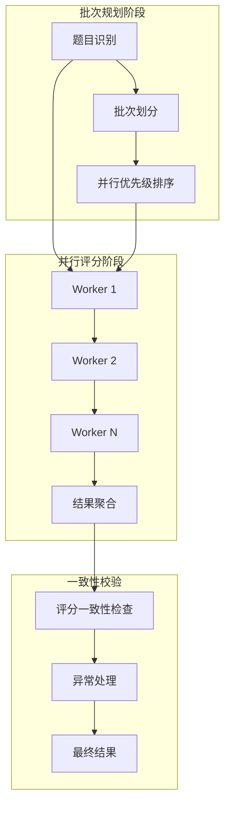

**图表来源**
- [evaluate_batch.py](file://ai_correction/functions/langgraph/agents/evaluate_batch.py#L35-L85)

### 多批次评分结果聚合流程

#### 批次处理机制
1. **题目分组**: 根据难度、题型等因素进行智能分组
2. **并行执行**: 多个Worker同时处理不同批次
3. **结果收集**: 统一收集各批次的评分结果

#### 一致性校验策略
系统实现了多层次的一致性校验：

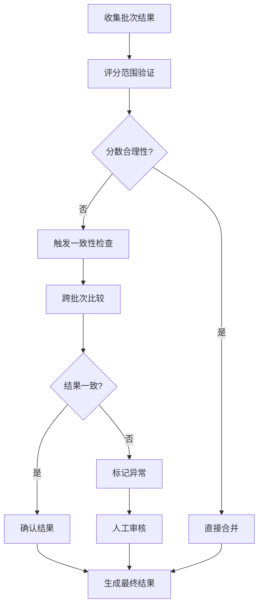

**图表来源**
- [evaluate_batch.py](file://ai_correction/functions/langgraph/agents/evaluate_batch.py#L45-L85)

### 错误处理与重试机制

#### 错误分类
- **临时性错误**: 网络问题、模型超时
- **逻辑性错误**: 输入格式错误、评分标准冲突
- **系统性错误**: 模型故障、资源不足

#### 重试策略
- **指数退避**: 逐步增加重试间隔
- **最大重试**: 防止无限重试
- **熔断机制**: 连续失败时暂停服务

**章节来源**
- [evaluate_batch.py](file://ai_correction/functions/langgraph/agents/evaluate_batch.py#L35-L85)

## 评分数据序列化与导出

### 序列化架构设计

系统提供了完整的评分数据序列化解决方案：

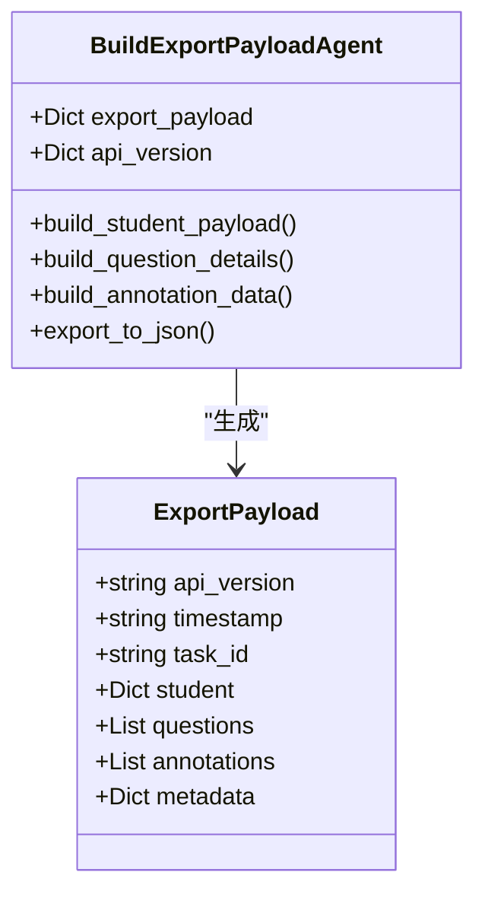

**图表来源**
- [build_export_payload.py](file://ai_correction/functions/langgraph/agents/build_export_payload.py#L20-L50)

### 导出数据结构

#### 学生数据包
包含学生基本信息和总体表现：
- 学生ID和姓名
- 总分和百分比
- 等级评定
- 评价和反馈

#### 题目详情
详细记录每道题的评分信息：
- 题号和得分
- 最大分值
- 评分标签
- 详细反馈
- 错误token ID
- 评分分析

#### 坐标标注数据
支持可视化展示的标注信息：
- 注释ID和题号
- 页面信息
- 边界框坐标
- 提示信息
- 错误类型
- 严重程度

### JSON导出功能

系统提供了便捷的JSON导出功能：

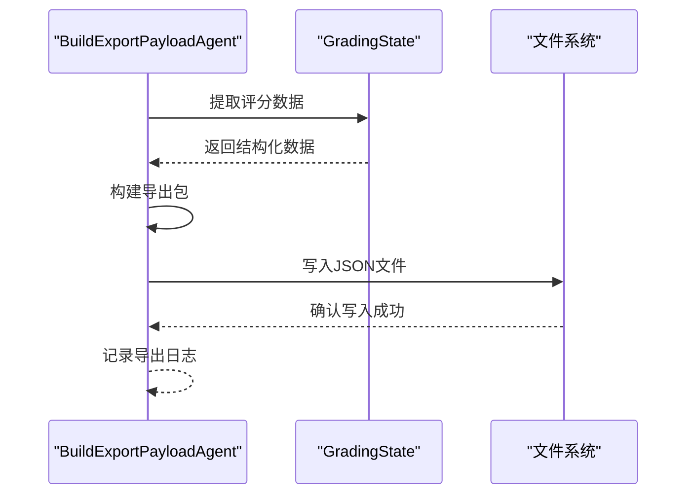

**图表来源**
- [build_export_payload.py](file://ai_correction/functions/langgraph/agents/build_export_payload.py#L150-L170)

**章节来源**
- [build_export_payload.py](file://ai_correction/functions/langgraph/agents/build_export_payload.py#L20-L170)

## 与外部系统集成

### 班级系统API集成

系统提供了完整的班级系统集成解决方案：

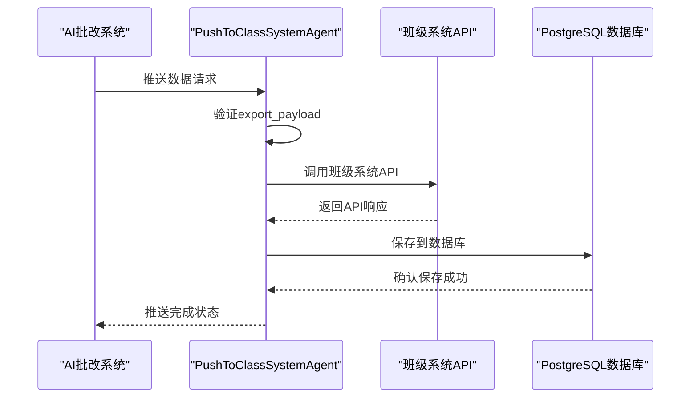

**图表来源**
- [push_to_class_system.py](file://ai_correction/functions/langgraph/agents/push_to_class_system.py#L60-L90)

### 集成配置选项

#### API配置
- **API URL**: 班级系统接口地址
- **认证机制**: 支持多种认证方式
- **超时设置**: 可配置的请求超时时间
- **重试策略**: 自动重试机制

#### 数据库配置
- **连接字符串**: PostgreSQL连接信息
- **表结构**: 自动创建必要的数据表
- **索引优化**: 性能优化的数据库索引
- **备份策略**: 自动备份机制

### Mock测试模式

系统提供了完整的Mock测试支持：

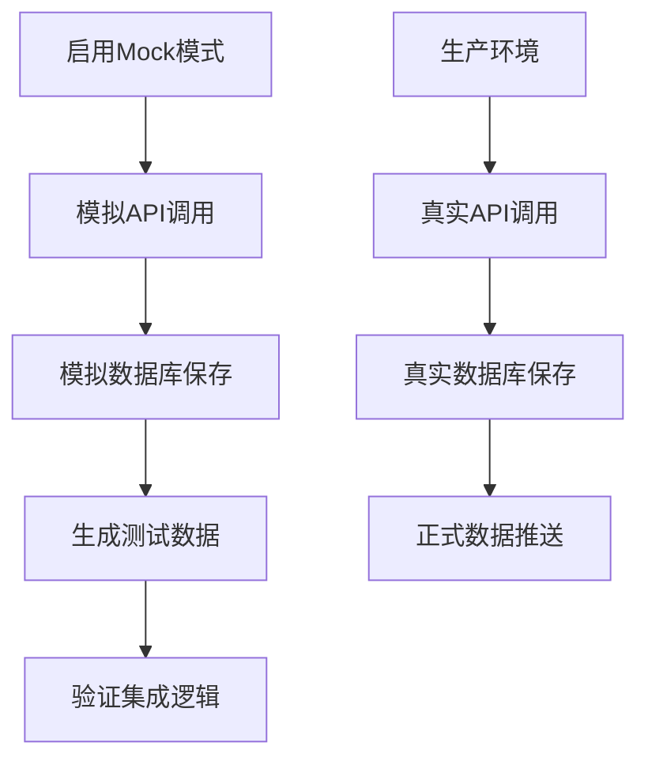

**图表来源**
- [push_to_class_system.py](file://ai_correction/functions/langgraph/agents/push_to_class_system.py#L206-L249)

**章节来源**
- [push_to_class_system.py](file://ai_correction/functions/langgraph/agents/push_to_class_system.py#L20-L90)

## 错误回溯与调试

### 错误处理机制

系统实现了完善的错误处理和回溯机制：

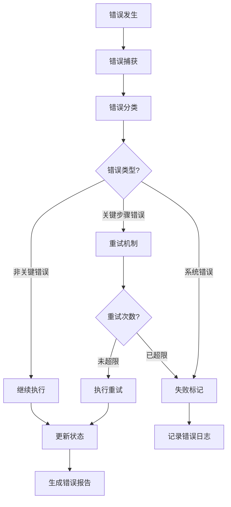

**图表来源**
- [routing.py](file://ai_correction/functions/langgraph/routing.py#L156-L191)

### 调试工具与方法

#### 日志记录系统
- **分级日志**: ERROR、WARNING、INFO、DEBUG级别
- **结构化日志**: JSON格式便于分析
- **上下文信息**: 包含任务ID、步骤信息等
- **性能监控**: 记录处理时间和资源使用

#### 错误分析工具
- **错误追踪**: 自动追踪错误源头
- **影响范围**: 分析错误影响的范围
- **根因分析**: 基于AI的错误原因分析
- **修复建议**: 自动生成修复方案

#### 测试与验证
- **单元测试**: 针对各个组件的测试
- **集成测试**: 端到端的功能测试
- **压力测试**: 大规模并发测试
- **回归测试**: 确保功能稳定性

**章节来源**
- [routing.py](file://ai_correction/functions/langgraph/routing.py#L156-L191)

## 最佳实践示例

### 高效模式批改示例

```python
# 配置高效模式参数
config = {
    'mode': 'efficient',
    'strictness_level': '中等',
    'language': 'zh',
    'max_parallel_workers': 8
}

# 执行批量评分
async def batch_scoring_example():
    agent = EvaluateBatchAgent()
    batch_data = {
        'batch_index': 0,
        'questions': question_list,
        'rubric_struct': rubric_structure,
        'mm_tokens': token_list,
        'mode': 'efficient'
    }
    
    results = await agent(batch_data)
    return results
```

### 专业模式详细反馈示例

```python
# 专业模式配置
professional_config = {
    'mode': 'professional',
    'strictness_level': '严格',
    'language': 'zh',
    'enable_detailed_feedback': True
}

# 获取详细评估结果
async def detailed_evaluation_example():
    agent = ScoringAgent()
    state = {
        'task_id': 'task_001',
        'mode': 'professional',
        'question_files': ['question.txt'],
        'answer_files': ['answer.txt'],
        'marking_files': ['rubric.txt']
    }
    
    result = await agent(state)
    return result['detailed_feedback']
```

### 批量处理最佳实践

#### 性能优化策略
- **并行处理**: 合理设置并行Worker数量
- **内存管理**: 及时释放中间结果
- **缓存机制**: 缓存重复使用的数据
- **负载均衡**: 均衡各Worker的处理量

#### 质量保证措施
- **结果验证**: 自动验证评分结果的合理性
- **人工复核**: 关键评分的人工复核机制
- **持续监控**: 实时监控系统性能指标
- **定期维护**: 定期更新评分标准和模型

**章节来源**
- [test_scoring.py](file://ai_correction/test_scoring.py#L50-L134)

## 总结

AI批改系统的评分与评估机制体现了现代教育技术的先进理念：

### 核心优势
1. **双模式设计**: 高效模式和专业模式满足不同场景需求
2. **细粒度评估**: 基于结构化评分标准的精确评估
3. **可解释性**: 完整的评分理由和证据链
4. **可扩展性**: 支持大规模并行处理
5. **集成能力**: 完善的外部系统集成方案

### 技术创新
- **多模态融合**: 结合文本和图像的综合评估
- **智能提示词**: 针对不同模式的优化提示词设计
- **一致性校验**: 多层次的质量保证机制
- **错误恢复**: 完善的错误处理和恢复策略

### 应用价值
该系统不仅提高了批改效率，更重要的是为教育数字化转型提供了可靠的技术支撑，真正实现了智能化、个性化的教学评估。