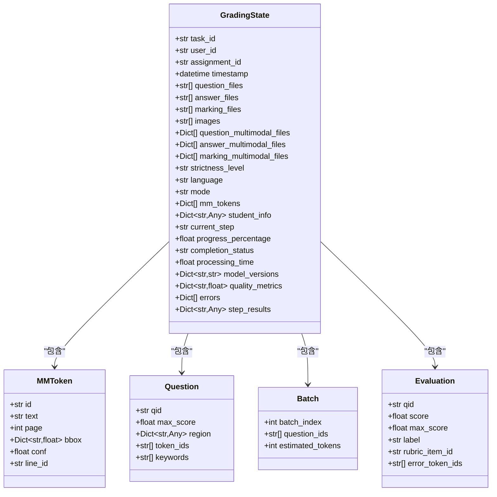
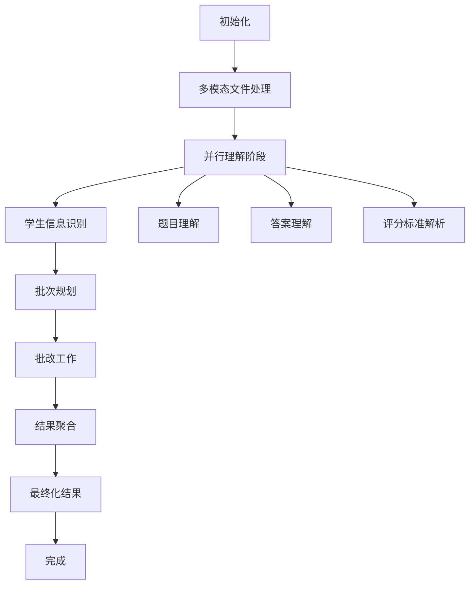
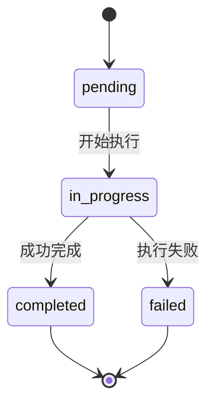
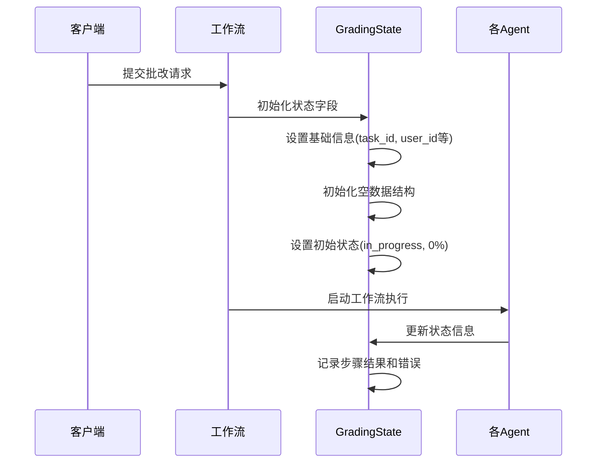
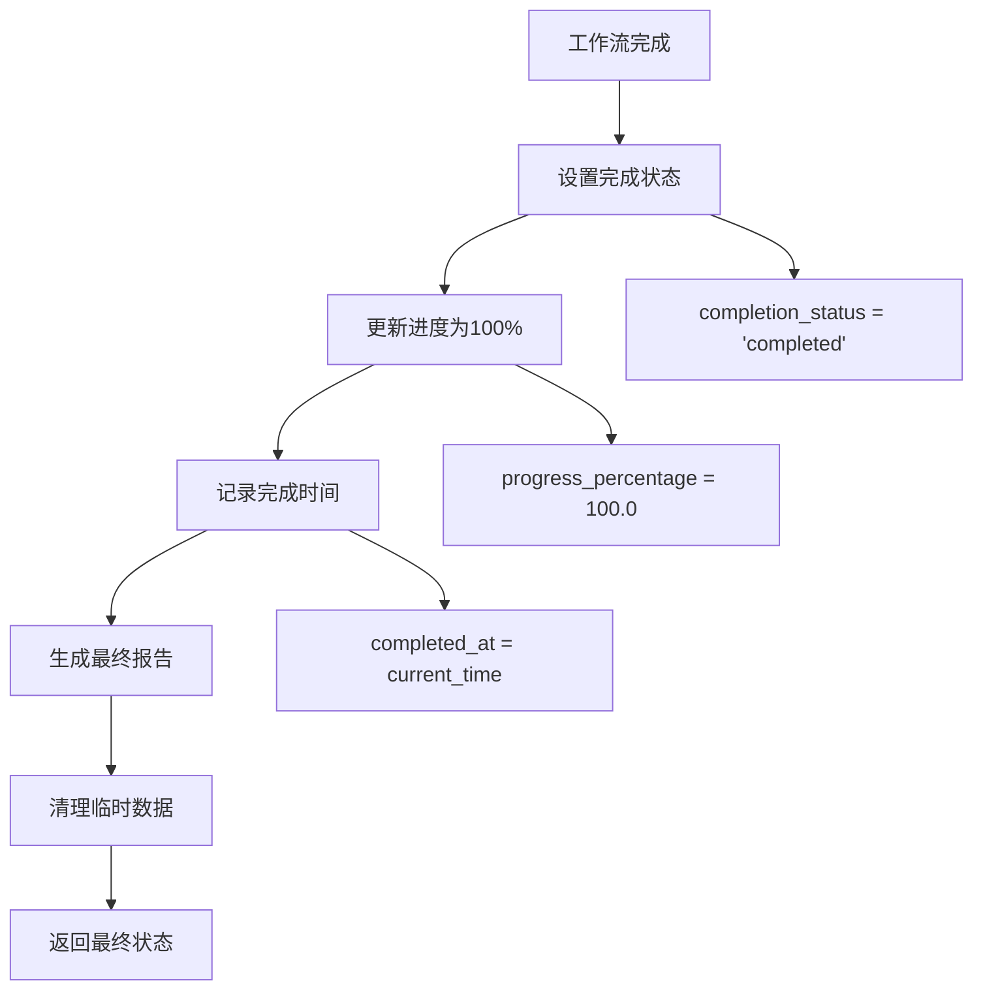

# 核心状态字段

<cite>
**本文档引用的文件**
- [state.py](file://ai_correction/functions/langgraph/state.py)
- [workflow_multimodal.py](file://ai_correction/functions/langgraph/workflow_multimodal.py)
- [orchestrator_agent.py](file://ai_correction/functions/langgraph/agents/orchestrator_agent.py)
- [multimodal_input_agent.py](file://ai_correction/functions/langgraph/agents/multimodal_input_agent.py)
- [ingest_input.py](file://ai_correction/functions/langgraph/agents/ingest_input.py)
- [decide_batches.py](file://ai_correction/functions/langgraph/agents/decide_batches.py)
- [result_assembler.py](file://ai_correction/functions/langgraph/agents/result_assembler.py)
- [streaming.py](file://ai_correction/functions/langgraph/streaming.py)
</cite>

## 目录
1. [简介](#简介)
2. [GradingState类型字典概述](#gradingstate类型字典概述)
3. [基础任务信息字段](#基础任务信息字段)
4. [批改参数配置字段](#批改参数配置字段)
5. [处理状态字段](#处理状态字段)
6. [元数据字段](#元数据字段)
7. [工作流生命周期管理](#工作流生命周期管理)
8. [状态字段验证与默认值设置](#状态字段验证与默认值设置)
9. [最佳实践指南](#最佳实践指南)
10. [故障排除](#故障排除)

## 简介

`GradingState`是AI批改系统的核心状态模型，基于Python的TypedDict实现，用于在LangGraph工作流中维护和传递批改过程中的所有关键信息。该状态字典包含了基础任务信息、批改参数、处理状态、元数据以及各种中间结果，是整个批改工作流的数据载体和状态管理核心。

## GradingState类型字典概述



**图表来源**
- [state.py](file://ai_correction/functions/langgraph/state.py#L44-L268)

**章节来源**
- [state.py](file://ai_correction/functions/langgraph/state.py#L44-L268)

## 基础任务信息字段

### task_id（任务标识符）

**字段类型**: `str`  
**业务含义**: 唯一标识每个批改任务的字符串标识符，通常由UUID生成。

**配置要求**:
- 必填字段
- 全局唯一性
- 推荐格式: `task_{random_hex}`

**业务价值**:
- 用于工作流跟踪和调试
- 支持并发任务管理
- 便于日志关联和审计

### user_id（用户标识符）

**字段类型**: `str`  
**业务含义**: 执行批改操作的用户的唯一标识符。

**配置要求**:
- 必填字段
- 来源于用户认证系统
- 支持多租户隔离

**业务价值**:
- 用户权限控制
- 使用统计分析
- 服务计费依据

### assignment_id（作业标识符）

**字段类型**: `str`  
**业务含义**: 作业或课程的唯一标识符，用于组织和管理批改任务。

**配置要求**:
- 必填字段
- 格式: `assignment_{task_id}`
- 支持作业版本管理

**业务价值**:
- 作业归档和检索
- 成绩统计分析
- 教学效果评估

### timestamp（时间戳）

**字段类型**: `datetime`  
**业务含义**: 任务创建的时间戳，用于排序、超时判断和历史记录。

**配置要求**:
- 自动生成
- UTC时间格式
- 精确到毫秒

**业务价值**:
- 任务优先级排序
- 超时检测机制
- 历史数据分析

**章节来源**
- [state.py](file://ai_correction/functions/langgraph/state.py#L50-L55)
- [workflow_multimodal.py](file://ai_correction/functions/langgraph/workflow_multimodal.py#L268-L280)

## 批改参数配置字段

### mode（批改模式）

**字段类型**: `str`  
**有效值**: `'efficient'` | `'professional'`  
**默认值**: `'efficient'`

**配置选项对比**:

| 对比项 | 高效模式 | 专业模式 |
|--------|---------|---------|
| **处理速度** | ⚡⚡⚡ | ⚡⚡ |
| **Token消耗** | 500/题 | 1500/题 |
| **详细度** | ⭐⭐⭐ | ⭐⭐⭐⭐⭐ |
| **适用场景** | 大规模批改 | 小班精细批改 |
| **算法复杂度** | 简化推理 | 完整推理链 |

**配置策略**:
- **高效模式**: 适用于50+份作业的大规模批改
- **专业模式**: 适用于30份以下作业的精细化批改
- **自动选择**: 基于作业数量动态调整

### strictness_level（严格程度）

**字段类型**: `str`  
**有效值**: `'宽松'` | `'中等'` | `'严格'`  
**默认值**: `'中等'`

**影响机制**:
- **宽松模式**: 容错率高，关注主要思路
- **中等模式**: 平衡准确性和实用性
- **严格模式**: 严格遵循评分标准

**应用场景**:
- **教学初期**: 使用宽松模式鼓励学生
- **考试评估**: 使用严格模式确保公平性
- **日常练习**: 使用中等模式平衡效率和准确性

### language（语言设置）

**字段类型**: `str`  
**有效值**: `'zh'` | `'en'`  
**默认值**: `'zh'`

**功能特性**:
- **中文支持**: 完整的中文语义理解和处理
- **英文支持**: 英文数学符号和术语处理
- **混合语言**: 自动检测和适配

**技术实现**:
- 多语言Prompt模板
- 语言特定的正则表达式
- 本地化错误消息

**章节来源**
- [state.py](file://ai_correction/functions/langgraph/state.py#L65-L67)
- [workflow_multimodal.py](file://ai_correction/functions/langgraph/workflow_multimodal.py#L268-L275)
- [decide_batches.py](file://ai_correction/functions/langgraph/agents/decide_batches.py#L35-L40)

## 处理状态字段

### current_step（当前步骤）

**字段类型**: `str`  
**业务含义**: 当前正在执行的工作流步骤名称。

**常见步骤值**:
- `"初始化"`
- `"多模态文件处理"`
- `"题目理解"`
- `"答案理解"`
- `"评分标准解析"`
- `"学生信息识别"`
- `"批次规划"`
- `"批改工作"`
- `"结果聚合"`
- `"最终化结果"`

**状态流转**:


**图表来源**
- [workflow_multimodal.py](file://ai_correction/functions/langgraph/workflow_multimodal.py#L100-L150)

### progress_percentage（进度百分比）

**字段类型**: `float`  
**取值范围**: `0.0` - `100.0`  
**精度**: 百分之一百分点

**更新策略**:
- **粗粒度更新**: 主要步骤间更新（10%间隔）
- **细粒度更新**: 批次处理中实时更新
- **异常处理**: 出错时保持前一状态

**监控指标**:
- **平均处理时间**: 基于历史进度数据
- **剩余时间估算**: 基于当前速率
- **瓶颈识别**: 通过进度曲线分析

### completion_status（完成状态）

**字段类型**: `str`  
**有效值**: `'pending'` | `'in_progress'` | `'completed'` | `'failed'`

**状态转换**:


**状态含义**:
- **pending**: 任务已创建但未开始
- **in_progress**: 任务正在执行中
- **completed**: 任务成功完成
- **failed**: 任务执行过程中发生错误

**章节来源**
- [state.py](file://ai_correction/functions/langgraph/state.py#L143-L150)
- [workflow_multimodal.py](file://ai_correction/functions/langgraph/workflow_multimodal.py#L170-L190)
- [streaming.py](file://ai_correction/functions/langgraph/streaming.py#L106-L147)

## 元数据字段

### processing_time（处理时间）

**字段类型**: `float`  
**单位**: 秒  
**精度**: 毫秒级

**计算方式**:
```python
processing_time = end_time - start_time
```

**监控价值**:
- **性能基准**: 建立不同模式的性能基线
- **容量规划**: 基于历史数据预测资源需求
- **用户体验**: 提供处理时间预估

**优化策略**:
- **并行处理**: 批次级别的并行优化
- **缓存机制**: 结果缓存减少重复计算
- **模型选择**: 根据复杂度选择合适模型

### model_versions（模型版本）

**字段类型**: `Dict[str, str]`  
**键值对**: `{"primary": "gpt-4-turbo", "secondary": "gpt-3.5-turbo"}`

**版本管理**:
- **主模型**: 当前推荐使用的模型版本
- **备用模型**: 主模型不可用时的备选
- **回退机制**: 自动降级策略

**版本追踪**:
- **A/B测试**: 不同版本的效果对比
- **性能监控**: 各版本的准确率和延迟
- **合规性**: 模型版本的合规性验证

### quality_metrics（质量指标）

**字段类型**: `Dict[str, float]`  
**常用指标**:

| 指标名称 | 含义 | 取值范围 | 目标值 |
|----------|------|----------|--------|
| `accuracy_score` | 批改准确率 | 0.0-1.0 | ≥ 0.95 |
| `consistency_score` | 结果一致性 | 0.0-1.0 | ≥ 0.90 |
| `completeness_score` | 完整度评分 | 0.0-1.0 | ≥ 0.95 |
| `response_time` | 平均响应时间 | 秒 | ≤ 150s |

**质量监控**:
- **实时监控**: 运行时质量指标计算
- **趋势分析**: 质量指标的历史趋势
- **异常检测**: 质量下降的自动告警

**章节来源**
- [state.py](file://ai_correction/functions/langgraph/state.py#L158-L163)
- [result_assembler.py](file://ai_correction/functions/langgraph/agents/result_assembler.py#L120-L140)

## 工作流生命周期管理

### 工作流初始化过程



**图表来源**
- [workflow_multimodal.py](file://ai_correction/functions/langgraph/workflow_multimodal.py#L150-L180)

### 字段填充与更新逻辑

#### 初始化阶段字段设置

在工作流执行开始时，系统会自动初始化以下关键字段：

1. **错误记录初始化**:
   ```python
   if 'errors' not in initial_state:
       initial_state['errors'] = []
   ```

2. **步骤结果初始化**:
   ```python
   if 'step_results' not in initial_state:
       initial_state['step_results'] = {}
   ```

3. **警告信息初始化**:
   ```python
   if 'warnings' not in initial_state:
       initial_state['warnings'] = []
   ```

4. **多模态字段初始化**:
   ```python
   if 'question_multimodal_files' not in initial_state:
       initial_state['question_multimodal_files'] = []
   ```

#### 执行过程中的状态更新

每个Agent在执行过程中都会更新相应的状态字段：

1. **进度更新**:
   ```python
   state['progress_percentage'] = new_percentage
   state['current_step'] = current_step_name
   ```

2. **结果记录**:
   ```python
   state['step_results'][agent_name] = result_data
   ```

3. **错误处理**:
   ```python
   state['errors'].append({
       'step': agent_name,
       'error': error_message,
       'timestamp': str(datetime.now())
   })
   ```

### 工作流最终化过程



**图表来源**
- [workflow_multimodal.py](file://ai_correction/functions/langgraph/workflow_multimodal.py#L185-L200)

**章节来源**
- [workflow_multimodal.py](file://ai_correction/functions/langgraph/workflow_multimodal.py#L150-L220)
- [orchestrator_agent.py](file://ai_correction/functions/langgraph/agents/orchestrator_agent.py#L30-L50)

## 状态字段验证与默认值设置

### 验证框架

系统实现了多层次的状态字段验证机制：

#### 1. 类型验证
```python
# 在GradingState定义中使用TypedDict确保类型安全
class GradingState(TypedDict):
    task_id: str                    # 必须是字符串
    user_id: str                    # 必须是字符串
    timestamp: datetime             # 必须是datetime对象
    progress_percentage: float      # 必须是浮点数
```

#### 2. 业务规则验证
```python
# 在orchestrator_agent中进行任务类型分析
def _analyze_task_type(self, state: Dict[str, Any]) -> str:
    answer_files = state.get('answer_files', [])
    if len(answer_files) == 0:
        return 'single'
    elif len(answer_files) == 1:
        return 'single'
    elif len(answer_files) <= 5:
        return 'batch'
    else:
        return 'class'
```

#### 3. 默认值设置策略

##### 自动初始化机制
```python
# 在workflow_multimodal.py中实现的初始化逻辑
def _initialize_empty_structures(self, state: GradingState) -> GradingState:
    # 多模态提取结果
    if 'mm_tokens' not in state:
        state['mm_tokens'] = []
    if 'student_info' not in state:
        state['student_info'] = {}
    
    # 题目和批次
    if 'questions' not in state:
        state['questions'] = []
    if 'batches' not in state:
        state['batches'] = []
```

##### 条件初始化
```python
# 基于任务类型的条件初始化
if task_type in ['batch', 'class']:
    state['enable_student_detection'] = True
else:
    state['enable_student_detection'] = False
```

### 错误处理与恢复

#### 错误记录格式
```python
error_record = {
    'step': 'agent_name',
    'error': 'detailed_error_message',
    'timestamp': '2025-01-01 12:00:00',
    'retry_count': 2
}
```

#### 恢复策略
1. **自动重试**: 对于临时性错误
2. **降级处理**: 使用备用模型或简化算法
3. **状态回滚**: 回到上一个稳定状态
4. **人工介入**: 对于严重错误

**章节来源**
- [ingest_input.py](file://ai_correction/functions/langgraph/agents/ingest_input.py#L250-L300)
- [orchestrator_agent.py](file://ai_correction/functions/langgraph/agents/orchestrator_agent.py#L70-L90)

## 最佳实践指南

### 1. 字段命名规范

#### 命名约定
- **驼峰命名法**: `studentInfo`, `questionFiles`
- **复数形式**: 表示集合的字段使用复数
- **描述性**: 字段名应清晰表达业务含义

#### 字段分组原则
```python
# 建议的字段分组
class GradingState(TypedDict):
    # 基础信息组
    task_id: str
    user_id: str
    assignment_id: str
    timestamp: datetime
    
    # 配置参数组
    mode: str
    strictness_level: str
    language: str
    
    # 处理状态组
    current_step: str
    progress_percentage: float
    completion_status: str
    
    # 结果数据组
    evaluations: List[Dict]
    annotations: List[Dict]
    knowledge_points: List[Dict]
    
    # 元数据组
    processing_time: float
    model_versions: Dict[str, str]
    quality_metrics: Dict[str, float]
```

### 2. 性能优化策略

#### 1. 字段访问优化
```python
# 推荐: 使用get方法避免KeyError
score = state.get('total_score', 0.0)

# 推荐: 使用类型检查
if isinstance(state['progress_percentage'], float):
    update_progress(state['progress_percentage'])
```

#### 2. 内存使用优化
```python
# 对于大型数据结构，考虑使用生成器
def process_large_dataset(data):
    for item in data:
        yield process_item(item)
        # 及时释放不需要的引用
        del item
```

#### 3. 并发安全
```python
# 在多Agent环境中确保状态安全
import threading
state_lock = threading.Lock()

def safe_update_state(state: GradingState, updates: Dict):
    with state_lock:
        state.update(updates)
```

### 3. 监控和调试

#### 1. 状态快照
```python
def log_state_snapshot(state: GradingState, step_name: str):
    snapshot = {
        'step': step_name,
        'task_id': state['task_id'],
        'current_step': state['current_step'],
        'progress': state['progress_percentage'],
        'timestamp': str(datetime.now())
    }
    logger.info(f"状态快照: {snapshot}")
```

#### 2. 性能指标收集
```python
def collect_performance_metrics(state: GradingState):
    metrics = {
        'processing_time': state['processing_time'],
        'memory_usage': get_memory_usage(),
        'cpu_utilization': get_cpu_usage(),
        'error_rate': calculate_error_rate(state)
    }
    return metrics
```

### 4. 错误预防

#### 1. 输入验证
```python
def validate_state_input(state: Dict) -> bool:
    required_fields = ['task_id', 'user_id', 'timestamp']
    for field in required_fields:
        if field not in state:
            logger.error(f"缺少必填字段: {field}")
            return False
    return True
```

#### 2. 状态一致性检查
```python
def validate_state_consistency(state: GradingState) -> List[str]:
    errors = []
    
    # 检查进度百分比范围
    if not 0 <= state['progress_percentage'] <= 100:
        errors.append(f"进度百分比超出范围: {state['progress_percentage']}")
    
    # 检查完成状态一致性
    if state['completion_status'] == 'completed' and state['progress_percentage'] != 100:
        errors.append("完成状态与进度不一致")
    
    return errors
```

**章节来源**
- [state.py](file://ai_correction/functions/langgraph/state.py#L44-L268)
- [workflow_multimodal.py](file://ai_correction/functions/langgraph/workflow_multimodal.py#L150-L180)

## 故障排除

### 常见问题及解决方案

#### 1. 状态字段缺失

**症状**: `KeyError: 'field_name'` 异常

**原因**: 字段未在状态中初始化

**解决方案**:
```python
# 在访问前检查字段是否存在
if 'field_name' in state:
    value = state['field_name']
else:
    # 设置默认值或处理缺失情况
    value = get_default_value('field_name')
```

#### 2. 进度更新异常

**症状**: 进度百分比不连续或倒退

**原因**: 多个Agent同时更新进度

**解决方案**:
```python
def update_progress_safely(state: GradingState, new_percentage: float):
    current = state['progress_percentage']
    if new_percentage > current:
        state['progress_percentage'] = new_percentage
    # 或者使用锁机制确保原子性
```

#### 3. 模型版本冲突

**症状**: 不同Agent使用不同的模型版本

**原因**: 模型版本配置不一致

**解决方案**:
```python
# 统一模型版本管理
def set_model_version(state: GradingState, model_name: str, version: str):
    if 'model_versions' not in state:
        state['model_versions'] = {}
    state['model_versions'][model_name] = version
```

#### 4. 内存泄漏

**症状**: 长时间运行后内存使用持续增长

**原因**: 大型数据结构未及时清理

**解决方案**:
```python
def cleanup_large_data(state: GradingState):
    # 清理临时数据
    if 'temp_data' in state:
        del state['temp_data']
    
    # 限制结果数组大小
    if len(state.get('evaluations', [])) > MAX_EVALUATIONS:
        state['evaluations'] = state['evaluations'][-MAX_EVALUATIONS:]
```

### 调试工具

#### 1. 状态检查器
```python
def debug_state(state: GradingState):
    print(f"任务ID: {state['task_id']}")
    print(f"当前步骤: {state['current_step']}")
    print(f"进度: {state['progress_percentage']}%")
    print(f"状态: {state['completion_status']}")
    print(f"错误数量: {len(state.get('errors', []))}")
    print(f"处理时间: {state.get('processing_time', 0.0)}秒")
```

#### 2. 性能分析器
```python
def analyze_performance(state: GradingState):
    metrics = state.get('quality_metrics', {})
    processing_time = state.get('processing_time', 0.0)
    
    print(f"处理时间: {processing_time:.2f}秒")
    print(f"准确率: {metrics.get('accuracy_score', 0.0):.2%}")
    print(f"一致性: {metrics.get('consistency_score', 0.0):.2%}")
```

**章节来源**
- [workflow_multimodal.py](file://ai_correction/functions/langgraph/workflow_multimodal.py#L185-L220)
- [result_assembler.py](file://ai_correction/functions/langgraph/agents/result_assembler.py#L120-L180)

## 结论

`GradingState`作为AI批改系统的核心状态模型，通过精心设计的字段结构和完善的生命周期管理，为整个批改工作流提供了可靠的数据支撑。合理使用这些核心状态字段，配合最佳实践和故障排除策略，可以显著提升系统的稳定性、性能和可维护性。

在实际应用中，建议根据具体的业务需求和性能要求，灵活调整批改参数配置，建立完善的状态监控和错误处理机制，确保批改系统的高效稳定运行。