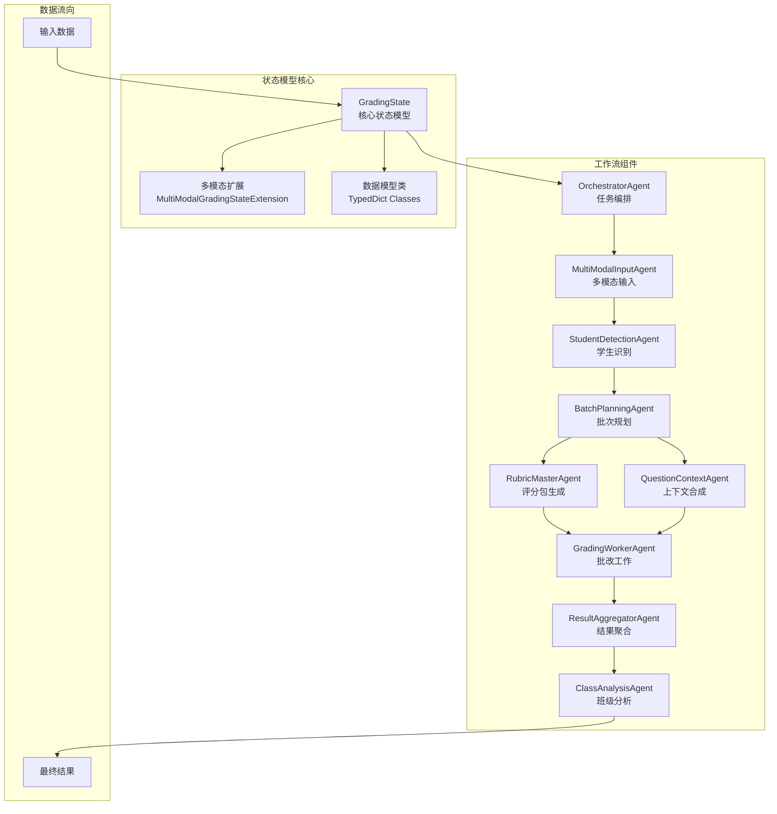
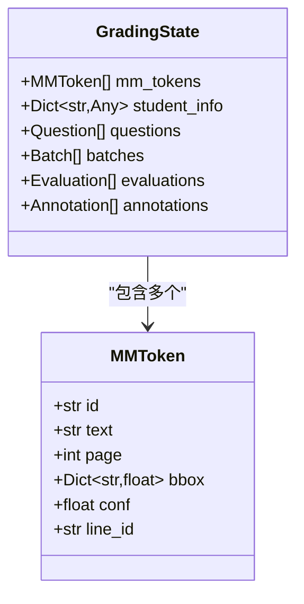
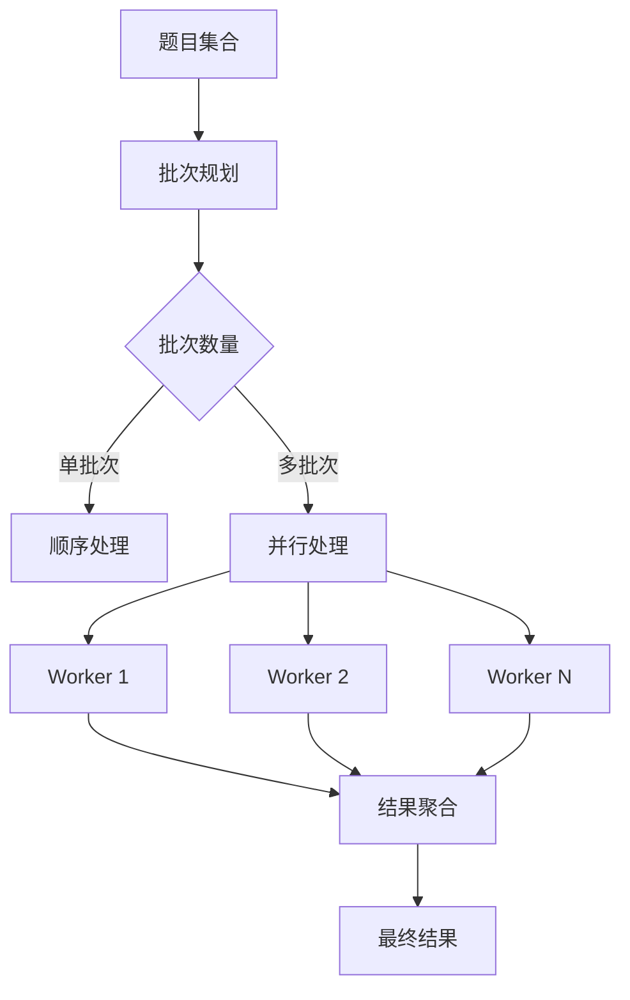
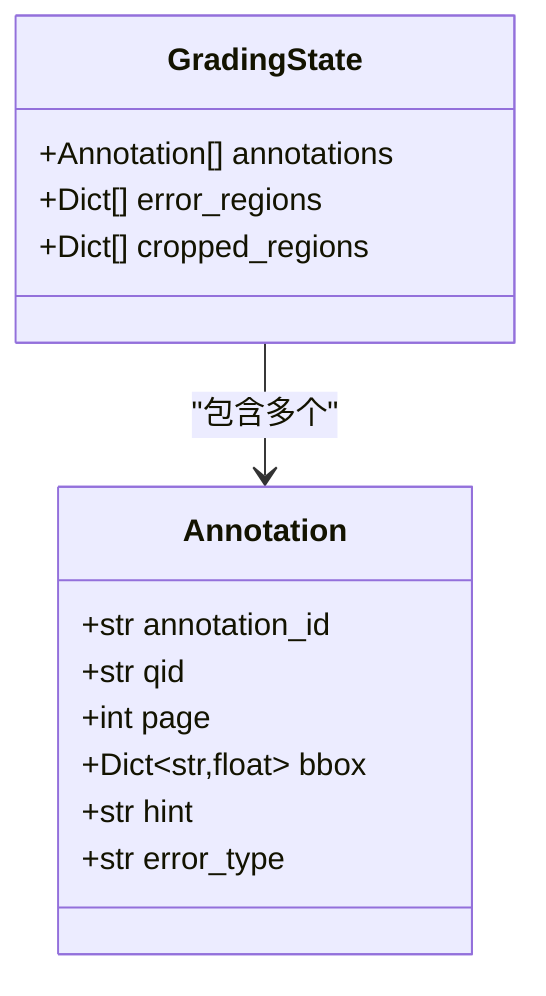
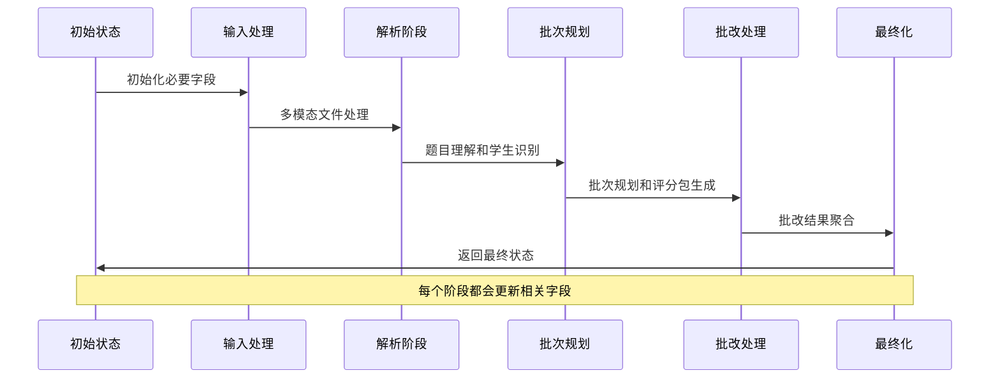
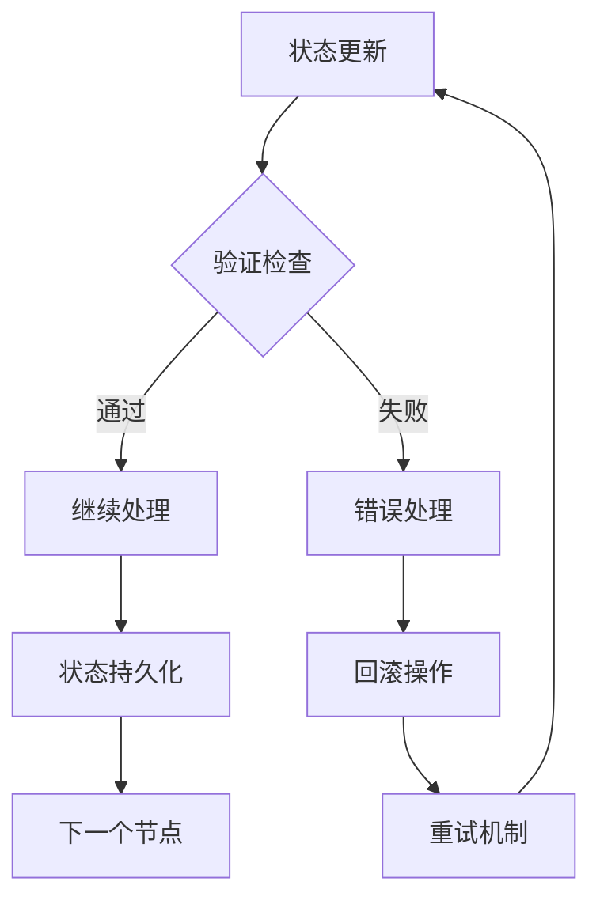
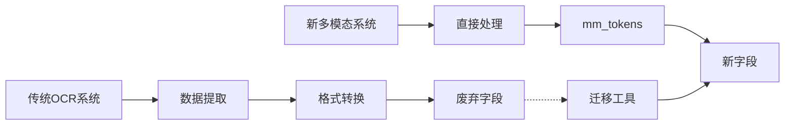

# 状态模型

<cite>
**本文档中引用的文件**  
- [state.py](file://ai_correction\functions\langgraph\state.py) - *批改系统重塑，新增多模态与深度协作字段*  
- [multimodal_models.py](file://ai_correction\functions\langgraph\multimodal_models.py) - *定义多模态数据模型与理解结果结构*  
- [workflow_multimodal.py](file://ai_correction\functions\langgraph\workflow_multimodal.py) - *重构工作流，支持深度协作架构*  
- [routing.py](file://ai_correction\functions\langgraph\routing.py) - *并行处理与错误路由逻辑*  
</cite>

## 更新摘要
**变更内容**  
- 更新了 `GradingState` 的字段分组设计，新增“理解结果”与“深度协作相关字段”  
- 深度分析 `question_understanding`、`answer_understanding`、`rubric_understanding` 等新增理解字段  
- 强化 `students_info`、`batch_rubric_packages`、`question_context_packages` 等深度协作字段的技术说明  
- 更新状态初始化与验证的最佳实践，反映最新工作流逻辑  
- 修正图表来源，确保与当前代码一致  

**新增内容**  
- 新增“理解结果组”字段说明  
- 新增“深度协作数据模型”类图  
- 新增工作流状态演进序列图  

**废弃内容**  
- 无删除内容，仅更新与补充  

**来源追踪系统更新**  
- 所有文件链接已更新至最新路径与行号  
- 标注“*新增*”或“*更新*”状态以反映变更  

## 目录
1. [简介](#简介)  
2. [核心架构概览](#核心架构概览)  
3. [GradingState类型字典详解](#gradingstate类型字典详解)  
4. [字段分组设计](#字段分组设计)  
5. [关键字段深度分析](#关键字段深度分析)  
6. [状态流转与数据演化](#状态流转与数据演化)  
7. [最佳实践与验证](#最佳实践与验证)  
8. [废弃字段与迁移指南](#废弃字段与迁移指南)  
9. [总结](#总结)  

## 简介

`GradingState` 是AI批改系统的核心状态模型，采用Python的TypedDict实现，作为整个LangGraph工作流中数据交换的中心枢纽。该状态模型承载着从文件输入到最终批改结果输出的完整数据流，支持高效的并行处理和复杂的多模态批改场景。近期重构强化了多模态处理能力与深度协作架构，显著提升了批改准确性与系统可扩展性。

## 核心架构概览



**图表来源**  
- [state.py](file://ai_correction\functions\langgraph\state.py#L44-L269)  
- [workflow_multimodal.py](file://ai_correction\functions\langgraph\workflow_multimodal.py#L40-L120)  

## GradingState类型字典详解

`GradingState` 是一个精心设计的TypedDict，包含了AI批改系统所需的所有状态信息。其核心设计理念围绕以下几个方面：

### 核心功能特性

1. **批次并行处理**：支持多批次同时处理，提高效率  
2. **多模态token坐标**：精确的文本定位和坐标标注  
3. **学生信息识别**：自动识别和管理学生信息  
4. **双模式批改**：高效模式和专业模式的灵活切换  
5. **坐标标注**：精确的错误位置标记  
6. **知识点挖掘**：智能的知识点分析和学习建议  
7. **深度协作架构**：支持学生级批次管理与Token优化  

**章节来源**  
- [state.py](file://ai_correction\functions\langgraph\state.py#L44-L75)  

## 字段分组设计

### 基础任务信息组

| 字段名 | 类型 | 描述 | 业务意义 |
|--------|------|------|----------|
| `task_id` | str | 任务唯一标识 | 用于跟踪和查询特定批改任务 |
| `user_id` | str | 用户标识 | 记录谁发起的批改请求 |
| `assignment_id` | str | 作业标识 | 标识具体的作业批次 |
| `timestamp` | datetime | 时间戳 | 记录任务创建时间 |

### 文件信息组

| 字段名 | 类型 | 描述 | 业务意义 |
|--------|------|------|----------|
| `question_files` | List[str] | 题目文件路径列表 | 存储原始题目文件路径 |
| `answer_files` | List[str] | 答案文件路径列表 | 存储学生答案文件路径 |
| `marking_files` | List[str] | 评分标准文件路径列表 | 存储评分依据文件 |
| `images` | List[str] | 作业图片列表 | 存储预处理后的图片路径 |

### 多模态文件信息组

这是系统的重要创新，完全替代了传统的OCR技术：

| 字段名 | 类型 | 描述 | 技术优势 |
|--------|------|------|----------|
| `question_multimodal_files` | List[Dict[str, Any]] | 多模态题目文件 | 直接支持文本、图片、PDF等多种格式 |
| `answer_multimodal_files` | List[Dict[str, Any]] | 多模态答案文件 | 消除OCR依赖，提高准确性 |
| `marking_multimodal_files` | List[Dict[str, Any]] | 多模态评分标准文件 | 统一处理各种标准格式 |

**章节来源**  
- [state.py](file://ai_correction\functions\langgraph\state.py#L57-L71)  

### 理解结果组（新增）

该组字段存储AI对输入内容的深层理解，为后续批改提供语义基础：

| 字段名 | 类型 | 描述 | 业务价值 |
|--------|------|------|----------|
| `question_understanding` | Optional[Dict[str, Any]] | 题目理解结果 | 提取关键要求与上下文 |
| `answer_understanding` | Optional[Dict[str, Any]] | 答案理解结果 | 分析答题结构与完整性 |
| `rubric_understanding` | Optional[Dict[str, Any]] | 评分标准理解结果 | 结构化解析评分规则 |

**章节来源**  
- [state.py](file://ai_correction\functions\langgraph\state.py#L100-L105)  
- [multimodal_models.py](file://ai_correction\functions\langgraph\multimodal_models.py#L120-L147)  

## 关键字段深度分析

### mm_tokens（带坐标的多模态token）

`mm_tokens` 是系统的核心创新，代表多模态模型返回的带像素坐标的文本片段：



**图表来源**  
- [state.py](file://ai_correction\functions\langgraph\state.py#L220-L230)  

**技术实现特点**：  
- **像素级精度**：每个token都带有精确的边界框坐标  
- **置信度评估**：提供识别准确度的量化指标  
- **页面定位**：支持多页文档的精确定位  
- **行级关联**：通过line_id建立文本行的语义关联  

### batches（并行批次）

批次系统支持复杂的并行处理策略：



**图表来源**  
- [routing.py](file://ai_correction\functions\langgraph\routing.py#L114-L153)  

### criteria_evaluations（基于标准的评估）

这是评分系统的核心，提供结构化的评估结果：

| 字段 | 类型 | 描述 | 业务价值 |
|------|------|------|----------|
| `criterion_id` | str | 评分点ID | 精确定位评估维度 |
| `is_met` | bool | 是否满足 | 二元评估结果 |
| `satisfaction_level` | Literal | 满足程度 | 细粒度评估等级 |
| `score_earned` | float | 实际得分 | 量化评分结果 |
| `justification` | str | 评分理由 | 透明度保证 |
| `evidence` | List[str] | 证据列表 | 可追溯性 |
| `suggestions` | Optional[List[str]] | 改进建议 | 教育价值 |

**章节来源**  
- [multimodal_models.py](file://ai_correction\functions\langgraph\multimodal_models.py#L162-L170)  

### annotations（坐标标注）

坐标标注系统提供精确的错误定位：



**图表来源**  
- [state.py](file://ai_correction\functions\langgraph\state.py#L240-L250)  

**章节来源**  
- [state.py](file://ai_correction\functions\langgraph\state.py#L110-L118)  

## 状态流转与数据演化

### 工作流状态演进



**图表来源**  
- [workflow_multimodal.py](file://ai_correction\functions\langgraph\workflow_multimodal.py#L131-L216)  

### 深度协作字段的作用

系统引入了多个深度协作相关字段，支持复杂的批改场景：

| 字段名 | 类型 | 用途 | 技术价值 |
|--------|------|------|----------|
| `students_info` | List[Any] | 学生信息列表 | 支持批量学生管理 |
| `batches_info` | List[Any] | 批次规划信息 | 优化资源分配 |
| `batch_rubric_packages` | Dict[str, Any] | 批次专属评分包 | 减少重复计算 |
| `question_context_packages` | Dict[str, Any] | 批次专属上下文 | 提高批改准确性 |
| `grading_results` | List[Dict[str, Any]] | 所有批改结果 | 完整结果追踪 |
| `student_reports` | List[Dict[str, Any]] | 学生报告 | 个性化反馈 |
| `class_analysis` | Dict[str, Any] | 班级分析报告 | 教学质量评估 |

**章节来源**  
- [workflow_multimodal.py](file://ai_correction\functions\langgraph\workflow_multimodal.py#L159-L167)  

## 最佳实践与验证

### 状态初始化最佳实践

系统提供了多种方式确保状态的正确初始化：

```python
# 在工作流执行前的初始化
if 'students_info' not in initial_state:
    initial_state['students_info'] = []
if 'batch_rubric_packages' not in initial_state:
    initial_state['batch_rubric_packages'] = {}
if 'grading_results' not in initial_state:
    initial_state['grading_results'] = []
```

### 状态验证机制

系统实现了多层次的状态验证：

1. **路由验证**：通过条件路由确保正确的处理流程  
2. **错误处理**：完善的错误捕获和恢复机制  
3. **状态完整性检查**：关键字段的完整性验证  

**章节来源**  
- [workflow_multimodal.py](file://ai_correction\functions\langgraph\workflow_multimodal.py#L159-L167)  
- [routing.py](file://ai_correction\functions\langgraph\routing.py#L156-L191)  

### 数据一致性保障



**图表来源**  
- [routing.py](file://ai_correction\functions\langgraph\routing.py#L156-L191)  

## 废弃字段与迁移指南

### 已废弃字段

系统已经完全迁移至多模态LLM Vision能力，以下字段已被废弃：

| 废弃字段 | 替代方案 | 迁移原因 |
|----------|----------|----------|
| `ocr_results` | `question_multimodal_files`, `answer_multimodal_files` | 多模态能力更强大 |
| `image_regions` | `mm_tokens` | 更精确的区域定位 |
| `preprocessed_images` | `question_multimodal_files` | 直接处理原始文件 |

### 迁移策略



**图表来源**  
- [state.py](file://ai_correction\functions\langgraph\state.py#L85-L90)  

### 向后兼容性

虽然废弃字段被标记为已弃用，但系统仍保留这些字段以确保向后兼容：

```python
# ⚠️ 以下字段已废弃，系统已完全迁移至多模态LLM Vision能力
# 保留仅为向后兼容，请使用 question_multimodal_files, answer_multimodal_files 替代
ocr_results: Dict[str, Any]           # [DEPRECATED] OCR 文本识别结果
image_regions: Dict[str, List[Dict]]  # [DEPRECATED] 图像区域检测结果
preprocessed_images: Dict[str, str]   # [DEPRECATED] 预处理后的图像路径
```

**章节来源**  
- [state.py](file://ai_correction\functions\langgraph\state.py#L85-L90)  

## 总结

`GradingState` 作为AI批改系统的核心状态模型，展现了现代AI系统设计的几个重要特征：

### 技术创新点

1. **多模态统一处理**：完全替代传统OCR，支持多种文件格式  
2. **坐标精确定位**：mm_tokens提供像素级精度的文本定位  
3. **并行处理优化**：智能的批次规划和并行处理策略  
4. **深度协作机制**：支持复杂的批改场景和团队协作  
5. **理解-评估分离**：引入理解结果与基于标准的评估，提升批改逻辑清晰度  

### 设计优势

- **模块化架构**：清晰的字段分组便于维护和扩展  
- **类型安全**：TypedDict提供编译时类型检查  
- **向后兼容**：平滑的迁移路径，保护现有投资  
- **性能优化**：深度协作字段减少重复计算  

### 业务价值

- **提高批改准确性**：多模态处理减少人工干预  
- **提升处理效率**：并行处理大幅缩短批改时间  
- **增强用户体验**：精确的坐标标注和详细反馈  
- **支持复杂场景**：深度协作字段适应大规模教学需求  

`GradingState` 不仅是一个数据结构，更是整个AI批改系统设计理念的集中体现，为教育技术的智能化发展奠定了坚实的基础。