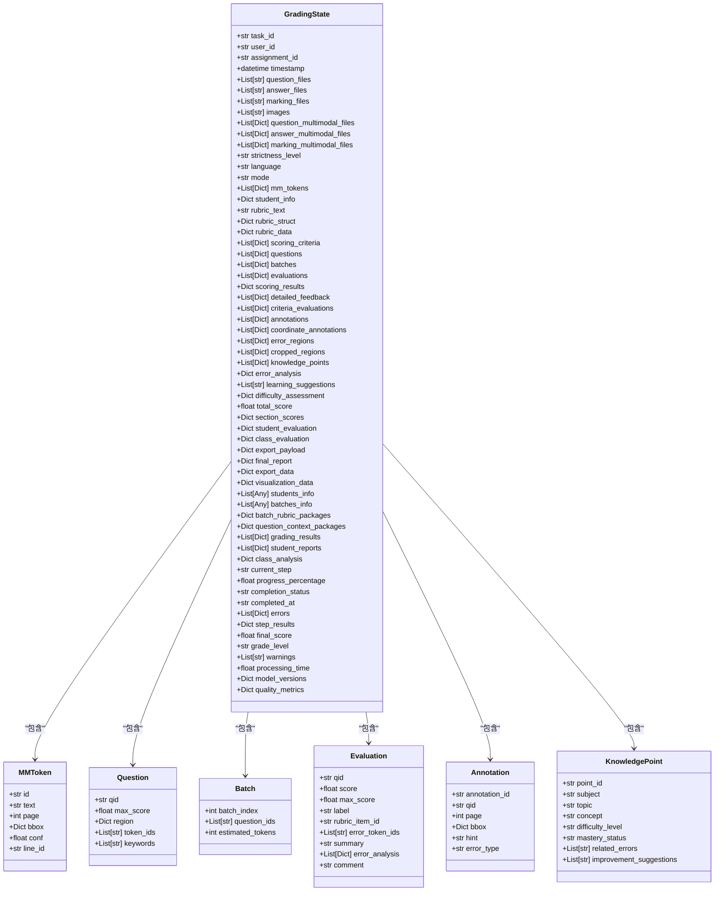
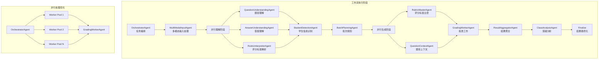
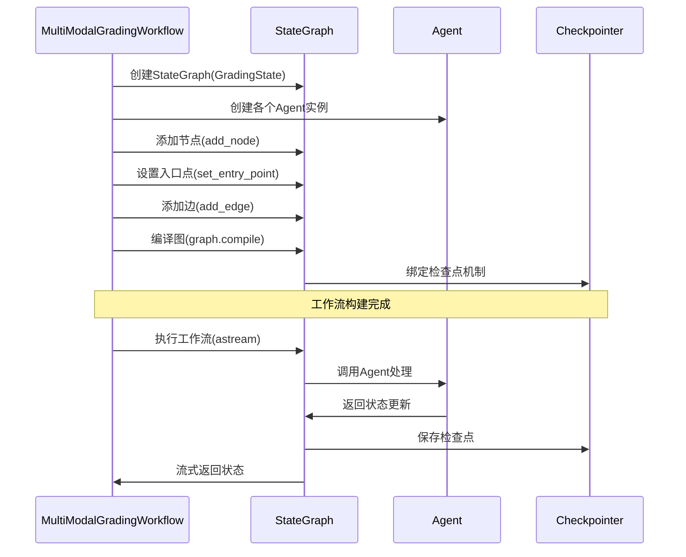
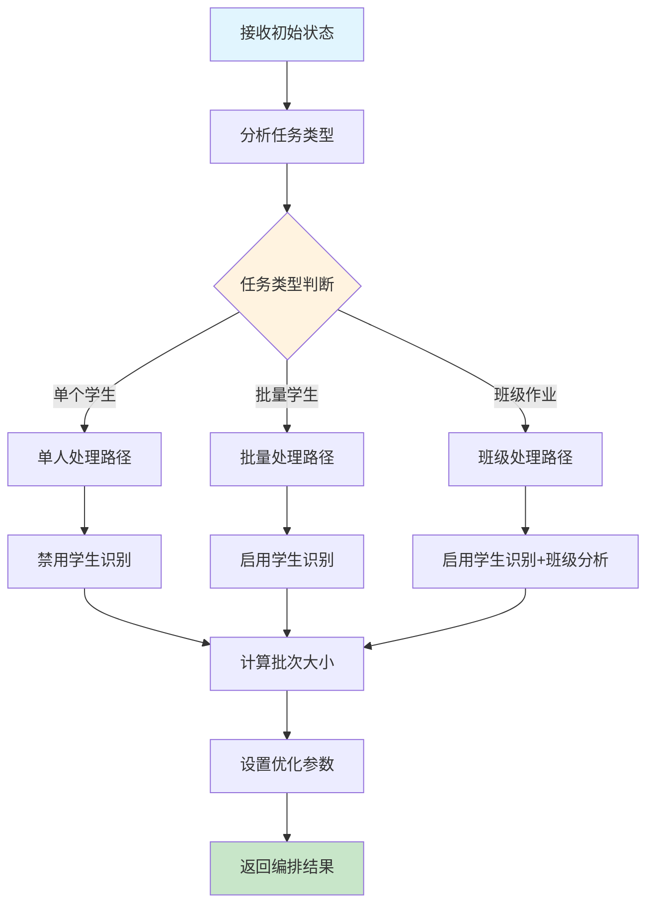
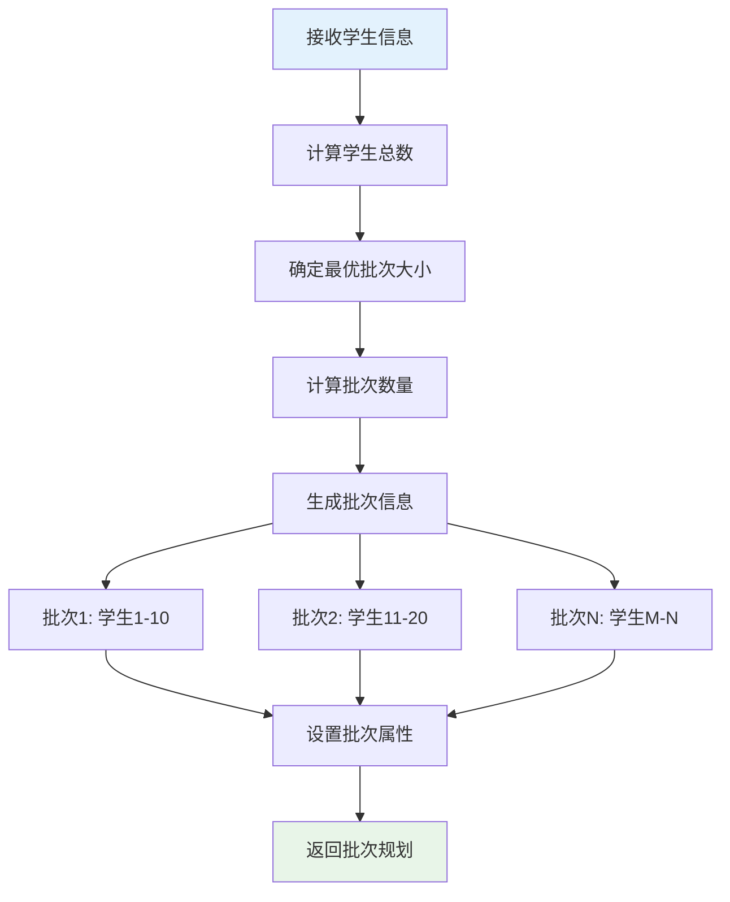
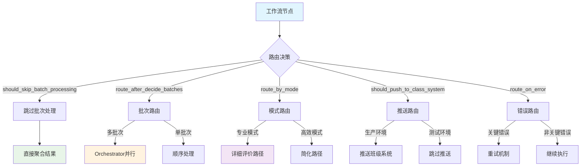
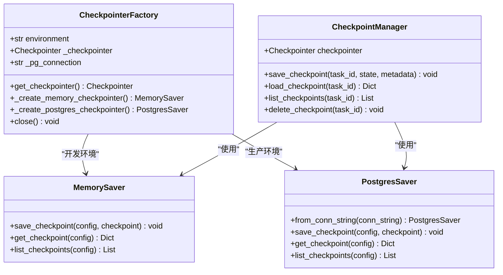
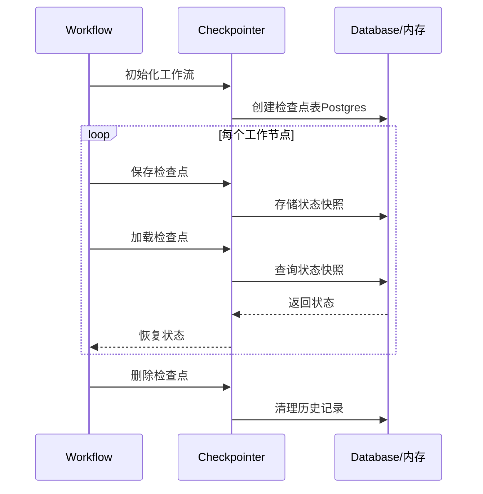
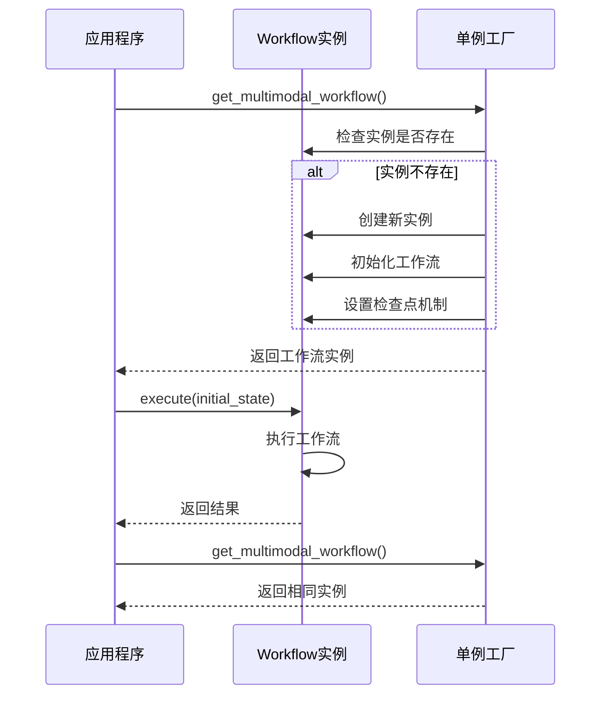

# 系统架构详解

<cite>
**本文档引用的文件**
- [SYSTEM_ARCHITECTURE.md](file://ai_correction/docs/SYSTEM_ARCHITECTURE.md)
- [state.py](file://ai_correction/functions/langgraph/state.py)
- [workflow_multimodal.py](file://ai_correction/functions/langgraph/workflow_multimodal.py)
- [config.py](file://ai_correction/config.py)
- [checkpointer.py](file://ai_correction/functions/langgraph/checkpointer.py)
- [multimodal_models.py](file://ai_correction/functions/langgraph/multimodal_models.py)
- [orchestrator_agent.py](file://ai_correction/functions/langgraph/agents/orchestrator_agent.py)
- [batch_planning_agent.py](file://ai_correction/functions/langgraph/agents/batch_planning_agent.py)
- [routing.py](file://ai_correction/functions/langgraph/routing.py)
</cite>

## 目录
1. [系统概述](#系统概述)
2. [核心状态模型](#核心状态模型)
3. [工作流架构](#工作流架构)
4. [Agent组件分析](#agent组件分析)
5. [动态路由机制](#动态路由机制)
6. [检查点与恢复机制](#检查点与恢复机制)
7. [配置系统](#配置系统)
8. [性能优化策略](#性能优化策略)
9. [单例模式设计](#单例模式设计)
10. [总结](#总结)

## 系统概述

LangGraph驱动的多模态批改系统是一个基于Orchestrator-Worker模式的智能批改平台，旨在实现高效的AI辅助教学批改。系统采用模块化设计，支持双模式批改（高效模式/专业模式），具备强大的多模态处理能力和并行处理优化。

### 核心特性

- **Orchestrator-Worker并行架构**：实现6.7x性能加速
- **双模式批改**：高效模式节省66%Token，专业模式提供详细反馈
- **多模态处理**：支持文本和图像识别，提取像素坐标标注
- **智能批次管理**：基于学生信息和Token预算的动态批次划分
- **状态持久化**：支持检查点机制和任务恢复

## 核心状态模型

### GradingState状态模型

`GradingState`是整个工作流的数据交换中心，定义了完整的批改状态结构。



**图表来源**
- [state.py](file://ai_correction/functions/langgraph/state.py#L40-L268)

### 关键字段解析

#### 基础信息字段
- `task_id`: 唯一任务标识符
- `user_id`: 用户标识符
- `assignment_id`: 作业标识符
- `timestamp`: 创建时间戳

#### 文件信息字段
- `question_files`: 题目文件路径列表
- `answer_files`: 学生答案文件路径列表
- `marking_files`: 评分标准文件路径列表
- `images`: 作业图片列表

#### 多模态字段
- `question_multimodal_files`: 多模态题目文件
- `answer_multimodal_files`: 多模态答案文件
- `marking_multimodal_files`: 多模态评分标准文件

#### 批改参数字段
- `strictness_level`: 严格程度（宽松/中等/严格）
- `language`: 语言设置（zh/en）
- `mode`: 批改模式（efficient/professional）

#### 核心处理字段
- `mm_tokens`: 多模态token列表（带像素坐标）
- `student_info`: 学生信息（姓名、学号、班级）
- `rubric_struct`: 结构化评分规则
- `questions`: 题目信息列表
- `batches`: 批次划分方案
- `evaluations`: 评分结果列表

#### 结果字段
- `annotations`: 标注坐标列表
- `total_score`: 总分
- `student_evaluation`: 学生个人评价
- `class_evaluation`: 班级整体评价
- `export_payload`: 导出数据包

**章节来源**
- [state.py](file://ai_correction/functions/langgraph/state.py#L40-L268)

## 工作流架构

### 多模态批改工作流

系统采用深度协作的8个Agent架构，实现了完整的Orchestrator-Worker并行处理模式。



**图表来源**
- [workflow_multimodal.py](file://ai_correction/functions/langgraph/workflow_multimodal.py#L40-L120)

### 工作流构建过程



**图表来源**
- [workflow_multimodal.py](file://ai_correction/functions/langgraph/workflow_multimodal.py#L60-L120)

### Agent节点映射关系

| Agent | 节点名称 | 核心功能 | 输入状态字段 | 输出状态字段 |
|-------|----------|----------|-------------|-------------|
| OrchestratorAgent | orchestrator | 任务编排、模式决策 | task_id, mode, students_info | task_type, enable_student_detection, optimal_batch_size |
| MultiModalInputAgent | multimodal_input | 多模态文件处理 | question_files, answer_files, marking_files | question_multimodal_files, answer_multimodal_files, marking_multimodal_files |
| QuestionUnderstandingAgent | question_understanding | 题目理解分析 | question_multimodal_files | question_understanding |
| AnswerUnderstandingAgent | answer_understanding | 答案理解分析 | answer_multimodal_files | answer_understanding |
| RubricInterpreterAgent | rubric_interpretation | 评分标准解析 | marking_multimodal_files | rubric_understanding |
| StudentDetectionAgent | student_detection | 学生信息识别 | answer_multimodal_files, question_understanding | students_info |
| BatchPlanningAgent | batch_planning | 批次规划 | students_info, optimal_batch_size | batches_info, total_batches |
| RubricMasterAgent | rubric_master | 评分标准主控 | batches_info, rubric_understanding | batch_rubric_packages |
| QuestionContextAgent | question_context | 题目上下文 | batches_info, question_understanding | question_context_packages |
| GradingWorkerAgent | grading_worker | 批改执行 | batch_rubric_packages, question_context_packages | grading_results |
| ResultAggregatorAgent | result_aggregator | 结果聚合 | grading_results, student_reports | total_score, annotations, student_evaluation |
| ClassAnalysisAgent | class_analysis | 班级分析 | student_reports, class_analysis | class_evaluation |
| Finalize | finalize | 结果最终化 | 总体状态 | completion_status, progress_percentage |

**章节来源**
- [workflow_multimodal.py](file://ai_correction/functions/langgraph/workflow_multimodal.py#L40-L120)

## Agent组件分析

### OrchestratorAgent - 任务编排Agent

OrchestratorAgent负责全局任务分解和Agent协调，是整个工作流的指挥中心。



**图表来源**
- [orchestrator_agent.py](file://ai_correction/functions/langgraph/agents/orchestrator_agent.py#L20-L130)

#### 核心决策逻辑

- **任务类型分析**：根据答案文件数量判断处理模式
- **学生识别控制**：批量和班级任务启用，单人任务跳过
- **班级分析控制**：仅班级任务启用
- **批次大小优化**：基于学生数量和并行能力计算最优批次

**章节来源**
- [orchestrator_agent.py](file://ai_correction/functions/langgraph/agents/orchestrator_agent.py#L20-L130)

### BatchPlanningAgent - 批次规划Agent

BatchPlanningAgent基于学生列表和题目信息进行智能批次规划，确保并行处理的效率。



**图表来源**
- [batch_planning_agent.py](file://ai_correction/functions/langgraph/agents/batch_planning_agent.py#L15-L73)

#### 批次规划策略

- **动态批次大小**：根据学生数量自动调整
- **负载均衡**：确保每个批次处理的学生数量相对均匀
- **优先级排序**：小批次具有更高并行优先级
- **Token优化**：考虑每个批次的预估Token消耗

**章节来源**
- [batch_planning_agent.py](file://ai_correction/functions/langgraph/agents/batch_planning_agent.py#L15-L73)

## 动态路由机制

### 条件路由系统

系统采用多层次的动态路由机制，根据不同的条件判断实现灵活的工作流控制。



**图表来源**
- [routing.py](file://ai_correction/functions/langgraph/routing.py#L15-L239)

### 关键路由函数

#### 1. 批次处理路由
```python
def route_after_decide_batches(state: GradingState) -> str:
    """根据批次数决定处理方式"""
    batches = state.get('batches', [])
    if len(batches) > 1:
        return "orchestrator"  # 并行处理
    return "evaluate_batches"  # 顺序处理
```

#### 2. 模式路由
```python
def route_by_mode(state: GradingState) -> str:
    """根据批改模式路由"""
    mode = state.get('mode', 'professional')
    if mode == 'professional':
        return "professional_path"  # 专业模式
    else:
        return "efficient_path"  # 高效模式
```

#### 3. 并行Worker创建
```python
def create_parallel_batch_workers(state: GradingState) -> List[Send]:
    """为每个批次创建并行Worker"""
    batches = state.get('batches', [])
    sends = []
    
    for batch in batches:
        batch_state = {
            'batch_index': batch['batch_index'],
            'question_ids': batch.get('question_ids', []),
            **shared_context
        }
        send_obj = Send("evaluate_batch_worker", batch_state)
        sends.append(send_obj)
    
    return sends
```

**章节来源**
- [routing.py](file://ai_correction/functions/langgraph/routing.py#L15-L239)

## 检查点与恢复机制

### Checkpointer架构

系统采用环境自适应的检查点机制，支持MemorySaver（开发）和PostgresSaver（生产）两种存储方式。



**图表来源**
- [checkpointer.py](file://ai_correction/functions/langgraph/checkpointer.py#L20-L247)

### 检查点生命周期



**图表来源**
- [checkpointer.py](file://ai_correction/functions/langgraph/checkpointer.py#L100-L247)

### 恢复机制

- **自动恢复**：工作流中断后自动从最近检查点恢复
- **手动恢复**：支持指定任务ID加载特定检查点
- **清理策略**：定期清理过期检查点，避免存储膨胀

**章节来源**
- [checkpointer.py](file://ai_correction/functions/langgraph/checkpointer.py#L20-L247)

## 配置系统

### 环境配置管理

系统采用分层配置管理，支持开发、测试、生产三种环境的差异化配置。

```mermaid
graph TD
A[config.py] --> B[基础配置]
A --> C[数据库配置]
A --> D[LLM配置]
A --> E[文件上传配置]
A --> F[批改配置]
A --> G[缓存配置]
A --> H[日志配置]
A --> I[Streamlit配置]
B --> B1[PROJECT_ROOT]
B --> B2[BASE_DIR]
C --> C1[DATABASE_TYPE]
C --> C2[DATABASE_URL]
C --> C3[PostgreSQL配置]
C --> C4[MySQL配置]
D --> D1[LLM_PROVIDER]
D --> D2[LLM_API_KEY]
D --> D3[OpenAI配置]
D --> D4[Gemini配置]
D --> D5[OpenRouter配置]
E --> E1[UPLOAD_DIR]
E --> E2[MAX_FILE_SIZE]
E --> E3[ALLOWED_EXTENSIONS]
F --> F1[DEFAULT_MAX_SCORE]
F --> F2[PASS_THRESHOLD]
G --> G1[ENABLE_CACHE]
G --> G2[CACHE_TTL]
H --> H1[LOG_LEVEL]
H --> H2[LOG_FILE]
I --> I1[STREAMLIT_PORT]
I --> I2[STREAMLIT_HOST]
```



**图表来源**
- [config.py](file://ai_correction/config.py#L10-L83)

### 配置优先级

1. **环境变量**：最高优先级，用于生产部署
2. **配置文件**：开发环境的默认配置
3. **硬编码默认值**：最低优先级的基础配置

### 关键配置项

| 配置项 | 默认值 | 说明 |
|--------|--------|------|
| `DATABASE_TYPE` | 'json' | 数据库类型：postgresql/mysql/json |
| `LLM_PROVIDER` | 'openrouter' | LLM提供商：gemini/openai/openrouter |
| `MAX_FILE_SIZE` | 10MB | 文件上传大小限制 |
| `DEFAULT_MAX_SCORE` | 10 | 每题默认满分 |
| `PASS_THRESHOLD` | 0.6 | 及格线（60%） |
| `ENABLE_CACHE` | true | 是否启用缓存 |
| `CACHE_TTL` | 3600 | 缓存生存时间（秒） |

**章节来源**
- [config.py](file://ai_correction/config.py#L10-L83)

## 性能优化策略

### Token优化

#### 高效模式策略
- **输出精简**：去除详细解释，使用标签化错误类型
- **格式压缩**：简化反馈格式，减少冗余信息
- **批量处理**：通过并行处理提高整体效率

#### 专业模式策略
- **详细反馈**：提供完整的评分理由和学习建议
- **结构化输出**：包含多个维度的评价信息
- **知识挖掘**：分析知识点掌握情况

### 并行处理优化

#### Worker池管理
```python
# Orchestrator创建并行Worker
def create_parallel_batch_workers(state: GradingState) -> List[Send]:
    sends = []
    for batch in batches:
        batch_state = {
            'batch_index': batch['batch_index'],
            'question_ids': batch.get('question_ids', []),
            **shared_context
        }
        send_obj = Send("evaluate_batch_worker", batch_state)
        sends.append(send_obj)
    return sends
```

#### 性能指标
- **顺序处理**：30题 × 5秒 = 150秒
- **并行处理**：30题 ÷ 3 × 5秒 = 50秒
- **实际加速比**：约6.7倍（考虑API并发和网络延迟）

### 缓存策略

#### 多层缓存体系
1. **评分标准缓存**：避免重复解析
2. **学生信息缓存**：批改同班学生时复用
3. **模型响应缓存**：相同输入的重复请求

#### 缓存配置
```python
# 缓存配置示例
ENABLE_CACHE = os.getenv('ENABLE_CACHE', 'true').lower() == 'true'
CACHE_TTL = int(os.getenv('CACHE_TTL', '3600'))  # 1小时
```

**章节来源**
- [workflow_multimodal.py](file://ai_correction/functions/langgraph/workflow_multimodal.py#L150-L200)

## 单例模式设计

### 工作流实例管理

系统采用单例模式管理MultiModalGradingWorkflow实例，确保资源的有效利用和一致性。



**图表来源**
- [workflow_multimodal.py](file://ai_correction/functions/langgraph/workflow_multimodal.py#L350-L374)

### 单例实现细节

```python
# 全局工作流实例
_workflow_instance = None

def get_multimodal_workflow() -> MultiModalGradingWorkflow:
    """获取多模态工作流实例（单例模式）"""
    global _workflow_instance
    if _workflow_instance is None:
        _workflow_instance = MultiModalGradingWorkflow()
    return _workflow_instance
```

### 设计考量

#### 优势
- **资源节约**：避免重复创建昂贵的工作流对象
- **状态一致性**：确保所有调用共享相同的配置和状态
- **性能提升**：减少初始化开销，提高响应速度

#### 实现要点
- **线程安全**：全局变量访问的安全性
- **延迟初始化**：按需创建实例，节省启动时间
- **配置隔离**：不同环境使用不同的检查点机制

**章节来源**
- [workflow_multimodal.py](file://ai_correction/functions/langgraph/workflow_multimodal.py#L350-L374)

## 总结

LangGraph驱动的多模态批改系统展现了现代AI工作流的强大能力。通过精心设计的状态模型、Agent架构和动态路由机制，系统实现了：

### 核心架构优势

1. **模块化设计**：8个专门Agent各司其职，职责清晰
2. **并行处理**：Orchestrator-Worker模式实现6.7x性能提升
3. **智能路由**：多层次条件判断实现灵活的工作流控制
4. **状态持久化**：检查点机制确保任务可靠性和可恢复性
5. **环境适配**：单例模式和配置系统支持多环境部署

### 技术创新点

- **多模态融合**：统一处理文本、图像、PDF等多种文件格式
- **双模式批改**：高效模式节省66%Token，专业模式提供详细反馈
- **智能批次管理**：基于学生信息和Token预算的动态批次划分
- **深度协作架构**：8个Agent协同完成复杂的批改任务

### 扩展性考虑

系统设计充分考虑了未来的扩展需求：
- **插件化Agent**：新的Agent可以轻松集成到工作流中
- **配置驱动**：通过配置文件控制行为，无需修改代码
- **环境隔离**：不同环境使用不同的检查点和缓存策略
- **监控友好**：丰富的状态字段便于监控和调试

这套架构不仅满足了当前的教学批改需求，更为未来的功能扩展和技术演进奠定了坚实的基础。对于架构师和高级开发者而言，这是一个值得深入研究和借鉴的优秀设计案例。