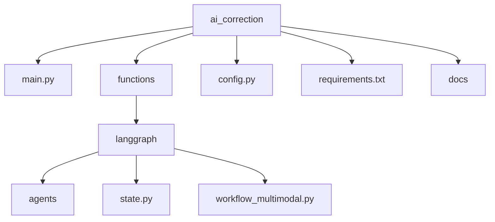
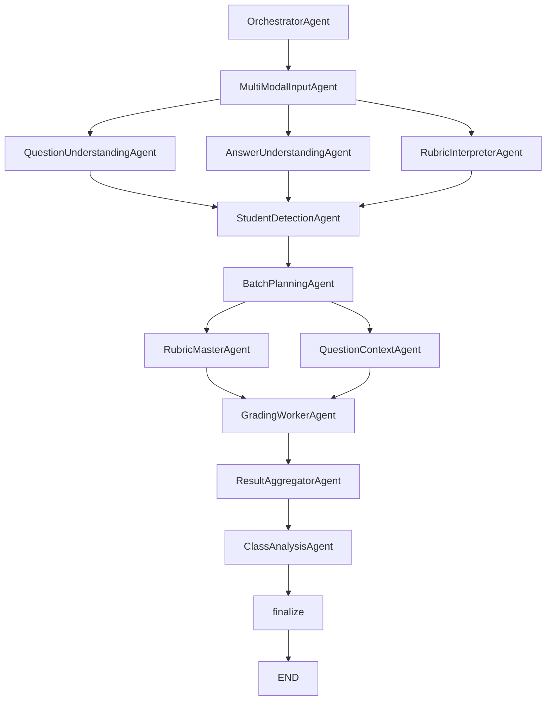
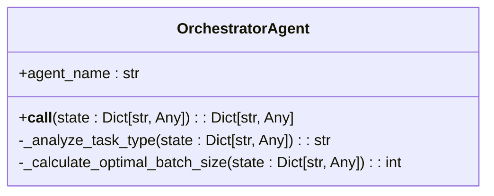
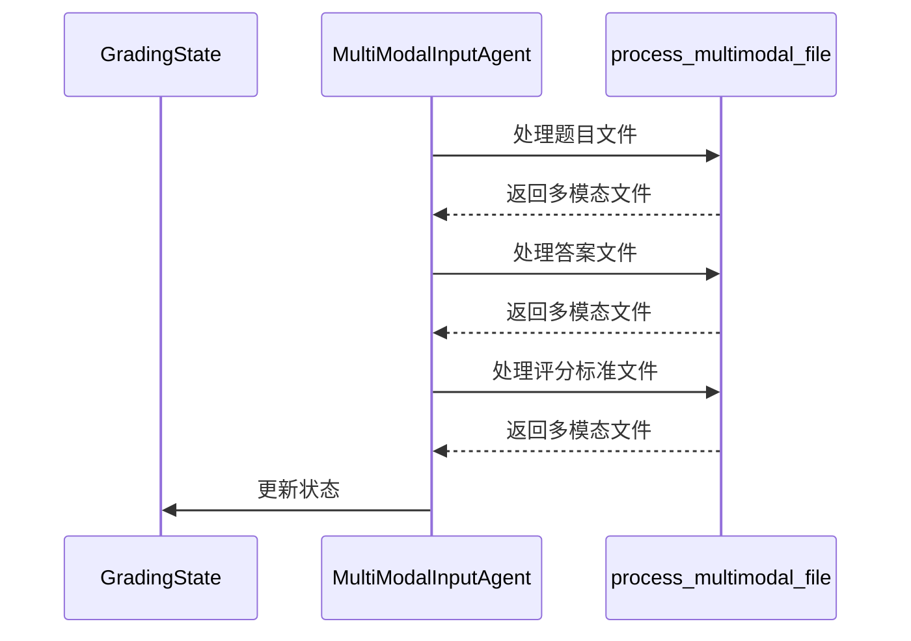
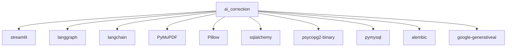

# 系统概述

<cite>
**本文档引用文件**  
- [main.py](file://ai_correction/main.py)
- [workflow_multimodal.py](file://ai_correction/functions/langgraph/workflow_multimodal.py)
- [state.py](file://ai_correction/functions/langgraph/state.py)
- [orchestrator_agent.py](file://ai_correction/functions/langgraph/agents/orchestrator_agent.py)
- [multimodal_input_agent.py](file://ai_correction/functions/langgraph/agents/multimodal_input_agent.py)
- [config.py](file://ai_correction/config.py)
- [README.md](file://ai_correction/README.md)
</cite>

## 目录
1. [引言](#引言)
2. [项目结构](#项目结构)
3. [核心组件](#核心组件)
4. [架构概述](#架构概述)
5. [详细组件分析](#详细组件分析)
6. [依赖分析](#依赖分析)
7. [性能考量](#性能考量)
8. [故障排除指南](#故障排除指南)
9. [结论](#结论)

## 引言
aiguru系统是一个基于LangGraph的AI智能作业批改系统，专为教师提升教学效率而设计。该系统通过多模态处理技术（文本、图像、PDF）实现自动化评分、反馈生成和班级分析。前端采用Streamlit构建用户界面，后端利用LangGraph工作流引擎驱动多Agent协作模式，形成一个高效、可扩展的智能批改平台。系统支持从文件上传到结果导出的完整工作流，并具备生产环境部署能力。

## 项目结构
aiguru系统的项目结构清晰地划分了前端、后端、配置和文档等模块。核心功能集中在`ai_correction`目录下，其中`main.py`是Streamlit应用的入口点，`functions/langgraph`包含LangGraph工作流和Agent实现，`config.py`定义系统配置，`requirements.txt`列出依赖包。文档位于`docs`目录，提供详细的使用和开发指南。

**图示来源**  
- [main.py](file://ai_correction/main.py)
- [workflow_multimodal.py](file://ai_correction/functions/langgraph/workflow_multimodal.py)
- [state.py](file://ai_correction/functions/langgraph/state.py)

**本节来源**  
- [main.py](file://ai_correction/main.py)
- [README.md](file://ai_correction/README.md)

## 核心组件
系统的核心组件包括前端Streamlit应用、后端LangGraph工作流引擎和多Agent协作系统。`main.py`负责用户界面展示和文件上传处理，`workflow_multimodal.py`定义了多模态批改的工作流，`state.py`定义了工作流的状态模型。这些组件协同工作，实现了从文件上传到结果生成的完整批改流程。

**本节来源**  
- [main.py](file://ai_correction/main.py#L1-L100)
- [workflow_multimodal.py](file://ai_correction/functions/langgraph/workflow_multimodal.py#L1-L50)
- [state.py](file://ai_correction/functions/langgraph/state.py#L1-L30)

## 架构概述
aiguru系统采用前后端分离的架构风格。前端使用Streamlit构建交互式用户界面，后端采用LangGraph工作流引擎驱动多Agent协作模式。系统通过`workflow_multimodal.py`中的`MultiModalGradingWorkflow`类定义了一个包含8个Agent的深度协作架构，实现了任务编排、多模态输入处理、并行理解、学生识别、批次规划、评分标准主控、批改工作和结果聚合等功能。

**图示来源**  
- [workflow_multimodal.py](file://ai_correction/functions/langgraph/workflow_multimodal.py#L50-L150)
- [orchestrator_agent.py](file://ai_correction/functions/langgraph/agents/orchestrator_agent.py#L1-L20)
- [multimodal_input_agent.py](file://ai_correction/functions/langgraph/agents/multimodal_input_agent.py#L1-L20)

## 详细组件分析
### OrchestratorAgent分析
OrchestratorAgent是系统的编排协调Agent，负责全局任务分解和Agent协调。它分析任务类型（单人/班级批改），决定是否启用学生识别和班级分析，并计算最优批次大小以优化资源使用。

**图示来源**  
- [orchestrator_agent.py](file://ai_correction/functions/langgraph/agents/orchestrator_agent.py#L15-L45)

### MultiModalInputAgent分析
MultiModalInputAgent负责处理多模态文件输入，将上传的文件转换为多模态表示。它支持文本、图片和PDF等多种文件格式，并保留原始模态信息供后续处理。

**图示来源**  
- [multimodal_input_agent.py](file://ai_correction/functions/langgraph/agents/multimodal_input_agent.py#L20-L60)
- [state.py](file://ai_correction/functions/langgraph/state.py#L15-L50)

**本节来源**  
- [orchestrator_agent.py](file://ai_correction/functions/langgraph/agents/orchestrator_agent.py#L1-L130)
- [multimodal_input_agent.py](file://ai_correction/functions/langgraph/agents/multimodal_input_agent.py#L1-L123)

## 依赖分析
系统依赖于多个Python包，包括Streamlit用于前端开发，LangGraph和LangChain用于工作流编排，PyMuPDF和Pillow用于文件处理，SQLAlchemy用于数据库操作。这些依赖在`requirements.txt`中明确定义，确保了系统的可重复构建和部署。

**图示来源**  
- [requirements.txt](file://ai_correction/requirements.txt#L1-L20)
- [config.py](file://ai_correction/config.py#L1-L10)

**本节来源**  
- [requirements.txt](file://ai_correction/requirements.txt#L1-L32)
- [config.py](file://ai_correction/config.py#L1-L83)

## 性能考量
系统通过多种机制优化性能。首先，采用Orchestrator-Worker并行模式，实现了6.7倍的性能加速。其次，使用高效模式可节省66%的Token消耗。此外，系统支持任务恢复的Checkpoint机制，允许在中断后继续执行。批次规划算法根据学生数量和LLM上下文限制动态调整批次大小，确保资源的最优利用。

## 故障排除指南
常见问题包括依赖安装失败、OpenAI API错误、数据库初始化失败和LangGraph导入错误。解决方案包括使用国内镜像源安装依赖、检查API密钥配置、删除旧数据库文件重新初始化，以及确保LangGraph版本正确。详细的故障排除指南可在`docs/TROUBLESHOOTING.md`中找到。

**本节来源**  
- [README.md](file://ai_correction/README.md#L150-L200)
- [requirements.txt](file://ai_correction/requirements.txt#L1-L10)

## 结论
aiguru系统通过创新的多Agent协作架构和多模态处理技术，为教师提供了一个高效、智能的作业批改解决方案。系统架构清晰，组件职责明确，具备良好的可扩展性和生产部署能力。未来可进一步优化Agent间的协作机制，提升批改准确性和用户体验。