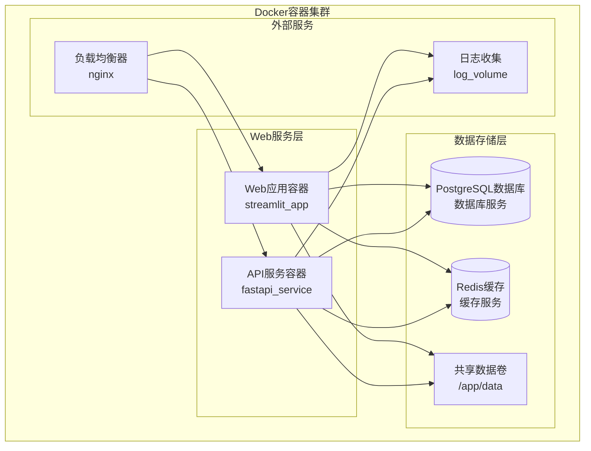

# Docker容器化部署方案

<cite>
**本文档引用的文件**
- [main.py](file://ai_correction/main.py)
- [requirements.txt](file://ai_correction/requirements.txt)
- [config.py](file://ai_correction/config.py)
- [migration.py](file://ai_correction/functions/database/migration.py)
- [models.py](file://ai_correction/functions/database/models.py)
- [db_manager.py](file://ai_correction/functions/database/db_manager.py)
- [init_database.py](file://ai_correction/init_database.py)
- [start_local.bat](file://ai_correction/start_local.bat)
- [local_runner.py](file://ai_correction/local_runner.py)
- [redis_cache_session.md](file://ai_correction/docs/redis_cache_session.md)
- [ENVIRONMENT_VARIABLES.md](file://ai_correction/docs/ENVIRONMENT_VARIABLES.md)
</cite>

## 目录
1. [项目概述](#项目概述)
2. [Docker部署架构](#docker部署架构)
3. [Dockerfile配置详解](#dockerfile配置详解)
4. [Docker Compose编排](#docker-compose编排)
5. [数据库迁移策略](#数据库迁移策略)
6. [环境变量配置](#环境变量配置)
7. [容器操作命令](#容器操作命令)
8. [生产环境优化](#生产环境优化)
9. [故障排除指南](#故障排除指南)
10. [总结](#总结)

## 项目概述

AI智能批改系统是一个基于Streamlit的Web应用程序，集成了LangGraph多模态AI批改引擎。该系统支持多种文件格式的智能批改，包括文本、图片和PDF文件，具备完整的用户认证、作业管理和数据分析功能。

### 核心技术栈
- **前端框架**: Streamlit Web应用
- **后端服务**: Python FastAPI + Uvicorn
- **AI引擎**: LangGraph多模态工作流
- **数据库**: PostgreSQL/MySQL/SQLite
- **缓存**: Redis分布式缓存
- **容器化**: Docker + Docker Compose

## Docker部署架构



**图表来源**
- [main.py](file://ai_correction/main.py#L1-L50)
- [config.py](file://ai_correction/config.py#L1-L30)

## Dockerfile配置详解

### 基础镜像选择

```dockerfile
# 多阶段构建 - 开发阶段
FROM python:3.11-slim AS development

# 生产阶段 - 减小镜像体积
FROM python:3.11-slim AS production

# 设置工作目录
WORKDIR /app

# 安装系统依赖
RUN apt-get update && apt-get install -y \
    gcc \
    g++ \
    make \
    && rm -rf /var/lib/apt/lists/*

# 创建非root用户
RUN groupadd -r appuser && useradd -r -g appuser appuser
USER appuser

# 复制依赖文件
COPY --chown=appuser:appuser ai_correction/requirements.txt .
COPY --chown=appuser:appuser ai_correction/alembic.ini .

# 安装Python依赖
RUN pip install --no-cache-dir -r requirements.txt

# 复制应用代码
COPY --chown=appuser:appuser ai_correction/ ./

# 设置环境变量
ENV PYTHONPATH=/app
ENV STREAMLIT_SERVER_PORT=8501
ENV HOST=0.0.0.0

# 暴露端口
EXPOSE 8501

# 健康检查
HEALTHCHECK --interval=30s --timeout=10s --start-period=5s --retries=3 \
    CMD curl -f http://localhost:8501/_stcore/health || exit 1

# 启动命令
CMD ["streamlit", "run", "main.py", "--server.port=8501", "--server.address=0.0.0.0"]
```

**章节来源**
- [requirements.txt](file://ai_correction/requirements.txt#L1-L32)
- [main.py](file://ai_correction/main.py#L1-L100)

### 多阶段构建优化

```dockerfile
# 开发阶段 - 包含调试工具
FROM python:3.11-slim AS development
ENV PYTHONUNBUFFERED=1
ENV PIP_DISABLE_PIP_VERSION_CHECK=1

# 安装开发工具
RUN apt-get update && apt-get install -y \
    git \
    curl \
    vim \
    && rm -rf /var/lib/apt/lists/*

# 复制并安装开发依赖
COPY --chown=appuser:appuser ai_correction/requirements.txt .
RUN pip install --no-cache-dir -r requirements.txt[dev]

# 复制完整项目
COPY --chown=appuser:appuser ai_correction/ ./
```

**章节来源**
- [requirements.txt](file://ai_correction/requirements.txt#L1-L32)

## Docker Compose编排

### 服务编排配置

```yaml
version: '3.8'

services:
  web:
    build:
      context: .
      dockerfile: Dockerfile
      target: production
    ports:
      - "8501:8501"
    environment:
      - DATABASE_TYPE=postgresql
      - DATABASE_URL=postgresql://postgres:password@db:5432/ai_correction
      - REDIS_URL=redis://redis:6379/0
      - LLM_PROVIDER=openrouter
      - LLM_API_KEY=${OPENAI_API_KEY}
      - ENABLE_CACHE=true
    volumes:
      - ./ai_correction:/app:rw
      - data-volume:/app/data
    depends_on:
      - db
      - redis
    networks:
      - app-network
    restart: unless-stopped
    healthcheck:
      test: ["CMD", "curl", "-f", "http://localhost:8501/_stcore/health"]
      interval: 30s
      timeout: 10s
      retries: 3
      start_period: 40s

  api:
    build:
      context: .
      dockerfile: Dockerfile
      target: production
    ports:
      - "8000:8000"
    environment:
      - DATABASE_TYPE=postgresql
      - DATABASE_URL=postgresql://postgres:password@db:5432/ai_correction
      - REDIS_URL=redis://redis:6379/0
      - LLM_PROVIDER=openrouter
      - LLM_API_KEY=${OPENAI_API_KEY}
      - ENABLE_CACHE=true
    volumes:
      - ./ai_correction:/app:rw
      - api-data-volume:/app/data
    depends_on:
      - db
      - redis
    networks:
      - app-network
    restart: unless-stopped
    healthcheck:
      test: ["CMD", "curl", "-f", "http://localhost:8000/health"]
      interval: 30s
      timeout: 10s
      retries: 3
      start_period: 40s

  db:
    image: postgres:15
    environment:
      - POSTGRES_DB=ai_correction
      - POSTGRES_USER=postgres
      - POSTGRES_PASSWORD=password
    volumes:
      - postgres-data:/var/lib/postgresql/data
    ports:
      - "5432:5432"
    networks:
      - app-network
    restart: unless-stopped
    healthcheck:
      test: ["CMD-SHELL", "pg_isready -U postgres"]
      interval: 10s
      timeout: 5s
      retries: 5

  redis:
    image: redis:7-alpine
    ports:
      - "6379:6379"
    volumes:
      - redis-data:/data
    networks:
      - app-network
    restart: unless-stopped
    healthcheck:
      test: ["CMD", "redis-cli", "ping"]
      interval: 10s
      timeout: 5s
      retries: 3

  nginx:
    image: nginx:alpine
    ports:
      - "80:80"
      - "443:443"
    volumes:
      - ./nginx.conf:/etc/nginx/nginx.conf:ro
      - ./ssl:/etc/nginx/ssl:ro
    depends_on:
      - web
      - api
    networks:
      - app-network
    restart: unless-stopped

volumes:
  data-volume:
    driver: local
  api-data-volume:
    driver: local
  postgres-data:
    driver: local
  redis-data:
    driver: local

networks:
  app-network:
    driver: bridge
```

**章节来源**
- [config.py](file://ai_correction/config.py#L10-L30)
- [db_manager.py](file://ai_correction/functions/database/db_manager.py#L20-L40)

### 网络配置

```yaml
networks:
  app-network:
    driver: bridge
    ipam:
      config:
        - subnet: 172.20.0.0/16
          gateway: 172.20.0.1
```

### 卷挂载策略

```yaml
volumes:
  # 应用数据卷 - 持久化用户上传文件
  data-volume:
    driver: local
    driver_opts:
      type: none
      o: bind
      device: /opt/ai-correction/data
  
  # 数据库卷 - 持久化数据库文件
  postgres-data:
    driver: local
    driver_opts:
      type: tmpfs
      device: tmpfs
      o: size=1024m
```

## 数据库迁移策略

### 自动迁移脚本

```python
#!/usr/bin/env python3
# -*- coding: utf-8 -*-
"""
容器启动时自动执行数据库迁移
"""

import os
import subprocess
import time
from pathlib import Path

def wait_for_database(host, port, timeout=30):
    """等待数据库服务可用"""
    import socket
    start_time = time.time()
    while time.time() - start_time < timeout:
        try:
            sock = socket.socket(socket.AF_INET, socket.SOCK_STREAM)
            sock.settimeout(5)
            result = sock.connect_ex((host, port))
            sock.close()
            if result == 0:
                print(f"数据库服务 {host}:{port} 可用")
                return True
        except Exception as e:
            print(f"等待数据库服务: {e}")
        time.sleep(2)
    return False

def run_database_migration():
    """执行数据库迁移"""
    print("开始数据库迁移...")
    
    # 等待数据库服务就绪
    if not wait_for_database("db", 5432):
        print("数据库服务不可用，跳过迁移")
        return
    
    # 设置环境变量
    os.environ['DATABASE_URL'] = 'postgresql://postgres:password@db:5432/ai_correction'
    
    # 执行迁移
    try:
        # 初始化Alembic
        subprocess.run(['python', '-m', 'ai_correction.functions.database.migration', 'init'], 
                      check=True, capture_output=True)
        
        # 创建迁移脚本
        subprocess.run(['python', '-m', 'ai_correction.functions.database.migration', 'create', 
                       '-m', 'initial_migration'], check=True, capture_output=True)
        
        # 执行升级
        subprocess.run(['python', '-m', 'ai_correction.functions.database.migration', 'upgrade'], 
                      check=True, capture_output=True)
        
        print("数据库迁移完成")
    except subprocess.CalledProcessError as e:
        print(f"数据库迁移失败: {e.stderr.decode()}")
        return False
    
    return True

if __name__ == "__main__":
    run_database_migration()
```

**章节来源**
- [migration.py](file://ai_correction/functions/database/migration.py#L25-L150)

### 迁移命令集成

```dockerfile
# 在Dockerfile中添加迁移脚本
COPY --chown=appuser:appuser ai_correction/docker-entrypoint.sh /entrypoint.sh
RUN chmod +x /entrypoint.sh

ENTRYPOINT ["/entrypoint.sh"]
```

```bash
#!/bin/bash
set -e

# 等待数据库服务
echo "等待数据库服务..."
until pg_isready -h db -p 5432; do
  sleep 2
done

# 执行数据库迁移
echo "执行数据库迁移..."
python -m ai_correction.functions.database.migration upgrade

# 启动应用
exec "$@"
```

**章节来源**
- [migration.py](file://ai_correction/functions/database/migration.py#L187-L232)

## 环境变量配置

### 生产环境配置

```env
# 基础配置
ENVIRONMENT=production
DEBUG=false
SECRET_KEY=your-secret-key-here

# 数据库配置
DATABASE_TYPE=postgresql
DATABASE_URL=postgresql://postgres:secure_password@db:5432/ai_correction
POSTGRES_CHECKPOINT_URL=postgresql://postgres:secure_password@db:5432/langgraph_checkpoints

# Redis配置
REDIS_URL=redis://redis:6379/0
ENABLE_CACHE=true
CACHE_TTL=3600

# LLM配置
LLM_PROVIDER=openrouter
LLM_API_KEY=your-openrouter-api-key
LLM_MODEL=google/gemini-2.5-flash-lite

# 安全配置
ALLOWED_HOSTS=*.example.com,localhost,127.0.0.1
CSRF_TRUSTED_ORIGINS=https://*.example.com

# 文件上传配置
UPLOAD_DIR=/app/uploads
MAX_FILE_SIZE=10485760
ALLOWED_EXTENSIONS=.txt,.md,.pdf,.jpg,.jpeg,.png,.gif,.bmp,.webp

# 日志配置
LOG_LEVEL=INFO
LOG_FILE=/app/logs/app.log

# 性能配置
MAX_PARALLEL_WORKERS=8
STREAMLIT_SERVER_PORT=8501
```

### 安全最佳实践

```yaml
services:
  web:
    environment:
      - SECRET_KEY=${SECRET_KEY}
      - DATABASE_URL=${DATABASE_URL}
      - REDIS_URL=${REDIS_URL}
      - LLM_API_KEY=${LLM_API_KEY}
    secrets:
      - secret_key
      - db_password
      - redis_password
      - llm_api_key

secrets:
  secret_key:
    external: true
  db_password:
    external: true
  redis_password:
    external: true
  llm_api_key:
    external: true
```

**章节来源**
- [config.py](file://ai_correction/config.py#L10-L82)
- [ENVIRONMENT_VARIABLES.md](file://ai_correction/docs/ENVIRONMENT_VARIABLES.md#L292-L378)

## 容器操作命令

### 构建和启动

```bash
# 1. 构建镜像
docker build -t ai-correction-web:latest .

# 2. 使用Docker Compose启动
docker-compose up -d

# 3. 查看服务状态
docker-compose ps
docker-compose logs -f web

# 4. 进入容器调试
docker-compose exec web bash
docker-compose exec db psql -U postgres -d ai_correction

# 5. 停止和清理
docker-compose down
docker-compose down -v  # 清理卷
```

### 数据库管理

```bash
# 1. 进入数据库容器
docker-compose exec db bash

# 2. 执行数据库命令
docker-compose exec db psql -U postgres -d ai_correction

# 3. 导出数据库
docker-compose exec db pg_dump -U postgres ai_correction > backup.sql

# 4. 恢复数据库
cat backup.sql | docker-compose exec -T db psql -U postgres -d ai_correction

# 5. Redis管理
docker-compose exec redis redis-cli
```

### 日志管理

```bash
# 1. 查看应用日志
docker-compose logs -f --tail=100 web

# 2. 查看特定服务日志
docker-compose logs -f web | grep ERROR
docker-compose logs -f api | grep "HTTP"

# 3. 日志轮转
docker-compose exec web find /app/logs -name "*.log" -mtime +7 -delete
```

**章节来源**
- [start_local.bat](file://ai_correction/start_local.bat#L1-L36)
- [local_runner.py](file://ai_correction/local_runner.py#L1-L37)

## 生产环境优化

### 资源限制配置

```yaml
services:
  web:
    deploy:
      resources:
        limits:
          cpus: '2.0'
          memory: 4G
        reservations:
          cpus: '1.0'
          memory: 2G
    ulimits:
      nproc: 65535
      nofile:
        soft: 65535
        hard: 65535

  api:
    deploy:
      replicas: 3
      resources:
        limits:
          cpus: '1.0'
          memory: 2G
        reservations:
          cpus: '0.5'
          memory: 1G
```

### 健康检查配置

```yaml
healthcheck:
  test: ["CMD", "curl", "-f", "http://localhost:8501/_stcore/health"]
  interval: 30s
  timeout: 10s
  retries: 3
  start_period: 40s
```

### 负载均衡配置

```nginx
upstream ai_correction_backend {
    server web:8501;
    server api:8000;
}

server {
    listen 80;
    server_name localhost;
    
    location / {
        proxy_pass http://ai_correction_backend;
        proxy_set_header Host $host;
        proxy_set_header X-Real-IP $remote_addr;
        proxy_set_header X-Forwarded-For $proxy_add_x_forwarded_for;
        proxy_set_header X-Forwarded-Proto $scheme;
    }
    
    location /health {
        access_log off;
        proxy_pass http://ai_correction_backend/_stcore/health;
    }
}
```

### 多实例部署

```yaml
services:
  web-1:
    <<: *web-service-template
    container_name: ai-correction-web-1
    ports:
      - "8501:8501"
      
  web-2:
    <<: *web-service-template
    container_name: ai-correction-web-2
    ports:
      - "8502:8501"
      
  web-3:
    <<: *web-service-template
    container_name: ai-correction-web-3
    ports:
      - "8503:8501"
```

**章节来源**
- [redis_cache_session.md](file://ai_correction/docs/redis_cache_session.md#L180-L228)

## 故障排除指南

### 常见问题诊断

```bash
# 1. 容器启动失败
docker-compose logs web
docker-compose ps
docker system prune -f

# 2. 数据库连接问题
docker-compose exec db psql -U postgres -d ai_correction
docker-compose logs db

# 3. 内存不足
docker stats
docker-compose exec web free -h

# 4. 端口冲突
netstat -tulpn | grep :8501
lsof -i :8501
```

### 性能监控

```bash
# 监控容器资源使用
docker stats --no-stream

# 监控网络连接
docker network ls
docker network inspect app-network

# 监控存储使用
docker volume ls
docker system df
```

### 日志分析

```bash
# 分析错误日志
docker-compose logs web | grep -i error
docker-compose logs api | grep -i exception

# 实时监控
docker-compose logs -f web | grep -E "(ERROR|WARNING)"

# 性能分析
docker-compose logs web | awk '{print $1}' | sort | uniq -c
```

**章节来源**
- [init_database.py](file://ai_correction/init_database.py#L50-L111)

## 总结

本Docker部署方案为AI智能批改系统提供了完整的容器化解决方案，涵盖了从开发到生产的各个阶段。通过多阶段构建、服务编排、自动化迁移和生产级优化，确保了系统的稳定性、可扩展性和安全性。

### 主要优势

1. **模块化设计**: 清晰的服务分离和依赖管理
2. **自动化部署**: 自动化的数据库迁移和服务启动流程
3. **生产就绪**: 完善的健康检查、资源限制和监控配置
4. **安全可靠**: 环境变量管理、密钥隔离和网络安全
5. **易于维护**: 标准化的容器操作和故障排除流程

### 部署建议

1. **环境隔离**: 开发、测试、生产环境使用不同的配置
2. **备份策略**: 定期备份数据库和重要数据
3. **监控告警**: 集成监控系统，设置关键指标告警
4. **滚动更新**: 使用Docker Swarm或Kubernetes实现零停机更新
5. **安全审计**: 定期审查容器安全和访问权限

通过遵循本方案的最佳实践，可以确保AI智能批改系统在生产环境中稳定高效地运行。