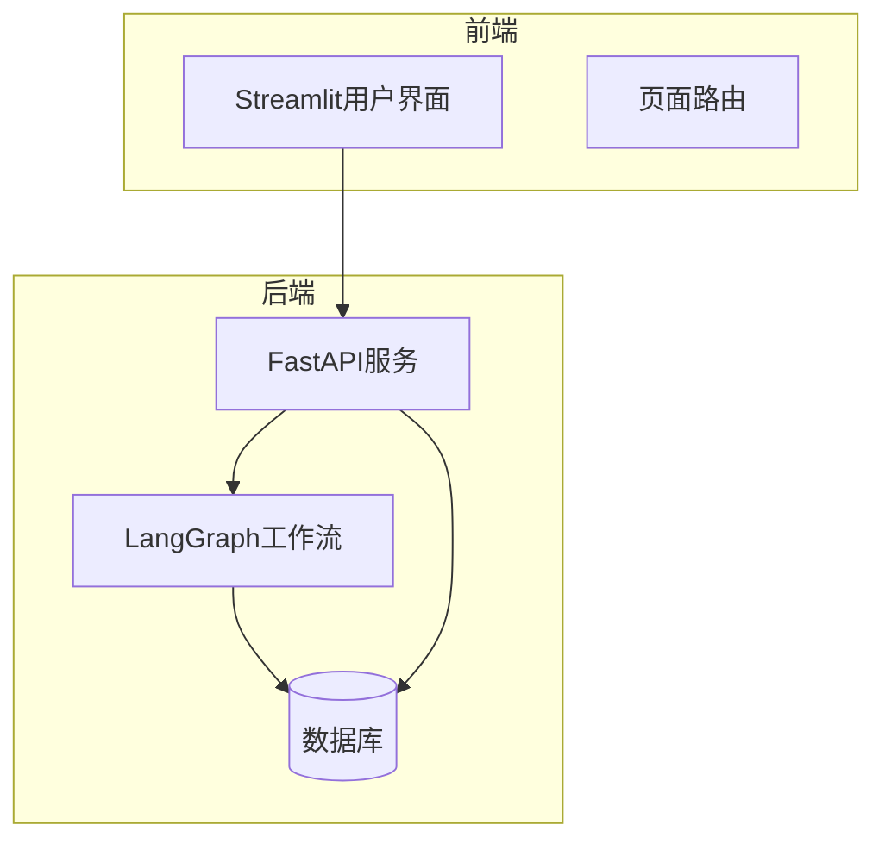
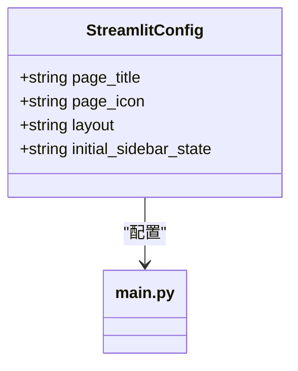
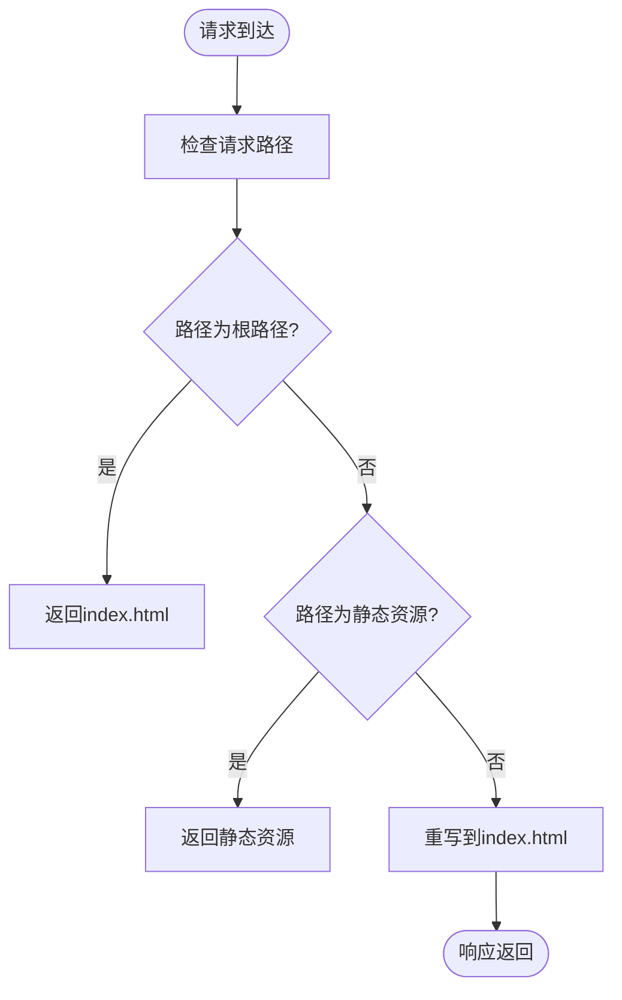
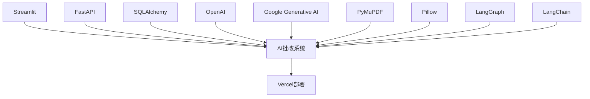

# Vercel部署

<cite>
**本文档中引用的文件**  
- [vercel.json](file://vercel.json)
- [main.py](file://ai_correction/main.py)
- [requirements.txt](file://ai_correction/requirements.txt)
- [DEPLOYMENT_GUIDE.md](file://ai_correction/docs/DEPLOYMENT_GUIDE.md)
- [ENVIRONMENT_VARIABLES.md](file://ai_correction/docs/ENVIRONMENT_VARIABLES.md)
- [config.py](file://ai_correction/config.py)
</cite>

## 目录
1. [简介](#简介)
2. [项目结构](#项目结构)
3. [核心组件](#核心组件)
4. [架构概述](#架构概述)
5. [详细组件分析](#详细组件分析)
6. [依赖分析](#依赖分析)
7. [性能考虑](#性能考虑)
8. [故障排除指南](#故障排除指南)
9. [结论](#结论)

## 简介
本文档提供详细的Vercel平台部署指南，基于`vercel.json`配置文件中的重写规则（source: '/(.*)', destination: '/index.html'），解释如何正确配置静态文件路由以支持单页应用模式。说明Streamlit应用在Vercel上的构建流程，包括构建命令、输出目录配置和静态资源处理。详细描述环境变量的设置方法，特别是OPENAI_API_KEY、DATABASE_URL等关键变量的配置位置。提供vercel.json的完整配置示例，并解释每个字段的作用。包含部署后的验证步骤，如访问根路径检查路由重写是否生效，以及常见部署问题的排查方法，如404错误、静态资源加载失败等。

**Section sources**
- [vercel.json](file://vercel.json#L0-L0)
- [DEPLOYMENT_GUIDE.md](file://ai_correction/docs/DEPLOYMENT_GUIDE.md#L0-L309)

## 项目结构
本项目采用分层架构设计，主要包含AI批改系统核心模块和部署配置文件。项目根目录下包含`vercel.json`部署配置文件，`ai_correction`目录为AI批改系统主应用，其中包含Streamlit前端界面、LangGraph工作流引擎、数据库管理模块等核心组件。

```

├── ai_correction
│   ├── docs
│   ├── functions
│   ├── prompts
│   ├── test_data
│   ├── test_data_debug
│   ├── tests
│   ├── uploads
│   ├── AGENT_CLEANUP_REPORT.md
│   ├── CLEANUP_COMPLETE.md
│   ├── FINAL_REFACTORING_REPORT.md
│   ├── README.md
│   ├── config.py
│   ├── init_database.py
│   ├── install_pdf_support.py
│   ├── local_runner.py
│   ├── main.py
│   ├── requirements.txt
│   ├── start_local.bat
│   ├── test_api.py
│   ├── test_multimodal_grading.py
│   ├── test_new_workflow.py
│   ├── test_scoring.py
│   └── user_data.json
├── README.md
├── RELEASE_NOTES_v2.0.md
├── TEST_REPORT_PHASE1.md
├── start_dev.bat
├── urgent_fix_deployment.py
├── vercel.json
├── 像高手一样写代码.ipynb
└── 命令.md
```

**Diagram sources**
- [vercel.json](file://vercel.json#L0-L0)
- [main.py](file://ai_correction/main.py#L0-L199)

**Section sources**
- [vercel.json](file://vercel.json#L0-L0)
- [main.py](file://ai_correction/main.py#L0-L199)

## 核心组件
AI批改系统的核心组件包括Streamlit前端界面、LangGraph工作流引擎、数据库管理模块和文件处理模块。Streamlit作为全栈Web框架，提供用户友好的交互界面；LangGraph作为状态机编排引擎，实现Orchestrator-Worker模式的并行批改；数据库模块使用SQLAlchemy进行数据模型管理，支持SQLite和PostgreSQL；文件处理模块支持多种格式的文件上传和处理。

**Section sources**
- [main.py](file://ai_correction/main.py#L0-L199)
- [requirements.txt](file://ai_correction/requirements.txt#L0-L31)

## 架构概述
系统采用现代化的全栈架构，前端使用Streamlit构建交互界面，后端使用FastAPI提供API服务，工作流引擎采用LangGraph实现复杂的状态管理。数据层支持SQLite（开发环境）和PostgreSQL（生产环境），通过SQLAlchemy进行ORM管理。系统支持多模态输入处理，包括文本和图像识别，实现像素坐标标注功能。



**Diagram sources**
- [main.py](file://ai_correction/main.py#L0-L199)
- [config.py](file://ai_correction/config.py#L48-L80)

## 详细组件分析
### Streamlit应用分析
Streamlit应用作为系统的前端入口，提供简洁直观的用户界面。应用配置了页面标题、图标、布局等属性，支持宽屏显示和展开的侧边栏状态。通过CSS样式定制，实现了黑白纯色的主题设计，提升了用户体验。

#### 页面配置


**Diagram sources**
- [main.py](file://ai_correction/main.py#L25-L35)

### 静态文件路由配置
Vercel平台通过`vercel.json`文件中的重写规则实现单页应用模式的路由支持。`/.*`路径的所有请求都被重写到`/index.html`，确保前端路由能够正确处理。

#### 重写规则


**Diagram sources**
- [vercel.json](file://vercel.json#L0-L0)

### 构建流程配置
Vercel部署的构建流程通过`vercel.json`文件配置，包括安装依赖、构建命令和开发命令。系统会自动安装`requirements.txt`中定义的Python依赖包，并启动Streamlit应用。

#### 构建配置
```json
{
  "buildCommand": "pip install -r requirements.txt",
  "devCommand": "streamlit run main.py",
  "installCommand": "pip install -r requirements.txt"
}
```

**Section sources**
- [vercel.json](file://vercel.json#L0-L0)
- [requirements.txt](file://ai_correction/requirements.txt#L0-L31)

## 依赖分析
系统依赖主要分为前端框架、后端服务、数据库管理和AI模型四类。前端依赖Streamlit框架，后端使用FastAPI和Uvicorn，数据库通过SQLAlchemy管理，AI模型集成OpenAI和Google Gemini。



**Diagram sources**
- [requirements.txt](file://ai_correction/requirements.txt#L0-L31)
- [vercel.json](file://vercel.json#L0-L0)

**Section sources**
- [requirements.txt](file://ai_correction/requirements.txt#L0-L31)

## 性能考虑
系统在设计时充分考虑了性能优化，包括并行处理配置、Token阈值优化和缓存机制。通过调整`MAX_PARALLEL_WORKERS`参数，可以根据服务器核心数优化并行处理能力。设置合理的Token阈值，可以在高效模式和专业模式之间平衡性能和成本。

**Section sources**
- [ENVIRONMENT_VARIABLES.md](file://ai_correction/docs/ENVIRONMENT_VARIABLES.md#L0-L431)

## 故障排除指南
### 常见部署问题
1. **404错误**
   - 检查`vercel.json`中的重写规则是否正确配置
   - 确认`index.html`文件存在于输出目录中

2. **静态资源加载失败**
   - 检查静态资源路径配置
   - 确认文件权限设置正确

3. **依赖安装失败**
   - 使用国内镜像源安装依赖
   ```bash
   pip install -r requirements.txt -i https://pypi.tuna.tsinghua.edu.cn/simple
   ```

4. **环境变量未生效**
   - 在Vercel控制台中确认环境变量已正确设置
   - 检查变量名称拼写是否正确

**Section sources**
- [DEPLOYMENT_GUIDE.md](file://ai_correction/docs/DEPLOYMENT_GUIDE.md#L0-L309)
- [ENVIRONMENT_VARIABLES.md](file://ai_correction/docs/ENVIRONMENT_VARIABLES.md#L0-L431)

## 结论
通过本文档的指导，用户可以成功在Vercel平台部署AI批改系统。关键配置包括`vercel.json`中的重写规则、环境变量设置和构建流程配置。系统采用现代化的全栈架构，结合Streamlit、LangGraph和多种AI模型，实现了高效智能的批改功能。部署过程中需要注意静态文件路由、环境变量安全和性能优化等方面，确保系统稳定运行。