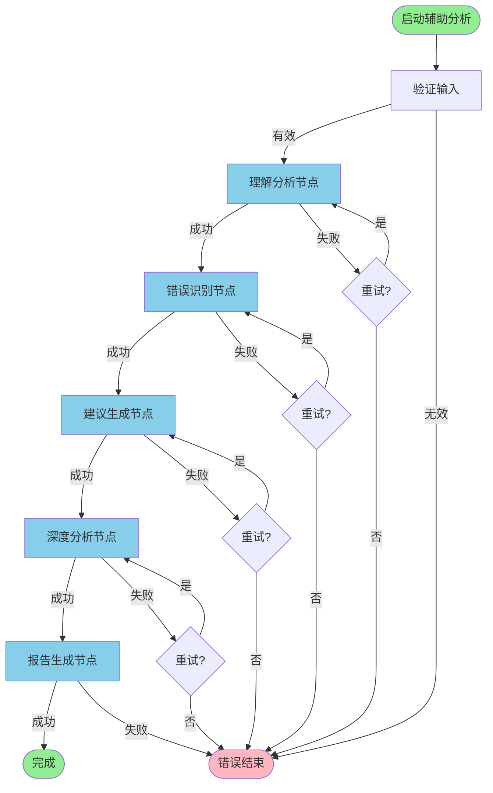

# 辅助批改系统 - LangGraph 工作流详细设计

**版本**: 1.0  
**日期**: 2026-01-28

## 1. 工作流概览

### 1.1 完整流程图



### 1.2 状态流转

```
初始状态 (initialized)
    ↓
理解分析中 (understanding)
    ↓
错误识别中 (identifying_errors)
    ↓
建议生成中 (generating_suggestions)
    ↓
深度分析中 (deep_analyzing)
    ↓
报告生成中 (generating_report)
    ↓
已完成 (completed)
```

---

## 2. 节点详细设计

### 2.1 理解分析节点（Understand Assignment Node）

#### 输入

- `image_base64_list`: 作业图片列表
- `context_info`: 上下文信息（可选）
- `subject`: 科目（可选）

#### 处理逻辑

```python
async def understand_assignment_node(state: AssistantGradingState) -> Dict[str, Any]:
    """
    理解作业内容节点
    
    功能：
    1. 识别知识点
    2. 分析题目类型
    3. 推断解题思路
    4. 评估难度
    
    使用的 AI 能力：
    - 视觉理解（识别手写内容）
    - 知识图谱（匹配知识点）
    - 逻辑推理（分析解题步骤）
    """
    analysis_id = state["analysis_id"]
    images = state["image_base64_list"]
    context = state.get("context_info", {})
    subject = state.get("subject")
    
    logger.info(
        f"[AssistantGrading] 开始理解分析: "
        f"analysis_id={analysis_id}, images={len(images)}"
    )
    
    try:
        # 1. 初始化分析器
        analyzer = AssistantAnalyzer()
        
        # 2. 调用 LLM 进行理解分析
        understanding = await analyzer.understand_assignment(
            images=images,
            context=context,
            subject=subject,
        )
        
        # 3. 验证结果
        if not understanding or not understanding.get("knowledge_points"):
            raise ValueError("理解分析结果为空或无效")
        
        # 4. 更新状态
        return {
            "understanding": understanding,
            "current_stage": "understood",
            "percentage": 25.0,
            "timestamps": {
                **state.get("timestamps", {}),
                "understood_at": datetime.now().isoformat()
            }
        }
        
    except Exception as e:
        logger.error(f"[AssistantGrading] 理解分析失败: {e}", exc_info=True)
        
        # 记录错误
        return {
            "processing_errors": [
                *state.get("processing_errors", []),
                {
                    "stage": "understand",
                    "error": str(e),
                    "timestamp": datetime.now().isoformat()
                }
            ],
            "retry_count": state.get("retry_count", 0) + 1,
        }
```

#### Prompt 模板

```python
UNDERSTANDING_PROMPT_TEMPLATE = """
你是一位经验丰富的{subject}学科专家和教育心理学家。

请深入分析这份学生作业，重点关注：

## 1. 知识点识别
- 作业涉及哪些核心知识点？
- 每个知识点的置信度是多少？
- 知识点之间的关联是什么？

## 2. 题目类型分析
- 这是什么类型的题目？（计算题、证明题、应用题、综合题等）
- 题目的难度如何？（简单/中等/困难）
- 预计完成时间是多少？

## 3. 解题思路推断
- 学生采用了什么解题方法？
- 解题步骤是否完整？
- 逻辑链条是否清晰？

## 上下文信息
{context_json}

## 输出格式
请严格按照以下 JSON 格式输出（确保是有效的 JSON）：

```json
{{
  "knowledge_points": [
    {{
      "name": "知识点名称",
      "category": "分类（如：微积分/代数/几何）",
      "confidence": 0.9
    }}
  ],
  "question_types": ["计算题", "证明题"],
  "solution_approaches": [
    "使用定义法求极限",
    "应用洛必达法则"
  ],
  "difficulty_level": "medium",
  "estimated_time_minutes": 30,
  "logic_chain": [
    "步骤1：识别题目要求",
    "步骤2：选择合适的方法",
    "步骤3：进行计算",
    "步骤4：验证结果"
  ]
}}
```

## 注意事项
1. 不要猜测，基于实际看到的内容进行分析
2. 如果某些信息不确定，将置信度设置为较低值
3. 专注于学生的解题过程，而不是最终答案
4. 保持客观和专业
"""
```

#### 输出

```python
{
  "understanding": {
    "knowledge_points": [
      {
        "name": "极限的定义",
        "category": "微积分",
        "confidence": 0.95
      },
      {
        "name": "洛必达法则",
        "category": "微积分",
        "confidence": 0.85
      }
    ],
    "question_types": ["计算题", "应用题"],
    "solution_approaches": [
      "使用定义法求极限",
      "应用洛必达法则简化计算"
    ],
    "difficulty_level": "medium",
    "estimated_time_minutes": 20,
    "logic_chain": [
      "识别极限类型",
      "判断是否满足洛必达条件",
      "应用法则求解",
      "化简结果"
    ]
  }
}
```

---

### 2.2 错误识别节点（Identify Errors Node）

#### 输入

- `image_base64_list`: 作业图片列表
- `understanding`: 理解分析结果

#### 处理逻辑

```python
async def identify_errors_node(state: AssistantGradingState) -> Dict[str, Any]:
    """
    错误识别节点
    
    功能：
    1. 检测计算错误
    2. 检测逻辑错误
    3. 检测概念错误
    4. 检测书写错误
    
    使用的 AI 能力：
    - 数学推理（验证计算步骤）
    - 逻辑验证（检查推理链条）
    - 概念匹配（验证公式和定义）
    """
    analysis_id = state["analysis_id"]
    images = state["image_base64_list"]
    understanding = state["understanding"]
    
    logger.info(
        f"[AssistantGrading] 开始错误识别: analysis_id={analysis_id}"
    )
    
    try:
        # 1. 初始化错误检测器
        detector = ErrorDetector()
        
        # 2. 检测错误
        errors = await detector.detect_errors(
            images=images,
            understanding=understanding,
        )
        
        # 3. 按严重程度排序
        errors = sorted(
            errors,
            key=lambda e: {"high": 0, "medium": 1, "low": 2}[e["severity"]]
        )
        
        # 4. 更新状态
        return {
            "errors": errors,
            "current_stage": "errors_identified",
            "percentage": 50.0,
            "timestamps": {
                **state.get("timestamps", {}),
                "errors_identified_at": datetime.now().isoformat()
            }
        }
        
    except Exception as e:
        logger.error(f"[AssistantGrading] 错误识别失败: {e}", exc_info=True)
        return {
            "processing_errors": [
                *state.get("processing_errors", []),
                {
                    "stage": "identify_errors",
                    "error": str(e),
                    "timestamp": datetime.now().isoformat()
                }
            ],
            "retry_count": state.get("retry_count", 0) + 1,
        }
```

#### Prompt 模板

```python
ERROR_DETECTION_PROMPT_TEMPLATE = """
你是一位严谨的{subject}学科专家，请仔细检查这份作业中的错误。

## 理解分析结果
{understanding_json}

## 错误检测维度

### 1. 计算错误
- 数值计算是否正确？
- 单位换算是否正确？
- 精度保留是否合理？

### 2. 逻辑错误
- 推理步骤是否合理？
- 前后是否矛盾？
- 是否有步骤缺失？
- 因果关系是否成立？

### 3. 概念错误
- 公式使用是否正确？
- 定义理解是否准确？
- 定理应用是否恰当？
- 适用条件是否满足？

### 4. 书写错误
- 符号使用是否规范？
- 格式是否正确？
- 单位是否标注？

## 输出格式

对于每个错误，请提供：

```json
{{
  "errors": [
    {{
      "error_id": "err_001",
      "error_type": "calculation|logic|concept|writing",
      "description": "具体的错误描述",
      "severity": "high|medium|low",
      "location": {{
        "page": 0,
        "region": "顶部/中间/底部",
        "step_number": 3
      }},
      "affected_steps": ["步骤3", "步骤4"],
      "correct_approach": "正确的做法应该是...",
      "context": "出现错误的上下文"
    }}
  ]
}}
```

## 注意事项
1. 只标记明确的错误，不要过度挑剔
2. 区分"错误"和"可以改进"
3. 对于严重程度的判断：
   - high: 导致结果完全错误
   - medium: 导致结果部分错误
   - low: 不影响结果但不规范
4. 提供建设性的指导
"""
```

#### 输出

```python
{
  "errors": [
    {
      "error_id": "err_001",
      "error_type": "calculation",
      "description": "在步骤3中，分母应该是 (x-1)² 而不是 (x-1)",
      "severity": "high",
      "location": {
        "page": 0,
        "region": "middle",
        "step_number": 3
      },
      "affected_steps": ["步骤3", "步骤4"],
      "correct_approach": "应用求导法则时，(x-1) 的导数是 1，所以分母应该是 (x-1)²",
      "context": "在应用洛必达法则求极限时"
    }
  ]
}
```

---

### 2.3 建议生成节点（Generate Suggestions Node）

#### 输入

- `errors`: 错误列表
- `understanding`: 理解分析结果

#### Prompt 模板

```python
SUGGESTION_PROMPT_TEMPLATE = """
基于识别出的错误和作业理解，请提供具体的改进建议。

## 识别的错误
{errors_json}

## 理解分析
{understanding_json}

## 建议生成原则

### 1. 纠正建议（Correction）
针对每个错误，提供：
- 错误的原因
- 正确的做法
- 如何避免类似错误

### 2. 改进建议（Improvement）
提供更优的解题方法：
- 更简洁的步骤
- 更清晰的表达
- 更规范的格式

### 3. 替代方案（Alternative）
提供其他解题思路：
- 不同的方法
- 不同的角度
- 拓展思考

## 输出格式

```json
{{
  "suggestions": [
    {{
      "suggestion_id": "sug_001",
      "related_error_id": "err_001",
      "suggestion_type": "correction|improvement|alternative",
      "description": "具体的建议描述",
      "example": "示例或演示",
      "priority": "high|medium|low",
      "resources": [
        "相关的学习资源"
      ],
      "expected_improvement": "预期的改进效果"
    }}
  ]
}}
```

## 注意事项
1. 建议要具体、可操作
2. 提供清晰的示例
3. 优先级判断：
   - high: 必须改正的错误
   - medium: 建议改进的地方
   - low: 可选的优化建议
4. 保持鼓励和正面的语气
"""
```

---

### 2.4 深度分析节点（Deep Analysis Node）

#### Prompt 模板

```python
DEEP_ANALYSIS_PROMPT_TEMPLATE = """
作为教育专家，请对学生的作业进行全面的深度分析。

## 综合信息

### 理解分析
{understanding_json}

### 错误列表
{errors_json}

### 改进建议
{suggestions_json}

## 深度分析维度

### 1. 理解程度评估（0-100 分）
- 学生对知识点的理解程度如何？
- 基础概念是否扎实？
- 能否灵活运用？

评分依据：
- 90-100: 理解透彻，能够创新应用
- 70-89: 理解良好，能够正确应用
- 50-69: 基本理解，但有欠缺
- 30-49: 理解不足，有明显误解
- 0-29: 基本不理解

### 2. 逻辑连贯性评估（0-100 分）
- 解题逻辑是否清晰？
- 步骤之间是否连贯？
- 推理是否严谨？

### 3. 完整性评估（0-100 分）
- 解答是否完整？
- 是否遗漏关键步骤？
- 是否考虑了所有情况？

### 4. 优点总结
列出学生做得好的地方（3-5 条）

### 5. 不足总结
列出需要改进的地方（3-5 条）

### 6. 学习建议
提供具体的学习建议（3-5 条）

## 输出格式

```json
{{
  "understanding_score": 75.0,
  "understanding_score_reasoning": "评分理由",
  "logic_coherence": 80.0,
  "logic_coherence_reasoning": "评分理由",
  "completeness": 70.0,
  "completeness_reasoning": "评分理由",
  "overall_score": 75.0,
  "strengths": [
    "解题思路清晰，选择了合适的方法",
    "步骤完整，逻辑连贯",
    "书写规范，易于理解"
  ],
  "weaknesses": [
    "计算过程中存在粗心错误",
    "符号使用不够规范",
    "缺少必要的验证步骤"
  ],
  "learning_recommendations": [
    {{
      "category": "基础强化",
      "description": "加强基础运算练习，减少计算错误",
      "action_items": [
        "每天练习 10 道计算题",
        "总结常见的计算陷阱"
      ]
    }},
    {{
      "category": "规范提升",
      "description": "注意数学符号的规范使用",
      "action_items": [
        "学习数学符号的标准写法",
        "养成检查符号的习惯"
      ]
    }}
  ],
  "growth_potential": "high|medium|low",
  "next_steps": [
    "巩固当前知识点",
    "尝试解决更有挑战性的题目"
  ]
}}
```

## 注意事项
1. 评分要客观、有依据
2. 优点和不足要具体、平衡
3. 学习建议要可操作、有指导性
4. 保持鼓励和正面的态度
5. 关注学生的成长潜力
"""
```

---

### 2.5 报告生成节点（Generate Report Node）

#### 处理逻辑

```python
async def generate_report_node(state: AssistantGradingState) -> Dict[str, Any]:
    """
    报告生成节点
    
    功能：
    1. 汇总所有分析结果
    2. 生成结构化报告
    3. 生成可视化图表（可选）
    4. 存储报告
    """
    analysis_id = state["analysis_id"]
    understanding = state["understanding"]
    errors = state["errors"]
    suggestions = state["suggestions"]
    deep_analysis = state["deep_analysis"]
    
    logger.info(
        f"[AssistantGrading] 开始生成报告: analysis_id={analysis_id}"
    )
    
    try:
        # 1. 初始化报告构建器
        builder = ReportBuilder()
        
        # 2. 构建报告
        report = await builder.build_report(
            analysis_id=analysis_id,
            submission_id=state.get("submission_id"),
            student_id=state.get("student_id"),
            subject=state.get("subject"),
            understanding=understanding,
            errors=errors,
            suggestions=suggestions,
            deep_analysis=deep_analysis,
        )
        
        # 3. 生成可视化图表（可选）
        if should_generate_charts(state):
            charts = await builder.generate_charts(report)
            report["charts"] = charts
        
        # 4. 存储报告
        report_url = await builder.save_report(analysis_id, report)
        
        # 5. 存储到数据库
        await save_analysis_to_db(analysis_id, report, report_url)
        
        # 6. 更新状态
        return {
            "report": report,
            "report_url": report_url,
            "current_stage": "completed",
            "percentage": 100.0,
            "timestamps": {
                **state.get("timestamps", {}),
                "completed_at": datetime.now().isoformat()
            }
        }
        
    except Exception as e:
        logger.error(f"[AssistantGrading] 报告生成失败: {e}", exc_info=True)
        return {
            "processing_errors": [
                *state.get("processing_errors", []),
                {
                    "stage": "generate_report",
                    "error": str(e),
                    "timestamp": datetime.now().isoformat()
                }
            ],
            "retry_count": state.get("retry_count", 0) + 1,
        }
```

#### 报告结构

```python
REPORT_STRUCTURE = {
    "metadata": {
        "analysis_id": "ana_abc123",
        "submission_id": "sub_12345",
        "student_id": "stu_67890",
        "subject": "mathematics",
        "created_at": "2026-01-28T10:00:00Z",
        "completed_at": "2026-01-28T10:05:00Z",
        "version": "1.0"
    },
    "summary": {
        "overall_score": 75.0,
        "total_errors": 3,
        "high_severity_errors": 1,
        "total_suggestions": 5,
        "estimated_completion_time_minutes": 20,
        "actual_difficulty": "medium"
    },
    "understanding": {
        # 理解分析结果
    },
    "errors": [
        # 错误列表
    ],
    "suggestions": [
        # 建议列表
    ],
    "deep_analysis": {
        # 深度分析结果
    },
    "visualizations": {
        "score_breakdown_chart": "chart_url_1",
        "error_distribution_chart": "chart_url_2",
        "knowledge_point_radar": "chart_url_3"
    },
    "action_plan": {
        "immediate_actions": [
            "纠正计算错误",
            "规范符号使用"
        ],
        "short_term_goals": [
            "巩固极限概念",
            "练习洛必达法则"
        ],
        "long_term_goals": [
            "提升数学逻辑思维",
            "培养严谨的学习习惯"
        ]
    }
}
```

---

## 3. 错误处理策略

### 3.1 重试机制

```python
class RetryConfig:
    """重试配置"""
    max_retries: int = 3
    retry_delay_seconds: float = 2.0
    backoff_factor: float = 2.0
    retryable_errors = [
        "TimeoutError",
        "ConnectionError",
        "RateLimitError",
    ]


async def with_retry(
    func: Callable,
    config: RetryConfig,
    *args,
    **kwargs
):
    """带重试的函数执行"""
    for attempt in range(config.max_retries + 1):
        try:
            return await func(*args, **kwargs)
        except Exception as e:
            if attempt == config.max_retries:
                raise
            
            error_type = type(e).__name__
            if error_type not in config.retryable_errors:
                raise
            
            delay = config.retry_delay_seconds * (config.backoff_factor ** attempt)
            logger.warning(
                f"操作失败，{delay}秒后重试 (尝试 {attempt + 1}/{config.max_retries}): {e}"
            )
            await asyncio.sleep(delay)
```

### 3.2 降级策略

```python
async def understand_assignment_with_fallback(
    images: List[str],
    context: Optional[Dict[str, Any]] = None,
    subject: Optional[str] = None,
) -> Dict[str, Any]:
    """
    带降级策略的理解分析
    
    降级链：
    1. 完整分析（使用所有图片）
    2. 简化分析（使用关键图片）
    3. 基础分析（仅提取文本）
    """
    try:
        # 尝试完整分析
        return await full_understanding_analysis(images, context, subject)
    except Exception as e:
        logger.warning(f"完整分析失败，尝试简化分析: {e}")
        
        try:
            # 尝试简化分析
            key_images = select_key_images(images)
            return await simplified_understanding_analysis(key_images, context, subject)
        except Exception as e2:
            logger.warning(f"简化分析失败，尝试基础分析: {e2}")
            
            # 基础分析
            return await basic_understanding_analysis(images, context, subject)
```

---

## 4. 性能优化

### 4.1 并行处理

对于批量分析，可以并行处理多个作业：

```python
async def analyze_batch(
    submissions: List[Dict[str, Any]],
    max_concurrent: int = 3,
) -> List[str]:
    """
    批量分析（并行）
    
    Args:
        submissions: 提交列表
        max_concurrent: 最大并发数
        
    Returns:
        分析 ID 列表
    """
    semaphore = asyncio.Semaphore(max_concurrent)
    
    async def analyze_one(submission):
        async with semaphore:
            return await start_assistant_analysis(submission)
    
    tasks = [analyze_one(sub) for sub in submissions]
    analysis_ids = await asyncio.gather(*tasks)
    
    return analysis_ids
```

### 4.2 缓存策略

对于相似的作业，可以缓存部分结果：

```python
class AnalysisCache:
    """分析结果缓存"""
    
    def __init__(self, redis_client):
        self.redis = redis_client
    
    async def get_similar_understanding(
        self,
        image_hash: str,
        subject: str,
    ) -> Optional[Dict[str, Any]]:
        """获取相似作业的理解分析结果"""
        cache_key = f"assistant:understanding:{subject}:{image_hash}"
        cached = await self.redis.get(cache_key)
        
        if cached:
            logger.info(f"命中理解分析缓存: {cache_key}")
            return json.loads(cached)
        
        return None
    
    async def cache_understanding(
        self,
        image_hash: str,
        subject: str,
        understanding: Dict[str, Any],
        ttl_seconds: int = 3600,
    ):
        """缓存理解分析结果"""
        cache_key = f"assistant:understanding:{subject}:{image_hash}"
        await self.redis.setex(
            cache_key,
            ttl_seconds,
            json.dumps(understanding, ensure_ascii=False)
        )
```

---

## 5. 监控与可观测性

### 5.1 关键指标

```python
# Prometheus 指标
assistant_node_duration = Histogram(
    "assistant_node_duration_seconds",
    "节点执行时长",
    ["node_name"]
)

assistant_node_errors = Counter(
    "assistant_node_errors_total",
    "节点错误次数",
    ["node_name", "error_type"]
)

assistant_llm_tokens = Counter(
    "assistant_llm_tokens_total",
    "LLM Token 使用量",
    ["node_name", "token_type"]
)
```

### 5.2 日志规范

```python
# 节点开始
logger.info(
    f"[AssistantGrading] 节点开始: "
    f"analysis_id={analysis_id}, node={node_name}, "
    f"stage={current_stage}, percentage={percentage}"
)

# 节点完成
logger.info(
    f"[AssistantGrading] 节点完成: "
    f"analysis_id={analysis_id}, node={node_name}, "
    f"duration={duration:.2f}s"
)

# 节点失败
logger.error(
    f"[AssistantGrading] 节点失败: "
    f"analysis_id={analysis_id}, node={node_name}, "
    f"error={error}, retry_count={retry_count}",
    exc_info=True
)
```

---

## 6. 测试策略

### 6.1 单元测试

每个节点都应该有独立的单元测试：

```python
@pytest.mark.asyncio
async def test_understand_assignment_node():
    """测试理解分析节点"""
    # 准备测试数据
    state = {
        "analysis_id": "test_ana_001",
        "image_base64_list": [TEST_IMAGE_BASE64],
        "context_info": {"chapter": "微积分"},
        "subject": "mathematics",
    }
    
    # 执行节点
    result = await understand_assignment_node(state)
    
    # 验证结果
    assert "understanding" in result
    assert result["current_stage"] == "understood"
    assert result["percentage"] == 25.0
    assert "knowledge_points" in result["understanding"]
```

### 6.2 集成测试

测试完整的工作流：

```python
@pytest.mark.asyncio
async def test_full_assistant_workflow():
    """测试完整的辅助分析工作流"""
    # 创建工作流
    graph = create_assistant_grading_graph()
    
    # 准备初始状态
    initial_state = create_initial_assistant_state(
        analysis_id="test_ana_002",
        images=[TEST_IMAGE_BASE64],
        subject="mathematics",
    )
    
    # 执行工作流
    config = {"configurable": {"thread_id": "test_thread_002"}}
    final_state = await graph.ainvoke(initial_state, config)
    
    # 验证最终状态
    assert final_state["current_stage"] == "completed"
    assert final_state["percentage"] == 100.0
    assert "report" in final_state
    assert "report_url" in final_state
```

---

**下一步**：开始实现节点代码。
