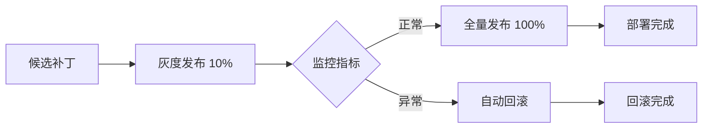

# 补丁部署器服务 (PatchDeployer)

## 概述

补丁部署器负责规则补丁的灰度发布、全量发布、回滚和监控，确保规则升级的安全性和可靠性。

## 核心功能

### 1. 灰度发布 (deploy_canary)

将补丁部署到一小部分流量（默认10%），用于验证补丁的有效性。

```python
from src.services.patch_deployer import get_patch_deployer
from src.models.rule_patch import RulePatch

deployer = get_patch_deployer()

# 灰度发布补丁
deployment_id = await deployer.deploy_canary(
    patch=patch,
    traffic_percentage=0.1  # 10% 流量
)
```

### 2. 全量发布 (promote_to_full)

将灰度发布的补丁推广到全部流量。

```python
# 全量发布
success = await deployer.promote_to_full(deployment_id)
```

### 3. 回滚 (rollback)

将补丁回滚，恢复到部署前的状态。

```python
# 回滚补丁
success = await deployer.rollback(deployment_id)
```

### 4. 监控部署 (monitor_deployment)

持续监控部署的指标，检测异常并在必要时自动回滚。

```python
# 监控部署
result = await deployer.monitor_deployment(deployment_id)

print(f"状态：{result['status']}")
print(f"异常数：{len(result['anomalies'])}")
print(f"采取的行动：{result['action_taken']}")
```

## 部署流程



## 异常检测

部署器会自动检测以下异常：

1. **误判率增加**：当前误判率比基线增加超过阈值（默认10%）
2. **高误判率**：当前误判率超过绝对阈值（默认20%）
3. **漏判率增加**：当前漏判率比基线增加超过阈值
4. **复核率增加**：当前复核率比基线增加超过阈值的2倍

检测到严重异常（critical）时，系统会自动回滚补丁。

## 配置参数

```python
deployer = PatchDeployer(
    canary_duration_minutes=30,  # 灰度发布持续时间
    anomaly_threshold=0.1,       # 异常阈值（10%）
    error_rate_threshold=0.2     # 错误率阈值（20%）
)
```

## 数据库表结构

```sql
CREATE TABLE rule_patches (
    patch_id UUID PRIMARY KEY,
    patch_type VARCHAR(20) NOT NULL,
    version VARCHAR(20) NOT NULL UNIQUE,
    description TEXT NOT NULL,
    content JSONB NOT NULL,
    source_pattern_id VARCHAR(100),
    status VARCHAR(20) NOT NULL DEFAULT 'candidate',
    dependencies JSONB NOT NULL DEFAULT '[]',
    
    -- 部署信息
    deployed_at TIMESTAMPTZ,
    deployment_scope VARCHAR(20),
    rolled_back_at TIMESTAMPTZ,
    
    -- 测试结果
    regression_result JSONB,
    
    -- 时间戳
    created_at TIMESTAMPTZ NOT NULL DEFAULT NOW(),
    updated_at TIMESTAMPTZ NOT NULL DEFAULT NOW()
);
```

## 使用示例

### 完整的部署流程

```python
from src.services.patch_deployer import get_patch_deployer
from src.services.regression_tester import get_regression_tester
from src.models.rule_patch import RulePatch
import asyncio

async def deploy_patch_safely(patch: RulePatch):
    """安全地部署补丁"""
    deployer = get_patch_deployer()
    tester = get_regression_tester()
    
    # 1. 运行回归测试
    print("运行回归测试...")
    result = await tester.run_regression(patch, eval_set_id="eval_001")
    
    if not result.passed:
        print("回归测试未通过，取消部署")
        return False
    
    # 2. 灰度发布
    print("开始灰度发布...")
    deployment_id = await deployer.deploy_canary(
        patch=patch,
        traffic_percentage=0.1
    )
    
    # 3. 监控灰度发布
    print("监控灰度发布...")
    for i in range(6):  # 监控30分钟（每5分钟一次）
        await asyncio.sleep(300)  # 5分钟
        
        monitor_result = await deployer.monitor_deployment(deployment_id)
        
        if monitor_result["status"] == "critical":
            print("检测到严重异常，已自动回滚")
            return False
        
        if monitor_result["status"] == "warning":
            print(f"检测到警告：{monitor_result['anomalies']}")
    
    # 4. 全量发布
    print("灰度发布正常，开始全量发布...")
    success = await deployer.promote_to_full(deployment_id)
    
    if success:
        print("部署成功！")
    else:
        print("全量发布失败")
    
    return success

# 使用
patch = RulePatch(...)
asyncio.run(deploy_patch_safely(patch))
```

### 手动回滚

```python
async def manual_rollback(deployment_id: str):
    """手动回滚部署"""
    deployer = get_patch_deployer()
    
    success = await deployer.rollback(deployment_id)
    
    if success:
        print(f"部署 {deployment_id} 已回滚")
    else:
        print(f"回滚失败")

# 使用
asyncio.run(manual_rollback("deploy_abc123"))
```

## 验证需求

- **需求 9.4**：补丁发布条件 - 回归测试通过且误判率下降的补丁加入灰度发布队列
- **需求 9.5**：异常自动回滚 - 灰度发布期间出现异常时自动回滚到上一版本

## 注意事项

1. **灰度发布时间**：建议至少监控30分钟，确保补丁稳定
2. **流量比例**：初始灰度流量建议不超过10%，避免影响过多用户
3. **监控频率**：建议每5分钟监控一次，及时发现异常
4. **回滚策略**：检测到严重异常时立即自动回滚，不等待人工介入
5. **依赖关系**：回滚时需要考虑补丁之间的依赖关系（由 VersionManager 处理）

## 相关服务

- `RuleMiner`: 规则挖掘器，识别失败模式
- `PatchGenerator`: 补丁生成器，生成候选补丁
- `RegressionTester`: 回归测试器，验证补丁有效性
- `VersionManager`: 版本管理器，管理补丁版本和依赖关系
