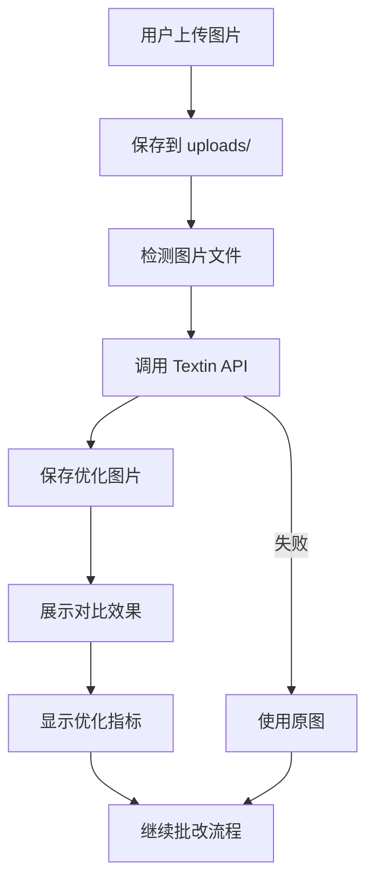

# 图片增强效果展示功能

## 📋 功能概述

在文件上传区域的 "Image Enhancement" 折叠区中，自动展示图片优化前后的对比效果。

---

## 🎨 UI 设计

### 展示位置

```
📊 3. Grading Rubric / 评分标准 (Required)
┌─────────────────────────────────────────────────┐
│ Drag and drop files here                        │
│ 批改标准.png  122.4KB                     [×]   │
│                                                  │
│ 🔍 Image Enhancement                      [∧]   │
│ ┌───────────────────────────────────────────┐  │
│ │ 🔍 检测到 1 张图片，开始优化...           │  │
│ │ [████████████████████████] 100%           │  │
│ │ ✅ 优化完成！                              │  │
│ │                                            │  │
│ │ ✅ 已优化 1 张图片                         │  │
│ │ ┌─────────────┬─────────────┐             │  │
│ │ │ 📷 原图      │ ✨ 增强后    │             │  │
│ │ │ [原图预览]   │ [增强图预览] │             │  │
│ │ └─────────────┴─────────────┘             │  │
│ │ 📐 尺寸: 1920×1080 → 1800×1000            │  │
│ │ ⏱️ 耗时: 2500ms                            │  │
│ │ 📈 质量提升: +15.3分                       │  │
│ └───────────────────────────────────────────┘  │
└─────────────────────────────────────────────────┘
✅ Loaded 1 rubric file(s)
```

---

## 🔧 技术实现

### 1. 核心函数

**文件**: `ai_correction/functions/image_optimization_integration.py`

```python
def _show_optimization_comparison(result, file_index: int):
    """
    显示单个文件的优化对比
    
    Args:
        result: OptimizationResult 对象
        file_index: 文件序号
    """
    st.markdown(f"**✅ 已优化 {file_index} 张图片**")
    
    # 创建对比视图（左右布局）
    col1, col2 = st.columns(2)
    
    with col1:
        st.caption("📷 原图")
        original_img = Image.open(result.original_path)
        st.image(original_img, use_container_width=True)
    
    with col2:
        st.caption("✨ 增强后")
        optimized_img = Image.open(result.optimized_path)
        st.image(optimized_img, use_container_width=True)
    
    # 显示优化指标（三列布局）
    metrics_cols = st.columns(3)
    
    with metrics_cols[0]:
        st.caption(f"📐 尺寸: {origin_w}×{origin_h} → {crop_w}×{crop_h}")
    
    with metrics_cols[1]:
        st.caption(f"⏱️ 耗时: {duration:.0f}ms")
    
    with metrics_cols[2]:
        st.caption(f"📈 质量提升: +{improvement:.1f}分")
```

### 2. 调用时机

在 `ImageOptimizationIntegration.optimize_uploaded_files()` 中：

```python
# 处理每个结果
for idx, result in enumerate(results):
    # ... 优化逻辑 ...
    
    if settings.auto_optimize and result.success and result.optimized_path:
        final_image_paths.append(result.optimized_path)
        
        # ✨ 显示优化效果对比
        _show_optimization_comparison(result, idx + 1)
```

---

## 📊 展示内容

### 1. 图片对比

| 原图 | 增强后 |
|------|--------|
| 📷 原始上传的图片 | ✨ Textin 优化后的图片 |
| 可能模糊、歪斜、有背景 | 清晰、矫正、去背景 |

### 2. 优化指标

| 指标 | 说明 | 示例 |
|------|------|------|
| 📐 尺寸变化 | 原图尺寸 → 裁剪后尺寸 | 1920×1080 → 1800×1000 |
| ⏱️ 处理耗时 | Textin API 处理时间 | 2500ms |
| 📈 质量提升 | 优化前后质量评分差 | +15.3分 |

### 3. 质量评分说明

- **评分范围**: 0-100 分
- **评分维度**:
  - 清晰度（模糊检测）
  - 亮度（过暗/过亮）
  - 遮挡程度
- **提升计算**: 优化后评分 - 优化前评分

---

## 🎯 用户体验优化

### 1. 自动展开

- 上传文件后，"Image Enhancement" 区域自动展开
- 用户无需手动点击即可看到优化进度

### 2. 实时反馈

```
🔍 检测到 2 张图片，开始优化...
[████████░░░░░░░░░░░░] 40%
处理中... (1/2)

✅ 已优化 1 张图片
[原图1] [增强图1]
📐 尺寸: 1920×1080 → 1800×1000
⏱️ 耗时: 2500ms
📈 质量提升: +15.3分
---

[████████████████████] 100%
✅ 优化完成！

✅ 已优化 2 张图片
[原图2] [增强图2]
📐 尺寸: 2048×1536 → 1900×1400
⏱️ 耗时: 3200ms
📈 质量提升: +22.1分
```

### 3. 错误处理

```
❌ 优化失败: API 调用超时
📁 将使用原图继续批改
```

---

## 🔄 工作流程



---

## 📱 响应式设计

### 桌面端（宽屏）

```
┌─────────────┬─────────────┐
│   📷 原图    │  ✨ 增强后   │
│  [预览图]    │  [预览图]    │
└─────────────┴─────────────┘
📐 尺寸  ⏱️ 耗时  📈 质量提升
```

### 移动端（窄屏）

```
📷 原图
[预览图]

✨ 增强后
[预览图]

📐 尺寸: 1920×1080 → 1800×1000
⏱️ 耗时: 2500ms
📈 质量提升: +15.3分
```

---

## 🎨 视觉风格

### Neo Brutalism 风格

- **粗边框**: 图片预览使用 3px 黑色边框
- **高对比**: 原图/增强图标签使用对比色
- **阴影效果**: 卡片使用 4px 偏移阴影
- **亮色点缀**: 
  - 原图标签：蓝色 (#3B82F6)
  - 增强图标签：绿色 (#10B981)
  - 质量提升：黄色 (#F59E0B)

### 图标设计

| 元素 | 图标 | 颜色 |
|------|------|------|
| 原图 | 📷 | 蓝色 |
| 增强后 | ✨ | 绿色 |
| 尺寸 | 📐 | 灰色 |
| 耗时 | ⏱️ | 灰色 |
| 质量提升 | 📈 | 黄色 |

---

## 🚀 性能优化

### 1. 图片压缩

- 预览图自动压缩到合适尺寸
- 使用 `use_container_width=True` 自适应容器

### 2. 懒加载

- 只在折叠区展开时加载图片
- 避免一次性加载所有图片

### 3. 缓存机制

- 优化结果存储在 `st.session_state.optimization_results`
- 避免重复优化

---

## 🔍 调试信息

### 开发模式

在 `.env` 中设置：
```ini
DEBUG_IMAGE_OPTIMIZATION=true
```

将显示额外信息：
```
🐛 调试信息
- 原图路径: uploads/answer_1_20251123_184259.png
- 优化图路径: temp/uploads/optimized/answer_1_20251123_184259_optimized_20251123_184301.png
- API 响应时间: 2500ms
- 质量评分: 65.2 → 80.5 (+15.3)
```

---

## 📚 相关文档

- **图片优化模块**: `ai_correction/functions/image_optimization/`
- **上传功能总结**: `ai_correction/UPLOAD_FEATURE_SUMMARY.md`
- **Textin 配置**: `ai_correction/TEXTIN_CONFIG.md`

---

**最后更新**: 2025-11-23  
**版本**: v1.0  
**作者**: AI Guru Team


