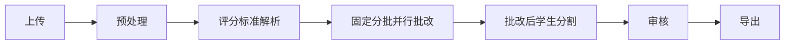

# 工作流重构实现计划

## 问题分析

### 当前实现问题
1. **流程顺序错误**：当前是"先识别学生 → 再批改"，但需求文档要求"先批改 → 再分割学生"
2. **缺少核心组件**：
   - 缺少 RAG 判例记忆系统 (ExemplarMemory)
   - 缺少动态提示词拼装器 (PromptAssembler)
   - 缺少个性化校准服务 (CalibrationService)
   - 缺少批改日志记录器 (GradingLogger)
   - 缺少规则升级引擎 (RuleMiner/PatchGenerator/RegressionTester/PatchDeployer)
   - 缺少客观题二次验证 (Objective_Grader)
3. **批改报错**：`TypeError: can only concatenate str (not "list") to str` ✅ 已修复

## 正确的工作流程

### 详细步骤说明

| 步骤 | 节点ID | 说明 |
|------|--------|------|
| 1. 文件接收 | `intake` | 接收上传的 PDF 文件 |
| 2. 图像预处理 | `preprocess` | PDF → 图像列表 |
| 3. 评分标准解析 | `rubric_parse` | 解析评分标准，提取题目和得分点 |
| 4. **固定分批并行批改** | `grading` | 按 10 张一组分批，每批并行批改所有页面 |
| 5. **批改后学生分割** | `segment` | 基于批改结果中的学生标识信息分割学生 |
| 6. 结果审核 | `review` | 汇总统计，标记低置信度结果 |
| 7. 导出结果 | `export` | 生成最终报告 |

## 实现任务

### Phase 1: 修复当前错误（优先级最高）
- [x] Task 1.1: 修复 `strict_grading.py` 中的 TypeError

### Phase 2: 重构工作流顺序（优先级高）
- [ ] Task 2.1: 修改 `batch.py` 中的 `run_real_grading_workflow`，实现正确的流程顺序
- [ ] Task 2.2: 更新前端 `consoleStore.ts` 中的 `initialNodes`，调整节点顺序和标签
- [ ] Task 2.3: 更新前端 `WorkflowGraph.tsx` 和 `NodeInspector.tsx`，适配新流程

### Phase 3: 实现批改后学生分割（优先级高）
- [ ] Task 3.1: 创建 `StudentBoundaryDetector` 服务，基于批改结果分析学生边界
- [ ] Task 3.2: 实现基于题目序列循环的边界检测算法
- [ ] Task 3.3: 实现基于学生标识提取的边界检测算法

### Phase 4: 实现自我成长层（优先级中）
- [ ] Task 4.1: 创建 `ExemplarMemory` 判例记忆服务
- [ ] Task 4.2: 创建 `PromptAssembler` 动态提示词拼装器
- [ ] Task 4.3: 创建 `CalibrationService` 个性化校准服务
- [ ] Task 4.4: 创建 `GradingLogger` 批改日志记录器

### Phase 5: 实现规则升级引擎（优先级低）
- [ ] Task 5.1: 创建 `RuleMiner` 规则挖掘器
- [ ] Task 5.2: 创建 `PatchGenerator` 补丁生成器
- [ ] Task 5.3: 创建 `RegressionTester` 回归测试器
- [ ] Task 5.4: 创建 `PatchDeployer` 补丁部署器

## 当前工作

开始执行 Phase 2，重构工作流顺序。
