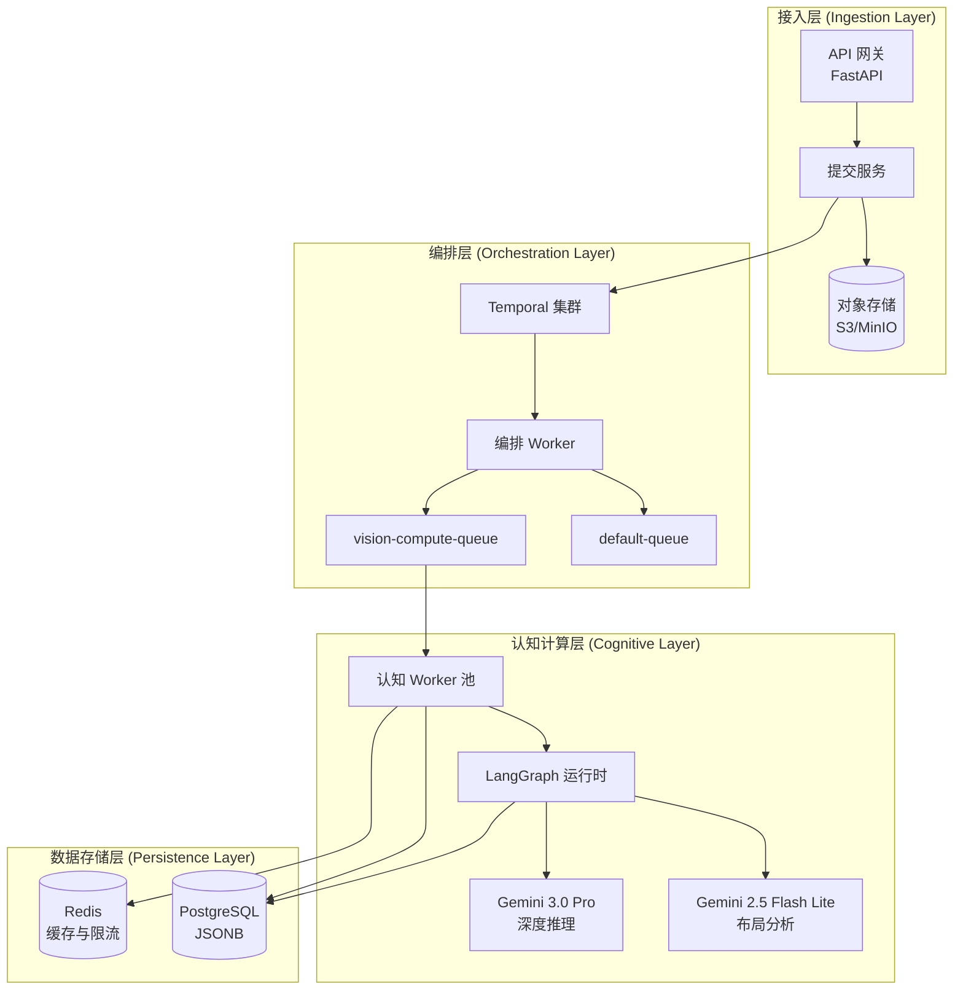
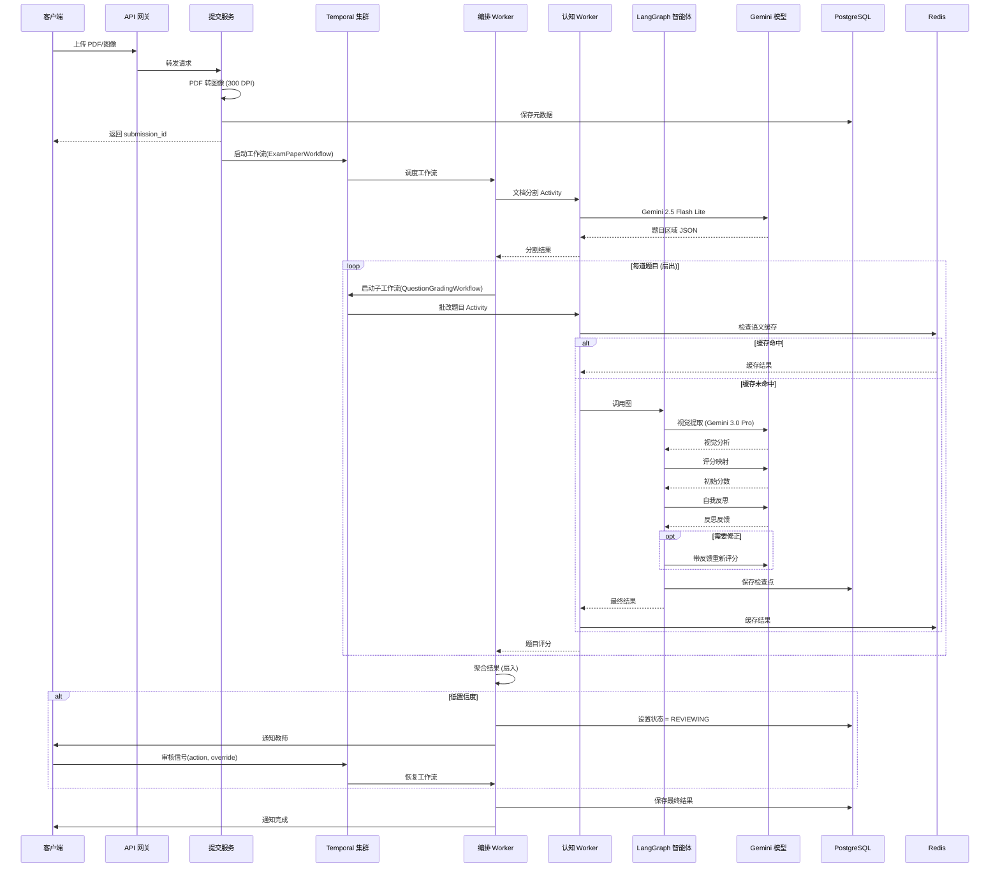
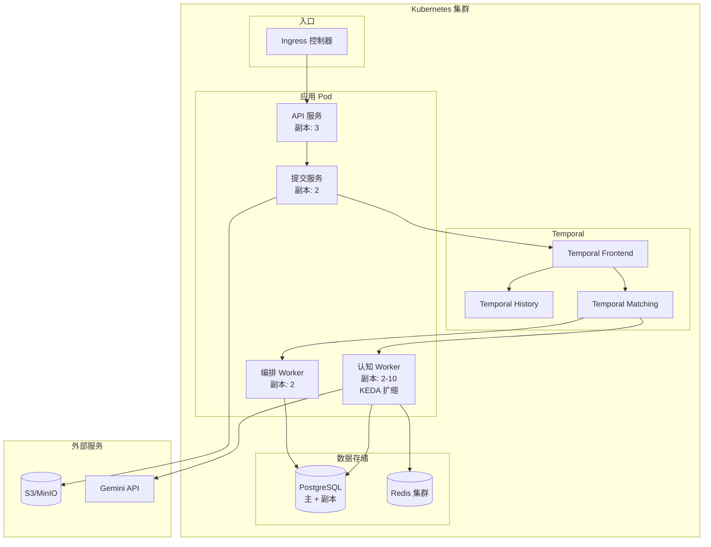

# 设计文档：AI 批改智能体工作流

## 概述

本设计文档详述一套生产级纯视觉 AI 批改系统的技术架构。系统采用 Temporal 作为分布式工作流编排引擎，LangGraph 作为题内智能体推理框架，Gemini 系列模型作为视觉理解核心。整体架构遵循事件驱动微服务模式，通过异步消息传递和工作流编排实现组件解耦。

### 核心设计原则

1. **纯视觉优先（Vision-Native）**：完全摒弃 OCR，直接利用 VLM 进行端到端语义理解
2. **持久化执行（Durable Execution）**：通过 Temporal 保证长周期任务的持久化执行
3. **智能体推理（Agentic Reasoning）**：通过 LangGraph 实现循环推理和自我反思
4. **水平扩展（Horizontal Scalability）**：无状态 Worker 设计，支持 KEDA 自动扩缩容

## 架构设计

系统采用三层架构：接入层、编排层、认知计算层。




### 工作流时序图



## 组件与接口

### 1. 提交服务 (Submission Service)

负责文件上传预处理和工作流触发。

```python
from pydantic import BaseModel
from typing import List, Optional
from enum import Enum

class FileType(str, Enum):
    PDF = "pdf"
    IMAGE = "image"

class SubmissionRequest(BaseModel):
    exam_id: str
    student_id: str
    file_type: FileType
    file_data: bytes  # Base64 编码

class SubmissionResponse(BaseModel):
    submission_id: str
    status: str
    estimated_completion_time: int  # 秒

class SubmissionServiceInterface:
    async def submit(self, request: SubmissionRequest) -> SubmissionResponse:
        """处理文件上传，触发 Temporal 工作流"""
        pass
    
    async def get_status(self, submission_id: str) -> dict:
        """查询批改状态"""
        pass
    
    async def convert_pdf_to_images(self, pdf_data: bytes, dpi: int = 300) -> List[bytes]:
        """PDF 转高分辨率图像"""
        pass
```

### 2. 布局分析服务 (Layout Analysis Service)

使用 Gemini 2.5 Flash Lite 进行页面分割。

```python
class BoundingBox(BaseModel):
    ymin: int
    xmin: int
    ymax: int
    xmax: int

class QuestionRegion(BaseModel):
    question_id: str
    page_index: int
    bounding_box: BoundingBox
    image_data: Optional[str]  # Base64 裁剪图像

class SegmentationResult(BaseModel):
    submission_id: str
    total_pages: int
    regions: List[QuestionRegion]

class LayoutAnalysisServiceInterface:
    async def segment_document(self, image_data: bytes) -> SegmentationResult:
        """识别题目边界，返回结构化坐标"""
        pass
    
    def normalize_coordinates(
        self, 
        box_1000: List[int], 
        img_width: int, 
        img_height: int
    ) -> BoundingBox:
        """将归一化坐标转换为像素坐标"""
        pass
```


### 3. 批改智能体 (Grading Agent - LangGraph)

核心智能体，执行多步推理批改。

```python
from typing import TypedDict, List, Optional
from langgraph.graph import StateGraph

class GradingState(TypedDict):
    # 静态输入
    question_image: str  # Base64
    rubric: str
    standard_answer: Optional[str]
    
    # 动态推理数据
    vision_analysis: str
    rubric_mapping: List[dict]
    initial_score: float
    reasoning_trace: List[str]
    critique_feedback: Optional[str]
    
    # 最终输出
    final_score: float
    max_score: float
    confidence: float
    visual_annotations: List[dict]
    student_feedback: str
    
    # 控制标志
    revision_count: int
    is_finalized: bool

class GradingAgentInterface:
    def build_graph(self) -> StateGraph:
        """构建 LangGraph 图结构"""
        pass
    
    async def vision_extraction(self, state: GradingState) -> dict:
        """视觉提取节点：描述学生解题步骤"""
        pass
    
    async def rubric_mapping(self, state: GradingState) -> dict:
        """评分映射节点：逐条核对评分点"""
        pass
    
    async def critique(self, state: GradingState) -> dict:
        """自我反思节点：审查评分逻辑"""
        pass
    
    async def finalize(self, state: GradingState) -> dict:
        """最终化节点：格式化输出"""
        pass
```

### 4. Temporal 工作流

工作流定义，包含父子工作流层级。

```python
from temporalio import workflow, activity
from temporalio.common import RetryPolicy
from datetime import timedelta

class ExamPaperWorkflowInput(BaseModel):
    submission_id: str
    student_id: str
    exam_id: str
    file_paths: List[str]

class QuestionGradingInput(BaseModel):
    submission_id: str
    question_id: str
    image_b64: str
    rubric: str
    max_score: float

class GradingResult(BaseModel):
    question_id: str
    score: float
    max_score: float
    confidence: float
    feedback: str
    visual_annotations: List[dict]
    agent_trace: dict

class ExamPaperWorkflowInterface:
    async def run(self, input_data: ExamPaperWorkflowInput) -> dict:
        """父工作流：管理整份试卷的批改生命周期"""
        pass
    
    def review_signal(self, action: str, override_data: dict):
        """信号处理：接收人工审核指令"""
        pass

class QuestionGradingWorkflowInterface:
    async def run(self, input_data: QuestionGradingInput) -> GradingResult:
        """子工作流：单道题目的精细化批改"""
        pass
```

### 5. 缓存服务 (Cache Service)

语义缓存服务，降低 API 调用成本。

```python
class CacheServiceInterface:
    async def compute_image_hash(self, image_data: bytes) -> str:
        """计算图像感知哈希"""
        pass
    
    async def get_cached_result(
        self, 
        rubric_hash: str, 
        image_hash: str
    ) -> Optional[GradingResult]:
        """查询缓存"""
        pass
    
    async def cache_result(
        self, 
        rubric_hash: str, 
        image_hash: str, 
        result: GradingResult,
        ttl_days: int = 30
    ) -> bool:
        """存储缓存"""
        pass
```

### 6. 限流器 (Rate Limiter)

API 限流服务，保护系统稳定性。

```python
class RateLimiterInterface:
    async def acquire(self, key: str, max_requests: int, window_seconds: int) -> bool:
        """尝试获取令牌，返回是否允许请求"""
        pass
    
    async def get_remaining(self, key: str) -> int:
        """获取剩余配额"""
        pass
```

## 数据模型

### PostgreSQL Schema

```sql
-- 提交记录表
CREATE TABLE submissions (
    submission_id UUID PRIMARY KEY DEFAULT gen_random_uuid(),
    exam_id UUID NOT NULL,
    student_id UUID NOT NULL,
    status VARCHAR(20) NOT NULL DEFAULT 'UPLOADED',
    -- UPLOADED, SEGMENTING, GRADING, REVIEWING, COMPLETED, REJECTED
    total_score DECIMAL(5, 2),
    max_total_score DECIMAL(5, 2),
    file_paths JSONB NOT NULL,
    created_at TIMESTAMPTZ DEFAULT NOW(),
    updated_at TIMESTAMPTZ DEFAULT NOW(),
    
    CONSTRAINT valid_status CHECK (status IN (
        'UPLOADED', 'SEGMENTING', 'GRADING', 'REVIEWING', 'COMPLETED', 'REJECTED'
    ))
);

CREATE INDEX idx_submissions_exam ON submissions(exam_id);
CREATE INDEX idx_submissions_student ON submissions(student_id);
CREATE INDEX idx_submissions_status ON submissions(status);

-- 题目批改结果表
CREATE TABLE grading_results (
    submission_id UUID NOT NULL REFERENCES submissions(submission_id),
    question_id VARCHAR(50) NOT NULL,
    
    -- 核心分数
    score DECIMAL(5, 2),
    max_score DECIMAL(5, 2),
    confidence_score DECIMAL(3, 2),
    
    -- 视觉标注 (用于前端高亮)
    visual_annotations JSONB,
    
    -- AI 推理全链路
    agent_trace JSONB,
    
    -- 学生反馈
    student_feedback JSONB,
    
    created_at TIMESTAMPTZ DEFAULT NOW(),
    updated_at TIMESTAMPTZ DEFAULT NOW(),
    
    PRIMARY KEY (submission_id, question_id)
);

CREATE INDEX idx_grading_results_confidence ON grading_results(confidence_score);
CREATE INDEX idx_grading_results_feedback ON grading_results USING GIN (student_feedback);

-- 评分细则表
CREATE TABLE rubrics (
    rubric_id UUID PRIMARY KEY DEFAULT gen_random_uuid(),
    exam_id UUID NOT NULL,
    question_id VARCHAR(50) NOT NULL,
    rubric_text TEXT NOT NULL,
    max_score DECIMAL(5, 2) NOT NULL,
    scoring_points JSONB NOT NULL,
    standard_answer TEXT,
    created_at TIMESTAMPTZ DEFAULT NOW(),
    updated_at TIMESTAMPTZ DEFAULT NOW(),
    
    UNIQUE(exam_id, question_id)
);

-- LangGraph 检查点表
CREATE TABLE langgraph_checkpoints (
    thread_id VARCHAR(255) NOT NULL,
    checkpoint_id VARCHAR(255) NOT NULL,
    parent_checkpoint_id VARCHAR(255),
    checkpoint_data JSONB NOT NULL,
    metadata JSONB,
    created_at TIMESTAMPTZ DEFAULT NOW(),
    
    PRIMARY KEY (thread_id, checkpoint_id)
);

CREATE INDEX idx_checkpoints_thread ON langgraph_checkpoints(thread_id);

-- 人工审核记录表
CREATE TABLE human_reviews (
    review_id UUID PRIMARY KEY DEFAULT gen_random_uuid(),
    submission_id UUID NOT NULL REFERENCES submissions(submission_id),
    question_id VARCHAR(50),
    reviewer_id UUID NOT NULL,
    action VARCHAR(20) NOT NULL,
    override_score DECIMAL(5, 2),
    override_feedback TEXT,
    review_comment TEXT,
    created_at TIMESTAMPTZ DEFAULT NOW()
);

CREATE INDEX idx_reviews_submission ON human_reviews(submission_id);
```


### Redis 键模式

```
# 语义缓存
grade_cache:v1:{rubric_hash}:{image_perceptual_hash} -> JSON(GradingResult)
TTL: 30 天

# API 限流 (滑动窗口)
rate_limit:gemini:{minute_bucket} -> 计数器
TTL: 2 分钟

# 分布式锁 (防重复提交)
submission_lock:{submission_id} -> "1"
TTL: 5 分钟

# 工作流状态缓存 (热数据)
workflow_status:{submission_id} -> JSON(status, progress)
TTL: 1 小时
```

## 正确性属性

*属性是指在系统所有有效执行中都应保持为真的特征或行为——本质上是关于系统应该做什么的形式化陈述。属性是人类可读规范与机器可验证正确性保证之间的桥梁。*

基于预分析，已识别出以下正确性属性：

### 属性 1：坐标归一化数学正确性
*对于任意*归一化边界框坐标（[0, 1000] 比例）和任意正整数图像尺寸（宽度、高度），像素坐标转换应当产生满足以下条件的值：
- `pixel_y = normalized_y * height / 1000`
- `pixel_x = normalized_x * width / 1000`
- 所有输出坐标为图像边界内的非负整数

**验证：需求 2.3**

### 属性 2：智能体执行完整性
*对于任意*有效的题目图像和评分细则输入，当批改智能体完成执行时，输出状态应当包含：
- 非空的 `vision_analysis` 字符串
- 包含每个评分点条目的 `rubric_mapping` 列表
- 介于 0 和 `max_score` 之间的 `final_score`
- 介于 0.0 和 1.0 之间的 `confidence`
- 非空的 `reasoning_trace` 列表

**验证：需求 3.1, 3.2, 3.3, 3.6**

### 属性 3：智能体修正循环终止
*对于任意* `critique_feedback` 非空的智能体执行，当且仅当 `revision_count < 3` 时，智能体应当循环回到评分节点。当 `revision_count >= 3` 时，无论反馈如何，智能体应当继续到最终化节点。

**验证：需求 3.5**

### 属性 4：状态转换时检查点持久化
*对于任意*智能体执行期间的 LangGraph 状态转换，在下一个节点执行之前，应当将带有正确 `thread_id` 的检查点记录持久化到数据库。

**验证：需求 3.7**

### 属性 5：扇出数量匹配题目数量
*对于任意*包含 N 个题目区域的分割结果，父工作流应当启动恰好 N 个子工作流，每道题目一个。

**验证：需求 4.2**

### 属性 6：分数聚合正确性
*对于任意*子工作流结果集，其分数为 [s1, s2, ..., sn]，满分为 [m1, m2, ..., mn]，聚合的 total_score 应当等于 sum(si)，max_total_score 应当等于 sum(mi)。

**验证：需求 4.3**

### 属性 7：低置信度触发审核状态
*对于任意*批改结果，如果任何题目的 `confidence_score < 0.75`，工作流应当转换到 REVIEWING 状态，提交状态应当更新为 'REVIEWING'。

**验证：需求 5.1**

### 属性 8：信号处理状态转换
*对于任意*处于 REVIEWING 状态的工作流：
- APPROVE 信号 → 工作流继续使用原始 AI 结果，状态变为 COMPLETED
- OVERRIDE 信号带分数 → 最终结果反映覆盖分数，状态变为 COMPLETED
- REJECT 信号 → 状态变为 REJECTED，工作流终止

**验证：需求 5.3, 5.4, 5.5**

### 属性 9：感知哈希确定性
*对于任意*图像，多次计算感知哈希应当产生相同的哈希值。对于任意两张视觉上相同的图像（相同内容，可能不同编码），哈希值应当相等。

**验证：需求 6.1**

### 属性 10：缓存命中返回缓存结果
*对于任意*存在 (rubric_hash, image_hash) 组合缓存条目的批改请求，服务应当返回缓存结果而不调用 LLM，返回的结果应当与缓存值相同。

**验证：需求 6.2**

### 属性 11：高置信度结果被缓存
*对于任意* `confidence > 0.9` 的新生成批改结果，结果应当以正确的 (rubric_hash, image_hash) 键和 30 天 TTL 存储到缓存中。

**验证：需求 6.3**

### 属性 12：缓存失败不阻塞批改
*对于任意*失败的缓存操作（查找或存储），批改过程应当正常继续并产生有效结果。缓存失败不应当作为异常传播给调用者。

**验证：需求 6.4**

### 属性 13：结果持久化完整性
*对于任意*完成的批改操作，持久化记录应当包含：
- 有效的 `score` 和 `max_score` 值
- 介于 0.0 和 1.0 之间的 `confidence_score`
- 作为有效 JSONB 的 `visual_annotations`，包含边界框坐标
- 作为有效 JSONB 的 `agent_trace`，包含 vision_analysis、reasoning_trace 和 critique 字段

**验证：需求 7.1, 7.2, 7.3**

### 属性 14：限流器节流
*对于任意*时间窗口内超过配置限制的 N 个请求序列，限流器应当拒绝超出限制的请求并返回节流响应。

**验证：需求 8.3**

### 属性 15：评分细则更新使缓存失效
*对于任意*评分细则更新操作，所有匹配 rubric_hash 的缓存条目应当被失效（从缓存中删除）。

**验证：需求 9.4**

### 属性 16：缺失评分细则标记题目
*对于任意*指定 (exam_id, question_id) 不存在评分细则的批改请求，系统应当将该题目标记为需要手动配置，且不应继续 AI 批改。

**验证：需求 9.5**

### 属性 17：质量控制阈值阻止部署
*对于任意*皮尔逊相关系数 < 0.9 或科恩 Kappa < 0.8 的模型验证运行，部署流水线应当阻止发布并返回失败状态。

**验证：需求 10.3**


## 错误处理

### 1. API 层错误

| 错误类型 | HTTP 状态码 | 处理策略 |
|---------|------------|---------|
| 无效文件格式 | 400 | 返回支持的格式列表 |
| 文件过大 | 413 | 返回最大大小限制 |
| 认证失败 | 401 | 返回认证错误 |
| 超出速率限制 | 429 | 返回 retry-after 头 |
| 内部错误 | 500 | 记录日志，返回通用消息 |

### 2. 工作流错误

```python
from temporalio.exceptions import ApplicationError

class GradingError(ApplicationError):
    """批改错误基类"""
    pass

class SegmentationError(GradingError):
    """文档分割失败"""
    pass

class ModelInvocationError(GradingError):
    """Gemini 模型调用失败"""
    pass

class LowConfidenceError(GradingError):
    """批改置信度低于阈值"""
    pass

# 重试策略配置
GRADING_RETRY_POLICY = RetryPolicy(
    initial_interval=timedelta(seconds=1),
    backoff_coefficient=2.0,
    maximum_interval=timedelta(minutes=1),
    maximum_attempts=3,
    non_retryable_error_types=["SegmentationError"]  # 分割失败不重试
)
```

### 3. LangGraph 错误恢复

```python
async def safe_node_execution(node_func, state, fallback_value):
    """包装节点执行，带错误处理"""
    try:
        return await node_func(state)
    except Exception as e:
        logger.error(f"节点执行失败: {e}")
        return {
            **fallback_value,
            "error": str(e),
            "confidence": 0.0  # 强制人工审核
        }
```

### 4. 缓存错误处理

```python
async def get_with_fallback(cache_key: str) -> Optional[dict]:
    """缓存查找，带优雅降级"""
    try:
        return await redis_client.get(cache_key)
    except RedisError as e:
        logger.warning(f"缓存查找失败: {e}")
        return None  # 继续执行，不使用缓存
```

## 测试策略

### 单元测试框架

- **框架**：pytest 配合 pytest-asyncio
- **Mock**：unittest.mock 用于外部依赖
- **覆盖率目标**：核心逻辑 80% 行覆盖率

### 属性测试框架

- **框架**：Hypothesis (Python)
- **最小迭代次数**：每个属性 100 次
- **配置**：

```python
from hypothesis import settings, Phase

settings.register_profile(
    "ci",
    max_examples=100,
    phases=[Phase.generate, Phase.target, Phase.shrink]
)
```

### 测试类别

#### 1. 单元测试

- 坐标归一化函数
- 缓存键生成
- JSON Schema 验证
- 错误消息格式化

#### 2. 属性测试

设计文档中的每个正确性属性将实现为属性测试：

```python
from hypothesis import given, strategies as st

# 属性 1：坐标归一化
@given(
    ymin=st.integers(0, 1000),
    xmin=st.integers(0, 1000),
    ymax=st.integers(0, 1000),
    xmax=st.integers(0, 1000),
    width=st.integers(1, 10000),
    height=st.integers(1, 10000)
)
def test_coordinate_normalization_bounds(ymin, xmin, ymax, xmax, width, height):
    """
    **功能: ai-grading-agent, 属性 1: 坐标归一化数学正确性**
    """
    result = normalize_coordinates([ymin, xmin, ymax, xmax], width, height)
    assert 0 <= result.ymin <= height
    assert 0 <= result.xmin <= width
    assert 0 <= result.ymax <= height
    assert 0 <= result.xmax <= width
```

#### 3. 集成测试

- Temporal 工作流执行（使用 Temporal 测试服务器）
- LangGraph 图遍历
- 数据库持久化往返
- Redis 缓存操作

### 测试标注格式

所有属性测试必须包含以下注释格式：

```python
"""
**功能: ai-grading-agent, 属性 {编号}: {属性文本}**
**验证: 需求 {X.Y}**
"""
```

### Mock 策略

| 组件 | Mock 策略 |
|-----|----------|
| Gemini API | 使用真实 JSON 格式的 Mock 响应 |
| PostgreSQL | 使用测试数据库或 SQLite |
| Redis | 使用 fakeredis 库 |
| Temporal | 使用 Temporal 测试环境 |
| 对象存储 | 使用 moto (S3 mock) |

## 部署架构



### KEDA 扩缩配置

```yaml
apiVersion: keda.sh/v1alpha1
kind: ScaledObject
metadata:
  name: cognitive-worker-scaler
spec:
  scaleTargetRef:
    name: cognitive-worker
  minReplicaCount: 2
  maxReplicaCount: 10
  triggers:
    - type: temporal
      metadata:
        address: temporal-frontend:7233
        namespace: default
        taskQueue: vision-compute-queue
        targetValue: "5"  # 当每个 worker 待处理任务 > 5 时扩容
```
