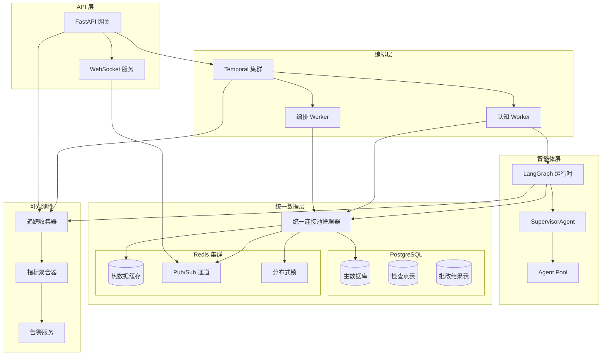
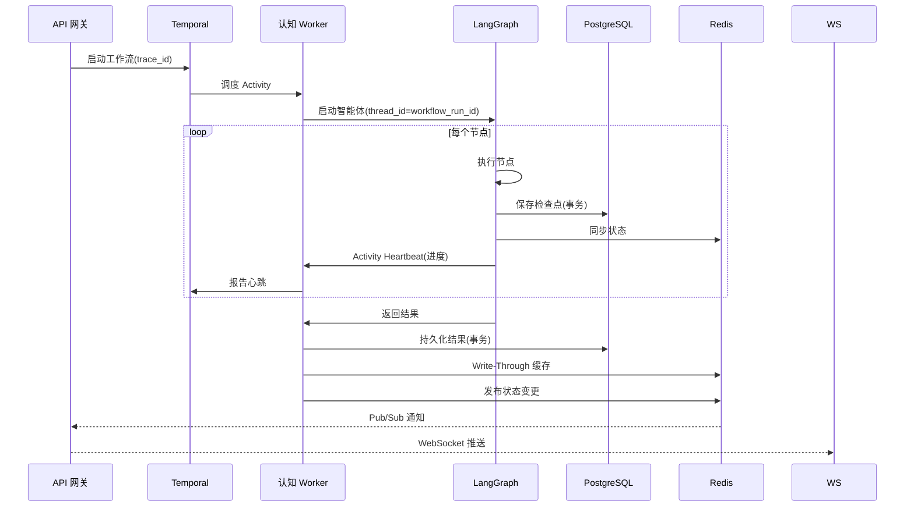

# 设计文档：架构深度融合优化

## 概述

本设计文档详述 AI 批改系统中 Temporal 工作流编排引擎、LangGraph 智能体框架、Redis 缓存层和 PostgreSQL 数据存储层的深度融合优化方案。核心目标是实现组件间的无缝集成，提供统一的状态管理、分布式事务协调、智能缓存策略和端到端可观测性。

### 核心设计原则

1. **统一状态管理**：Temporal 工作流状态与 LangGraph 智能体状态双向同步
2. **事务一致性**：跨组件操作采用 Saga 模式保证最终一致性
3. **智能缓存**：多层缓存架构，支持预热、失效和降级
4. **资源复用**：共享连接池，减少资源开销
5. **全链路追踪**：trace_id 贯穿所有组件，支持端到端可观测性

## 架构设计

### 深度融合架构图




### 状态同步时序图



## 组件与接口

### 1. 统一连接池管理器 (Unified Pool Manager)

负责管理所有数据库和 Redis 连接，提供共享连接池。


```python
from typing import Optional
from contextlib import asynccontextmanager
from psycopg_pool import AsyncConnectionPool
import redis.asyncio as redis

class UnifiedPoolManager:
    """
    统一连接池管理器
    
    提供 PostgreSQL 和 Redis 的共享连接池，
    供 Temporal Activities、LangGraph Checkpointer 和 Repository 层使用。
    
    验证：需求 2.1, 8.1, 8.2, 8.3, 8.4, 8.5
    """
    
    _instance: Optional["UnifiedPoolManager"] = None
    
    def __init__(self):
        self._pg_pool: Optional[AsyncConnectionPool] = None
        self._redis_pool: Optional[redis.ConnectionPool] = None
        self._redis_client: Optional[redis.Redis] = None
        self._initialized = False
    
    @classmethod
    def get_instance(cls) -> "UnifiedPoolManager":
        """获取单例实例"""
        if cls._instance is None:
            cls._instance = cls()
        return cls._instance
    
    async def initialize(
        self,
        pg_dsn: str,
        redis_url: str,
        pg_min_size: int = 5,
        pg_max_size: int = 20,
        redis_max_connections: int = 50,
        connection_timeout: float = 5.0
    ) -> None:
        """初始化连接池"""
        pass
    
    async def shutdown(self, timeout: float = 30.0) -> None:
        """优雅关闭所有连接"""
        pass
    
    @asynccontextmanager
    async def pg_connection(self):
        """获取 PostgreSQL 连接"""
        pass
    
    @asynccontextmanager
    async def pg_transaction(self):
        """获取 PostgreSQL 事务连接"""
        pass
    
    def get_redis_client(self) -> redis.Redis:
        """获取 Redis 客户端"""
        pass
    
    async def health_check(self) -> dict:
        """健康检查"""
        pass
```


### 2. 增强型 LangGraph 检查点器 (Enhanced Checkpointer)

支持增量存储、压缩和与 Temporal 状态同步的检查点器。

```python
from typing import Optional, Dict, Any, List
from langgraph.checkpoint.base import BaseCheckpointSaver
import zlib
import json

class EnhancedPostgresCheckpointer(BaseCheckpointSaver):
    """
    增强型 PostgreSQL 检查点器
    
    特性：
    - 增量状态存储
    - 大数据压缩（>1MB）
    - 与 Temporal 心跳集成
    - 历史检查点恢复
    
    验证：需求 9.1, 9.2, 9.3, 9.4
    """
    
    def __init__(
        self,
        pool_manager: "UnifiedPoolManager",
        compression_threshold: int = 1024 * 1024,  # 1MB
        heartbeat_callback: Optional[callable] = None
    ):
        self.pool_manager = pool_manager
        self.compression_threshold = compression_threshold
        self.heartbeat_callback = heartbeat_callback
    
    async def put(
        self,
        config: Dict[str, Any],
        checkpoint: Dict[str, Any],
        metadata: Optional[Dict[str, Any]] = None
    ) -> None:
        """保存检查点（支持增量和压缩）"""
        pass
    
    async def get(
        self,
        config: Dict[str, Any]
    ) -> Optional[Dict[str, Any]]:
        """获取最新检查点"""
        pass
    
    async def get_by_id(
        self,
        thread_id: str,
        checkpoint_id: str
    ) -> Optional[Dict[str, Any]]:
        """从任意历史检查点恢复"""
        pass
    
    async def list_checkpoints(
        self,
        thread_id: str,
        limit: int = 10
    ) -> List[Dict[str, Any]]:
        """列出历史检查点"""
        pass
    
    def _compute_delta(
        self,
        previous: Dict[str, Any],
        current: Dict[str, Any]
    ) -> Dict[str, Any]:
        """计算状态增量"""
        pass
    
    def _compress(self, data: bytes) -> bytes:
        """压缩数据"""
        if len(data) > self.compression_threshold:
            return zlib.compress(data)
        return data
```


### 3. 多层缓存服务 (Multi-Layer Cache Service)

支持 Write-Through、热数据缓存、Pub/Sub 通知和降级的缓存服务。

```python
from typing import Optional, Any, Callable
from enum import Enum
import redis.asyncio as redis

class CacheStrategy(str, Enum):
    WRITE_THROUGH = "write_through"
    CACHE_ASIDE = "cache_aside"
    WRITE_BEHIND = "write_behind"

class MultiLayerCacheService:
    """
    多层缓存服务
    
    特性：
    - Write-Through 策略
    - 热数据缓存
    - Pub/Sub 失效通知
    - 自动降级到 PostgreSQL
    
    验证：需求 3.1, 3.2, 3.3, 3.4, 3.5
    """
    
    def __init__(
        self,
        pool_manager: "UnifiedPoolManager",
        pubsub_channel: str = "cache_invalidation"
    ):
        self.pool_manager = pool_manager
        self.pubsub_channel = pubsub_channel
        self._fallback_mode = False
    
    async def get_with_fallback(
        self,
        key: str,
        db_query: Callable[[], Any],
        ttl_seconds: int = 3600
    ) -> Optional[Any]:
        """
        获取数据，支持降级
        
        1. 先查 Redis
        2. 未命中则查 PostgreSQL
        3. 回填缓存
        4. Redis 故障时自动降级
        """
        pass
    
    async def write_through(
        self,
        key: str,
        value: Any,
        db_write: Callable[[Any], None],
        ttl_seconds: int = 3600
    ) -> bool:
        """
        Write-Through 写入
        
        同时写入 Redis 和 PostgreSQL
        """
        pass
    
    async def invalidate_with_notification(
        self,
        pattern: str
    ) -> int:
        """
        失效缓存并通知所有节点
        
        通过 Pub/Sub 广播失效消息
        """
        pass
    
    async def sync_workflow_state(
        self,
        workflow_id: str,
        state: dict
    ) -> None:
        """同步工作流状态到 Redis"""
        pass
    
    async def subscribe_invalidation(
        self,
        callback: Callable[[str], None]
    ) -> None:
        """订阅缓存失效通知"""
        pass
```


### 4. 分布式事务协调器 (Distributed Transaction Coordinator)

采用 Saga 模式协调跨组件的分布式事务。

```python
from typing import List, Callable, Any, Optional
from dataclasses import dataclass
from enum import Enum
import logging

class SagaStepStatus(str, Enum):
    PENDING = "pending"
    COMPLETED = "completed"
    FAILED = "failed"
    COMPENSATED = "compensated"

@dataclass
class SagaStep:
    """Saga 步骤定义"""
    name: str
    action: Callable[[], Any]
    compensation: Callable[[], None]
    status: SagaStepStatus = SagaStepStatus.PENDING

class DistributedTransactionCoordinator:
    """
    分布式事务协调器
    
    采用 Saga 模式协调跨组件事务：
    - 缓存写入
    - 数据库写入
    - 通知发送
    
    验证：需求 4.1, 4.2, 4.3, 4.4, 4.5
    """
    
    def __init__(
        self,
        pool_manager: "UnifiedPoolManager",
        logger: Optional[logging.Logger] = None
    ):
        self.pool_manager = pool_manager
        self.logger = logger or logging.getLogger(__name__)
    
    async def execute_saga(
        self,
        saga_id: str,
        steps: List[SagaStep]
    ) -> bool:
        """
        执行 Saga 事务
        
        按顺序执行步骤，失败时执行补偿
        """
        pass
    
    async def compensate(
        self,
        saga_id: str,
        completed_steps: List[SagaStep]
    ) -> None:
        """执行补偿操作"""
        pass
    
    async def log_transaction(
        self,
        saga_id: str,
        steps: List[SagaStep],
        final_status: str
    ) -> None:
        """记录事务日志"""
        pass
    
    async def cleanup_partial_state(
        self,
        saga_id: str
    ) -> None:
        """清理部分写入状态"""
        pass
```


### 5. 端到端追踪服务 (End-to-End Tracing Service)

提供跨组件的分布式追踪能力。

```python
from typing import Optional, Dict, Any, List
from dataclasses import dataclass
from datetime import datetime
from enum import Enum
import uuid

class SpanKind(str, Enum):
    API = "api"
    TEMPORAL_WORKFLOW = "temporal_workflow"
    TEMPORAL_ACTIVITY = "temporal_activity"
    LANGGRAPH_NODE = "langgraph_node"
    DATABASE = "database"
    CACHE = "cache"

@dataclass
class TraceSpan:
    """追踪跨度"""
    trace_id: str
    span_id: str
    parent_span_id: Optional[str]
    kind: SpanKind
    name: str
    start_time: datetime
    end_time: Optional[datetime]
    attributes: Dict[str, Any]
    status: str

class TracingService:
    """
    端到端追踪服务
    
    特性：
    - 生成唯一 trace_id
    - 跨组件传递
    - 结构化日志
    - 性能告警
    
    验证：需求 5.1, 5.2, 5.3, 5.4, 5.5
    """
    
    def __init__(
        self,
        pool_manager: "UnifiedPoolManager",
        alert_threshold_ms: int = 500
    ):
        self.pool_manager = pool_manager
        self.alert_threshold_ms = alert_threshold_ms
    
    def generate_trace_id(self) -> str:
        """生成唯一 trace_id"""
        return str(uuid.uuid4())
    
    def start_span(
        self,
        trace_id: str,
        kind: SpanKind,
        name: str,
        parent_span_id: Optional[str] = None,
        attributes: Optional[Dict[str, Any]] = None
    ) -> TraceSpan:
        """开始一个跨度"""
        pass
    
    def end_span(
        self,
        span: TraceSpan,
        status: str = "ok"
    ) -> None:
        """结束跨度并记录"""
        pass
    
    async def get_trace(
        self,
        trace_id: str
    ) -> List[TraceSpan]:
        """获取完整追踪链路"""
        pass
    
    async def check_and_alert(
        self,
        span: TraceSpan
    ) -> None:
        """检查性能并触发告警"""
        pass
```


### 6. 增强型 Temporal 工作流 (Enhanced Temporal Workflow)

支持 Redis 事件、分布式锁和进度查询的增强工作流。

```python
from typing import Optional, Dict, Any, List
from temporalio import workflow, activity
from datetime import timedelta

class EnhancedWorkflowMixin:
    """
    增强型工作流混入类
    
    特性：
    - Redis Pub/Sub 事件接收
    - 分布式锁协调
    - 进度查询
    - 并发控制
    
    验证：需求 10.1, 10.2, 10.3, 10.4
    """
    
    def __init__(self):
        self._progress: Dict[str, Any] = {}
        self._external_events: List[Dict[str, Any]] = []
    
    @workflow.query
    def get_progress(self) -> Dict[str, Any]:
        """查询当前进度"""
        return self._progress
    
    @workflow.signal
    def external_event(self, event: Dict[str, Any]) -> None:
        """接收外部事件（通过 Redis Pub/Sub 转发）"""
        self._external_events.append(event)
    
    async def acquire_distributed_lock(
        self,
        resource_id: str,
        timeout: timedelta = timedelta(seconds=30)
    ) -> bool:
        """获取分布式锁"""
        pass
    
    async def release_distributed_lock(
        self,
        resource_id: str
    ) -> None:
        """释放分布式锁"""
        pass
    
    async def batch_start_child_workflows(
        self,
        inputs: List[Any],
        max_concurrent: int = 10
    ) -> List[Any]:
        """批量启动子工作流，限制并发"""
        pass
    
    def update_progress(
        self,
        stage: str,
        percentage: float,
        details: Optional[Dict[str, Any]] = None
    ) -> None:
        """更新进度"""
        self._progress = {
            "stage": stage,
            "percentage": percentage,
            "details": details or {},
            "updated_at": workflow.now().isoformat()
        }
```


### 7. 增强型 API 服务 (Enhanced API Service)

支持 WebSocket、字段选择和高级查询的 API 服务。

```python
from typing import Optional, List, Set
from fastapi import FastAPI, WebSocket, Query
from pydantic import BaseModel

class QueryParams(BaseModel):
    """查询参数"""
    page: int = 1
    page_size: int = 20
    sort_by: Optional[str] = None
    sort_order: str = "desc"
    filters: Optional[dict] = None
    fields: Optional[Set[str]] = None

class EnhancedAPIService:
    """
    增强型 API 服务
    
    特性：
    - WebSocket 实时推送
    - 分页、排序、过滤
    - 字段选择
    - 慢查询监控
    
    验证：需求 7.1, 7.2, 7.3, 7.4, 7.5
    """
    
    def __init__(
        self,
        pool_manager: "UnifiedPoolManager",
        tracing_service: "TracingService",
        slow_query_threshold_ms: int = 500
    ):
        self.pool_manager = pool_manager
        self.tracing_service = tracing_service
        self.slow_query_threshold_ms = slow_query_threshold_ms
        self._websocket_connections: dict = {}
    
    async def handle_websocket(
        self,
        websocket: WebSocket,
        submission_id: str
    ) -> None:
        """处理 WebSocket 连接，推送状态变更"""
        pass
    
    async def query_with_pagination(
        self,
        table: str,
        params: QueryParams
    ) -> dict:
        """分页查询"""
        pass
    
    async def query_with_field_selection(
        self,
        table: str,
        id: str,
        fields: Set[str]
    ) -> dict:
        """字段选择查询"""
        pass
    
    async def broadcast_state_change(
        self,
        submission_id: str,
        state: dict
    ) -> None:
        """广播状态变更到 WebSocket 客户端"""
        pass
```


## 数据模型

### PostgreSQL Schema 增强

```sql
-- 追踪跨度表
CREATE TABLE trace_spans (
    trace_id VARCHAR(36) NOT NULL,
    span_id VARCHAR(36) NOT NULL,
    parent_span_id VARCHAR(36),
    kind VARCHAR(50) NOT NULL,
    name VARCHAR(255) NOT NULL,
    start_time TIMESTAMPTZ NOT NULL,
    end_time TIMESTAMPTZ,
    duration_ms INTEGER,
    attributes JSONB,
    status VARCHAR(20) DEFAULT 'ok',
    created_at TIMESTAMPTZ DEFAULT NOW(),
    
    PRIMARY KEY (trace_id, span_id)
);

CREATE INDEX idx_trace_spans_trace ON trace_spans(trace_id);
CREATE INDEX idx_trace_spans_time ON trace_spans(start_time);
CREATE INDEX idx_trace_spans_duration ON trace_spans(duration_ms) 
    WHERE duration_ms > 500;

-- Saga 事务日志表
CREATE TABLE saga_transactions (
    saga_id VARCHAR(36) PRIMARY KEY,
    steps JSONB NOT NULL,
    final_status VARCHAR(20) NOT NULL,
    started_at TIMESTAMPTZ NOT NULL,
    completed_at TIMESTAMPTZ,
    error_message TEXT,
    created_at TIMESTAMPTZ DEFAULT NOW()
);

CREATE INDEX idx_saga_status ON saga_transactions(final_status);

-- 增强检查点表（支持增量和压缩）
ALTER TABLE langgraph_checkpoints 
ADD COLUMN is_compressed BOOLEAN DEFAULT FALSE,
ADD COLUMN is_delta BOOLEAN DEFAULT FALSE,
ADD COLUMN base_checkpoint_id VARCHAR(255),
ADD COLUMN data_size_bytes INTEGER;

-- 工作流状态缓存表（用于 Redis 降级）
CREATE TABLE workflow_state_cache (
    workflow_id VARCHAR(255) PRIMARY KEY,
    state JSONB NOT NULL,
    updated_at TIMESTAMPTZ DEFAULT NOW()
);
```


### Redis 键模式增强

```
# 热数据缓存（Write-Through）
hot_cache:grading_result:{submission_id}:{question_id} -> JSON(GradingResult)
TTL: 1 小时

# 工作流状态（实时查询）
workflow_state:{workflow_id} -> JSON(state)
TTL: 24 小时

# 分布式锁
lock:{resource_type}:{resource_id} -> owner_id
TTL: 30 秒（可续期）

# Pub/Sub 通道
channel:cache_invalidation -> 缓存失效消息
channel:workflow_events:{workflow_id} -> 工作流事件
channel:state_changes:{submission_id} -> 状态变更通知

# 评分细则哈希缓存
rubric_hash:{exam_id}:{question_id} -> hash_value
TTL: 7 天

# 连接池状态
pool_stats:pg -> JSON(stats)
pool_stats:redis -> JSON(stats)
TTL: 1 分钟
```

## 正确性属性

*属性是指在系统所有有效执行中都应保持为真的特征或行为——本质上是关于系统应该做什么的形式化陈述。属性是人类可读规范与机器可验证正确性保证之间的桥梁。*

基于预分析，已识别出以下正确性属性：


### 属性 1：状态标识一致性
*对于任意* Temporal 工作流启动的 LangGraph 智能体，传递给智能体的 thread_id 应当等于 workflow_run_id，且通过 Temporal Query 查询的状态应当与 LangGraph 最新状态一致。

**验证：需求 1.1, 1.5**

### 属性 2：Activity 心跳进度报告
*对于任意* LangGraph 智能体的状态转换，智能体应当通过 Activity Heartbeat 向 Temporal 报告进度，心跳间隔不超过配置的超时时间的一半。

**验证：需求 1.2**

### 属性 3：重试策略决策正确性
*对于任意* LangGraph 执行失败，当存在有效检查点时 Temporal 应当从检查点恢复，当不存在检查点或检查点损坏时应当重新开始执行。

**验证：需求 1.4**

### 属性 4：持久化事务原子性
*对于任意*批改结果持久化操作，grading_results 表更新和 submissions 状态更新应当在同一数据库事务中完成，要么全部成功要么全部回滚。

**验证：需求 2.2, 2.3**

### 属性 5：写入同步一致性
*对于任意*采用 Write-Through 策略的写入操作，Redis 和 PostgreSQL 中的数据应当保持一致，写入完成后两者的数据应当相同。

**验证：需求 3.1, 3.4**


### 属性 6：缓存查询顺序正确性
*对于任意*批改结果查询，系统应当先查询 Redis，仅在 Redis 未命中时查询 PostgreSQL，且 PostgreSQL 查询结果应当回填到 Redis。

**验证：需求 3.2**

### 属性 7：缓存失效通知传播
*对于任意*评分细则更新操作，系统应当通过 Redis Pub/Sub 发送失效通知，所有订阅的 Worker 节点应当收到通知并失效本地缓存。

**验证：需求 3.3**

### 属性 8：补偿操作正确性
*对于任意*缓存写入成功但数据库写入失败的场景，系统应当执行补偿操作删除已写入的缓存条目，最终状态应当与操作前一致。

**验证：需求 4.2**

### 属性 9：审核覆盖事务原子性
*对于任意*人工审核覆盖分数操作，数据库更新、缓存失效和通知发送应当在单个 Saga 事务中完成，任一步骤失败应当触发补偿。

**验证：需求 4.4**

### 属性 10：追踪标识传递完整性
*对于任意* API 请求，生成的 trace_id 应当传递给 Temporal 工作流、所有 Activity 调用和 LangGraph 节点，所有组件的日志应当包含相同的 trace_id。

**验证：需求 5.1, 5.2, 5.3**


### 属性 11：评分细则哈希预计算
*对于任意*新创建的评分细则，系统应当预计算并缓存该细则的哈希值，后续查询应当能够从缓存获取哈希值。

**验证：需求 6.2**

### 属性 12：分页查询结果正确性
*对于任意*分页查询请求，返回的结果数量应当不超过 page_size，结果应当按指定字段排序，过滤条件应当正确应用。

**验证：需求 7.2**

### 属性 13：字段选择查询正确性
*对于任意*指定返回字段的查询，返回的数据应当仅包含请求的字段，不应包含未请求的字段。

**验证：需求 7.3**

### 属性 14：限流响应正确性
*对于任意*超过阈值的并发请求，API 应当返回 429 状态码，响应应当包含 Retry-After 头，头的值应当为正整数。

**验证：需求 7.5**

### 属性 15：连接池资源管理
*对于任意*连接使用完毕后，连接应当正确归还到连接池，连接池大小应当保持在配置的范围内。获取连接超时时应当返回明确的错误。

**验证：需求 8.2, 8.4**


### 属性 16：检查点存储效率
*对于任意*检查点保存操作，当状态变化较小时应当仅保存增量，当数据超过 1MB 时应当压缩后存储，压缩后的数据应当能够正确解压恢复。

**验证：需求 9.1, 9.3**

### 属性 17：历史检查点恢复
*对于任意*历史检查点，系统应当能够从该检查点恢复状态，恢复后的状态应当与保存时的状态一致。

**验证：需求 9.2**

### 属性 18：检查点保存重试
*对于任意*检查点保存失败，系统应当重试最多 3 次，3 次失败后应当标记任务为需要人工干预。

**验证：需求 9.4**

### 属性 19：Redis 事件接收
*对于任意*通过 Redis Pub/Sub 发送的外部事件，等待该事件的工作流应当能够接收到事件并继续执行。

**验证：需求 10.1**

### 属性 20：工作流进度查询
*对于任意*正在执行的工作流，通过 Temporal Query 应当能够获取当前进度信息，进度信息应当包含阶段、百分比和更新时间。

**验证：需求 10.2**


### 属性 21：批量子工作流并发控制
*对于任意*批量启动子工作流的请求，同时运行的子工作流数量应当不超过配置的 max_concurrent 值。

**验证：需求 10.3**

### 属性 22：分布式锁互斥性
*对于任意*需要访问共享资源的工作流，同一时刻只有一个工作流能够持有该资源的分布式锁，其他工作流应当等待或超时。

**验证：需求 10.4**

## 错误处理

### 1. 连接池错误

| 错误类型 | 处理策略 |
|---------|---------|
| 连接池耗尽 | 返回 503 错误，触发告警，记录等待队列长度 |
| 连接超时 | 返回明确错误信息，不无限等待 |
| 连接断开 | 自动重连，从池中移除无效连接 |

### 2. 缓存错误

| 错误类型 | 处理策略 |
|---------|---------|
| Redis 连接失败 | 自动降级到 PostgreSQL 直接查询 |
| 缓存写入失败 | 记录日志，继续执行，不影响主流程 |
| Pub/Sub 断开 | 自动重连，重新订阅 |

### 3. 分布式事务错误

| 错误类型 | 处理策略 |
|---------|---------|
| 部分步骤失败 | 执行补偿操作，回滚已完成步骤 |
| 补偿失败 | 记录详细日志，标记为需要人工干预 |
| 超时 | 清理部分状态，重试或标记失败 |


## 测试策略

### 单元测试框架

- **框架**：pytest 配合 pytest-asyncio
- **Mock**：unittest.mock 用于外部依赖
- **覆盖率目标**：核心逻辑 80% 行覆盖率

### 属性测试框架

- **框架**：Hypothesis (Python)
- **最小迭代次数**：每个属性 100 次
- **配置**：

```python
from hypothesis import settings, Phase

settings.register_profile(
    "ci",
    max_examples=100,
    phases=[Phase.generate, Phase.target, Phase.shrink]
)
```

### 测试类别

#### 1. 单元测试

- 连接池管理
- 缓存键生成
- 增量计算
- 压缩/解压

#### 2. 属性测试

设计文档中的每个正确性属性将实现为属性测试：

```python
from hypothesis import given, strategies as st

# 属性 4：持久化事务原子性
@given(
    submission_id=st.uuids(),
    question_id=st.text(min_size=1, max_size=50),
    score=st.floats(min_value=0, max_value=100)
)
def test_persistence_transaction_atomicity(submission_id, question_id, score):
    """
    **功能: architecture-deep-integration, 属性 4: 持久化事务原子性**
    **验证: 需求 2.2, 2.3**
    """
    # 测试实现
    pass

# 属性 16：检查点存储效率
@given(
    state_data=st.dictionaries(
        keys=st.text(min_size=1),
        values=st.text(),
        min_size=1
    )
)
def test_checkpoint_storage_efficiency(state_data):
    """
    **功能: architecture-deep-integration, 属性 16: 检查点存储效率**
    **验证: 需求 9.1, 9.3**
    """
    # 测试实现
    pass
```


#### 3. 集成测试

- Temporal 工作流与 LangGraph 状态同步
- Redis 降级到 PostgreSQL
- 分布式事务补偿
- WebSocket 实时推送

### 测试标注格式

所有属性测试必须包含以下注释格式：

```python
"""
**功能: architecture-deep-integration, 属性 {编号}: {属性文本}**
**验证: 需求 {X.Y}**
"""
```

### Mock 策略

| 组件 | Mock 策略 |
|-----|----------|
| PostgreSQL | 使用测试数据库或 SQLite |
| Redis | 使用 fakeredis 库 |
| Temporal | 使用 Temporal 测试环境 |
| WebSocket | 使用 httpx 测试客户端 |

## 部署架构

### 连接池配置建议

```yaml
# PostgreSQL 连接池
postgresql:
  min_connections: 5
  max_connections: 20
  connection_timeout: 5s
  idle_timeout: 300s
  max_lifetime: 3600s

# Redis 连接池
redis:
  max_connections: 50
  connection_timeout: 5s
  socket_keepalive: true
  health_check_interval: 30s
```

### 监控指标

```yaml
metrics:
  - name: pool_connections_active
    type: gauge
    labels: [pool_type, instance]
  
  - name: cache_hit_rate
    type: gauge
    labels: [cache_layer]
  
  - name: saga_transaction_duration
    type: histogram
    labels: [saga_type, status]
  
  - name: trace_span_duration
    type: histogram
    labels: [span_kind, status]
```
