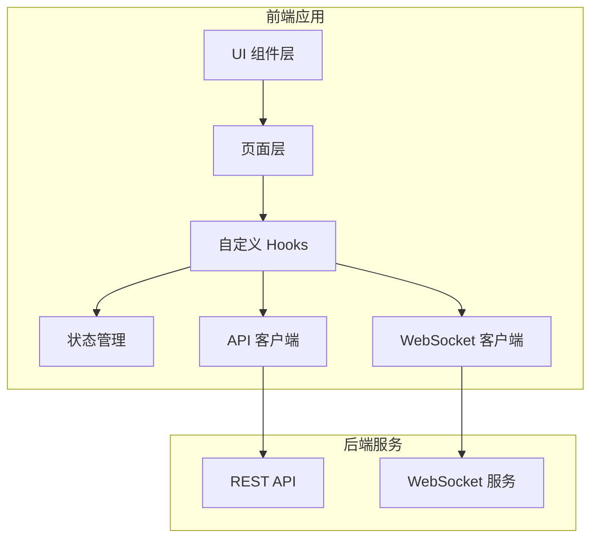

# 设计文档：AI 批改系统前端演示应用

## 概述

本设计文档详述 AI 批改系统前端演示应用的技术架构和实现方案。该应用采用现代化的 React 技术栈，提供直观的用户界面用于实验和展示 AI 批改系统的核心功能。

### 核心设计原则

1. **组件化设计**：采用原子设计方法论，构建可复用的 UI 组件库
2. **状态管理**：使用 React Query 管理服务端状态，Zustand 管理客户端状态
3. **实时通信**：通过 WebSocket 实现批改进度的实时推送
4. **响应式布局**：使用 Tailwind CSS 实现移动优先的响应式设计
5. **类型安全**：全面使用 TypeScript 确保代码质量

## 架构设计

### 技术栈

```
前端框架: React 18 + TypeScript
构建工具: Vite
UI 框架: Tailwind CSS + shadcn/ui
状态管理: React Query (服务端) + Zustand (客户端)
路由: React Router v6
图表: Recharts
图像处理: react-zoom-pan-pinch
WebSocket: 原生 WebSocket API
测试: Vitest + React Testing Library + Playwright
```

### 应用架构图



### 目录结构

```
frontend/
├── src/
│   ├── components/          # UI 组件
│   │   ├── ui/              # 基础 UI 组件 (shadcn/ui)
│   │   ├── forms/           # 表单组件
│   │   ├── layout/          # 布局组件
│   │   └── features/        # 功能组件
│   ├── pages/               # 页面组件
│   ├── hooks/               # 自定义 Hooks
│   ├── stores/              # Zustand 状态存储
│   ├── services/            # API 服务
│   ├── types/               # TypeScript 类型定义
│   ├── utils/               # 工具函数
│   └── lib/                 # 第三方库配置
├── tests/
│   ├── unit/                # 单元测试
│   ├── integration/         # 集成测试
│   └── e2e/                 # 端到端测试
└── public/                  # 静态资源
```

## 组件与接口

### 1. API 客户端 (API Client)

封装所有后端 API 调用，提供类型安全的接口。

```typescript
// services/api.ts
import axios from 'axios';

const apiClient = axios.create({
  baseURL: import.meta.env.VITE_API_BASE_URL || 'http://localhost:8000',
  timeout: 30000,
});

// 提交相关 API
export const submissionApi = {
  // 上传并提交批改
  submit: async (data: FormData): Promise<SubmissionResponse> => {
    const response = await apiClient.post('/api/v1/submissions', data, {
      headers: { 'Content-Type': 'multipart/form-data' },
    });
    return response.data;
  },
  
  // 获取提交状态
  getStatus: async (submissionId: string): Promise<SubmissionStatus> => {
    const response = await apiClient.get(`/api/v1/submissions/${submissionId}`);
    return response.data;
  },
  
  // 获取批改结果
  getResults: async (submissionId: string): Promise<GradingResults> => {
    const response = await apiClient.get(`/api/v1/submissions/${submissionId}/results`);
    return response.data;
  },
  
  // 分页查询提交列表
  list: async (params: ListParams): Promise<PaginatedResponse<Submission>> => {
    const response = await apiClient.get('/api/v1/submissions', { params });
    return response.data;
  },
};

// 评分细则相关 API
export const rubricApi = {
  create: async (data: RubricCreateRequest): Promise<Rubric> => {
    const response = await apiClient.post('/api/v1/rubrics', data);
    return response.data;
  },
  
  get: async (examId: string, questionId: string): Promise<Rubric> => {
    const response = await apiClient.get(`/api/v1/rubrics/${examId}/${questionId}`);
    return response.data;
  },
  
  update: async (rubricId: string, data: RubricUpdateRequest): Promise<Rubric> => {
    const response = await apiClient.put(`/api/v1/rubrics/${rubricId}`, data);
    return response.data;
  },
};

// 审核相关 API
export const reviewApi = {
  sendSignal: async (submissionId: string, signal: ReviewSignal): Promise<void> => {
    await apiClient.post(`/api/v1/reviews/${submissionId}/signal`, signal);
  },
  
  getPending: async (submissionId: string): Promise<PendingReview[]> => {
    const response = await apiClient.get(`/api/v1/reviews/${submissionId}/pending`);
    return response.data;
  },
};
```

### 2. WebSocket 客户端 (WebSocket Client)

管理 WebSocket 连接，支持自动重连和状态订阅。

```typescript
// services/websocket.ts
type MessageHandler = (data: WebSocketMessage) => void;

export class WebSocketClient {
  private ws: WebSocket | null = null;
  private reconnectAttempts = 0;
  private maxReconnectAttempts = 5;
  private reconnectDelay = 1000;
  private handlers: Map<string, MessageHandler[]> = new Map();
  
  constructor(private baseUrl: string) {}
  
  // 连接到指定提交的状态通道
  connect(submissionId: string): void {
    const url = `${this.baseUrl}/ws/submissions/${submissionId}`;
    this.ws = new WebSocket(url);
    
    this.ws.onopen = () => {
      this.reconnectAttempts = 0;
      this.emit('connected', { submissionId });
    };
    
    this.ws.onmessage = (event) => {
      const data = JSON.parse(event.data);
      this.emit('message', data);
      this.emit(data.type, data);
    };
    
    this.ws.onclose = () => {
      this.emit('disconnected', {});
      this.attemptReconnect(submissionId);
    };
    
    this.ws.onerror = (error) => {
      this.emit('error', { error });
    };
  }
  
  // 自动重连
  private attemptReconnect(submissionId: string): void {
    if (this.reconnectAttempts < this.maxReconnectAttempts) {
      this.reconnectAttempts++;
      setTimeout(() => {
        this.connect(submissionId);
      }, this.reconnectDelay * this.reconnectAttempts);
    }
  }
  
  // 订阅事件
  on(event: string, handler: MessageHandler): void {
    if (!this.handlers.has(event)) {
      this.handlers.set(event, []);
    }
    this.handlers.get(event)!.push(handler);
  }
  
  // 触发事件
  private emit(event: string, data: any): void {
    const handlers = this.handlers.get(event) || [];
    handlers.forEach(handler => handler(data));
  }
  
  // 断开连接
  disconnect(): void {
    if (this.ws) {
      this.ws.close();
      this.ws = null;
    }
  }
}
```

### 3. 状态管理 (State Management)

使用 Zustand 管理全局客户端状态。

```typescript
// stores/appStore.ts
import { create } from 'zustand';

interface AppState {
  // 用户信息
  user: User | null;
  setUser: (user: User | null) => void;
  
  // 通知
  notifications: Notification[];
  addNotification: (notification: Notification) => void;
  removeNotification: (id: string) => void;
  
  // 网络状态
  isOnline: boolean;
  setOnline: (online: boolean) => void;
  
  // 侧边栏状态
  sidebarCollapsed: boolean;
  toggleSidebar: () => void;
}

export const useAppStore = create<AppState>((set) => ({
  user: null,
  setUser: (user) => set({ user }),
  
  notifications: [],
  addNotification: (notification) =>
    set((state) => ({
      notifications: [...state.notifications, notification],
    })),
  removeNotification: (id) =>
    set((state) => ({
      notifications: state.notifications.filter((n) => n.id !== id),
    })),
  
  isOnline: navigator.onLine,
  setOnline: (online) => set({ isOnline: online }),
  
  sidebarCollapsed: false,
  toggleSidebar: () =>
    set((state) => ({ sidebarCollapsed: !state.sidebarCollapsed })),
}));
```

### 4. 自定义 Hooks

封装业务逻辑的可复用 Hooks。

```typescript
// hooks/useSubmission.ts
import { useQuery, useMutation, useQueryClient } from '@tanstack/react-query';
import { submissionApi } from '../services/api';

export function useSubmission(submissionId: string) {
  return useQuery({
    queryKey: ['submission', submissionId],
    queryFn: () => submissionApi.getStatus(submissionId),
    refetchInterval: (data) => 
      data?.status === 'PROCESSING' ? 5000 : false,
  });
}

export function useSubmitGrading() {
  const queryClient = useQueryClient();
  
  return useMutation({
    mutationFn: submissionApi.submit,
    onSuccess: () => {
      queryClient.invalidateQueries({ queryKey: ['submissions'] });
    },
  });
}

// hooks/useWebSocket.ts
import { useEffect, useRef, useState } from 'react';
import { WebSocketClient } from '../services/websocket';

export function useWebSocket(submissionId: string | null) {
  const [status, setStatus] = useState<'connecting' | 'connected' | 'disconnected'>('disconnected');
  const [progress, setProgress] = useState<ProgressData | null>(null);
  const wsRef = useRef<WebSocketClient | null>(null);
  
  useEffect(() => {
    if (!submissionId) return;
    
    const ws = new WebSocketClient(import.meta.env.VITE_WS_URL);
    wsRef.current = ws;
    
    ws.on('connected', () => setStatus('connected'));
    ws.on('disconnected', () => setStatus('disconnected'));
    ws.on('progress', (data) => setProgress(data));
    
    ws.connect(submissionId);
    
    return () => {
      ws.disconnect();
    };
  }, [submissionId]);
  
  return { status, progress };
}

// hooks/useFileValidation.ts
export function useFileValidation() {
  const validateFile = (file: File): ValidationResult => {
    const errors: string[] = [];
    
    // 验证文件格式
    const allowedTypes = ['application/pdf', 'image/jpeg', 'image/png', 'image/webp'];
    if (!allowedTypes.includes(file.type)) {
      errors.push('不支持的文件格式，请上传 PDF、JPEG、PNG 或 WEBP 文件');
    }
    
    // 验证文件大小 (10MB)
    const maxSize = 10 * 1024 * 1024;
    if (file.size > maxSize) {
      errors.push('文件大小超过 10MB 限制');
    }
    
    return {
      valid: errors.length === 0,
      errors,
    };
  };
  
  return { validateFile };
}
```

### 5. 页面组件

#### 5.1 上传页面

```typescript
// pages/UploadPage.tsx
export function UploadPage() {
  const [file, setFile] = useState<File | null>(null);
  const [examId, setExamId] = useState('');
  const [studentId, setStudentId] = useState('');
  const { validateFile } = useFileValidation();
  const submitMutation = useSubmitGrading();
  const navigate = useNavigate();
  
  const handleDrop = (acceptedFiles: File[]) => {
    const file = acceptedFiles[0];
    const result = validateFile(file);
    if (result.valid) {
      setFile(file);
    } else {
      toast.error(result.errors.join('\n'));
    }
  };
  
  const handleSubmit = async () => {
    if (!file || !examId || !studentId) return;
    
    const formData = new FormData();
    formData.append('file', file);
    formData.append('exam_id', examId);
    formData.append('student_id', studentId);
    
    try {
      const result = await submitMutation.mutateAsync(formData);
      toast.success('提交成功');
      navigate(`/progress/${result.submission_id}`);
    } catch (error) {
      toast.error('提交失败，请重试');
    }
  };
  
  return (
    <div className="container mx-auto p-6">
      <h1 className="text-2xl font-bold mb-6">上传试卷</h1>
      
      <FileDropzone onDrop={handleDrop} file={file} />
      
      <div className="mt-6 space-y-4">
        <Input
          label="考试 ID"
          value={examId}
          onChange={(e) => setExamId(e.target.value)}
        />
        <Input
          label="学生 ID"
          value={studentId}
          onChange={(e) => setStudentId(e.target.value)}
        />
        <Button
          onClick={handleSubmit}
          disabled={!file || !examId || !studentId || submitMutation.isPending}
        >
          {submitMutation.isPending ? '提交中...' : '提交批改'}
        </Button>
      </div>
    </div>
  );
}
```

#### 5.2 进度监控页面

```typescript
// pages/ProgressPage.tsx
export function ProgressPage() {
  const { submissionId } = useParams();
  const { status, progress } = useWebSocket(submissionId || null);
  const { data: submission } = useSubmission(submissionId || '');
  const navigate = useNavigate();
  
  useEffect(() => {
    if (submission?.status === 'COMPLETED') {
      navigate(`/results/${submissionId}`);
    }
  }, [submission?.status]);
  
  return (
    <div className="container mx-auto p-6">
      <h1 className="text-2xl font-bold mb-6">批改进度</h1>
      
      <ConnectionStatus status={status} />
      
      {progress && (
        <div className="mt-6">
          <ProgressBar value={progress.percentage} />
          <p className="mt-2 text-gray-600">
            当前处理: {progress.stage} - 题目 {progress.currentQuestion}
          </p>
          <p className="text-sm text-gray-500">
            预计剩余时间: {progress.estimatedTimeRemaining}
          </p>
        </div>
      )}
      
      {submission?.status === 'REVIEWING' && (
        <Alert variant="warning" className="mt-6">
          部分题目需要人工审核
          <Button variant="link" onClick={() => navigate(`/review/${submissionId}`)}>
            前往审核
          </Button>
        </Alert>
      )}
    </div>
  );
}
```

## 数据模型

### TypeScript 类型定义

```typescript
// types/submission.ts
export interface Submission {
  submission_id: string;
  exam_id: string;
  student_id: string;
  status: SubmissionStatus;
  total_score: number | null;
  max_total_score: number | null;
  created_at: string;
  updated_at: string;
}

export type SubmissionStatus = 
  | 'PENDING'
  | 'PROCESSING'
  | 'COMPLETED'
  | 'REVIEWING'
  | 'REJECTED'
  | 'FAILED';

export interface SubmissionResponse {
  submission_id: string;
  estimated_completion_time: string;
}

// types/grading.ts
export interface GradingResult {
  question_id: string;
  score: number;
  max_score: number;
  confidence: number;
  feedback: string;
  visual_annotations: VisualAnnotation[];
  agent_trace: AgentTrace;
}

export interface VisualAnnotation {
  bounding_box: [number, number, number, number];
  label: string;
  color: string;
}

export interface AgentTrace {
  reasoning_steps: string[];
  evidence_chain: EvidenceItem[];
}

export interface EvidenceItem {
  scoring_point: string;
  student_response: string;
  image_region: [number, number, number, number];
  points_awarded: number;
  justification: string;
}

// types/rubric.ts
export interface Rubric {
  rubric_id: string;
  exam_id: string;
  question_id: string;
  rubric_text: string;
  max_score: number;
  scoring_points: ScoringPoint[];
  standard_answer?: string;
}

export interface ScoringPoint {
  description: string;
  points: number;
  keywords?: string[];
}

// types/review.ts
export interface ReviewSignal {
  submission_id: string;
  action: 'APPROVE' | 'OVERRIDE' | 'REJECT';
  question_id?: string;
  override_score?: number;
  override_feedback?: string;
  review_comment?: string;
}

export interface PendingReview {
  submission_id: string;
  exam_id: string;
  student_id: string;
  question_id: string;
  ai_score: number;
  confidence: number;
  reason: string;
  created_at: string;
}
```

## 正确性属性

*属性是指在系统所有有效执行中都应保持为真的特征或行为——本质上是关于系统应该做什么的形式化陈述。属性是人类可读规范与机器可验证正确性保证之间的桥梁。*

### 属性 1：文件验证正确性
*对于任意*上传的文件，当文件格式不是 PDF、JPEG、PNG 或 WEBP 时，验证函数应当返回无效结果；当文件大小超过 10MB 时，验证函数应当返回无效结果；仅当格式和大小都符合要求时才返回有效结果。

**验证：需求 1.2, 1.3**

### 属性 2：评分点分值一致性
*对于任意*评分细则，各评分点的分值之和应当等于该细则的总分（max_score）。

**验证：需求 2.4**

### 属性 3：状态同步一致性
*对于任意* WebSocket 状态更新消息，UI 显示的进度百分比应当与消息中的 percentage 字段一致，状态文本应当与 stage 字段一致。

**验证：需求 3.2**

### 属性 4：置信度阈值判断正确性
*对于任意*批改结果，当置信度低于 0.75 时，该题目应当被标记为需要审核（显示醒目颜色）；当置信度大于等于 0.75 时，不应被标记。

**验证：需求 4.5**

### 属性 5：列表筛选正确性
*对于任意*筛选条件组合，返回的列表中每条记录都应当满足所有指定的筛选条件。

**验证：需求 6.2**

### 属性 6：列表排序正确性
*对于任意*排序字段和排序方向，返回的列表应当按指定字段和方向正确排序。

**验证：需求 6.3**

### 属性 7：统计计算正确性
*对于任意*批改结果数据集，平均置信度应当等于所有置信度值的算术平均值，平均批改时间应当等于所有批改时间的算术平均值。

**验证：需求 7.3**

### 属性 8：限流重试正确性
*对于任意* 429 响应，系统应当解析 Retry-After 头并在指定时间后自动重试，重试间隔应当不小于 Retry-After 指定的秒数。

**验证：需求 10.4**

## 错误处理

### 错误处理策略

| 错误类型 | 处理策略 |
|---------|---------|
| 网络错误 | 显示离线提示，缓存数据，网络恢复后自动重试 |
| 400 错误 | 显示具体的验证错误信息 |
| 401 错误 | 跳转到登录页面 |
| 404 错误 | 显示资源不存在提示 |
| 429 错误 | 显示等待时间，自动重试 |
| 500 错误 | 显示服务器错误提示，提供联系支持选项 |
| WebSocket 断开 | 自动重连，最多重试 5 次 |

### 错误边界组件

```typescript
// components/ErrorBoundary.tsx
export class ErrorBoundary extends React.Component<Props, State> {
  state = { hasError: false, error: null };
  
  static getDerivedStateFromError(error: Error) {
    return { hasError: true, error };
  }
  
  componentDidCatch(error: Error, errorInfo: React.ErrorInfo) {
    console.error('Error caught by boundary:', error, errorInfo);
    // 上报错误到监控服务
  }
  
  render() {
    if (this.state.hasError) {
      return (
        <div className="error-fallback">
          <h2>出错了</h2>
          <p>请刷新页面重试，或联系技术支持</p>
          <Button onClick={() => window.location.reload()}>
            刷新页面
          </Button>
        </div>
      );
    }
    
    return this.props.children;
  }
}
```

## 测试策略

### 单元测试框架

- **框架**：Vitest + React Testing Library
- **覆盖率目标**：核心逻辑 80% 行覆盖率

### 属性测试框架

- **框架**：fast-check
- **最小迭代次数**：每个属性 100 次

```typescript
import * as fc from 'fast-check';

// 属性 1：文件验证正确性
describe('File Validation', () => {
  test('rejects invalid file types', () => {
    fc.assert(
      fc.property(
        fc.string().filter(s => !['pdf', 'jpeg', 'png', 'webp'].includes(s)),
        (invalidType) => {
          const file = new File([''], `test.${invalidType}`, { type: `application/${invalidType}` });
          const result = validateFile(file);
          return !result.valid;
        }
      )
    );
  });
  
  test('rejects files over 10MB', () => {
    fc.assert(
      fc.property(
        fc.integer({ min: 10 * 1024 * 1024 + 1, max: 100 * 1024 * 1024 }),
        (size) => {
          const file = new File([new ArrayBuffer(size)], 'test.pdf', { type: 'application/pdf' });
          const result = validateFile(file);
          return !result.valid;
        }
      )
    );
  });
});

// 属性 4：置信度阈值判断
describe('Confidence Threshold', () => {
  test('marks low confidence results for review', () => {
    fc.assert(
      fc.property(
        fc.float({ min: 0, max: 0.749 }),
        (confidence) => {
          const result = shouldMarkForReview(confidence);
          return result === true;
        }
      )
    );
  });
  
  test('does not mark high confidence results', () => {
    fc.assert(
      fc.property(
        fc.float({ min: 0.75, max: 1 }),
        (confidence) => {
          const result = shouldMarkForReview(confidence);
          return result === false;
        }
      )
    );
  });
});
```

### 端到端测试

- **框架**：Playwright
- **测试场景**：完整的用户流程测试

```typescript
// tests/e2e/grading-flow.spec.ts
import { test, expect } from '@playwright/test';

test('complete grading flow', async ({ page }) => {
  // 1. 上传试卷
  await page.goto('/upload');
  await page.setInputFiles('input[type="file"]', 'test-paper.pdf');
  await page.fill('input[name="examId"]', 'exam-001');
  await page.fill('input[name="studentId"]', 'student-001');
  await page.click('button[type="submit"]');
  
  // 2. 等待跳转到进度页面
  await expect(page).toHaveURL(/\/progress\//);
  
  // 3. 等待批改完成
  await expect(page.locator('.progress-bar')).toHaveAttribute('data-value', '100', {
    timeout: 60000,
  });
  
  // 4. 查看结果
  await page.click('text=查看结果');
  await expect(page).toHaveURL(/\/results\//);
  await expect(page.locator('.total-score')).toBeVisible();
});
```

## 部署架构

### 构建配置

```typescript
// vite.config.ts
import { defineConfig } from 'vite';
import react from '@vitejs/plugin-react';

export default defineConfig({
  plugins: [react()],
  build: {
    outDir: 'dist',
    sourcemap: true,
    rollupOptions: {
      output: {
        manualChunks: {
          vendor: ['react', 'react-dom', 'react-router-dom'],
          ui: ['@radix-ui/react-dialog', '@radix-ui/react-dropdown-menu'],
          charts: ['recharts'],
        },
      },
    },
  },
  server: {
    proxy: {
      '/api': {
        target: 'http://localhost:8000',
        changeOrigin: true,
      },
      '/ws': {
        target: 'ws://localhost:8000',
        ws: true,
      },
    },
  },
});
```

### 环境变量

```bash
# .env.example
VITE_API_BASE_URL=http://localhost:8000
VITE_WS_URL=ws://localhost:8000
VITE_ENABLE_MOCK=false
```

