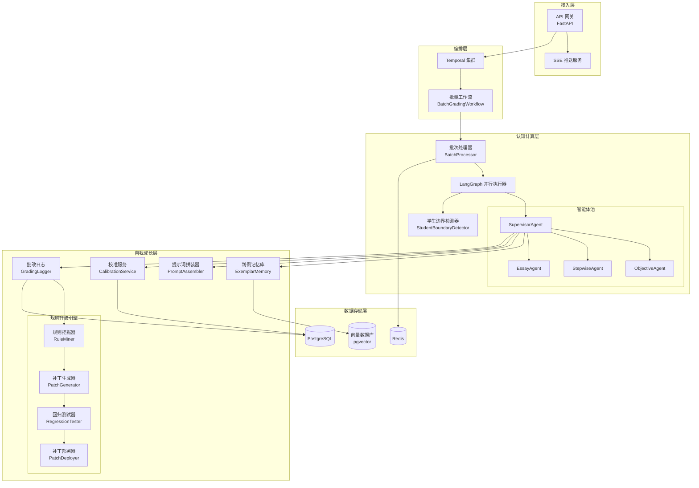
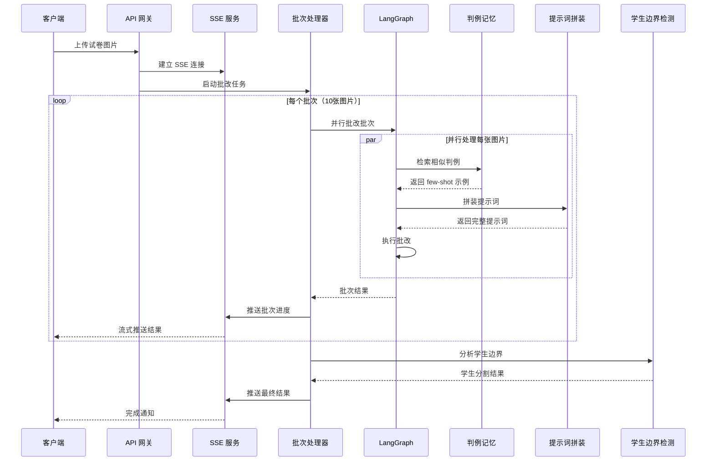

# 设计文档：自我成长批改系统架构升级

## 概述

本设计文档详述 AI 批改系统的架构升级方案，核心目标是实现"自我成长"能力。系统将从老师的反馈中持续学习，同时优化批改流程以支持流式传输和并行处理。

### 核心升级目标

1. **流式格式化传输**：通过 SSE 实时推送批改进度和结果
2. **固定分批并行批改**：10 张图片为一批，LangGraph 并行处理
3. **批改后学生分割**：基于批改结果智能判断学生边界
4. **RAG 判例记忆**：老师确认判例 → 向量检索 → few-shot 学习
5. **动态提示词拼装**：根据题型/错误模式/置信度选择模板
6. **个性化校准**：按老师/学校风格加载配置
7. **自动规则升级**：从改判中挖掘补丁 → 回归测试 → 灰度发布

## 架构设计

### 整体架构图



### 批改流程时序图




## 组件与接口

### 1. 流式推送服务 (StreamingService)

负责通过 SSE 实时推送批改进度和结果。

```python
from typing import AsyncGenerator, Optional
from pydantic import BaseModel
from enum import Enum
from datetime import datetime

class EventType(str, Enum):
    BATCH_START = "batch_start"
    PAGE_COMPLETE = "page_complete"
    BATCH_COMPLETE = "batch_complete"
    STUDENT_IDENTIFIED = "student_identified"
    ERROR = "error"
    COMPLETE = "complete"

class StreamEvent(BaseModel):
    event_type: EventType
    timestamp: datetime
    batch_id: str
    data: dict
    sequence_number: int  # 用于断点续传

class StreamingServiceInterface:
    async def create_stream(self, task_id: str) -> str:
        """创建流式连接，返回 stream_id"""
        pass
    
    async def push_event(self, stream_id: str, event: StreamEvent) -> bool:
        """推送事件到指定流"""
        pass
    
    async def get_events(
        self, 
        stream_id: str, 
        from_sequence: int = 0
    ) -> AsyncGenerator[StreamEvent, None]:
        """获取事件流，支持断点续传"""
        pass
    
    async def close_stream(self, stream_id: str) -> None:
        """关闭流式连接"""
        pass
```

### 2. 批次处理器 (BatchProcessor)

负责将图片分批并协调并行批改。

```python
from typing import List, Dict, Any
from dataclasses import dataclass

BATCH_SIZE = 10  # 固定批次大小

@dataclass
class BatchResult:
    batch_index: int
    page_results: List[Dict[str, Any]]
    success_count: int
    failure_count: int
    processing_time_ms: int

class BatchProcessorInterface:
    def create_batches(self, images: List[bytes]) -> List[List[bytes]]:
        """将图片按 10 张一组分批"""
        pass
    
    async def process_batch(
        self, 
        batch_index: int,
        images: List[bytes],
        rubric: str,
        teacher_id: str
    ) -> BatchResult:
        """并行处理单个批次"""
        pass
    
    async def aggregate_results(
        self, 
        batch_results: List[BatchResult]
    ) -> Dict[str, Any]:
        """汇总所有批次结果"""
        pass
```


### 3. 学生边界检测器 (StudentBoundaryDetector)

基于批改结果智能判断学生边界。

```python
from typing import List, Tuple, Optional
from dataclasses import dataclass

@dataclass
class StudentBoundary:
    student_key: str  # 学生标识（姓名/学号/代号）
    start_page: int
    end_page: int
    confidence: float
    needs_confirmation: bool  # 置信度 < 0.8 时为 True

@dataclass
class BoundaryDetectionResult:
    boundaries: List[StudentBoundary]
    total_students: int
    unassigned_pages: List[int]

class StudentBoundaryDetectorInterface:
    async def detect_boundaries(
        self,
        grading_results: List[Dict[str, Any]]
    ) -> BoundaryDetectionResult:
        """基于批改结果检测学生边界"""
        pass
    
    def _extract_student_markers(
        self, 
        result: Dict[str, Any]
    ) -> Optional[str]:
        """从批改结果中提取学生标识"""
        pass
    
    def _detect_question_cycle(
        self, 
        results: List[Dict[str, Any]]
    ) -> List[Tuple[int, int]]:
        """通过题目序列循环检测边界"""
        pass
```

### 4. 判例记忆库 (ExemplarMemory)

存储和检索老师确认的正确判例。

```python
from typing import List, Optional
from pydantic import BaseModel
from datetime import datetime

class Exemplar(BaseModel):
    exemplar_id: str
    question_type: str
    question_image_hash: str
    student_answer_text: str
    score: float
    max_score: float
    teacher_feedback: str
    teacher_id: str
    confirmed_at: datetime
    usage_count: int = 0
    embedding: List[float]  # 向量嵌入

class ExemplarMemoryInterface:
    async def store_exemplar(
        self,
        grading_result: Dict[str, Any],
        teacher_id: str,
        teacher_feedback: str
    ) -> str:
        """存储老师确认的判例，返回 exemplar_id"""
        pass
    
    async def retrieve_similar(
        self,
        question_image: bytes,
        question_type: str,
        top_k: int = 5,
        min_similarity: float = 0.7
    ) -> List[Exemplar]:
        """检索最相似的判例（3-5个）"""
        pass
    
    async def evict_old_exemplars(
        self,
        max_capacity: int,
        retention_days: int = 90
    ) -> int:
        """淘汰旧判例，返回淘汰数量"""
        pass
```


### 5. 动态提示词拼装器 (PromptAssembler)

根据上下文动态构建提示词。

```python
from typing import List, Optional, Dict, Any
from pydantic import BaseModel
from enum import Enum

class PromptSection(str, Enum):
    SYSTEM = "system"
    RUBRIC = "rubric"
    EXEMPLARS = "exemplars"
    ERROR_GUIDANCE = "error_guidance"
    DETAILED_REASONING = "detailed_reasoning"
    CALIBRATION = "calibration"

class AssembledPrompt(BaseModel):
    sections: Dict[PromptSection, str]
    total_tokens: int
    truncated_sections: List[PromptSection]

class PromptAssemblerInterface:
    def load_base_template(self, question_type: str) -> str:
        """加载题型基础模板"""
        pass
    
    def add_error_guidance(
        self, 
        error_patterns: List[str]
    ) -> str:
        """添加错误模式引导"""
        pass
    
    def add_detailed_reasoning_prompt(
        self, 
        previous_confidence: float
    ) -> str:
        """添加详细推理提示（低置信度时）"""
        pass
    
    def format_exemplars(
        self, 
        exemplars: List[Exemplar]
    ) -> str:
        """格式化判例为 few-shot 示例"""
        pass
    
    def assemble(
        self,
        question_type: str,
        rubric: str,
        exemplars: List[Exemplar],
        error_patterns: List[str],
        previous_confidence: Optional[float],
        calibration: Optional[Dict[str, Any]],
        max_tokens: int = 8000
    ) -> AssembledPrompt:
        """拼装完整提示词，按优先级截断"""
        pass
```

### 6. 个性化校准服务 (CalibrationService)

管理老师/学校的个性化评分配置。

```python
from typing import Optional, Dict, Any, List
from pydantic import BaseModel

class ToleranceRule(BaseModel):
    rule_type: str  # "numeric", "unit", "synonym"
    tolerance_value: float
    description: str

class CalibrationProfile(BaseModel):
    profile_id: str
    teacher_id: str
    school_id: Optional[str]
    
    # 扣分规则
    deduction_rules: Dict[str, float]  # 错误类型 -> 扣分值
    
    # 容差设置
    tolerance_rules: List[ToleranceRule]
    
    # 措辞模板
    feedback_templates: Dict[str, str]  # 场景 -> 模板
    
    # 严格程度（0.0-1.0）
    strictness_level: float = 0.5

class CalibrationServiceInterface:
    async def get_or_create_profile(
        self, 
        teacher_id: str
    ) -> CalibrationProfile:
        """获取或创建教师校准配置"""
        pass
    
    async def update_profile(
        self,
        teacher_id: str,
        updates: Dict[str, Any]
    ) -> CalibrationProfile:
        """更新校准配置"""
        pass
    
    def apply_tolerance(
        self,
        student_answer: str,
        standard_answer: str,
        profile: CalibrationProfile
    ) -> bool:
        """应用容差规则判断答案是否等价"""
        pass
    
    def generate_feedback(
        self,
        scenario: str,
        context: Dict[str, Any],
        profile: CalibrationProfile
    ) -> str:
        """使用模板生成评语"""
        pass
```


### 7. 批改日志服务 (GradingLogger)

记录完整的批改上下文用于后续分析。

```python
from typing import Optional, Dict, Any
from pydantic import BaseModel
from datetime import datetime

class GradingLog(BaseModel):
    log_id: str
    submission_id: str
    question_id: str
    timestamp: datetime
    
    # 提取阶段
    extracted_answer: str
    extraction_confidence: float
    evidence_snippets: List[str]
    
    # 规范化阶段
    normalized_answer: Optional[str]
    normalization_rules_applied: List[str]
    
    # 匹配阶段
    match_result: bool
    match_failure_reason: Optional[str]
    
    # 评分阶段
    score: float
    max_score: float
    confidence: float
    reasoning_trace: List[str]
    
    # 改判信息（如有）
    was_overridden: bool = False
    override_score: Optional[float]
    override_reason: Optional[str]
    override_teacher_id: Optional[str]

class GradingLoggerInterface:
    async def log_grading(self, log: GradingLog) -> str:
        """记录批改日志"""
        pass
    
    async def log_override(
        self,
        log_id: str,
        override_score: float,
        override_reason: str,
        teacher_id: str
    ) -> bool:
        """记录改判信息"""
        pass
    
    async def get_override_samples(
        self,
        min_count: int = 100,
        days: int = 7
    ) -> List[GradingLog]:
        """获取改判样本用于规则挖掘"""
        pass
    
    async def flush_pending(self) -> int:
        """刷新暂存的日志（写入失败时的重试）"""
        pass
```

### 8. 规则升级引擎

#### 8.1 规则挖掘器 (RuleMiner)

```python
from typing import List, Dict, Any
from dataclasses import dataclass

@dataclass
class FailurePattern:
    pattern_id: str
    pattern_type: str  # "extraction", "normalization", "matching"
    description: str
    frequency: int
    sample_logs: List[str]

class RuleMinerInterface:
    async def analyze_overrides(
        self,
        override_logs: List[GradingLog]
    ) -> List[FailurePattern]:
        """分析改判样本，识别高频失败模式"""
        pass
    
    def is_pattern_fixable(
        self, 
        pattern: FailurePattern
    ) -> bool:
        """判断模式是否可通过规则修复"""
        pass
```


#### 8.2 补丁生成器 (PatchGenerator)

```python
from typing import Optional
from pydantic import BaseModel
from enum import Enum

class PatchType(str, Enum):
    RULE = "rule"           # 规则补丁
    PROMPT = "prompt"       # 提示词补丁
    EXEMPLAR = "exemplar"   # 示例补丁

class RulePatch(BaseModel):
    patch_id: str
    patch_type: PatchType
    version: str
    description: str
    content: Dict[str, Any]
    source_pattern_id: str
    created_at: datetime
    status: str  # "candidate", "testing", "deployed", "rolled_back"

class PatchGeneratorInterface:
    async def generate_patch(
        self,
        pattern: FailurePattern
    ) -> Optional[RulePatch]:
        """根据失败模式生成候选补丁"""
        pass
```

#### 8.3 回归测试器 (RegressionTester)

```python
from dataclasses import dataclass

@dataclass
class RegressionResult:
    patch_id: str
    passed: bool
    
    # 指标对比
    old_error_rate: float
    new_error_rate: float
    old_miss_rate: float
    new_miss_rate: float
    old_review_rate: float
    new_review_rate: float
    
    # 测试详情
    total_samples: int
    improved_samples: int
    degraded_samples: int

class RegressionTesterInterface:
    async def run_regression(
        self,
        patch: RulePatch,
        eval_set_id: str
    ) -> RegressionResult:
        """在评测集上运行回归测试"""
        pass
    
    def is_improvement(
        self, 
        result: RegressionResult
    ) -> bool:
        """判断是否为改进（误判率、漏判率、复核率都下降）"""
        pass
```

#### 8.4 补丁部署器 (PatchDeployer)

```python
class PatchDeployerInterface:
    async def deploy_canary(
        self,
        patch: RulePatch,
        traffic_percentage: float = 0.1
    ) -> str:
        """灰度发布补丁，返回 deployment_id"""
        pass
    
    async def promote_to_full(
        self, 
        deployment_id: str
    ) -> bool:
        """全量发布"""
        pass
    
    async def rollback(
        self, 
        deployment_id: str
    ) -> bool:
        """回滚到上一版本"""
        pass
    
    async def monitor_deployment(
        self,
        deployment_id: str
    ) -> Dict[str, Any]:
        """监控部署状态，异常时自动回滚"""
        pass
```


### 9. 版本管理器 (VersionManager)

```python
from typing import List, Optional
from pydantic import BaseModel

class PatchVersion(BaseModel):
    version: str
    patch_id: str
    created_at: datetime
    deployed_at: Optional[datetime]
    status: str
    dependencies: List[str]  # 依赖的其他补丁版本

class VersionManagerInterface:
    def allocate_version(self) -> str:
        """分配唯一版本号"""
        pass
    
    async def record_deployment(
        self,
        patch_id: str,
        scope: str  # "canary", "full"
    ) -> bool:
        """记录部署信息"""
        pass
    
    async def rollback_to_version(
        self, 
        target_version: str
    ) -> bool:
        """回滚到指定版本，处理依赖关系"""
        pass
    
    async def get_history(
        self,
        limit: int = 50
    ) -> List[PatchVersion]:
        """获取补丁历史"""
        pass
```

## 数据模型

### PostgreSQL Schema 扩展

```sql
-- 判例表
CREATE TABLE exemplars (
    exemplar_id UUID PRIMARY KEY DEFAULT gen_random_uuid(),
    question_type VARCHAR(50) NOT NULL,
    question_image_hash VARCHAR(64) NOT NULL,
    student_answer_text TEXT NOT NULL,
    score DECIMAL(5, 2) NOT NULL,
    max_score DECIMAL(5, 2) NOT NULL,
    teacher_feedback TEXT NOT NULL,
    teacher_id UUID NOT NULL,
    confirmed_at TIMESTAMPTZ NOT NULL DEFAULT NOW(),
    usage_count INT DEFAULT 0,
    embedding vector(1536),  -- pgvector 扩展
    
    created_at TIMESTAMPTZ DEFAULT NOW(),
    updated_at TIMESTAMPTZ DEFAULT NOW()
);

CREATE INDEX idx_exemplars_type ON exemplars(question_type);
CREATE INDEX idx_exemplars_teacher ON exemplars(teacher_id);
CREATE INDEX idx_exemplars_embedding ON exemplars USING ivfflat (embedding vector_cosine_ops);

-- 校准配置表
CREATE TABLE calibration_profiles (
    profile_id UUID PRIMARY KEY DEFAULT gen_random_uuid(),
    teacher_id UUID NOT NULL UNIQUE,
    school_id UUID,
    deduction_rules JSONB NOT NULL DEFAULT '{}',
    tolerance_rules JSONB NOT NULL DEFAULT '[]',
    feedback_templates JSONB NOT NULL DEFAULT '{}',
    strictness_level DECIMAL(3, 2) DEFAULT 0.5,
    
    created_at TIMESTAMPTZ DEFAULT NOW(),
    updated_at TIMESTAMPTZ DEFAULT NOW()
);

CREATE INDEX idx_calibration_teacher ON calibration_profiles(teacher_id);
CREATE INDEX idx_calibration_school ON calibration_profiles(school_id);


-- 批改日志表
CREATE TABLE grading_logs (
    log_id UUID PRIMARY KEY DEFAULT gen_random_uuid(),
    submission_id UUID NOT NULL,
    question_id VARCHAR(50) NOT NULL,
    
    -- 提取阶段
    extracted_answer TEXT,
    extraction_confidence DECIMAL(3, 2),
    evidence_snippets JSONB,
    
    -- 规范化阶段
    normalized_answer TEXT,
    normalization_rules_applied JSONB,
    
    -- 匹配阶段
    match_result BOOLEAN,
    match_failure_reason TEXT,
    
    -- 评分阶段
    score DECIMAL(5, 2),
    max_score DECIMAL(5, 2),
    confidence DECIMAL(3, 2),
    reasoning_trace JSONB,
    
    -- 改判信息
    was_overridden BOOLEAN DEFAULT FALSE,
    override_score DECIMAL(5, 2),
    override_reason TEXT,
    override_teacher_id UUID,
    override_at TIMESTAMPTZ,
    
    created_at TIMESTAMPTZ DEFAULT NOW()
);

CREATE INDEX idx_grading_logs_submission ON grading_logs(submission_id);
CREATE INDEX idx_grading_logs_override ON grading_logs(was_overridden) WHERE was_overridden = TRUE;
CREATE INDEX idx_grading_logs_created ON grading_logs(created_at);

-- 规则补丁表
CREATE TABLE rule_patches (
    patch_id UUID PRIMARY KEY DEFAULT gen_random_uuid(),
    patch_type VARCHAR(20) NOT NULL,
    version VARCHAR(20) NOT NULL UNIQUE,
    description TEXT NOT NULL,
    content JSONB NOT NULL,
    source_pattern_id VARCHAR(100),
    status VARCHAR(20) NOT NULL DEFAULT 'candidate',
    dependencies JSONB DEFAULT '[]',
    
    -- 部署信息
    deployed_at TIMESTAMPTZ,
    deployment_scope VARCHAR(20),
    rolled_back_at TIMESTAMPTZ,
    
    -- 测试结果
    regression_result JSONB,
    
    created_at TIMESTAMPTZ DEFAULT NOW(),
    updated_at TIMESTAMPTZ DEFAULT NOW()
);

CREATE INDEX idx_patches_status ON rule_patches(status);
CREATE INDEX idx_patches_version ON rule_patches(version);

-- 流式事件表（用于断点续传）
CREATE TABLE stream_events (
    event_id UUID PRIMARY KEY DEFAULT gen_random_uuid(),
    stream_id VARCHAR(100) NOT NULL,
    sequence_number INT NOT NULL,
    event_type VARCHAR(50) NOT NULL,
    event_data JSONB NOT NULL,
    created_at TIMESTAMPTZ DEFAULT NOW(),
    
    UNIQUE(stream_id, sequence_number)
);

CREATE INDEX idx_stream_events_stream ON stream_events(stream_id, sequence_number);
```

### Redis 键模式扩展

```
# 流式事件缓存
stream:{stream_id}:events -> List<StreamEvent>
stream:{stream_id}:last_seq -> 最后序列号
TTL: 1 小时

# 批次处理状态
batch:{batch_id}:status -> JSON(progress, results)
TTL: 2 小时

# 校准配置缓存
calibration:{teacher_id} -> JSON(CalibrationProfile)
TTL: 24 小时

# 补丁版本缓存
patch:current_version -> 当前生效版本号
patch:{version}:content -> JSON(RulePatch)
TTL: 永久
```


## 正确性属性

*属性是指在系统所有有效执行中都应保持为真的特征或行为——本质上是关于系统应该做什么的形式化陈述。属性是人类可读规范与机器可验证正确性保证之间的桥梁。*

### 属性 1：分批正确性
*对于任意*数量 N 的图片集合，分批后应满足：
- 每个批次最多包含 10 张图片
- 所有批次的图片总数等于 N
- 批次按顺序编号，无遗漏

**验证：需求 2.1, 2.2**

### 属性 2：并行执行完整性
*对于任意*包含 M 张图片的批次，并行执行后应产生 M 个批改结果，每个结果对应一张图片。

**验证：需求 2.3**

### 属性 3：批次容错性
*对于任意*批次内的页面批改失败，其他页面的批改应正常完成，失败详情应被记录。

**验证：需求 2.4**

### 属性 4：批次汇总正确性
*对于任意*批次结果集，汇总的 success_count + failure_count 应等于批次内图片总数。

**验证：需求 2.5**

### 属性 5：学生边界检测触发
*对于任意*完成的批次批改，学生边界检测应被触发并产生分割结果。

**验证：需求 3.1**

### 属性 6：学生边界标记正确性
*对于任意*检测到的学生边界，start_page 应小于等于 end_page，且相邻学生的边界不重叠。

**验证：需求 3.2, 3.5**

### 属性 7：低置信度边界标记
*对于任意*置信度低于 0.8 的学生边界，needs_confirmation 应为 True。

**验证：需求 3.4**

### 属性 8：判例存储完整性
*对于任意*老师确认的批改结果，存储的判例应包含：question_type、student_answer_text、score、max_score、teacher_feedback、confirmed_at。

**验证：需求 4.1, 4.2**

### 属性 9：判例检索数量约束
*对于任意*判例检索请求，返回的判例数量应在 0-5 之间（相似度 >= 0.7 的判例）。

**验证：需求 4.3, 4.4**

### 属性 10：判例淘汰策略
*对于任意*超过容量阈值的判例库，淘汰后的容量应不超过阈值，且淘汰的是使用频率最低或最旧的判例。

**验证：需求 4.5**


### 属性 11：提示词模板选择正确性
*对于任意*题目类型，加载的基础模板应与该题型匹配。

**验证：需求 5.1**

### 属性 12：提示词截断优先级
*对于任意*超过 token 限制的提示词，截断应按优先级进行：SYSTEM > RUBRIC > EXEMPLARS > ERROR_GUIDANCE > DETAILED_REASONING。

**验证：需求 5.5**

### 属性 13：校准配置默认创建
*对于任意*首次使用系统的教师，应自动创建包含默认值的校准配置。

**验证：需求 6.1**

### 属性 14：校准配置更新一致性
*对于任意*校准配置更新，更新后的配置应反映所有修改，未修改的字段保持原值。

**验证：需求 6.2**

### 属性 15：客观题评分输出完整性
*对于任意*客观题评分，输出应包含：score、confidence、reasoning_trace。

**验证：需求 7.1, 7.2, 7.5**

### 属性 16：低置信度二次验证触发
*对于任意*置信度低于 0.85 的客观题评分，应触发二次验证流程。

**验证：需求 7.3**

### 属性 17：二次验证不一致处理
*对于任意*二次验证结果与首次不一致的情况，该题应被标记为待人工复核。

**验证：需求 7.4**

### 属性 18：批改日志完整性
*对于任意*完成的批改，日志应包含：extracted_answer、extraction_confidence、score、confidence、reasoning_trace。

**验证：需求 8.1, 8.2, 8.3**

### 属性 19：改判日志完整性
*对于任意*老师改判，日志应更新：was_overridden=True、override_score、override_reason、override_teacher_id。

**验证：需求 8.4**

### 属性 20：日志写入容错
*对于任意*日志写入失败，日志应被暂存并在恢复后重试，不应丢失。

**验证：需求 8.5**


### 属性 21：规则挖掘触发条件
*对于任意*累积超过 100 条改判样本的时间窗口，规则挖掘应被触发。

**验证：需求 9.1**

### 属性 22：补丁生成条件
*对于任意*可修复的失败模式，应生成对应的候选补丁。

**验证：需求 9.2**

### 属性 23：回归测试必要性
*对于任意*生成的候选补丁，在部署前必须通过回归测试。

**验证：需求 9.3**

### 属性 24：补丁发布条件
*对于任意*回归测试通过且误判率下降的补丁，应加入灰度发布队列。

**验证：需求 9.4**

### 属性 25：异常自动回滚
*对于任意*灰度发布期间出现异常的补丁，应自动回滚到上一版本。

**验证：需求 9.5**

### 属性 26：版本号唯一性
*对于任意*创建的规则补丁，分配的版本号应全局唯一。

**验证：需求 10.1**

### 属性 27：部署记录完整性
*对于任意*部署的补丁，应记录：deployed_at、deployment_scope。

**验证：需求 10.2**

### 属性 28：回滚正确性
*对于任意*回滚请求，系统应恢复到指定版本的规则集，且处理依赖关系。

**验证：需求 10.3, 10.5**

### 属性 29：历史查询完整性
*对于任意*补丁历史查询，返回的列表应包含：version、created_at、status。

**验证：需求 10.4**

### 属性 30：判例序列化往返一致性
*对于任意*判例对象，序列化后再反序列化应产生与原始对象等价的对象。

**验证：需求 11.1, 11.2, 11.3**

### 属性 31：流式事件推送及时性
*对于任意*页面批改完成事件，应在 500ms 内推送到客户端。

**验证：需求 1.2**

### 属性 32：断点续传正确性
*对于任意*断开重连的客户端，应从上次断点（sequence_number）继续推送未接收的事件。

**验证：需求 1.4**


## 错误处理

### 1. 流式推送错误

| 错误类型 | 处理策略 |
|---------|---------|
| 连接断开 | 保留事件队列，支持断点续传 |
| 推送超时 | 重试 3 次，失败后记录日志 |
| 客户端不存在 | 清理资源，关闭流 |

### 2. 批次处理错误

```python
class BatchProcessingError(Exception):
    """批次处理错误"""
    def __init__(self, batch_index: int, failed_pages: List[int], message: str):
        self.batch_index = batch_index
        self.failed_pages = failed_pages
        super().__init__(message)

# 单页失败不影响整批
async def process_page_with_fallback(page_index: int, image: bytes) -> Dict:
    try:
        return await grade_page(image)
    except Exception as e:
        logger.error(f"页面 {page_index} 批改失败: {e}")
        return {"page_index": page_index, "error": str(e), "status": "failed"}
```

### 3. 判例检索错误

```python
async def retrieve_with_fallback(query_embedding: List[float]) -> List[Exemplar]:
    try:
        return await vector_db.search(query_embedding, top_k=5)
    except Exception as e:
        logger.warning(f"判例检索失败，使用空列表: {e}")
        return []  # 降级：不使用判例
```

### 4. 规则升级错误

```python
class PatchDeploymentError(Exception):
    """补丁部署错误"""
    pass

async def deploy_with_rollback(patch: RulePatch) -> bool:
    deployment_id = await deploy_canary(patch)
    try:
        await monitor_for_anomalies(deployment_id, duration_minutes=30)
        await promote_to_full(deployment_id)
        return True
    except AnomalyDetected as e:
        logger.error(f"检测到异常，自动回滚: {e}")
        await rollback(deployment_id)
        return False
```

## 测试策略

### 单元测试框架

- **框架**：pytest 配合 pytest-asyncio
- **Mock**：unittest.mock 用于外部依赖
- **覆盖率目标**：核心逻辑 80% 行覆盖率

### 属性测试框架

- **框架**：Hypothesis (Python)
- **最小迭代次数**：每个属性 100 次
- **配置**：

```python
from hypothesis import settings, Phase

settings.register_profile(
    "ci",
    max_examples=100,
    phases=[Phase.generate, Phase.target, Phase.shrink]
)
```


### 属性测试示例

```python
from hypothesis import given, strategies as st

# 属性 1：分批正确性
@given(n_images=st.integers(min_value=1, max_value=1000))
def test_batch_creation_correctness(n_images):
    """
    **Feature: self-evolving-grading, Property 1: 分批正确性**
    **Validates: Requirements 2.1, 2.2**
    """
    images = [b"image_data"] * n_images
    batches = create_batches(images)
    
    # 每批最多 10 张
    assert all(len(batch) <= 10 for batch in batches)
    # 总数不变
    assert sum(len(batch) for batch in batches) == n_images
    # 批次数正确
    expected_batches = (n_images + 9) // 10
    assert len(batches) == expected_batches

# 属性 9：判例检索数量约束
@given(
    n_exemplars=st.integers(min_value=0, max_value=100),
    similarities=st.lists(st.floats(min_value=0.0, max_value=1.0), min_size=0, max_size=100)
)
def test_exemplar_retrieval_count(n_exemplars, similarities):
    """
    **Feature: self-evolving-grading, Property 9: 判例检索数量约束**
    **Validates: Requirements 4.3, 4.4**
    """
    # 模拟检索结果
    results = filter_by_similarity(similarities, min_similarity=0.7, top_k=5)
    
    # 数量在 0-5 之间
    assert 0 <= len(results) <= 5
    # 所有结果相似度 >= 0.7
    assert all(sim >= 0.7 for sim in results)

# 属性 30：判例序列化往返一致性
@given(
    question_type=st.sampled_from(["objective", "stepwise", "essay"]),
    score=st.floats(min_value=0, max_value=100),
    feedback=st.text(min_size=1, max_size=500)
)
def test_exemplar_serialization_roundtrip(question_type, score, feedback):
    """
    **Feature: self-evolving-grading, Property 30: 判例序列化往返一致性**
    **Validates: Requirements 11.1, 11.2, 11.3**
    """
    original = Exemplar(
        exemplar_id="test_id",
        question_type=question_type,
        question_image_hash="hash123",
        student_answer_text="answer",
        score=score,
        max_score=100.0,
        teacher_feedback=feedback,
        teacher_id="teacher_1",
        confirmed_at=datetime.now(),
        embedding=[0.1] * 1536
    )
    
    # 序列化后反序列化
    serialized = original.model_dump_json()
    deserialized = Exemplar.model_validate_json(serialized)
    
    # 验证等价性
    assert deserialized.question_type == original.question_type
    assert deserialized.score == original.score
    assert deserialized.teacher_feedback == original.teacher_feedback
```

### 集成测试

- LangGraph 并行执行测试
- SSE 流式推送测试
- 向量数据库检索测试
- 规则补丁部署回滚测试

### Mock 策略

| 组件 | Mock 策略 |
|-----|----------|
| Gemini API | 使用真实 JSON 格式的 Mock 响应 |
| PostgreSQL | 使用测试数据库 |
| Redis | 使用 fakeredis 库 |
| pgvector | 使用内存向量存储 |
| SSE 连接 | 使用 httpx AsyncClient |
