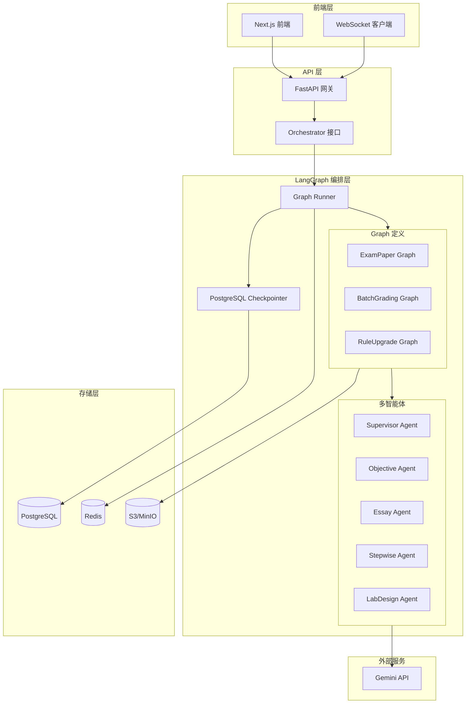
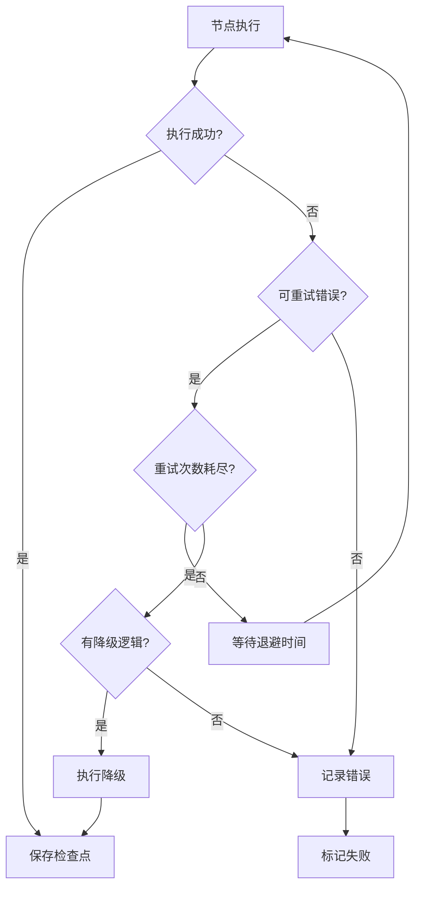
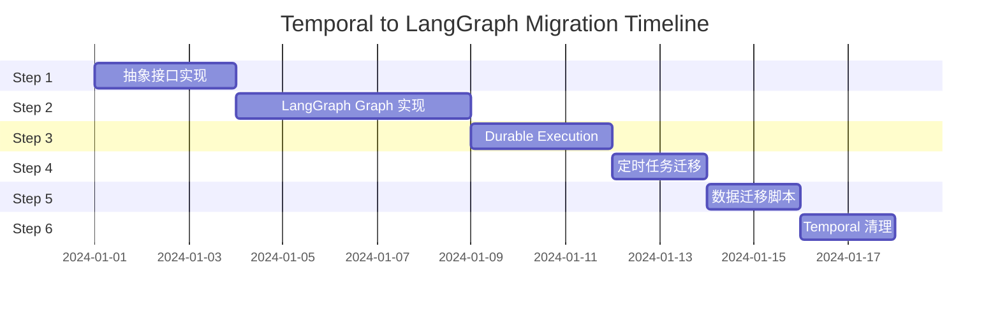

# Design Document: Temporal to LangGraph Migration

## Overview

本设计文档描述了将 AI 批改系统从 Temporal 工作流编排引擎迁移到 LangGraph 的技术方案。迁移后系统将使用 LangGraph 的图结构和 Checkpointer 实现持久化执行，同时保留原有的长任务可恢复、重试退避、状态查询、并行 fanout、人工介入、定时任务等核心能力。

### 迁移目标

1. 彻底移除 Temporal 依赖，简化系统架构
2. 利用 LangGraph 的多智能体能力增强批改质量
3. 前端直接与 LangGraph Graph 交互，实时展示推理过程
4. 保持 API 兼容性，业务层无感知迁移

## Architecture

### 整体架构图




### Temporal → LangGraph 映射表

| Temporal 概念 | LangGraph 对应 | 实现方式 |
|--------------|---------------|---------|
| Workflow | Graph | StateGraph 定义 |
| Activity | Node | 图节点函数 |
| Signal/Wait | interrupt() + resume | 中断点 + 恢复 API |
| Query | 读取 State | 从 Checkpointer 获取状态 |
| Retry/Timeout | 节点级重试 | 节点内部重试逻辑 + 失败分支 |
| Parallel | fanout 子图 | 并行节点 + 聚合节点 |
| Schedule | cron 触发 | 系统 cron + start_run |
| History/Audit | checkpoints | run/attempt 表 + 检查点记录 |
| task_queue | 无需 | 直接调用，无队列概念 |
| namespace | 无需 | 通过 thread_id 隔离 |

## Components and Interfaces

### 1. Orchestrator 抽象接口

```python
from abc import ABC, abstractmethod
from typing import Any, Dict, List, Optional
from dataclasses import dataclass
from enum import Enum
from datetime import datetime

class RunStatus(str, Enum):
    PENDING = "pending"
    RUNNING = "running"
    PAUSED = "paused"      # 等待人工介入
    COMPLETED = "completed"
    FAILED = "failed"
    CANCELLED = "cancelled"

@dataclass
class RunInfo:
    run_id: str
    graph_name: str
    status: RunStatus
    progress: Dict[str, Any]
    created_at: datetime
    updated_at: datetime
    error: Optional[str] = None

class Orchestrator(ABC):
    """编排器抽象接口 - 隔离业务层对具体编排引擎的依赖"""
    
    @abstractmethod
    async def start_run(
        self,
        graph_name: str,
        payload: Dict[str, Any],
        idempotency_key: Optional[str] = None
    ) -> str:
        """启动工作流执行，返回 run_id"""
        pass
    
    @abstractmethod
    async def get_status(self, run_id: str) -> RunInfo:
        """查询工作流状态"""
        pass
    
    @abstractmethod
    async def cancel(self, run_id: str) -> bool:
        """取消工作流执行"""
        pass
    
    @abstractmethod
    async def retry(self, run_id: str) -> str:
        """重试失败的工作流，返回新的 run_id"""
        pass
    
    @abstractmethod
    async def list_runs(
        self,
        graph_name: Optional[str] = None,
        status: Optional[RunStatus] = None,
        limit: int = 100,
        offset: int = 0
    ) -> List[RunInfo]:
        """列出工作流执行"""
        pass
    
    @abstractmethod
    async def send_event(
        self,
        run_id: str,
        event_type: str,
        event_data: Dict[str, Any]
    ) -> bool:
        """发送外部事件到工作流"""
        pass
```


### 2. LangGraph Orchestrator 实现

```python
from langgraph.graph import StateGraph
from langgraph.checkpoint.postgres import PostgresSaver
from typing import Dict, Any, Optional
import uuid

class LangGraphOrchestrator(Orchestrator):
    """LangGraph 编排器实现"""
    
    def __init__(
        self,
        checkpointer: PostgresSaver,
        graphs: Dict[str, StateGraph],
        db_pool: Any
    ):
        self.checkpointer = checkpointer
        self.graphs = graphs
        self.db_pool = db_pool
    
    async def start_run(
        self,
        graph_name: str,
        payload: Dict[str, Any],
        idempotency_key: Optional[str] = None
    ) -> str:
        # 幂等性检查
        if idempotency_key:
            existing = await self._find_by_idempotency_key(idempotency_key)
            if existing:
                return existing.run_id
        
        # 生成 run_id (同时作为 thread_id)
        run_id = str(uuid.uuid4())
        
        # 创建 run 记录
        await self._create_run_record(
            run_id=run_id,
            graph_name=graph_name,
            payload=payload,
            idempotency_key=idempotency_key
        )
        
        # 异步启动 Graph 执行
        await self._schedule_graph_execution(run_id, graph_name, payload)
        
        return run_id
    
    async def get_status(self, run_id: str) -> RunInfo:
        # 从数据库读取 run 记录
        run_record = await self._get_run_record(run_id)
        
        # 从 Checkpointer 读取最新状态
        config = {"configurable": {"thread_id": run_id}}
        state = await self.checkpointer.aget(config)
        
        progress = state.values if state else {}
        
        return RunInfo(
            run_id=run_id,
            graph_name=run_record.graph_name,
            status=run_record.status,
            progress=progress,
            created_at=run_record.created_at,
            updated_at=run_record.updated_at,
            error=run_record.error
        )
    
    async def send_event(
        self,
        run_id: str,
        event_type: str,
        event_data: Dict[str, Any]
    ) -> bool:
        # 获取 Graph 实例
        run_record = await self._get_run_record(run_id)
        graph = self.graphs[run_record.graph_name]
        
        # 使用 resume 恢复执行
        config = {"configurable": {"thread_id": run_id}}
        
        # 更新状态并恢复
        await graph.aupdate_state(
            config,
            {"external_event": {"type": event_type, "data": event_data}}
        )
        
        # 继续执行
        await self._schedule_graph_execution(
            run_id, 
            run_record.graph_name,
            resume=True
        )
        
        return True
```

### 3. Graph State 定义

```python
from typing import TypedDict, List, Dict, Any, Optional
from datetime import datetime
from langgraph.graph import MessagesState

class GradingGraphState(TypedDict):
    """批改 Graph 状态定义"""
    # 基础信息
    job_id: str
    submission_id: str
    exam_id: str
    student_id: str
    
    # 输入数据
    inputs: Dict[str, Any]
    file_paths: List[str]
    rubric: str
    
    # 进度信息
    progress: Dict[str, Any]
    current_stage: str
    percentage: float
    
    # 执行结果
    artifacts: Dict[str, Any]
    grading_results: List[Dict[str, Any]]
    total_score: float
    max_total_score: float
    
    # 错误处理
    errors: List[Dict[str, Any]]
    retry_count: int
    
    # 时间戳
    timestamps: Dict[str, datetime]
    
    # 人工介入
    needs_review: bool
    review_result: Optional[Dict[str, Any]]
    
    # 外部事件
    external_event: Optional[Dict[str, Any]]
```


### 4. 多智能体批改 Graph

```python
from langgraph.graph import StateGraph, END
from langgraph.prebuilt import ToolNode
from typing import Literal

def create_grading_graph() -> StateGraph:
    """创建多智能体批改 Graph"""
    
    graph = StateGraph(GradingGraphState)
    
    # 添加节点
    graph.add_node("segment", segment_node)
    graph.add_node("supervisor", supervisor_node)
    graph.add_node("objective_agent", objective_agent_node)
    graph.add_node("essay_agent", essay_agent_node)
    graph.add_node("stepwise_agent", stepwise_agent_node)
    graph.add_node("lab_design_agent", lab_design_agent_node)
    graph.add_node("aggregate", aggregate_node)
    graph.add_node("review_check", review_check_node)
    graph.add_node("persist", persist_node)
    
    # 设置入口
    graph.set_entry_point("segment")
    
    # 添加边
    graph.add_edge("segment", "supervisor")
    
    # Supervisor 条件路由
    graph.add_conditional_edges(
        "supervisor",
        route_to_agent,
        {
            "objective": "objective_agent",
            "essay": "essay_agent",
            "stepwise": "stepwise_agent",
            "lab_design": "lab_design_agent",
            "aggregate": "aggregate"
        }
    )
    
    # 智能体完成后返回 Supervisor
    for agent in ["objective_agent", "essay_agent", "stepwise_agent", "lab_design_agent"]:
        graph.add_edge(agent, "supervisor")
    
    # 聚合后检查是否需要审核
    graph.add_edge("aggregate", "review_check")
    
    # 审核检查条件路由
    graph.add_conditional_edges(
        "review_check",
        check_needs_review,
        {
            "needs_review": "wait_for_review",
            "no_review": "persist"
        }
    )
    
    # 添加人工介入中断点
    graph.add_node("wait_for_review", wait_for_review_node)
    graph.add_edge("wait_for_review", "persist")
    
    # 持久化后结束
    graph.add_edge("persist", END)
    
    return graph

def route_to_agent(state: GradingGraphState) -> str:
    """Supervisor 路由决策"""
    pending_questions = state.get("pending_questions", [])
    
    if not pending_questions:
        return "aggregate"
    
    question = pending_questions[0]
    question_type = question.get("type", "essay")
    
    type_mapping = {
        "objective": "objective",
        "multiple_choice": "objective",
        "fill_blank": "objective",
        "essay": "essay",
        "short_answer": "essay",
        "stepwise": "stepwise",
        "calculation": "stepwise",
        "lab_design": "lab_design",
        "experiment": "lab_design"
    }
    
    return type_mapping.get(question_type, "essay")

async def wait_for_review_node(state: GradingGraphState) -> GradingGraphState:
    """人工介入中断点"""
    from langgraph.types import interrupt
    
    # 触发中断，等待外部事件
    review_result = interrupt({
        "type": "review_required",
        "submission_id": state["submission_id"],
        "min_confidence": min(r.get("confidence", 1.0) for r in state["grading_results"]),
        "grading_results": state["grading_results"]
    })
    
    # 恢复后处理审核结果
    return {
        **state,
        "review_result": review_result,
        "needs_review": False
    }
```


### 5. 重试策略实现

```python
from dataclasses import dataclass
from typing import Callable, Any, Optional, List
import asyncio
import logging

logger = logging.getLogger(__name__)

@dataclass
class RetryConfig:
    """重试策略配置"""
    initial_interval: float = 1.0
    backoff_coefficient: float = 2.0
    maximum_interval: float = 60.0
    maximum_attempts: int = 3
    non_retryable_errors: List[type] = None
    
    def __post_init__(self):
        if self.non_retryable_errors is None:
            self.non_retryable_errors = [ValueError, TypeError]

async def with_retry(
    func: Callable,
    config: RetryConfig,
    *args,
    **kwargs
) -> Any:
    """带重试的函数执行"""
    last_error = None
    interval = config.initial_interval
    
    for attempt in range(config.maximum_attempts):
        try:
            return await func(*args, **kwargs)
        except Exception as e:
            # 检查是否为不可重试错误
            if any(isinstance(e, err_type) for err_type in config.non_retryable_errors):
                logger.error(f"不可重试错误: {e}")
                raise
            
            last_error = e
            
            if attempt < config.maximum_attempts - 1:
                logger.warning(
                    f"执行失败，第 {attempt + 1} 次重试，"
                    f"等待 {interval}s: {e}"
                )
                await asyncio.sleep(interval)
                interval = min(
                    interval * config.backoff_coefficient,
                    config.maximum_interval
                )
            else:
                logger.error(f"重试次数耗尽: {e}")
    
    raise last_error

def create_retryable_node(
    node_func: Callable,
    retry_config: RetryConfig,
    fallback_func: Optional[Callable] = None
) -> Callable:
    """创建带重试的节点"""
    
    async def wrapped_node(state: GradingGraphState) -> GradingGraphState:
        try:
            return await with_retry(node_func, retry_config, state)
        except Exception as e:
            if fallback_func:
                logger.warning(f"执行降级逻辑: {e}")
                return await fallback_func(state, e)
            else:
                # 记录错误到状态
                errors = state.get("errors", [])
                errors.append({
                    "node": node_func.__name__,
                    "error": str(e),
                    "timestamp": datetime.now().isoformat()
                })
                return {**state, "errors": errors}
    
    return wrapped_node
```

### 6. 并行 Fanout 实现

```python
from typing import List, Dict, Any
import asyncio
from langgraph.graph import StateGraph

async def fanout_grading(
    state: GradingGraphState,
    questions: List[Dict[str, Any]],
    max_concurrent: int = 10
) -> List[Dict[str, Any]]:
    """并行批改多道题目"""
    
    semaphore = asyncio.Semaphore(max_concurrent)
    results = []
    errors = []
    
    async def grade_single(question: Dict[str, Any]) -> Dict[str, Any]:
        async with semaphore:
            try:
                # 根据题目类型选择智能体
                agent = select_agent(question["type"])
                result = await agent.grade(question, state["rubric"])
                return {"success": True, "result": result}
            except Exception as e:
                return {"success": False, "error": str(e), "question_id": question["id"]}
    
    # 并行执行
    tasks = [grade_single(q) for q in questions]
    task_results = await asyncio.gather(*tasks, return_exceptions=True)
    
    for result in task_results:
        if isinstance(result, Exception):
            errors.append({"error": str(result)})
        elif result["success"]:
            results.append(result["result"])
        else:
            errors.append(result)
    
    return results, errors
```


## Data Models

### Run 表结构

```sql
CREATE TABLE runs (
    id UUID PRIMARY KEY DEFAULT gen_random_uuid(),
    run_id VARCHAR(255) UNIQUE NOT NULL,
    graph_name VARCHAR(255) NOT NULL,
    status VARCHAR(50) NOT NULL DEFAULT 'pending',
    payload JSONB NOT NULL,
    progress JSONB DEFAULT '{}',
    error TEXT,
    idempotency_key VARCHAR(255) UNIQUE,
    created_at TIMESTAMP WITH TIME ZONE DEFAULT NOW(),
    updated_at TIMESTAMP WITH TIME ZONE DEFAULT NOW(),
    completed_at TIMESTAMP WITH TIME ZONE
);

CREATE INDEX idx_runs_status ON runs(status);
CREATE INDEX idx_runs_graph_name ON runs(graph_name);
CREATE INDEX idx_runs_created_at ON runs(created_at);
CREATE INDEX idx_runs_idempotency_key ON runs(idempotency_key);
```

### Attempt 表结构

```sql
CREATE TABLE run_attempts (
    id UUID PRIMARY KEY DEFAULT gen_random_uuid(),
    run_id VARCHAR(255) NOT NULL REFERENCES runs(run_id),
    attempt_number INTEGER NOT NULL,
    status VARCHAR(50) NOT NULL,
    started_at TIMESTAMP WITH TIME ZONE DEFAULT NOW(),
    completed_at TIMESTAMP WITH TIME ZONE,
    error TEXT,
    checkpoint_id VARCHAR(255),
    
    UNIQUE(run_id, attempt_number)
);

CREATE INDEX idx_attempts_run_id ON run_attempts(run_id);
```

### 定时任务表结构

```sql
CREATE TABLE scheduled_jobs (
    id UUID PRIMARY KEY DEFAULT gen_random_uuid(),
    job_name VARCHAR(255) UNIQUE NOT NULL,
    graph_name VARCHAR(255) NOT NULL,
    cron_expression VARCHAR(100) NOT NULL,
    payload JSONB DEFAULT '{}',
    enabled BOOLEAN DEFAULT true,
    last_run_at TIMESTAMP WITH TIME ZONE,
    next_run_at TIMESTAMP WITH TIME ZONE,
    created_at TIMESTAMP WITH TIME ZONE DEFAULT NOW(),
    updated_at TIMESTAMP WITH TIME ZONE DEFAULT NOW()
);

CREATE INDEX idx_scheduled_jobs_next_run ON scheduled_jobs(next_run_at) WHERE enabled = true;
```

## Correctness Properties

*A property is a characteristic or behavior that should hold true across all valid executions of a system-essentially, a formal statement about what the system should do. Properties serve as the bridge between human-readable specifications and machine-verifiable correctness guarantees.*

### Property 1: Orchestrator 接口完整性

*For any* 有效的 payload，调用 `start_run` 应返回非空的 run_id，且后续调用 `get_status(run_id)` 应返回有效的 RunInfo 对象。

**Validates: Requirements 1.1, 1.2**

### Property 2: 幂等性保证

*For any* 相同的 idempotency_key，多次调用 `start_run` 应返回相同的 run_id，且只执行一次实际的 Graph 执行。

**Validates: Requirements 9.3**

### Property 3: 检查点恢复正确性

*For any* 已保存检查点的 run，从检查点恢复执行后，状态应与中断前一致，且继续执行不会重复已完成的节点。

**Validates: Requirements 3.3, 3.5**

### Property 4: 重试策略正确性

*For any* 配置了重试策略的节点，失败后的重试间隔应符合指数退避公式：`interval = min(initial * coefficient^attempt, maximum)`。

**Validates: Requirements 4.1, 4.4**

### Property 5: 并行执行完整性

*For any* fanout 并行执行，所有子任务的结果（成功或失败）都应被收集到聚合节点，且成功结果数 + 失败结果数 = 总任务数。

**Validates: Requirements 5.1, 5.2, 5.3**

### Property 6: 人工介入流程正确性

*For any* 触发 `interrupt()` 的执行，状态应变为 PAUSED，且只有在收到 `resume` 事件后才能继续执行。

**Validates: Requirements 8.1, 8.2**

### Property 7: 多智能体分发正确性

*For any* 题目类型，Supervisor 应将其路由到对应的专门智能体，且每道题目只被一个智能体处理一次。

**Validates: Requirements 12.1, 12.2, 12.3, 12.4, 12.5**

### Property 8: 状态查询一致性

*For any* 时刻查询的状态，应与 Checkpointer 中存储的最新检查点状态一致。

**Validates: Requirements 7.1, 14.3**

### Property 9: 取消操作原子性

*For any* 取消操作，run 状态应立即变为 CANCELLED，且不会有新的节点被执行。

**Validates: Requirements 1.3, 14.5**

### Property 10: 进度更新单调性

*For any* 执行过程中的进度更新，进度百分比应单调递增（除非发生回滚）。

**Validates: Requirements 5.5, 7.1**


## Error Handling

### 错误分类

| 错误类型 | 处理策略 | 示例 |
|---------|---------|------|
| 可重试错误 | 指数退避重试 | API 限流、网络超时 |
| 不可重试错误 | 立即失败 | 参数错误、权限不足 |
| 部分失败 | 记录失败，继续处理 | 部分题目批改失败 |
| 系统错误 | 记录日志，人工介入 | 数据库连接失败 |

### 错误处理流程



### 补偿机制

```python
async def compensation_handler(state: GradingGraphState, error: Exception) -> GradingGraphState:
    """补偿处理器 - 当重试耗尽时执行"""
    
    # 记录失败信息
    errors = state.get("errors", [])
    errors.append({
        "type": "compensation_triggered",
        "original_error": str(error),
        "timestamp": datetime.now().isoformat()
    })
    
    # 尝试部分结果保存
    if state.get("grading_results"):
        await save_partial_results(state)
    
    # 发送通知
    await notify_admin(
        submission_id=state["submission_id"],
        error=str(error),
        partial_results=len(state.get("grading_results", []))
    )
    
    return {
        **state,
        "errors": errors,
        "status": "partial_failure"
    }
```

## Testing Strategy

### 双重测试方法

本项目采用单元测试和属性测试相结合的方法：

1. **单元测试**: 验证具体示例和边界情况
2. **属性测试**: 验证应在所有输入上成立的通用属性

### 属性测试框架

使用 **Hypothesis** 作为属性测试库，配置每个属性测试运行至少 100 次迭代。

### 测试标注格式

每个属性测试必须使用以下格式标注：

```python
# **Feature: temporal-to-langgraph-migration, Property {number}: {property_text}**
```

### 测试用例示例

```python
from hypothesis import given, strategies as st, settings
import pytest

# **Feature: temporal-to-langgraph-migration, Property 1: Orchestrator 接口完整性**
@settings(max_examples=100)
@given(
    graph_name=st.sampled_from(["exam_paper", "batch_grading", "rule_upgrade"]),
    payload=st.fixed_dictionaries({
        "submission_id": st.uuids().map(str),
        "exam_id": st.text(min_size=1, max_size=50),
        "student_id": st.text(min_size=1, max_size=50)
    })
)
async def test_orchestrator_interface_completeness(graph_name, payload):
    """验证 Orchestrator 接口完整性"""
    orchestrator = LangGraphOrchestrator(...)
    
    # 启动 run
    run_id = await orchestrator.start_run(graph_name, payload)
    assert run_id is not None
    assert len(run_id) > 0
    
    # 查询状态
    status = await orchestrator.get_status(run_id)
    assert isinstance(status, RunInfo)
    assert status.run_id == run_id
    assert status.graph_name == graph_name

# **Feature: temporal-to-langgraph-migration, Property 2: 幂等性保证**
@settings(max_examples=100)
@given(
    idempotency_key=st.uuids().map(str),
    payload=st.fixed_dictionaries({
        "submission_id": st.uuids().map(str)
    })
)
async def test_idempotency_guarantee(idempotency_key, payload):
    """验证幂等性保证"""
    orchestrator = LangGraphOrchestrator(...)
    
    # 多次调用
    run_id_1 = await orchestrator.start_run("exam_paper", payload, idempotency_key)
    run_id_2 = await orchestrator.start_run("exam_paper", payload, idempotency_key)
    run_id_3 = await orchestrator.start_run("exam_paper", payload, idempotency_key)
    
    # 应返回相同的 run_id
    assert run_id_1 == run_id_2 == run_id_3

# **Feature: temporal-to-langgraph-migration, Property 4: 重试策略正确性**
@settings(max_examples=100)
@given(
    initial_interval=st.floats(min_value=0.1, max_value=10.0),
    backoff_coefficient=st.floats(min_value=1.1, max_value=5.0),
    maximum_interval=st.floats(min_value=10.0, max_value=300.0),
    attempt=st.integers(min_value=0, max_value=10)
)
def test_retry_interval_calculation(initial_interval, backoff_coefficient, maximum_interval, attempt):
    """验证重试间隔计算"""
    config = RetryConfig(
        initial_interval=initial_interval,
        backoff_coefficient=backoff_coefficient,
        maximum_interval=maximum_interval
    )
    
    expected = min(
        initial_interval * (backoff_coefficient ** attempt),
        maximum_interval
    )
    
    actual = calculate_retry_interval(config, attempt)
    
    assert abs(actual - expected) < 0.001
```


## Migration Plan

### 迁移步骤概览



### Step 1: 抽象接口实现

1. 创建 `Orchestrator` 抽象接口
2. 实现 `TemporalOrchestrator`（包装现有代码）
3. 修改业务层使用 `Orchestrator` 接口
4. 验证现有功能不受影响

### Step 2: LangGraph Graph 实现

1. 定义 `GradingGraphState` 类型
2. 将 Activity 重写为 Node 函数
3. 创建 `ExamPaperGraph`、`BatchGradingGraph`、`RuleUpgradeGraph`
4. 实现多智能体路由逻辑
5. 添加 `interrupt()` 中断点

### Step 3: Durable Execution 实现

1. 配置 PostgreSQL Checkpointer
2. 创建 run/attempt 数据库表
3. 实现 `LangGraphOrchestrator`
4. 实现 Worker 轮询执行逻辑
5. 验证崩溃恢复功能

### Step 4: 定时任务迁移

1. 创建 scheduled_jobs 表
2. 实现 cron 触发器
3. 迁移 `ScheduledRuleUpgradeWorkflow`

### Step 5: 数据迁移脚本

```python
async def migrate_temporal_runs():
    """迁移正在运行的 Temporal 工作流"""
    
    # 1. 停止接入新的 Temporal Run
    await disable_temporal_ingress()
    
    # 2. 等待队列排空
    await wait_for_queue_drain(timeout=timedelta(hours=1))
    
    # 3. 导出未完成工作流
    pending_workflows = await export_pending_workflows()
    
    # 4. 生成迁移 Payload
    for wf in pending_workflows:
        payload = {
            "submission_id": wf.input.submission_id,
            "exam_id": wf.input.exam_id,
            "student_id": wf.input.student_id,
            "file_paths": wf.input.file_paths,
            # 使用原 workflow_id 作为幂等键
            "idempotency_key": f"migrate_{wf.workflow_id}"
        }
        
        # 5. 启动到 LangGraph
        await orchestrator.start_run(
            graph_name="exam_paper",
            payload=payload,
            idempotency_key=payload["idempotency_key"]
        )
    
    # 6. 迁移历史审计数据
    await migrate_audit_history()
```

### Step 6: Temporal 清理

1. 删除 `temporalio` 依赖
2. 删除 `src/workflows/` 目录
3. 删除 `src/activities/` 目录
4. 删除 `src/workers/` 目录
5. 更新 `docker-compose.yml` 移除 temporal 服务
6. 更新 k8s 配置移除 temporal 相关资源
7. 更新文档

### 验收清单

```bash
# 1. API 触发 -> 后台执行 -> 状态可查
curl -X POST /api/submissions -d '{"exam_id": "test", "files": [...]}' 
# 返回 run_id

curl /api/runs/{run_id}/status
# 返回状态信息

# 2. 可取消/可重试
curl -X POST /api/runs/{run_id}/cancel
curl -X POST /api/runs/{run_id}/retry

# 3. 可恢复（模拟 Worker 崩溃）
# 启动执行 -> 杀死 Worker -> 重启 Worker -> 验证从检查点继续

# 4. 并行 fanout 场景
# 提交 300 道题目 -> 验证并行执行 -> 验证结果聚合

# 5. 人工介入路径
# 低置信度结果 -> 状态变为 PAUSED -> 提交审核 -> 继续执行

# 6. Temporal 清理验证
grep -r "temporal" --include="*.py" --include="*.yaml" --include="*.yml" src/ k8s/
# 结果应为空
```

## Risk Assessment

| 风险 | 影响 | 缓解措施 |
|-----|------|---------|
| 迁移期间数据丢失 | 高 | 使用幂等键确保不重复执行 |
| 性能下降 | 中 | 压测验证，优化检查点频率 |
| 前端兼容性问题 | 中 | API 保持兼容，渐进式迁移 |
| 定时任务遗漏 | 低 | 迁移前导出所有定时任务配置 |
| 回滚困难 | 高 | 保留 Temporal 代码分支，支持快速回滚 |
