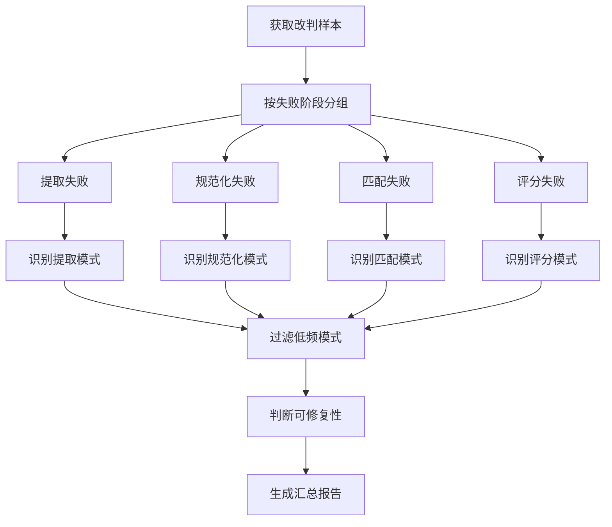

# 规则挖掘器 (RuleMiner)

规则挖掘器是自我成长批改系统的核心组件，负责从老师的改判样本中分析高频失败模式，为规则升级提供依据。

## 功能概述

规则挖掘器实现了以下核心功能：

1. **失败模式识别**：从改判日志中识别系统批改的常见错误模式
2. **模式分类**：将失败模式分为提取、规范化、匹配、评分四大类
3. **频率统计**：统计每种失败模式的出现频率
4. **可修复性判断**：判断失败模式是否可以通过规则修复
5. **汇总报告**：生成失败模式的汇总分析报告

## 核心概念

### 失败模式类型

规则挖掘器识别四种类型的失败模式：

1. **提取失败 (EXTRACTION)**
   - 答案提取置信度低（< 0.6）
   - 提取的答案为空
   - 示例：无法从图像中识别出学生的答案

2. **规范化失败 (NORMALIZATION)**
   - 应用规范化规则后仍然匹配失败
   - 示例：单位换算规则未能正确处理 "100cm" → "1m"

3. **匹配失败 (MATCHING)**
   - 答案提取和规范化成功，但与标准答案匹配失败
   - 示例：未能识别同义词 "正确" 和 "对"

4. **评分失败 (SCORING)**
   - 评分结果与教师评分存在显著偏差
   - 示例：系统评分 7 分，教师改判为 9 分

### 可修复性判断

规则挖掘器会判断每个失败模式是否可以通过自动规则修复：

- **可修复**：提取、规范化、匹配阶段的失败通常可以通过添加规则修复
- **不可修复**：评分阶段的失败通常需要人工介入调整

## 使用方法

### 基本用法

```python
from src.services.rule_miner import get_rule_miner
from src.services.grading_logger import get_grading_logger

# 1. 获取服务实例
grading_logger = get_grading_logger()
rule_miner = get_rule_miner()

# 2. 获取改判样本（最近 7 天，至少 100 条）
override_logs = await grading_logger.get_override_samples(
    min_count=100,
    days=7
)

# 3. 执行规则挖掘
patterns = await rule_miner.analyze_overrides(override_logs)

# 4. 查看识别出的失败模式
for pattern in patterns:
    print(f"模式: {pattern.description}")
    print(f"频率: {pattern.frequency}")
    print(f"可修复: {pattern.is_fixable}")
```

### 高级用法

#### 自定义频率阈值

```python
# 创建自定义规则挖掘器，只识别频率 >= 5 的模式
rule_miner = RuleMiner(min_frequency=5, min_confidence=0.8)
patterns = await rule_miner.analyze_overrides(override_logs)
```

#### 判断模式可修复性

```python
for pattern in patterns:
    if rule_miner.is_pattern_fixable(pattern):
        print(f"可修复: {pattern.description}")
        if pattern.suggested_fix:
            print(f"建议: {pattern.suggested_fix}")
```

#### 生成汇总报告

```python
summary = rule_miner.generate_summary(override_logs, patterns)

print(f"总改判数量: {summary.total_overrides}")
print(f"识别模式数量: {summary.total_patterns}")
print(f"可修复模式数量: {summary.fixable_patterns}")
```

## 数据模型

### FailurePattern

失败模式数据模型：

```python
class FailurePattern(BaseModel):
    pattern_id: str              # 失败模式唯一标识
    pattern_type: PatternType    # 失败模式类型
    description: str             # 失败模式描述
    frequency: int               # 出现频率
    sample_log_ids: List[str]    # 样本日志ID列表
    confidence: float            # 模式识别置信度
    is_fixable: bool             # 是否可通过规则修复
    error_signature: str         # 错误特征签名
    affected_question_types: List[str]  # 受影响的题型
    suggested_fix: str           # 建议的修复方案
```

### FailurePatternSummary

失败模式汇总：

```python
class FailurePatternSummary(BaseModel):
    total_overrides: int         # 总改判数量
    total_patterns: int          # 识别出的模式数量
    fixable_patterns: int        # 可修复的模式数量
    patterns: List[FailurePattern]  # 失败模式列表
    analysis_time: datetime      # 分析时间
```

## 工作流程

规则挖掘器的典型工作流程：



## 配置参数

### RuleMiner 初始化参数

- `min_frequency` (int, 默认=3): 最小频率阈值，低于此值的模式不会被识别
- `min_confidence` (float, 默认=0.7): 最小置信度阈值

### 推荐配置

- **生产环境**：`min_frequency=5, min_confidence=0.8`
- **测试环境**：`min_frequency=2, min_confidence=0.7`
- **严格模式**：`min_frequency=10, min_confidence=0.9`

## 性能考虑

### 样本数量

- **最小样本数**：建议至少 100 条改判样本
- **最佳样本数**：200-500 条改判样本
- **最大样本数**：不超过 1000 条（性能考虑）

### 时间窗口

- **短期分析**：最近 7 天的改判样本
- **中期分析**：最近 30 天的改判样本
- **长期分析**：最近 90 天的改判样本

## 集成示例

### 定时任务集成

```python
import asyncio
from datetime import datetime

async def daily_rule_mining_task():
    """每日规则挖掘任务"""
    grading_logger = get_grading_logger()
    rule_miner = get_rule_miner()
    
    # 获取最近 7 天的改判样本
    override_logs = await grading_logger.get_override_samples(
        min_count=100,
        days=7
    )
    
    if len(override_logs) < 100:
        print(f"改判样本不足（{len(override_logs)}/100），跳过规则挖掘")
        return
    
    # 执行规则挖掘
    patterns = await rule_miner.analyze_overrides(override_logs)
    
    # 生成报告
    summary = rule_miner.generate_summary(override_logs, patterns)
    
    # 记录到日志
    print(f"[{datetime.now()}] 规则挖掘完成")
    print(f"  总改判数量: {summary.total_overrides}")
    print(f"  识别模式数量: {summary.total_patterns}")
    print(f"  可修复模式数量: {summary.fixable_patterns}")
    
    # 将可修复模式发送到补丁生成器
    fixable_patterns = [p for p in patterns if p.is_fixable]
    for pattern in fixable_patterns:
        # TODO: 发送到补丁生成器
        print(f"  可修复模式: {pattern.description}")

# 在 Temporal 工作流中调度
# 或使用 APScheduler 等定时任务框架
```

### 与补丁生成器集成

```python
from src.services.rule_miner import get_rule_miner
from src.services.patch_generator import get_patch_generator

async def rule_upgrade_pipeline():
    """规则升级流水线"""
    rule_miner = get_rule_miner()
    patch_generator = get_patch_generator()
    
    # 1. 规则挖掘
    override_logs = await grading_logger.get_override_samples(
        min_count=100,
        days=7
    )
    patterns = await rule_miner.analyze_overrides(override_logs)
    
    # 2. 过滤可修复模式
    fixable_patterns = [p for p in patterns if rule_miner.is_pattern_fixable(p)]
    
    # 3. 生成补丁
    for pattern in fixable_patterns:
        patch = await patch_generator.generate_patch(pattern)
        if patch:
            print(f"生成补丁: {patch.patch_id}")
            # TODO: 发送到回归测试器
```

## 验证

规则挖掘器包含完整的单元测试和属性测试：

```bash
# 运行单元测试
pytest tests/unit/test_rule_miner.py -v

# 运行属性测试
pytest tests/property/test_rule_mining_trigger.py -v

# 运行示例
python examples/rule_miner_example.py
```

## 相关文档

- [批改日志服务](./README_GRADING_LOGGER.md)
- [补丁生成器](./README_PATCH_GENERATOR.md)（待实现）
- [回归测试器](./README_REGRESSION_TESTER.md)（待实现）

## 需求验证

规则挖掘器验证以下需求：

- **需求 9.1**：当累积足够的老师改判样本时，规则挖掘应被触发
- **需求 9.2**：识别到可修复的失败模式时，应生成候选规则补丁

## 属性测试

规则挖掘器实现了以下属性测试：

- **属性 21：规则挖掘触发条件**
  - 当改判样本 >= 100 时，规则挖掘应被触发并返回结果
  - 识别出的模式频率应 >= min_frequency
  - 模式应按频率降序排列
  - 应正确分类不同类型的失败模式
